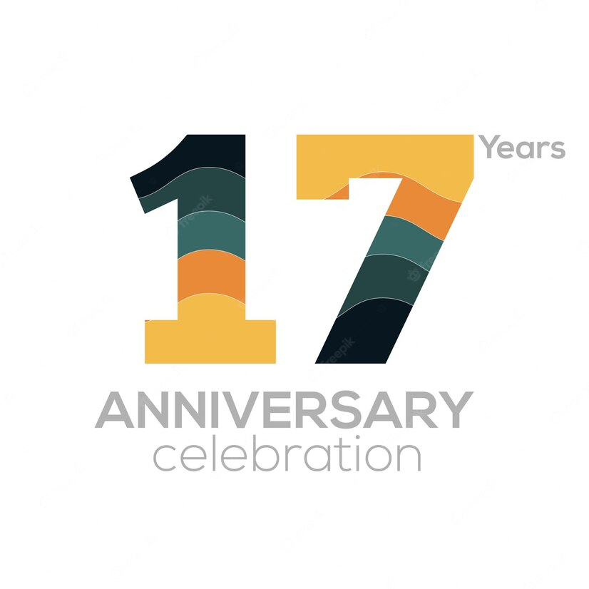

啊，又是一年啊~~
年前疫情，4月疫情。9月份居家静默的21天更是这辈子绝无仅有的经历，尤其中间还有个父母连饺子都没吃上的中秋节，一边是百感交集，一边是更加不想说话了。
快两年不能摸鱼写博客了，连带着读博客的兴致都不高。即使居家工作期间有大把的摸鱼时间，却没有捡回看博客的习惯。我也曾扪心自问：“你是不是不喜欢表达了？”
“我想我还是更喜欢打游戏。”
于是下半年就真的又重新开启了游戏模式。
很快乐。

雷锋叔叔说人要做螺丝钉。可是人哪里会像螺丝钉那样有用呢？普通人就像一粒沙子——不是一盘散沙的沙，也不是聚沙成塔的沙——而是被和在水泥里的工程用沙。万里高铁啊，XX速度啊，荣耀都归于钢筋水泥。眼睛看不见的时候，大米不好吃的时候，豆腐渣的时候，才赖到沙子头上。
沙子混在水泥里被铺成路面。历史的车轮碾过，倒车的时候再碾回来，反反复复。车子曲折前进，沙子停步不前。路上有了坑那叫负重前行的见证。把坑填上，一切焕然一新，仿佛什么都没发生过。

感恩的心，感谢有你。
