关于这次蓄谋已久出行，老婆大人的最终决定是报团去桂林。跟她的一个闺蜜小彩一起。我们一家三口，小彩带她的老妈和儿子小π。

## Day1 【协弃-唐山-桂林】

飞机的起飞时间是中午12：15，团提前两小时在机场组成。一共7个家庭，大人小孩共计28人。因为是一起报的名，我们两家被算作一个家庭。
航班来自于名不见经传的桂林航空。这班飞机是我坐过的最糟糕的一次——没午饭也就罢了，空乘广告推销忍忍也就过去了，tmd连口水都不给真是太过分了。中间还经停了唐山的三女河机场。很小，只有两个登机口。

到达桂林是傍晚5：30。桂林两江机场比协弃的周水子机场可像样多了，取完行李，跟地接汇合，上大巴。一个小时左右的车程到酒店。酒店当然不在市中心，但也不能算特别远，到桂林叠彩万达3公里左右，打车去市中心的正阳步行街20多块钱。当地人口中的北区应该就是类似我们协弃开发区的意思吧，我猜。
酒店设施一般，有个特色是电器声控。两个熊孩子凑一屋的时候，这个声控系统就遭了殃——

> XX系统，打开空调
> XX系统，关闭空调
> XX系统，风速最大
> XX系统，18度
> XX系统，30度……

至于为什么只玩空调，是因为两个屋的电视莫名其妙都不好用，而各种灯的名称诘屈聱牙，熊孩子分辨不能。
按照这个团的行程，在桂林市内的时候都是晚饭自理的。老婆和小彩在房间大众点评了半天，没找到合适的馆子，还是打车去了叠彩万达。万达里80%都是熟悉的面孔，随便找了一家，吃了个还算有的当地特色的猪肚鸡。
店里当地的漓泉啤酒10块钱一罐，要价太贵，放弃。

导游说Day3会路过人民币20块钱的取景地，为了换钱，回来的时候我在酒店楼下便利店用现金买了瓶健怡。进电梯的时候，小π眼睛一亮：“可乐！”遂以迅雷不及掩耳盗铃之势把瓶子夺到手里，两手握住，从1楼一直晃到38楼出电梯。
我那个气啊，要不是他妈和他姥姥在旁边，一定会把他脑袋怼在电梯门缝里狂按关门键。这种熊孩子就是欠揍。

## Day2 【古东·一江四湖·正阳街】

宾馆的早餐又单调又难吃，连豆浆都限量。

上午第一项是古东景区，特色是可供人溯流而上的连续小型瀑布。这里的瀑布可供人攀爬的连续有6级。最靠山脚下的一级落差最大，不允许14岁以下的小朋友入场；最靠山顶的则是不允许10岁以下的进入；其余全年龄。
景区必有购物街。古东景区的购物街叫做水果街。贵。

在景区大门口换成了景区导游。想玩水的要“租”一个头盔，十块钱的“送”草鞋，十五块“送”草鞋和雨披。瀑布旁边有立着的大牌子，上面规定，“出于安全考虑，没有头盔和草鞋的不准下水。”
除我之外，她们五个全都租了装备。我怕滑伤到膝盖，在旁边看着就好。
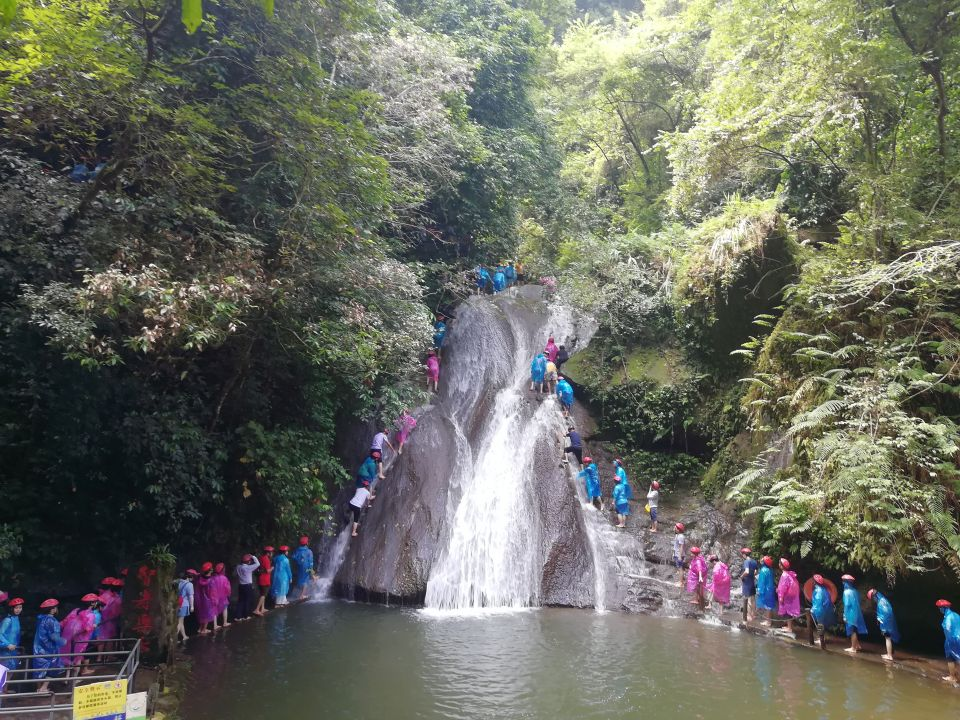

第一个瀑布两个小朋友都参与不了，所以两个妈妈也都没下去，只有小彩家的阿姨过了把瘾。小π虽熊胆子却小，到了水边磨磨蹭蹭不肯下去。我们一家也只好在一边陪着浪费了20多分钟。
天气虽热但树荫很多，山路的旁边就是河，除我之外的更是走在水里，所以倒还挺舒服的。山不太高，很快就到了最后一级瀑布。说是不让10以上的爬，但管的也不严，不是特别小的孩子保安也不会拦着。我们这两个都是九岁，很顺利地爬完了瀑布。
瀑布的重点是个小水池，两个孩子嬉闹了好久。水清。

继续往山上前进，差不多山顶的地方有座收费的吊桥。不走吊桥要绕远个几百米。小π走到桥中间又一次表现出熊孩子本色，又哭又闹又跳。他越跳，桥晃得越厉害——我们一家已经过了桥，整整齐齐站在另一端的桥头看笑话。最后姥姥实在觉得丢人，拜托桥上的保安把他架了下来。
下山的第二段可搭乘设施是吊索。只有我有胆子上，却超重了不收。只能全体步行。
第三段是轨道车。闺女早在上山的时候就惦记着要坐，当然要满足。人很多，排了半个多小时的队，差点误了午饭。

团餐嘛，就那个德行。我们跟另外一个外婆妈妈女儿组合分在一桌吃饭。于是，整张桌上就我一个男的。我是不好意思抢了，但3个孩子5个妈妈都挺好意思的。

车开回桂林市区，下午是船游“一江四湖”。在酒店前台问的，桂林的一江四湖跟两江四湖差了个桃花江，两江是要夜游的。而我们这种团几乎不会安排夜游。
上船的码头离桂林的地标象鼻山（也叫象山）非常近。这段的漓江非常难看，河道只有最当中有十米左右的水，处处裸露出白色的卵石。象山这地方刚好是个公园，有人在河的最中间捞鱼，水深刚过肚脐眼。象鼻山的鼻子本应该是吸水的，结果现在鼻头离水面起码还有一人高呢。导游说，桂林已经两个多月没下雨了。
一条船40多号人呢，真担心跑着跑着就搁浅了。又一想，就算出了事，想淹死也很难啊。
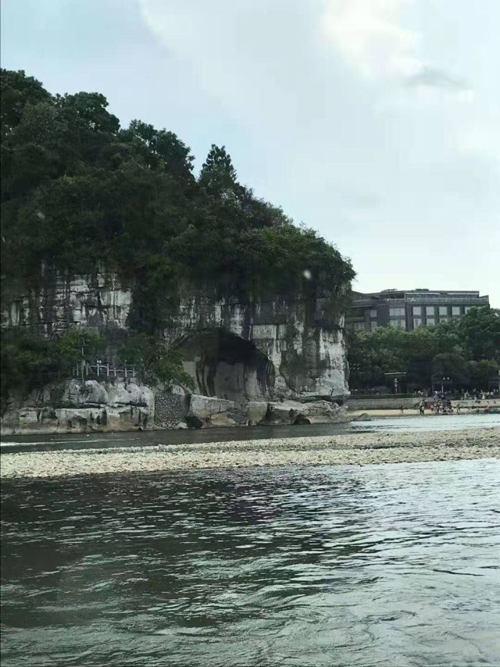

江上的风景，如果水能再多一些的话，是很好的。从路边的行人来看，这座城市应该是比较悠闲的。某段江面的岸边上，有一家三口挺有趣：妈妈推着婴儿车，车里装着包；哥哥浑身上下只穿一条泳裤，泳镜搂在脑门上，手里抓着一根一人长短的鱼叉；三四岁的妹妹拖着比人还长的网箱，蹒跚在哥哥身后。

沿江有好多名胜。什么名楼什么寺庙什么塔。仔细一听不是毁于火灾就是毁于兵祸，都是近些年重修的，没劲。

船上有套路摄影师。免费拍照，免费送照片。这套路早就知道。拍半天送张两寸的mini版，然后敲诈似的卖大照片和底片。因为是免费，所以没有人说不拍的。而且甲板地方确实不大，于是这巧妙地阻止了人们自行上甲板拍摄。象鼻山拍单人照，后面有个寓意比较吉祥的官帽山又组织了一波全家福。
船在象鼻山流连的时间比较长，这又是拜小π所赐。先是畏畏缩缩不敢上甲板，上了甲板又死活不肯抓身后的栏杆。摄影师怕出危险，只能那么僵着。其余游客在舱内吹着空调无动于衷。
因为我们全家一直缺少全家福，而船上的这张全家福照得确实挺顺眼的，20块钱就买了，当场照片到手。我比较感兴趣的是底片的交付方式。扫照片角上的二维码，提示安装某软件，并且该软件需要腾讯的应用宝。安完应用宝再扫一次，安装这个劳什子旅游照片APP。打开APP，第三次扫码，才能真正获得电子版。先装后卸，足足花了20分钟。幸亏是连着酒店WIFI搞的。
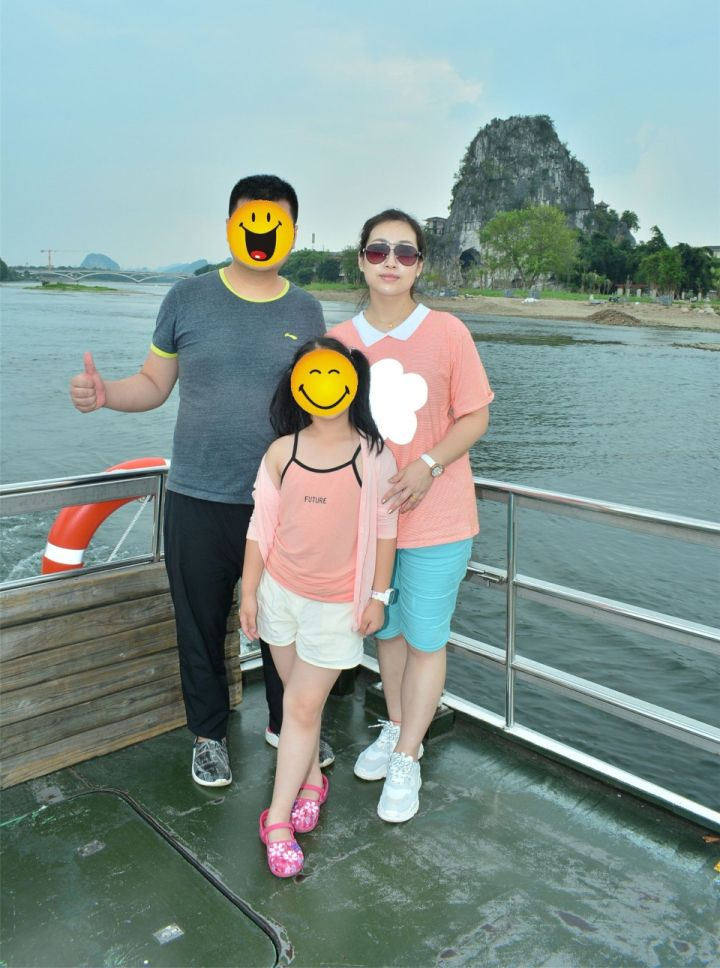

漓江跟“四湖”水面不一般高，接口处有个船用的升降机，挺好玩。四湖原来是四个水坑，06年的时候才整治重修的，江南园林+工业化仿古修饰，没太大的意思。船舱里也闹哄哄地在研究分照片买照片，就像路灯刚刚亮起，即将散场的夜市。

上岸的地方是桂林的市中心，正阳步行街。大多数团员都选择不回酒店直接进入逛吃模式。全国的步行街都差不多吧，也没见有什么特色美食，也就是卖现切水果的比较多。桂林最有名的是米粉，但两个孩子早上被酒店早餐版的米粉吓着了，坚决不肯尝试。
正阳街一路向北，尽头马路对面是另一条（片）商业街，叫东西街。东西街绕着一座古城，说是靖江王（明）的王城。反正只有城门楼子是真的老，其余城墙都是后砌的。还是那些店，又是走马观花的一圈。
从4点半逛到7点多，两位妈妈一直没定下来晚饭吃啥。两家索性分头行动。我们家是买了些肉啊串啊之类的打车回酒店吃。老婆因为对酒店早餐极度不满，还打开地图搜了一家面包房。
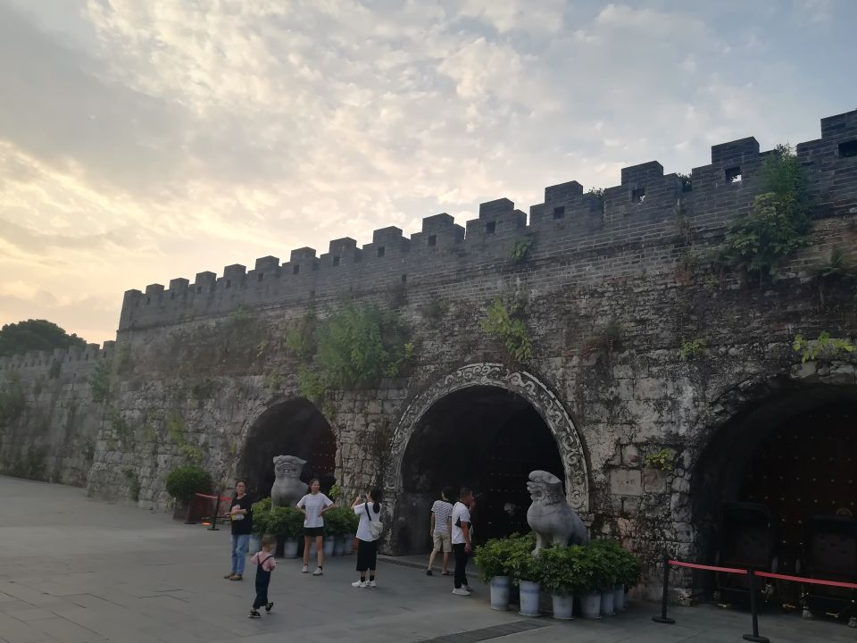
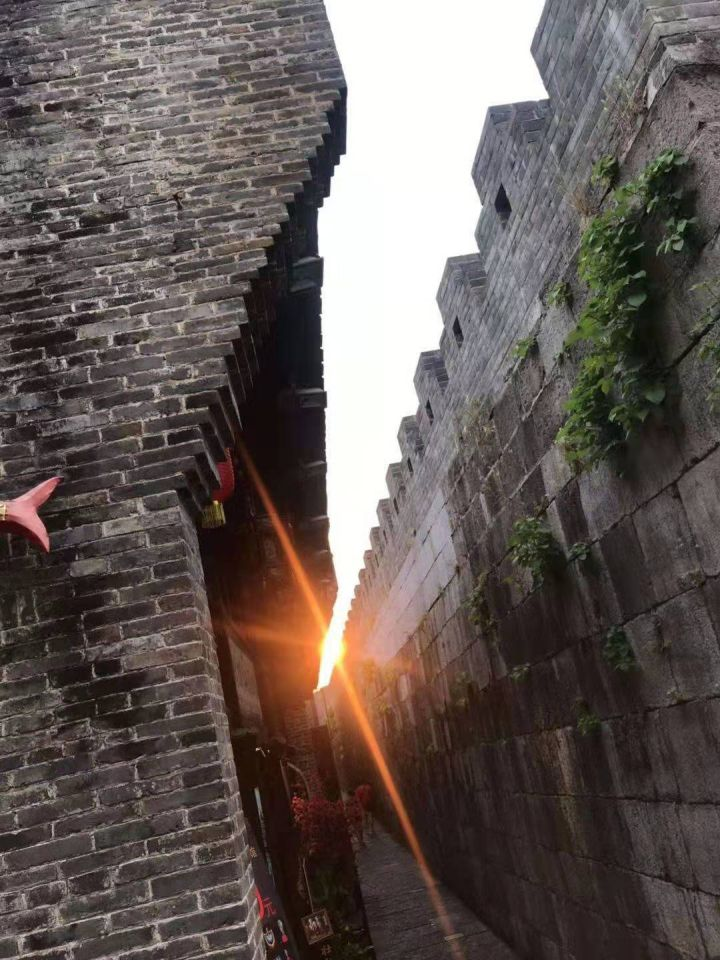

## Day3 【漓江游船·银子岩·印象刘三姐】

8点酒店出发，坐一个小时的客车，乘9点半的游船去阳朔。
所谓的“桂林山水甲天下”指的就是这一段行程。

盛名之下无虚士，这山水确实很赞。看得出桂林对这段江保护也做的挺好，江水清澈见底（当然水浅也有很大功劳）。游船两层能装200多人，每人票价200多，每半小时浩浩荡荡出去十几条。感觉这江上跑的都是人民币啊！
怪不得水位都那么浅了也没说停航。
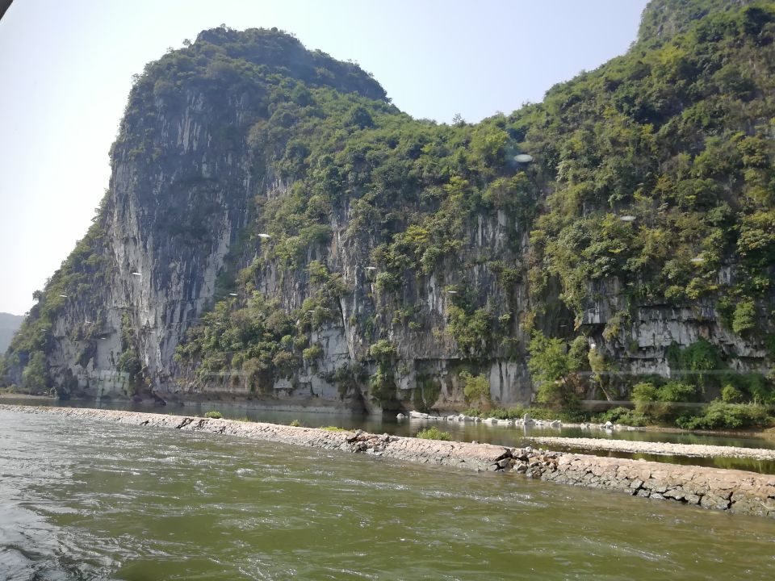

桂林的山确实很有特色，所谓的喀斯特地貌我的理解，就是山都不叫山，而是一座座“峰”，四面陡峭直直地杵在那里。什么时候看到山势起伏了，什么时候就离桂林大老远了。这些山往往附赠一面悬崖，上面赤黄白黑色彩纷呈，确实鬼斧神工。
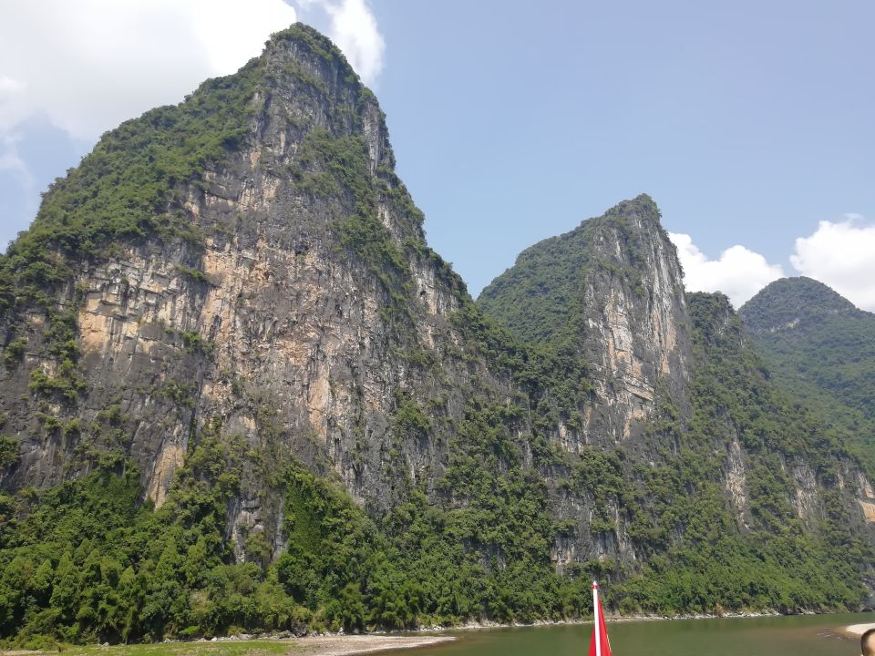

在船上要了个100块钱的小吃套装。一碟炸小虾，一碟炸小蟹，一碟炸小鱼，一碟炸地瓜，一碟炸芋头。为什么全是油炸的？因为据说为了保护环境船上不让动火。
船上的漓泉啤酒要价20，更不能买了。

每条船有两位摄影师，事先讲好100块钱7张照片入册。多出来的还想要，10块钱一张送电子版，愿者上钩。
于是航程的大约1/3时间在拍照。
不论是自己拍还是让摄影师拍，不拍照的时候没几个人上甲板。外面的天气实在是太热了。山水虽美，看多了也就那样。

漓江的上最有名的山叫“~~舅妈~~九马画山”，故事说的是，想当初周恩来看着山数出了九匹马，陈毅看出了七匹——新中国的总理和外交部长跑著名~~经典~~景点数数玩。
故事太洗脑了，客车上导游讲一遍，上船导游和摄影师各又讲一遍。什么看9匹当状元，看7匹当榜眼的。即使看马和聪明程度真的有关联性，那也明显是因果倒置的谬误，状元看出了马，而不是看出马的当了状元。再说，这样看出8匹马的算什么？榜眼以上状元未满，榜眼后？？不会是划拳大师吧。
最高的山头图案确实像马，另有两个有丢丢像，其余的，穿凿附会而已。
船开到这儿发了中午饭。航空餐。米饭鸭肉土豆小菜。最好吃的是附送的辣酱。

江上最后一个著名景区就是二十元人民币背景图了。不得不又双叒叕感叹一次，要是水再多点就更美了。
话说这地方没有20块钱纸币以前总不会没名字吧？
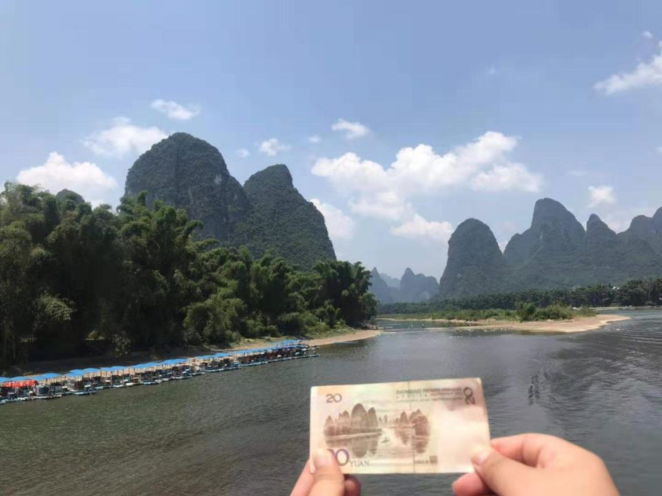

最后的40分钟类似垃圾时间，山水没有前面那么出色，人的兴奋劲也过去了。多半人在打盹。

这种最著名级别的旅游景点，有种莫名的快餐的感觉。签到打卡一样，不是景色不美，也不是服务不到位，只是完全没有眼前一亮的心情。

上岸第一件事是拿相册挑照片，把不要的还给摄影师，剩下的算钱。其实挺好奇如果挑不够7张会怎么处理，很遗憾这样的事情并没有发生。交完钱后加摄影师微信，然后发了一个密码，上指定的QQ空间自行取电子版文件。

这里是阳朔县。由于地方保护主义，码头的所在地没有停车场。每人需要乘坐10元一位的电瓶车才能到达旅游车的停车地。
路上看到三位骑着电动车的毛妹。骑电动车的应该都是常驻人口吧，我不由暗自揣摩起她们的身份来。
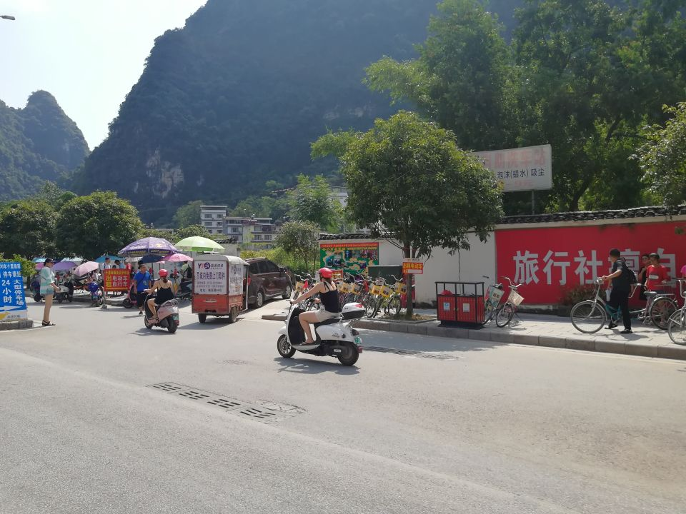

上大巴，奔赴下午的目的地，银子岩。银子岩其实在隔壁的荔浦县，已经不归桂林管了。
银子岩是个山洞。所有的钟乳石为卖点的山洞其实长得都差不多。尤其我还刚去过本溪。这亚热带旱洞里面可比亚寒带水洞里闷热多了，用户体验非常糟。
唯一的亮点，银子岩里的石钟乳是白色的。
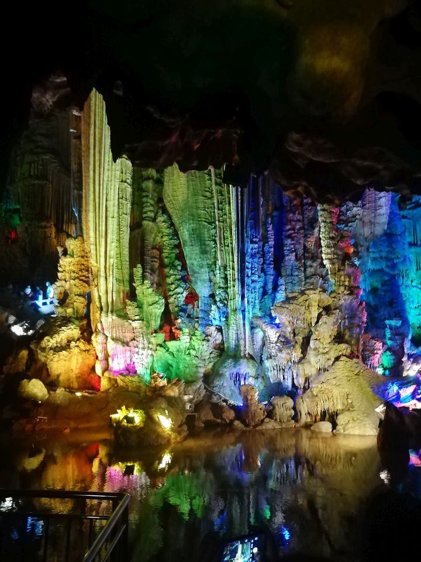
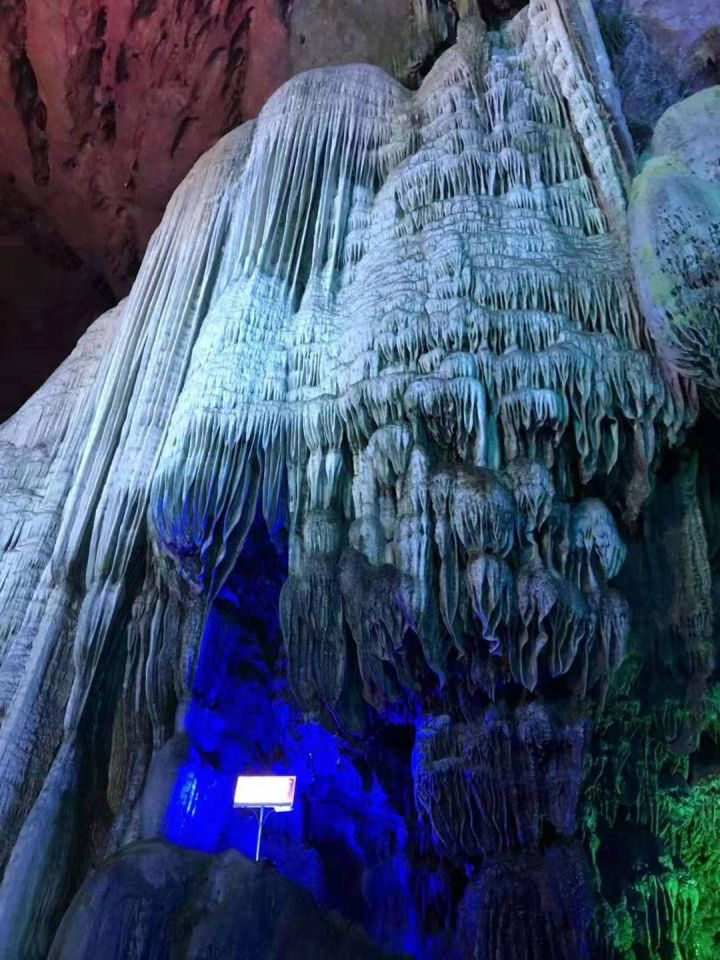

晚饭，据说是桂林特色名菜的啤酒鱼闪亮登场。姥姥吃这道菜的时候很疑惑：“啤酒鱼的特色是不刮鳞吗？”
我跟她说：“全中国的厨师做鱼都刮鳞，不刮是因为旅行团好糊弄”。

回阳朔县城住店。巷子里一家不太大的有些类似民宿的旅馆，松木装修复古风，感觉不错。尤其我们一家三口的都安排在了顶楼（明显是加盖的，不知是不是违建），有天窗。

晚上的印象刘三姐，导游定的是九点的第二场。
背景的山水确实漂亮，表演除了场面气派以外乏善可陈，成年演员根本不卖力气，故事性极差，场景和场景之间没什么联系。
还不如之前看过的印象周庄。回程的时候导游说,这套节目从04年演到现在一直没改动任何一个环节，这应该算是取死之道了吧。

回酒店已经11点了。导游在回程的车上说，阳朔有个什么街，酒吧文化，想去的可以自己打车去，明天集合前回来。
这下知道为什么会有定居的毛妹出现了。

## Day4 【龙脊梯田】

阳朔这家旅馆的早饭可以下咽。出发的很晚，客车从桂林的南面又杀回北面。
10点半就在北区的某处吃了午饭，之后晃晃悠悠向北继续出发。看不见独头蒜一样山峰的时候，就是出了传统的桂林范围，进入龙胜县。
客车走的应该是省道，爬了个大岭，下一半，又爬一道，山路十八弯,最慢点时候只敢开到20迈，举步维艰。到达的龙脊梯田的大门，正是导游的老家。
再往里的路大客是进不去的，换成35人的小客，继续跑盘山道，40分钟。下车的时候晃吐了好几个，包括小π。
老婆大人心有余悸——她最想玩的地方就是龙脊梯田，之前研究过自由行+自驾，幸亏没有。

小客的终点离旅店还有段距离。这时本乡本土导游的又是就体现出来了：他喊来了若干轿车，把整团的人拉到旅店。虽然只有3公里不到，几分钟就到了，但挺贴心的。
这时是下午两点多，导游说下午天太热，等4点半再集合上山。
这里住的酒店不错，也是仿木质结构，带阳台。一开窗就能看到绿色的梯田。山上的游人很多，村子里的人却不怎么多。一副生意盎然，鸡犬相闻的静谧景象。

上山只有一条小路，蜿蜒而上。龙脊梯田的特色也就是个“窄”。梯田的每一级也就一人宽，只能种下两排稻。这样一来半边山上分的级数就很多，显得密密层层。同行的一位大叔在给他的孙子讲解：“当年农业学大寨，全国各地都修梯田，我也修过。不过咱下乡那地方种苞米，长起来一人多高，根本看不见道。你看看人家这梯田修的，还成景点了……”

用了接近40分钟，终于到达了山顶。向下俯瞰，真的是心旷神怡。臭宝租了套民族服饰，娘俩一通拍。我也终于喝上了惦记好几天的8块钱的冰镇当地啤酒。味道很一般，仔细一看，原来是被燕京收了。
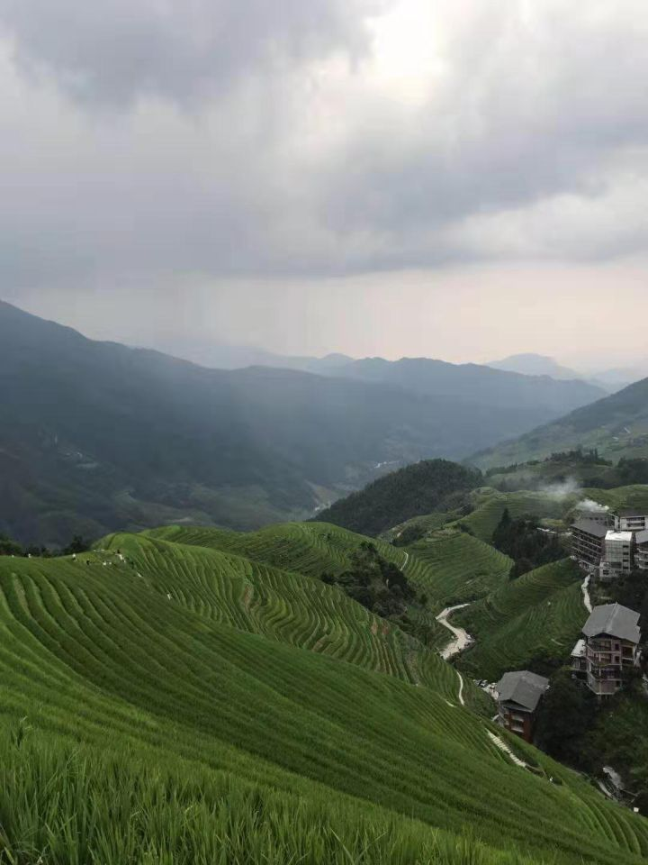

我们这桌开饭比别桌晚。因为下山的时候小π跟他妈闹脾气，想施展坐地不起大法，却一屁股坐进人家水田里。不得不回房间洗澡。
晚餐不错。看来导游同乡的身份还挺好用——关系应该很好，他都跑厨房去帮忙了。导游推荐了竹筒饭，20一份，应该是私下自己挣的外快。没吃出来竹子味。

## Day5 【义江缘】

出发时间比较晚。所以有人跑去山上看日出。
我这腿脚的，当然就算了。

下山当然又是一通绕山路，一通吐。
在龙胜跟桂林市中间，有个叫“义江缘”的景点。在行程单上，这里有个民俗表演。
然而这最后的一个景点却是此次桂林行最糟糕的体验，出来时我甚至怀疑他们的4A是自己画上去的。
进门之后先换园内导游。
进来园子不到30米，就有个十来平的小房子，墙上挂满字画，空气中若有若无浮着墨汁变质的臭气——卖字画的。
卖字画的不少见，只是这次身边有熊孩子，真怕他乱动手啊！

坐了200米竹筏到了“瑶族风情博物馆”，由分布在山上的好多小木屋构成。前几个屋子展示了一些器物和照片，到了一间像祠堂样子的房间后，出来一位“专家”，给大家讲“防蛇知识”。耍完蛇之后开始卖药。
我觉得这种卖药方式简直有问题——即使你的蛇药确实能立刻让它不省蛇事，也不能证明你的喷剂能治疗人的腰腿颈椎啊。
就当民俗表演看了吧。
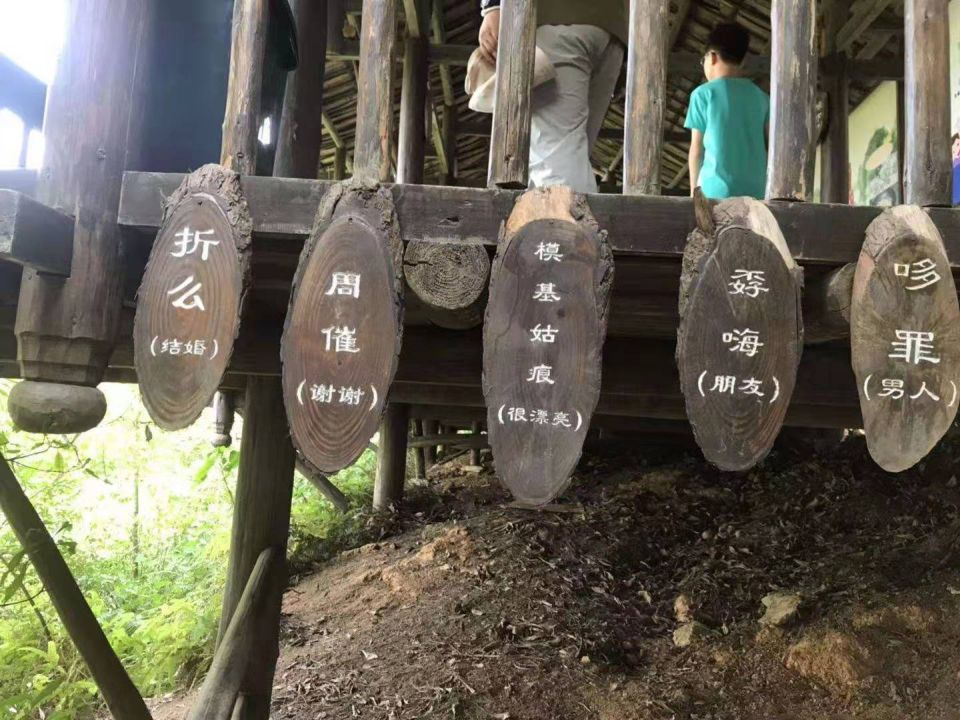

真正的民俗表演在山顶的一个大厅里。几个妹子跳了三段舞，一位大妈表演了一段梳头。没了。
送一小盅茶水，收茶杯的时候，托盘上铺满一元毛爷爷。太不与时俱进了，铺二维码也比铺一块钱好得多吧。

回大巴的路上，队伍里有个小孩被马蜂蛰了，家长导游景区三方在车下面掰斥半天，耽误了行程。

中午最后一顿团餐终于不是团餐了。在一个正规的馆子，正经的八菜一汤，鸡鸭鱼肉全有。最好吃的一道是黑豆做的豆腐。而且，还有免费的自助水果供应。西瓜、哈密瓜和番石榴。也是因为这个，知道了臭宝念念不忘的番石榴应该不是什么金贵的水果。

下午老婆和小彩出去采购，我跟姥姥在酒店负责对付两个熊孩子。没什么大事。就是小π把百香果滴到被子上，姥姥赶紧用矿泉水一顿冲，又放在窗口晾晒。
我反应过来之后长叹一声：“阿姨，明天凌晨4点就出发了，退房的时候不会有人管这个的。”

## Day6 【桂林-唐山-协弃】

没错，这趟飞回协弃的倒霉航班从桂林的出发时间是早上六点半。算上车程，导游要求4点钟一个不少地楼下集合。
酒店的最后一餐给折合成了小面包和鸡蛋，迷迷瞪瞪就去了机场。

桂林飞协弃的这趟，是机场早上第一趟航班。
那么问题来了。过安检的时候水全扔了。进到候机厅以后，没有一家店开门的。想买水？贵贱没有。
怀着忐忑的心情登了机。还好，起飞一小时之后每个座位给发了300ml的一瓶矿泉水。

9点20飞机上就广播要准备在唐山降落，10分钟之后有人发现飞机在绕圈。开始还有人数，后来绕得太多数不过来了。
半小时之后，终于有按耐不住的开始质问空姐。
答曰，唐山机场军民共用，现在机场有军事行动，飞机降不下去。
又转了快半小时才落下。反正走出舱门的时候，不管本来晕机不晕机的，一个二个都脚步虚浮，显然都不怎么好受。

第一次在周水子机场等自己的行李。以等行李的用户体验来说，协弃就是个四线城市。

晚了半小时，反正最终还是回到了家。