从2017记录电影开始，每年扫片的数量都呈上升的趋势。所以2019决定记录一下读书情况，希望能刺激产生多读书的潜意识。
总体来讲读书量还是不怎么大。零碎时间还是用手机读网文更加方便；而“三上”和陪孩子上课的大块的时间，又被漫画分润了一大块。毕竟kindle看漫画感觉实在是太好了。虽然孙正义的故事[1]告诉我们，漫画书也算书，但我还是不好意思把它们单独列入统计。
另外一直进行中的重读古龙计划也占了很多时间。

2019年共读新书32部。把“法医秦明”算作一部的话就只有27部。没有特别大部头的作品。
本来打算记录字数。但很多电子版的书，资料并不好查。而且豆瓣很奇怪的，只记录“页数”这种奇怪的指标而不计字数。不过这倒也给漫画图册之类的提供了一层保护吧。列入统计的有一部~~漫画~~绘本和一部图册，有福利。
于是，页数最多的是名著《初刻拍案惊奇》，花费时间最长的也是它。其实难副。最短的是胡适的《胡说》。

实体书8本，刚好1/4。其中好多本来自家门口的一家咖啡餐吧，闺女喜欢他们家的鸡丝凉面。
实体书主要还是携带不便，地铁上枕头上阅读都不太合适。
按照这个速度，不买新书的话，把之前凑单之类弄回来的书看完，还要十年。

读的品种最多的是小说，占1/3。一直以来就挑，不是什么书都能读下去。
按年代分，读的最多的是现代作品，有20部。其次是现代的五四先贤们，7部。欧美作品和其他国家地区加一起4部。还是对翻译的水平心有顾忌。
本年度个人觉得最好的书是《你一定爱读的极简欧洲史》、《回答不了》，偏偏都不是小说。

明年希望能至少增加一半吧。起码重读古龙上半年就应该结束。

下面是书目和个人简评：

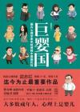

[巨婴国](https://pewae.com/gaan/aHR0cHM6Ly9iYWlrZS5iYWlkdS5jb20vaXRlbS8lRTUlQjclQTglRTUlQTklQjQlRTUlOUIlQkQ=)

作者：武志红出版社：浙江人民出版社出版时间：2016

一本网红书。因为下架引起了一些风波。作者的观点或许是对的，但论证得一塌糊涂。
举着“逻辑思维”的大旗不讲逻辑，从开始的乱举例子到后来的所有的人类主观行为都往“巨婴”的设定里塞，“诉诸大众”、“人身攻击”、“错误归因”、“诉诸感情”、“滑坡谬误”，简直可以当作逻辑错误的反面教材。读到后面差不多在不停地问，这种行为难道不是人类的共同心理吗？你作为一个心理学专家，不去从人类心理学的角度上分析原因，反而叨逼叨地不断加“中国式”、“巨婴”的定语，显得太不专业。
看到别人的论述水平低，或者存在逻辑错误，从而否定别人的观点，那叫谬误谬误。我不能犯那样的错误。所以这位专家的观点我选择无视。

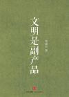

[文明是副产品](https://pewae.com/gaan/aHR0cHM6Ly9ib29rLmRvdWJhbi5jb20vc3ViamVjdC8yNjY1MjI0Mg==)

作者：郑也夫出版社：中信出版社出版时间：2016

一部纯欧美式的论文，讨论了所谓“文明”的种种由来。一板一眼的样子特别有趣，感觉作者写的时候也是故意绷着一副脸孔。
这种写法很枯燥，读起来也很累。跳着读又心有不甘。作者自己在后记里也说书名起得太过于标题党，扣了顶大帽子，其实并没有说所有的文明现象都是副产品的意思；也没有说副产品的价值就低的意思。
那么请问您是几个意思？
有关造纸术和印刷术的三章，要是被小粉红逮住能黑得不能翻身。

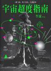

[宇宙超度指南](https://pewae.com/gaan/aHR0cHM6Ly9ib29rLmRvdWJhbi5jb20vc3ViamVjdC8yNzE0NTkwOA==)

作者：李诞出版社：四川文艺出版社出版时间：2017

第一次看李诞写的东西。真心不怎么样。或许他不适合写小说吧。要人物没人物，要情节没情节的。
这种水平的书，按理说不应该有人联系他出第二本了啊。

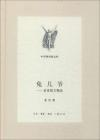

[兔儿爷](https://pewae.com/gaan/aHR0cHM6Ly9ib29rLmRvdWJhbi5jb20vc3ViamVjdC8yNjAzNzU0Mg==)

作者：老舍出版社：三联书店出版时间：2014

老舍先生的散文集。一个风趣幽默的传统文人形象跃然纸上。
书名起得不好，《兔儿爷》一篇写得很普通，可能是沾了政治正确的光，却也不如《吊济南》，也许不用是因为那篇太丧了吧。如果我是编辑，应该会把《考而不死是为神》作为标题。
写郭沫若那篇很有意思，咂磨小半天没品出来是正话还是反话。
先生写了母亲、姐姐、儿子、女儿，甚至还有猫，唯独写到老婆的时候只用夫人二字一笔带过，这也是个有故事的人呐！后来文革中舒夫人写大字报揭发老公，从零碎的文字中已可见端倪。

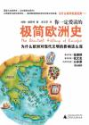

[你一定爱读的极简欧洲史](https://pewae.com/gaan/aHR0cHM6Ly9ib29rLmRvdWJhbi5jb20vc3ViamVjdC81MzY2MjQ4)

原名：The Shortest History of Europe作者：约翰·赫斯特译者：席玉苹出版社：广西师范大学出版社出版时间：2011

非常好的一部书，欧洲历史一下子清晰了。这是人家澳洲的教材，而当年我们的初高中都有世界历史，以事件为导向的写法教出来的完全是瞎子摸象，恐怕老师们一个二个也是稀里糊涂的吧。
所谓“四大文明古国”，考试时候总出来捣乱的古希腊和古罗马，看来是真的有料的。尤其是古希腊的思维模式在当今世界仍然可用，真不能用断了传承这种可笑的理由把它排除在外。
欧洲各个民族以及民族主义的形成其实很晚，这套理论传给苏联老大哥，又传到中国，经过好几手的舶来品。所谓的民族主义真挺没意思的。

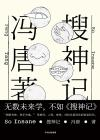

[搜神记](https://pewae.com/gaan/aHR0cHM6Ly9ib29rLmRvdWJhbi5jb20vc3ViamVjdC8yNzA3ODE1NA==)

作者：冯唐出版社：中信出版集团出版时间：2017

对于现在流行的这种行文方式实在是不敢恭维。明明可以好好说话，却偏要端着，序言比正文顺眼多了。只有一篇《做鸭的男人》还算有故事性。
排版莫名其妙，每个故事的标题单独占一页，像极word里两个分页符之间加了一行72px的宋体，这实体书做得太敷衍了。幸亏是在咖啡店读的，否则45块钱买这种书亏大了。

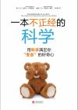

[一本不正经的科学](https://pewae.com/gaan/aHR0cHM6Ly9ib29rLmRvdWJhbi5jb20vc3ViamVjdC8yNjU3Njc1Ng==)

作者：皮埃尔·巴泰勒米译者：魏舒出版社：北京联合出版公司出版时间：2015

开篇的挑逗意味很足，几个问题都挺给劲儿的。但回答的字数可能只有问题背景的1/3？太过于浅尝辄止，没有深度，对不起定价。而且举的例子太过于法兰西化，缺少代入感。倒是插图画得还有点儿意思。
看的时候有个感觉，法国的基础教育做得恁差劲？

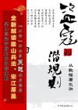

[盗寇的潜规则](https://pewae.com/gaan/aHR0cHM6Ly9ib29rLmRvdWJhbi5jb20vc3ViamVjdC8zMjI3MzY5)

作者：何钐出版社：中国友谊出版公司出版时间：2008

套上个数字化统计的外壳，继续厚黑学那套老物，新瓶装旧酒，没意思。而且作者的数据分析做得非常不严谨，什么梁山好汉的学历之类的东西完全是信口胡诌，然后在胡诌的基础上煞有介事地展开分析，这能有说服力才叫见鬼。
还有从外号分析人物算什么逻辑，更可笑的是还分析了好几遍。这种水平也能出书，怪不得实体书会没落。

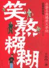

[笑熬糨糊](https://pewae.com/gaan/aHR0cHM6Ly9ib29rLmRvdWJhbi5jb20vc3ViamVjdC8xMDQ1MjYz)

作者：王小山出版社：东方出版社出版时间：2006

他无目的的写，你就无目的的看好了。就当给脑子做做按摩。不同的书就应该用不同的标准。而且我也喜欢写这种胡说八道的内容。
缺点是有的篇章不能始终保持有趣。

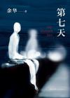

[第七天](https://pewae.com/gaan/aHR0cHM6Ly9ib29rLmRvdWJhbi5jb20vc3ViamVjdC8yNDU0MDg2NA==)

作者：余华出版社：新星出版社出版时间：2013

余华可能是被情绪左右了。这小说不能叫做小说，情节和人物都不行，太粗糙了，很多地方没过脑子的。好的地方只有最后找到父亲的那一小段。

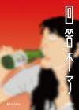

[回答不了](https://pewae.com/gaan/aHR0cHM6Ly9ib29rLmRvdWJhbi5jb20vc3ViamVjdC8zMDMzNjg2Mw==)

作者：匡扶出版社：浙江文艺出版社出版时间：2018

故事是很好的，但不是最好的；绘画水平是一般的。偏偏凑在一起非常切合步入中年的八零前。
看的是绘本，想的是自己和父母的以及孩子的人生。能有所感触，这书就值了。

[全世界人民都知道](https://pewae.com/gaan/aHR0cHM6Ly9iYWlrZS5iYWlkdS5jb20vaXRlbS8lRTYlOUQlOEUlRTYlODklQkYlRTklQjklOEYlRUYlQkMlOUElRTUlODUlQTglRTQlQjglOTYlRTclOTUlOEMlRTQlQkElQkElRTYlQjAlOTElRTklODMlQkQlRTclOUYlQTUlRTklODElOTM=)

作者：李承鹏出版社：新星出版社出版时间：2013

放下李大眼人品不论，文字的水平是真厉害。作为一个靠码字吃饭的人，点评热点事件天经地义，后来被消失实在显得管理者小肚鸡肠。李的文字，厉害之处是逻辑始终是能够自洽，滴水不漏；缺点是不客观，只有情绪，近乎阴谋论。当然还少不了中国文人掐架时共通的毛病：不对证据求真。其实李最擅长的修辞手法也就那么三两下，能引起共鸣还是靠社会热点。
读此书时最大的感触倒不是来自于大眼的文字，而是在并不遥远的当年，那些曾经的热点事件，大都是不了了之的结局。
“人类与强权的斗争，就是记忆与遗忘的斗争。”——米兰·昆德拉

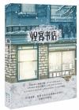

[怪客书店①](https://pewae.com/gaan/aHR0cHM6Ly9ib29rLmRvdWJhbi5jb20vc3ViamVjdC8yNjMxOTI0OQ==)

作者：春十三少出版社：长江出版社出版时间：2015

当我得知自己选了本晋江的小说的时候，肠子都要悔清了。
好在不怎么长，就读完了。20多年前无聊时读席绢的恶心感又回来了。
而且现在的书流行的，只对话不进行剧情。时不时跩的那几句英语很别扭。段子也不新。甚至于我既没看到言情的内容也没看到跟书店有什么关系。
不好看。

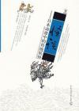

[怪谈](https://pewae.com/gaan/aHR0cHM6Ly9ib29rLmRvdWJhbi5jb20vc3ViamVjdC8zODM1NTU5)

作者：周英 / 李墨谦出版社：中国传媒大学出版社出版时间：2009

作者的考据是非常严谨的，对于详细表述的妖怪的出处、演变过程乃至心路历程都有涉及。引用的也是日本的妖怪大家的著作，令人信服。
插画也是一大亮点，可惜看的不是实体书，体验差了一筹。
缺憾是作者可能身为女性，对于涉及漫画作品的选材还是太窄了一些，除了传统的专门讲鬼的鬼太郎，也就只有犬夜叉、水木茂、宫崎骏等几部少数作品，无旁征则不博引，实在是难以引起男性读者的共鸣。
给分低是因为大多数东西都不新鲜，对我来说新知识不足。中间很长的一部分应该算是影评吧，我看你影评作甚。
作者对于妖怪的定义，我是非常赞同的，即“人们把认知以外的东西，称为妖怪”。所以，生活中其实处处可以有妖怪，哪怕建国以后。
另有一章专门写中国妖怪的，简直莫名其妙，好像后来再版的时候删掉了。

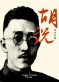

[胡说](https://pewae.com/gaan/aHR0cHM6Ly93d3cuYW1hem9uLmNuL2RwL0IwMEJMWVpRTE0=)

作者：胡适出版社：青苹果数据中心出版时间：2013

胡适的诗集，kindle上的免费读物，不是图上这本。只为凑图。
胡适是入世的，是积极的，是自由的，是风趣的。
“我从山中来，带着兰花草……”是胡适最有名的诗，可我不知道这首诗的名字叫《希望》。
“醉过方知酒浓，爱过方知情重”是胡适第二有名的诗，其实后面还有两句“你不能做我的诗，正如我不能做你的梦。”按照中文的特点，后面两句才是重点。我的理解，强调的是个性的独立。送给某某梦，正合适。
后面还有一篇，更有趣，胡适的朋友批评他说，两个“过”字用的不对，应该是“中”。胡适用首诗答复了他：你从来醉了就倒了，所以都是过后才知道。爱里就只是爱，结束了之后才知道珍惜。妙哉！

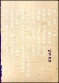

[故事新编](https://pewae.com/gaan/aHR0cHM6Ly9ib29rLmRvdWJhbi5jb20vc3ViamVjdC8xOTYxODEw)

作者：鲁迅出版社：人民文学出版社出版时间：2006

最有趣的故事是奔月。最不喜欢的是非攻。即使跟同时代的作家相比，鲁迅的文字也是晦涩的。看着是真累啊！
结合时代背景，得出一个结论——鲁迅跟林语堂真是相爱相杀啊！

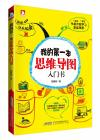

[我的第一本思维导图入门书](https://pewae.com/gaan/aHR0cHM6Ly9ib29rLmRvdWJhbi5jb20vc3ViamVjdC8yNjI5MjIzOA==)

作者：胡雅茹出版社：北京时代华文书局出版时间：2014

这本书是为了给臭宝买读物凑单用的，单买的话肯定不值36块钱——这售价在我看来一半在彩印上。
书的优点是开宗明义，怎么画思维导图，好的思维导图的特点：主分支要加粗、主分支2～7个，线和字要对齐，字要横写，要分类，最好要加图加色，关键字要有意义，一张不够画两张，中心可以套中心，没了。
对于我一个常年画图的程序员来说，转变一下就可以轻松上手。这就足够了。

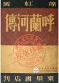

[呼兰河传](https://pewae.com/gaan/aHR0cHM6Ly9ib29rLmRvdWJhbi5jb20vc3ViamVjdC8xMDYwODUy)

作者：萧红出版社：百花文艺出版社出版时间：2005

这部作品的文体非常不好定位，像散文，或者诗歌，可能最接近的体裁应该是回忆录。我是非常不喜欢散文的。
这部书前面两章完全是在散写抒情，根本没情节，却很好地营造了一种孤独凄凉的氛围，真不知道连载的时候是怎么活下来的。
情节开始之后也充满了凄苦和孤独。最令人侧目的当然是“小团圆媳妇”的故事。用朴素的写法，小孩子的角度，描述了封建和愚昧如何吃人。既得利益者的嘴脸和人们的麻木让人越读越冷。只是这一篇，这部书就堪以登堂入室了。其实普罗大众这么多年也没什么改变，迷信跳大神跟迷信传销迷信APP迷信救世主迷信某组织都没什么区别。得出的结论还是一切要靠自己。
最后一个故事不喜欢。太过于正能量了，跟整部书的调子一点都不搭，非常怀疑是后改的……
小学的课文《火烧云》竟然出自这里。

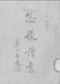

[怎样读书](https://pewae.com/gaan/aHR0cHM6Ly9ib29rLmRvdWJhbi5jb20vc3ViamVjdC8xMTIzMjk1OA==)

作者：胡适出版社：上海一心书店印行出版时间：1936

民国大能们以读书为题，分头做的作文。泛泛而谈的装逼犯是少不了的，比如江问渔，一直在说做人的道理。多数比较务实，写读书的方法。可是大家们是矛盾的啊，有的主张少而精，有的主张多读；有的主张读经典，有的主张去学外文直接读原著。所以呢，参考就好。可以看出，胡适之确实是个务实的人，作为开篇的人样子打得很标准，直接切入主题，应该怎样，有什么问题，娓娓道来。好感值UP。
分低不是因为书的内容，而是因为亚马逊的免费版，内容不全。

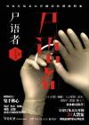

[尸语者](https://pewae.com/gaan/aHR0cHM6Ly9ib29rLmRvdWJhbi5jb20vc3ViamVjdC8xOTk1MDEzOQ==)

原名：鬼手佛心作者：秦明出版社：湖南文艺出版社出版时间：2012

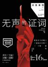

[无声的证词](https://pewae.com/gaan/aHR0cHM6Ly9ib29rLmRvdWJhbi5jb20vc3ViamVjdC8yNDUzMTAxMQ==)

作者：秦明出版社：漓江出版社出版时间：2013

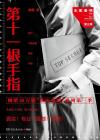

[第十一根手指](https://pewae.com/gaan/aHR0cHM6Ly9ib29rLmRvdWJhbi5jb20vc3ViamVjdC8yNTg5NjYxNw==)

作者：秦明出版社：湖南文艺出版社出版时间：2014

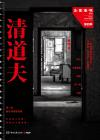

[清道夫](https://pewae.com/gaan/aHR0cHM6Ly9ib29rLmRvdWJhbi5jb20vc3ViamVjdC8yNjM0OTI1MQ==)

作者：秦明出版社：湖南文艺出版社出版时间：2015

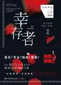

[幸存者](https://pewae.com/gaan/aHR0cHM6Ly9ib29rLmRvdWJhbi5jb20vc3ViamVjdC8yNjc3MjQxOQ==)

作者：秦明出版社：湖南文艺出版社出版时间：2016

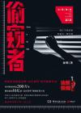

[偷窥者](https://pewae.com/gaan/aHR0cHM6Ly9ib29rLmRvdWJhbi5jb20vc3ViamVjdC8yNzA4MzkxMA==)

作者：秦明出版社：湖南文艺出版社出版时间：2017

法医秦明系列。第一部的时候作者的文字比较笨拙，甚至有非探案情节连不上的低级错误。但法医工作足够细致，这就足够了。
刚开始生涩的时候反而更加引人入胜，后面作者的手法愈加娴熟，却少了一种“直击感”。一开始的法医是鲜活的，大部分时间麻木，只对小孩子和强奸案有特殊反应，这不叫冷血，而应该叫职业习惯，毕竟成天激愤就会影响干活了。
后面几部就明显采用了一些小说家手段，一个大案件贯穿始终啊，出场人物身背嫌疑啊之类，文字也好了很多。却有些江河日下的感觉，究其原因还是案件没有那么真实了。后面几部开始给自己团队的人随意加设定，这种做法很不喜欢。最后一部的大事件太假了。
不知道以这本书为技术资料反推犯罪过程，被带进坑里的概率有多大。涉及行业机密，写出来的应该都是过时的技术吧……

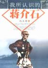

[我所认识的蒋介石](https://pewae.com/gaan/aHR0cHM6Ly9ib29rLmRvdWJhbi5jb20vc3ViamVjdC8xMDE0NDA5)

作者：冯玉祥出版社：中国文史出版社出版时间：2004

这本书最大的问题，是书名没起对。应该是“叛徒、内奸、工贼蒋介石”才对。
浓浓的“九评”文风。对老蒋从头骂到尾。但是吧，这人都如此不堪了，您还跟他称兄道弟十余年，您又是什么货色？
言必称“人民”、革命、讨伐军阀，妥妥地政治正确，可冯玉祥自己也是个军阀啊。
本书写于1948年，与其说是檄文，不如说是表忠自白书。哪怕是早成书三年，我都不会这么鄙视他。
文笔却还通畅，也算有理有据，如果据是真的就更好了。

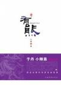

[有熊](https://pewae.com/gaan/aHR0cHM6Ly9ib29rLmRvdWJhbi5jb20vc3ViamVjdC8zOTMxNDk1)

作者：吕埴出版社：中国华侨出版社出版时间：2009

某个kindle资源站随机出来的，看豆瓣介绍差点给删了。腰封上没事扯什么于丹师弟啊，顶不待见于丹那个不说人话的老娘们。
反转不反转历史没关系，关键是要写得有趣。前半部分很好看，部落时期的人打架大概就应该是这个样子。后面有些乏力，不知是不是版本的问题，没写完。
最好的一段是父母和兄长的死。没什么特别的，就是被弄死了，真实。

[一路向西](https://pewae.com/gaan/aHR0cDovL20uYmFteHMuY29tL3JlYWQuYXNwP2lkPTM4ODU3)

作者：向西村上春树出版社：高登讨论区出版时间：2017

看过电影再看原著，发现二者只有名字相同。虽然电影已经不记得什么了。金庸、倪匡以外，很少接触香港作者的书，尤其是年轻一代。粤语词汇虽然有点儿不应，但却也生动。故事却乏善可陈。论叙事吧，情节很普通。当小黄文看吧，肉戏又太少。唯一的新鲜感就是作者香港人的身份本身。

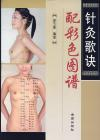

[针灸歌诀配彩色图谱](https://pewae.com/gaan/aHR0cHM6Ly9ib29rLmRvdWJhbi5jb20vc3ViamVjdC8yOTc1Mjk1)

作者：徐玉琢出版社：金盾出版社出版时间：2008

嗯……要是30年前看到这本书能看卷皮了，现在嘛，非常一般。
https://yun.baidu.com/s/1dDFCOmt

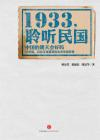

[1933，聆听民国](https://pewae.com/gaan/aHR0cHM6Ly9ib29rLmRvdWJhbi5jb20vc3ViamVjdC8yNTgzNTgwMQ==)

作者：多人出版社：中信出版社出版时间：2014

这本书挺有意思的，蹭“中国梦”的热度，把80年前商务印书馆主办的《东方杂志》的一期关于梦想的专题，当年的知识分子和小资读者们的回访专门总结出来，形成了一本书。
1933年正是中华民国内外交困的动荡期，人们的梦想可谓五花八门，期盼驱除外侮、惩治内腐的差不多一半。剩下的则各说各话，有要走社会主义道路的，也有支持强权独裁，希望中国能出墨索里尼的，当然相信三民主义的最多，足见孙先生魅力十足，忠实粉丝还真不少。
244份梦想里，吹捧列宁的只有一位叫张申府的先生。搜索一下可了不得——这位先生是中共第一批党员，周恩来、朱德的入党介绍人；毛先生担任图书管理员的时候，他是图书馆馆长；他夫人是中共历史上第一位女党员。30年代因为反对贵党联蒋而愤而退党。更作的是在1948年，革命形势一片大好的时候，“呼吁和平”，站错了队。
另有一位言辞犀利的女先生，叫谢冰莹。查一下资料，在当时的名气应该是高于谢婉莹的，作品在台湾的教材里有出现，现在不提看履历也是位脾气不大好看不顺眼直接硬怼的主。因为我也是这样的性格，所以打算有空搜她的书来看。
80年前没实现的，现在仍旧没希望实现。

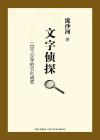

[文字侦探](https://pewae.com/gaan/aHR0cHM6Ly9ib29rLmRvdWJhbi5jb20vc3ViamVjdC82NTE3MTcw)

作者：流沙河出版社：新星出版社出版时间：2011

流沙河才死不久。中国讲究死者为大，死了级别就升了，不是大家也成了大家，人品什么的就被自动忽略了。不过看书也不是看人品，要看内容。
这本书内容就不错。讲的是小几百历史悠久的常用汉字的字源。对错不论，这种通过字形和读音的演变过程，深入浅出的分析方法是对的。了解字的来源，才能更好地使用汉字。
给闺女讲多音字“干”，就用了书里“干戈”一节，说明这个字之所以多音，是因为在简化前其实是三个字：干（gān）是盾，引申为边界和界限；幹（gàn）是树干，引申为主要的重要的；乾（gān）是形容湿度的形容词，孩子理解了之后就很难再犯错。
老头儿多少有些为老不尊，比如“妣”的解释，比如“尼”的解释，或者说是学者的认真劲吧。话里话外，老先生隐含的意思是支持繁体字复辟的。
至于准确性的问题，一家之言，姑妄听之。我也不是人说啥就是啥的性格，也不是人说啥就信的年纪。老头说“民不畏死，奈何以死惧之”的“民”应该是“怋”，莽夫二愣子。这就很没道理。道德经里到处是关于国民的论述，怎么会忽然蹦出个二愣子的用法。再说李先生是地地道道的河南中原人，也犯不上用四川方言来解释他的话。
我非常希望闺女的班主任能看看这本书，在教孩子们写字的时候要是能渗透一点儿，会是终生受用的。

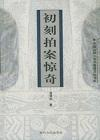

[初刻拍案惊奇](https://pewae.com/gaan/aHR0cHM6Ly9ib29rLmRvdWJhbi5jb20vc3ViamVjdC8xMTA5MTM3)

作者：凌濛初出版社：时代文艺出版社出版时间：2002

这部书版本众多，选了个评价人数多的记录。
总体来说很失望，因为内容对不起标题。并没有多少“惊奇”的故事。尼姑和尚诲淫诲盗，寺庙姑子庙藏污纳垢几乎隔几回就出现，殊为雷同。
有些故事太过刻意扣题，一眼假。比如那个关于“字纸不能丢”，白居易抄本什么经失而复得的故事，就很是扯扯扯扯扯。

下面是本年度补完的漫画。只为弥补少年时代的遗憾，不评价。有兴趣的单独讨论。加这项只是为了显着多……

[暗杀教室](https://pewae.com/gaan/aHR0cHM6Ly9ib29rLmRvdWJhbi5jb20vc2VyaWVzLzE1MTUz)

原名：暗殺教室作者：松井优征出版社：集英社出版时间：2012-11 / 2016-07全套册数：21

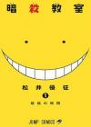

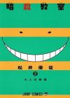

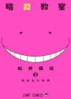

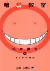

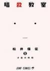

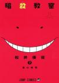

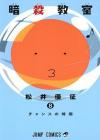

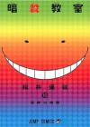

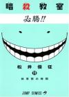

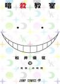

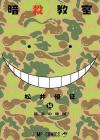

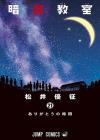

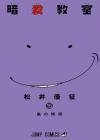

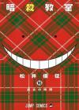

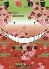

[杀戮都市](https://pewae.com/gaan/aHR0cHM6Ly9ib29rLmRvdWJhbi5jb20vc2VyaWVzLzE4MDk3)

原名：GANTZ作者：奥浩哉译者：梁家骏出版社：文化傳信有限公司 / 集英社出版时间：2000-12 / 2013-08全套册数：37

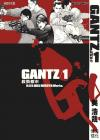

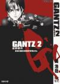

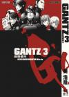

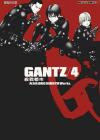

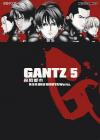

[一骑当千](https://pewae.com/gaan/aHR0cHM6Ly9ib29rLmRvdWJhbi5jb20vc2VyaWVzLzM2MTgy)

原名：一騎當千作者：盐崎雄二译者：付国忠出版社：WaniBooks / 台湾尖端出版社出版时间：2001-07 / 2016-09全套册数：24

[伊藤润二恐怖漫画精选](https://pewae.com/gaan/aHR0cHM6Ly9ib29rLmRvdWJhbi5jb20vc2VyaWVzLzQ0Mzg=)

作者：伊藤润二译者：何力出版社：東立出版时间：1998全套册数：16

[拍卖行](https://pewae.com/gaan/aHR0cHM6Ly9qYS53aWtpcGVkaWEub3JnL3dpa2kvJUUzJTgyJUFBJUUzJTgzJUJDJUUzJTgyJUFGJUUzJTgyJUI3JUUzJTgzJUE3JUUzJTgzJUIzJUUzJTgzJUJCJUUzJTgzJThGJUUzJTgyJUE2JUUzJTgyJUI5)

作者：叶精作 / 小池一夫出版社：集英社出版时间：1991-01 / 2003-06全套册数：34

## 参考资料

*[1]：孙正义自传里说他有一次住院，期间读了3000本书。有好事者去医院查证，问医生。医生回答：“他确实读了很多书。但大部分是漫画。”*