去年定下的读书量增加一半的目标并未达成。
本年度读书数量基本与上一年度基本差不多。本数略少，为29本。页数反倒增加了200多页。
上半年忙活读完了古龙系列的最后几部，有些超时，耽误了后面的读书计划。真没想到当年的珍馐如今也会变得索然无味。
因为疫情影响，家门口的咖啡（读书）餐吧就没怎么去过，下半年更是关门大吉了，所以失去了在那里读短篇幅的小书的机会。

倒是11月中旬以后，因为公司断网的原因，中午没有事情做，只能是之前下载过的电子书，有啥看啥。倒是有种被强迫的无目的阅读的意思。
同样是因为咖啡餐吧黄了的原因，今年读的实体书数量只有4本，2本是之前给臭宝买书凑单的，2本就是臭宝的书。

今年读的书中，篇幅最长的是夏志清的《中国现代小说史》。但其中的引文和附件其实都是跳过没读的。除去此部书，第二长的是《鲁迅传》。
最短的是刀尔登的《中国好人》。
耗时最长的是连阔如的《江湖丛谈》。这本书里面的江湖黑话太多，读了之后要先在脑子里翻译一遍。另外我还喜欢看他后面出现的骗术在前面的章节里是否出现过，因为耗时颇久。
最短的是黄霑的《不文集》，因为实在是不怎么新鲜。

按题材划分，读的最多的仍旧是小说，占了1/3强，其余散文回忆录之类的比较多。传记读了两部，感觉非常糟糕，明年如无意外是不会碰传记了。
按年代划分，中国当代作者的书占2/3。明年应当会适当减少。

系列小说只读了一部《凶宅笔记》，非常失望的存在。寡淡无味。绝对不推荐。

今年读的书中，感觉最好的是《六里庄遗事》，行文节奏很对我的口味。
另外《绝对笑喷之弃业医生日志》和《江湖丛谈》都是很适合床头马上的闲适读物，知识性和趣味性都挺好。
最差的则是《本书书名无法描述本书内容》的实体书，不知是翻译不行还是我不行，反正就是不行。
《看破西游便成精》也是一本烂书。

明年定个小目标，35本应该可以达到吧。

下面是书目和个人简评：

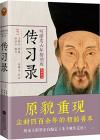

[传习录](https://pewae.com/gaan/aHR0cHM6Ly9ib29rLmRvdWJhbi5jb20vc3ViamVjdC8yNjQyNjM0Mw==)

作者：王守仁译者：张靖杰出版社：江苏文艺出版社出版时间：2015

王守仁，俺们老王家可能最有能耐的一个人，近几年很火。
于是读了《传习录》原文，发觉他既不像当年明月说得那么牛，也不像中学历史书里那么轴。

老王主张“天理即人欲”是没错，可我觉得他这么说更多的是因为他看不上朱熹那套。如果想要“随心所欲”地享受酒色财气的生活，那在王守仁看来就错了。因为“名利色”这些玩意儿在他那里不叫“人欲”，而是“私欲”。人欲等于真理，普通人所追求的仍旧是三俗！好吧，他比朱熹进步的地方，是强调了“理”必须靠“良知”去“求”，而不是靠坐家里瞎琢磨。

近年来王学兴盛，据说是有熊本熊在背书。可是毛的《实践论》跟“知行合一”相比较，不过是白话文版本跟古文的区别。怎么就一个“辩证唯物主义”，另一个“主观唯心主义”了？能不能要点脸。对于世界和人的认知，王氏心学强调的是“格”，也就是理解、揣摩、研究的意思，其余都不是重点。用伟大导师马克思的模板来套，王的研究方向是“方法论”，而不是根本的“世界观”，即：“应该如何面对世界，如何做人”，而不是“世界是什么样的，人是什么。”王阳明和马克思研究的根本不是同一个方向，我的中学政治书真可谓是自己树靶子自己打。

儒家的圣人等同于宗教里的神，无处不在又没有具体形象，只是虚幻的偶像。于是乎，在心学的理论里，没有人能成为圣人，因为你永远有可能做得不对，不符合“天理”或者“人欲”。天理或者说人欲是不会出错的，做得不对是你“格”得还不够。尧舜是没错的，孔孟是没错的，四书是没错的，都是朱熹这个二把刀，给解释歪了……于是心学这东西，终究没脱离开儒学的范畴，散发着酸腐的味道。高度集权的中央政权下是无法产生真正的思想家的。

“圣人不死，大盗不止。”我还是趋向认同庄子。只要有圣人存在的理论，就跟我相性不合。
也许再读多一些会有不同的认识吧，但这心学终究是不合口味，下次再碰不知要多久以后了。

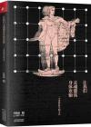

[让我们灵魂激荡身体欢愉](https://pewae.com/gaan/aHR0cHM6Ly9ib29rLmRvdWJhbi5jb20vc3ViamVjdC8zNDQ1OTc0MQ==)

作者：任黎明出版社：天津科学技术出版社出版时间：2019

虽然直奔下三路而去，但医学科普类的书终究值得鼓励。
我不玩微博，不了解作者是个怎样的大V。
作者有点直男癌，多少对女性读者有些不尊重。不过对“包皮、泌尿、前列腺、阴茎、阴囊、海绵体、不应期”这些名词感兴趣的女读者应该也不在乎那点儿直男癌吧。
但是，严谨的医学科普文章终归会得到一个最终结论：别给自己当大夫，有事儿赶紧去医院。这部书也不例外。这就有些不爽——就像国产的鬼片灵异现象最后都会解释成有人神经病——早就露了底了。

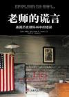

[老师的谎言](https://pewae.com/gaan/aHR0cHM6Ly9ib29rLmRvdWJhbi5jb20vc3ViamVjdC80MTM4MDY2)

原名：教师的谎言作者：詹姆斯·洛温译者：刘北成 / 马万利出版社：中央编译出版社出版时间：2009

作者很较真，用严谨的态度跟美国人说明了什么叫春秋笔法。
成为英雄也就成了符号，不再是人，连美国也不能例外。
长篇累牍地说哥伦布那章没什么必要，过分强调不是最先并没什么意义。
海伦凯勒的故事倒是挺有趣，作者之所以驳斥历史书，是因为后来的海伦凯勒变成了一位社会主义者；作者在字里行间的潜台词是：社会主义者怎么能成为标杆呢？
全文看下来，美国历史书上同样有很多的避而不谈，也就是多年前中国媒体喜欢追究的日本历史书回避南京大屠杀的同类问题。可这总比“曲折中前进”要强点儿吧。
而南北战争的政治正确，跟贵国把岳飞改成不是民族英雄也异曲同工，都是为了团结少数族裔而进行的退让。
政府总要实施教化，教化就有立场，教科书就是工具，哪儿都一样。所以还是无政府比较好。

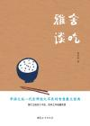

[雅舍谈吃](https://pewae.com/gaan/aHR0cHM6Ly9ib29rLmRvdWJhbi5jb20vc3ViamVjdC8zNDQ1NjM5Nw==)

作者：梁实秋出版社：中国妇女出版社出版时间：2019

梁实秋，喜欢香菜，咸党，不喜欢勾芡过重的食物。
文字平和顺畅，同是老北京，比老舍更平易近人。
局限性也挺强的，写海鲜的时候明显信心不足。
不经意间还是有种帝都人的傲慢。但没这种味儿就又不成了。

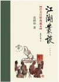

[江湖丛谈](https://pewae.com/gaan/aHR0cHM6Ly9ib29rLmRvdWJhbi5jb20vc3ViamVjdC83MDY1NDkx)

作者：连阔如出版社：中华书局出版时间：2011

又双叒叕是闺女买书凑单的搭头，实体书。非常有趣。
推荐！
不管是鲁郭茅巴老曹，还是胡适、林语堂、沈从文、周作人、谢冰莹，无论批判还是褒扬，他们的文字都是居于庙堂的、俯视的。而连阔如的这本书，是平视的，烟火的。连阔如笔下的二三十年代的北京天津沈阳大连是那样的热闹，基本看不到战火的侵扰。
云先生笔下的江湖，靠的是三样：骗、混、本事。有本事的不会骗，不行；能混的没本事，也不行。所谓金皮彩挂评团调柳八大门派，算命的（金）、卖药的（皮）、对缝的（调）完全靠嘴皮子骗，自不用提；可卖艺的、说书唱大鼓讲相声这种靠技术的，没有混和骗的本事竟也挣不到钱。唱大鼓说书说相声的注水拖延时间，还要现挂反应快跟观众互动；卖艺的要先用小把戏把客人圈过来，还要有跌宕起伏，不能让人跑咯。最神奇的知识点是彩门竟然是分成“卖戏法的”和“变戏法”的两种。“卖戏法的”是以教学生收学费为生，而且还不教真本事。这不就是今天的牛皮癣广告“赌术揭秘”么！
时代变了，骗子的手段变了，本质却没什么变化。全书通读下来，识别诈骗的本领又增强了。
评书、相声、大鼓行业的师门，相当于现在的行业协会。而且是约束性很强的那种。所谓不拜师不能登台，是一种欺行霸市的行为。并不光彩。所谓有师门的沦落他乡，会有同门帮一把，从老云的笔端就能看出，不过是粉饰太平罢了。相声这个行当，从诞生的那天起，内部的龃龉就从来没少过。
算命一章写得也很好，可能跟云先生自己当过算命先生有关。部分内容仍有现实意义，起码可以拿来指导面试。
整部书最差的部分是连丽如的序，絮絮叨叨，语无伦次——你收不收干儿子，有没有把评书发扬光大，跟你爹写的这部书有什么关系？他可是从头至尾都没露出自己是个团柴的，只说他到处流浪啊！
另外一个，也是最大的缺点，是每次出现江湖春点儿都要在括号里重新注释一遍。其实大可不必，各个江湖门派有很多共同的春点儿，像什么点子、圆粘子、老合、里腥、火穴大转之类，简直是通用的，根本没必要从第一章一直解释到第七章。这玩意儿的频繁出现影响了阅读的连贯性。

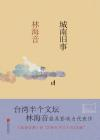

[城南旧事](https://pewae.com/gaan/aHR0cHM6Ly9ib29rLmRvdWJhbi5jb20vc3ViamVjdC8yNjcwMjUxNg==)

作者：林海音出版社：北京联合出版公司出版时间：2016

并不是简单的儿童读物。对父亲的描写很接地气，包括父亲的小心思，包括母亲的吃醋。

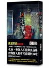

[凶宅笔记 上](https://pewae.com/gaan/aHR0cHM6Ly9ib29rLmRvdWJhbi5jb20vc3ViamVjdC8yNTk3ODAzMg==)

原名：凶宅筆記 上作者：貳十三出版社：知翎文化出版时间：2013

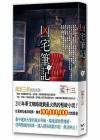

[凶宅笔记 下](https://pewae.com/gaan/aHR0cHM6Ly9ib29rLmRvdWJhbi5jb20vc3ViamVjdC8yNTk3ODAzMw==)

原名：凶宅筆記 下作者：貳十三出版社：知翎文化出版时间：2013

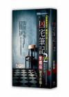

[凶宅笔记2](https://pewae.com/gaan/aHR0cHM6Ly9ib29rLmRvdWJhbi5jb20vc3ViamVjdC8yNTk3ODU3NA==)

原名：凶宅筆記2作者：贰十三出版社：知翎文化出版时间：2013

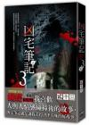

[凶宅笔记 第三部上](https://pewae.com/gaan/aHR0cHM6Ly9ib29rLmRvdWJhbi5jb20vc3ViamVjdC8yNzYxNTcxMg==)

原名：凶宅筆記 第三部上作者：贰十三出版社：知翎文化出版时间：2015

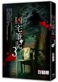

[凶宅笔记 第三部下](https://pewae.com/gaan/aHR0cHM6Ly9ib29rLmRvdWJhbi5jb20vc3ViamVjdC8yNzYxNTcxOQ==)

原名：凶宅筆記 第三部下作者：贰十三出版社：知翎文化出版时间：2015

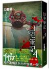

[凶宅笔记第四部](https://pewae.com/gaan/aHR0cHM6Ly9ib29rLmRvdWJhbi5jb20vc3ViamVjdC8yNzYxNTcyNA==)

原名：凶宅筆記 第四部作者：贰十三出版社：知翎文化出版时间：2015

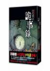

[凶宅笔记 诡事录](https://pewae.com/gaan/aHR0cHM6Ly9ib29rLmRvdWJhbi5jb20vc3ViamVjdC8yNTk3ODU3Nw==)

原名：凶宅筆記之詭事錄作者：贰十三出版社：知翎文化出版时间：2014

不知是不是为了出版的原因，这书写得太过浅尝辄止。这种书不吓人还有什么乐子可言。

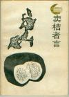

[卖桔者言](https://pewae.com/gaan/aHR0cHM6Ly9ib29rLmRvdWJhbi5jb20vc3ViamVjdC8xNDM4OTQ4Lw==)

作者：张五常出版社：四川人民出版社出版时间：1988

优点是生动，缺点是太散。
这本小书介于时评和科普之间，讲了一些基础的经济学原理。而且，说了一些张先生对于经济和政治之间关系的理解。
由于创作时间是在香港回归前，所以，张先生剖析了港英式伪民主对经济的抑制，并且稍微畅想了一下香港的未来。
然后就没有然后了。

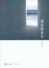

[观念的水位](https://pewae.com/gaan/aHR0cHM6Ly9ib29rLmRvdWJhbi5jb20vc3ViamVjdC8yMDQ2MzEwOC8=)

作者：刘瑜出版社：浙江大学出版社出版时间：2013

刘瑜大姐的政治倾向与我这个自由散漫的人非常接近。读之仿佛恰好搔到痒处，痛快。
缺憾是收录的后面的书评影评，以及最后两篇莫名其妙的散文。书评还好，影评的话，您老人家看个电影干嘛还挑那些晦涩的啊，就不能轻松一点嘛！最后“剩下的”一章实在太散，凑字数恰饭么。
某瓣下的评论令人心寒。与书名同题的那篇里，作者是相信公民意识的增强会促进民主的深化，也就是观念的水位会上涨。可真实的情况是，水位在下降啊。

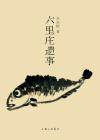

[六里庄遗事](https://pewae.com/gaan/aHR0cHM6Ly9ib29rLmRvdWJhbi5jb20vc3ViamVjdC8zMDQ0NjY4NA==)

作者：东东枪出版社：三联书店出版时间：2019

说成当代的“世说新语”，包装得有些过头了。但确实是好书。
事出寻常曰妖。当妖怪们融入日常的生活，便不再是妖。六里庄的鬼怪们寻常得便如杜王町的能力者一般，也有喜怒哀乐。
缺点跟同类型的“笑林广记”有些像，有时作者写了后面忘了前面，有些雷同。
大爱刘美丽。

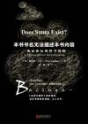

[本书书名无法描述本书内容](https://pewae.com/gaan/aHR0cHM6Ly9ib29rLmRvdWJhbi5jb20vc3ViamVjdC8yNjY3MjQwOA==)

原名：Does Santa Exist?: A Philosophical Investigation作者：埃里克·卡普兰译者：袁婧出版社：北京联合出版公司·未读出版时间：2016

本书内容配不上本书书名。
再不想碰哲学书。
翻译的水平不敢恭维。
外包装反人类。

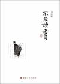

[不必读书目](https://pewae.com/gaan/aHR0cHM6Ly9ib29rLmRvdWJhbi5jb20vc3ViamVjdC8xMDQ2NjQ1NQ==)

作者：刀尔登出版社：山西人民出版社出版时间：2012

刀尔登果然博闻强记，点评各种名著信手拈来，毫无滞涩之感。
也许是学问太好，刀尔登引用古籍原文时几乎全然不作解释，这种“你看不懂是你level不够”的写作态度，我是非常欣赏的。当然有的字句我是真的看不懂。
本书蛮傲骄的。所谓的“不必读”其实是指出了各部著名的缺点。这些缺点大多是深入理解之后才能发现的态度上的偏差，也有少部分是把特色故意说成是缺点，硬拗上的。
读过之后，借用刀尔登的观点出去装逼，批评名作，感觉应该不错。

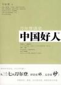

[中国好人](https://pewae.com/gaan/aHR0cHM6Ly9ib29rLmRvdWJhbi5jb20vc3ViamVjdC8zMzkxNzE3)

作者：刀尔登出版社：山西人民出版社出版时间：2009

中国的历史，就是在反复地树好人和抓坏人。其实好人坏人，都是宣传口径的事情。越是好就越容易假大空，反过来引起思想者的质疑。什么二十四孝，什么周公吐哺，什么雷锋赖宁，什么焦孔李任，莫不如是。泼脏水也同样。看看纣王越变越多的罪状，看看杨广的民间形象，就知道抓坏人这事儿多么的被民间所喜闻乐见。
作者从故纸堆里扒出了一些典型好人坏人的非典型事迹，有趣。

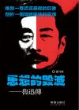

[思想的毁灭：鲁迅传](https://pewae.com/gaan/aHR0cHM6Ly93d3cuYm9va3MuY29tLnR3L3Byb2R1Y3RzLzAwMTA2NDQzNzk=)

作者：孙乃修出版时间：2014

孙的这大长篇传记，实在是在拿显微镜看人。（如果证据确凿的话）吹毛求疵的地方颇多，捕风捉影的地方也不少，当花边看还蛮有趣，用来认识鲁迅就跑偏了。鲁迅说得多，自然错的也多。观其言，察其行，只要不把鲁迅当成圣人完人看待，他干的那些事儿也不过是普通人该干的罢了。胡适表里不一，林语堂表里不一，梁实秋表里不一，鲁迅同样表里不一。中国人对“表”的要求实在高到了不可及的程度，根本没人能够做得到。基于这个标准进行的各种骂战，包括这部传记的大部分攻讦文字，实在太过不切实际。

作家，终究还是要靠作品来说话。鲁迅的小说散文和时评，成就就硬邦邦杵在那里，这是无法诋毁的。

鲁迅杂评文章的毛病，在我看来只有两处：第一是爱人身攻击，第二是爱站队扩大打击面。对于一个好幽默的人来说，总要找点什么来砸挂，说相声的人说了，砸挂要分对象，必须是同行业的，要么名人，要么熟人。可鲁迅本身是文人啊，而且貌似成了名声最大的那一个。自古文人相轻，我tm跟你很熟吗你就来调侃我？于是一个二个十个八个都闹翻了。想必鲁迅某些时候会后悔的，可为了维持人设也只能死硬着。

整部传记中最对胃口的部分是孙对《论“费厄泼赖”应该缓行》一文的分析。鞭辟入里，把我想说又说不出来的话都表达得很清楚。

鲁迅最后的遗言是：“忘掉我，过自己的生活。”想必他是不愿意被人整天惦记来评价去的。

一个有趣的事情，是若干年前，有人扒拉出鲁迅竟没正面谴责过日本侵略者。随后有很有一批辩解的人，说鲁迅1936年就死掉了，那时全面抗战还没爆发，所以鲁迅不开腔很正常。
于是问题来了，现在提出14年抗战，鲁迅直接被装里面了。嘿嘿。

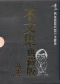

[不文集](https://pewae.com/gaan/aHR0cHM6Ly9ib29rLmRvdWJhbi5jb20vc3ViamVjdC8xNDg0ODA0)

作者：黃霑出版社：博益出版集團有限公司出版时间：2004

时间过太久了，段子不新鲜了，自然谈不上好看。但是收集黄色段子的精神是值得提倡的。
不知黄老师是不是捡肥皂一梗的原始出处。

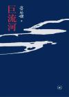

[巨流河](https://pewae.com/gaan/aHR0cHM6Ly9ib29rLmRvdWJhbi5jb20vc3ViamVjdC80ODQyNDQ2)

作者：齐邦媛出版社：生活·读书·新知三联书店出版时间：2010

本书的亮点集中在前半部分，以作者的角度看待抗战中的国共关系。作者的爹是国民党高官，但他投蒋之前是跟郭松龄混的。如果郭松龄不起兵反对张作霖，张作霖就不会找日本人借钱借兵器，更不会跟日本人赖帐，日本人就找不到借口收拾张作霖，也就没了九一八事变。
于是，作者看不上日本人，看不上俄国人，看不上老蒋，看不上老毛，看不上张学良，看不上杜聿明，看不上林彪。她一直认为只有东北人才能管好东北，南方来的都只会掠夺不会建设。——这妥妥的满洲国独立分子啊！以这样的视角看抗战太有意思了。
也正因为如此，后半部分在台湾的故事就毫无特色。
贯穿始终的，对飞虎队的那个初恋的描写真挚生动，对自己的丈夫和子女就像在对待纸片人。

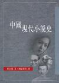

[中国现代小说史](https://pewae.com/gaan/aHR0cHM6Ly9ib29rLmRvdWJhbi5jb20vc3ViamVjdC8xMzY3ODAy)

原名：A History of Modern Chinese Fiction作者：夏志清译者：丁福祥 / 劉紹銘 / 國雄 / 夏濟安 / 思果 / 李歐梵 / 林耀福 / 水晶 / 潘銘燊 / 舒明出版社：香港中文大學出版社出版时间：2001

本书的优点和缺点都是苛刻。把文学性跟思想性分开这点我是赞同的，所以很多作家有了跟教科书上截然不同的评价。有观点的书读着过瘾，但并不能全盘接受，更要扬弃。

与我上学时语文老师所教的“鲁郭茅巴老曹，冰心夏衍叶圣陶，一多艾青朱自清，还有立波和老赵”的观点截然不同。一家之言并不足信，倒是搞明白了前面那个顺口溜的大概由来，以及张爱玲和钱钟书的东西为什么之前不受追捧。当书单搜书还是不错的，打算找巴金的《寒夜》和师陀的《结婚》来看。再读读张天翼叶圣陶吧。

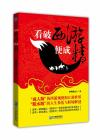

[看破西游便成精](https://pewae.com/gaan/aHR0cHM6Ly9ib29rLmRvdWJhbi5jb20vc3ViamVjdC8yMDI3NzI1MA==)

作者：御风楼主人出版社：企业管理出版社出版时间：2012

无聊。
除了文殊的两只狮子是同一只狮子以外，没什么新鲜观点。并且，缺少“更进一步”的分析。比如说太上老君派童子和独角兕下界，是为了道门挽回损失，OK，我接受。可之后呢？把金角银角大犀牛叫回去就完了？对佛门兴盛的大局完全没有影响啊！太上老君就只为了面子好看？这隔靴搔痒的做法跟作者分析的太上的厚黑人设严重不符嘛！
硬把西游记的故事往企业管理的模板里硬塞的滞涩感，读起来非常不舒服。并不是四个人一匹马凑一起就能叫团队啊。

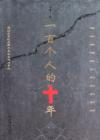

[一百个人的十年](https://pewae.com/2020/12/www.baidu.com/link?url=10aGTW2_iekIHowH6xF5cC3IBYdoNPCeEgLviHTIMXjFmvYM1LaXfDLAcBDoU8Z6adzsPhDpg5LLPdzXQC_caKkmSVigJBhSZvfOrua6bJClx-9_wPFRxF8pFysLvYwZAJaHwhGS77wTdRX8rpHYU8Xhx-p7goc4fjeISYpaWdq&wd=&eqid=d03e95e70001a8ed000000035fd4312a)

作者：冯骥才出版社：时代文艺出版社出版时间：2004

十年其实并不止十年。它跟前面的大跃进、反右、四清其实是一体的。
中国历史上以往的权力斗争，都是在庙堂之上，对于百姓的伤害和对后世荼毒，没有比文革更严重的了。
看看这些回忆者，往往都是用阶级斗争的语言来描述他们的经历就可见一斑。

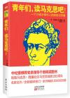

[青年们，读马克思吧！](https://pewae.com/gaan/aHR0cHM6Ly9ib29rLmRvdWJhbi5jb20vc3ViamVjdC8zMDIxODQ5OA==)

作者：内田树 / 石川康宏译者：李春霞出版社：东方出版社出版时间：2018

译者可谓如履薄冰，引用的每一句马克思恩格斯的话都去翻了官方翻译版本原文。
以前的批评者们说，马克思提出《共产党宣言》的时候才30郎当岁，嘴上没毛办事不牢，所以理论上是不行的。但是，他们可没有说，马克思这厮是正宗的博士啊。博士当然比硕士、学士、高中生、初中生、小学生、辍学的、文盲要厉害。马克思确实想了很多问题，也解答了很多问题，也有很多问题解答不了。作为一个哲学家被人尊重和研究是应该的。
但是具体拿来用就两说了。
最早提出“意识形态”的马克思那帮人，对于这个词是抱有批判态度的。恩格斯说：“意识形态是由所谓的思想家有意识地、但是以虚假的意识完成的过程。推动他行动的真正动力始终是他不知道的，否则这就不是意识形态的过程了。”
到了列宁那里就变了味儿了：“意识形态论证和捍卫统治阶级的合法性；意识形态整合社会思潮，凝聚人心；意识形态源自特定阶级根本的利益需求,具有利益阐释和利益维护功能……”
估计看了列子的注解，恩亚圣的棺材板都要摁不住了。
所以列宁搞的，跟马克思说的，根本不是同一套东西。但是吧，马克思就是个搞纯理论的，不经过检验，也不知道能不能使。反正共产主义搞着搞着就变成了现在这个样子。马先生也早已预料到了。
“每一个企图代替旧统治阶级地位的新阶级，就是为了达到自己的目的而不得不把自己的利益说成是社会全体成员的共同利益。”
政治家的嘴，骗人的鬼。

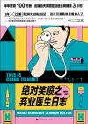

[绝对笑喷之弃业医生日志](https://pewae.com/gaan/aHR0cHM6Ly9ib29rLmRvdWJhbi5jb20vc3ViamVjdC8zMDI5MzY2Mw==)

原名：THIS IS GOING TO HURT作者：亚当·凯译者：胡逍扬出版社：北京时代华文书局出版时间：2019

推荐！
又是一本下三路的医学书。作为“三上”读本是极好的。作者笔力流畅张弛有度。正文有趣，注释有用。
原来英国的妇产科也会滥用剖腹产，也有医闹，也有公费医疗跟私人医生的巨大价格差异。
以及，英国的病床一晚高达400英镑！
最喜欢是本书行将结束的时候，因为一台事故戛然而止。

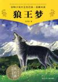

[狼王梦](https://pewae.com/gaan/aHR0cHM6Ly9ib29rLmRvdWJhbi5jb20vc3ViamVjdC80MDYxOTcy)

作者：沈石溪出版社：浙江少年儿童出版社出版时间：2009

作为沈石溪的代表作，水平还凑合，并不能算差。不过这狼是臆想中的狼，习性什么的跟真正的狼差好多。给低年级小孩看，看不懂；给高年级看，又太直白了。反正教育局每个假期的推荐书单上都有沈石溪，说这里面没PY交易，我是不信的。
总之是大大拉低了禁书平均水平的一部书。

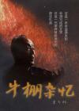

[牛棚杂忆](https://pewae.com/gaan/aHR0cHM6Ly9ib29rLmRvdWJhbi5jb20vc3ViamVjdC8xMjc0ODgx)

作者：季羡林出版社：中共中央党校出版社出版时间：1998

本书怨气颇重。而且是古早味知识分子的一板一眼的端着的那种，所以读起来有些反差萌。但也就那样了，季老的经历只是“一般”的波折，而不是“特别”的波折，故而情节本身并没有太多刳心雕肾之处。
倒是觉得人家在文革期间并没有多么受苦：都蹲了牛棚了，每月还有十几块工资，而且不工作的家属也有十几块钱。我大爷那时又红又专也没赚上十几块钱啊。

最有价值的是第二十章。余思和反思。关于文革的教训，季羡林说：“没有，一点儿都没有。”
本书起稿在1986年，出版在1998年，没有看到他所期望的反思。如今又是20年过去了，不仅没有反思，反而更加讳莫如深了。
老先生说的领袖崇拜，嘿嘿。

---

下面是本年度补完的漫画。只为弥补少年时代的遗憾，不评价。有兴趣的单独讨论。加这项只是为了显着多……

[恶之华](https://pewae.com/gaan/aHR0cHM6Ly9ib29rLmRvdWJhbi5jb20vc2VyaWVzLzc2ODU=)

原名：惡之華作者：押见修造译者：猴出版社：東立出版社出版时间：2011-05 / 2015-06全套册数：11

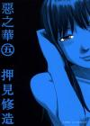

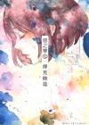

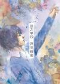

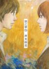

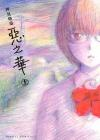

[罗马浴场](https://pewae.com/gaan/aHR0cHM6Ly9ib29rLmRvdWJhbi5jb20vc2VyaWVzLzU5MjI=)

原名：テルマエ・ロマエ作者：ヤマザキマリ译者：涂愫芸出版社：台灣角川出版时间：2010-11 / 2014-02全套册数：6

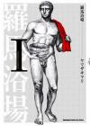

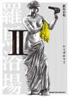

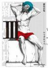

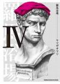

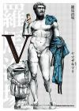

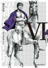

[多重人格侦探](https://pewae.com/gaan/aHR0cHM6Ly9ib29rLmRvdWJhbi5jb20vc2VyaWVzLzEwNjgw)

原名：多重人格探偵サイコ作者：大塚英志 / 田島昭宇出版社：東立出版社 / 角川書店出版时间：1997-01 / 2016-11全套册数：24

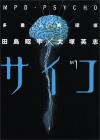

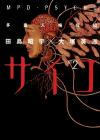

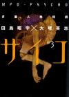

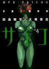

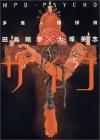

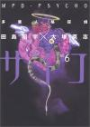

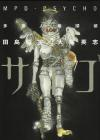

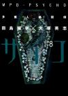

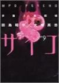

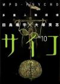

[怨恨屋本铺](https://pewae.com/gaan/aHR0cHM6Ly9ib29rLmRvdWJhbi5jb20vc2VyaWVzLzE3NDA4)

原名：怨み屋本舗作者：栗原正尚译者：翁蛉玲出版社：東立 / 集英社出版时间：2003-09 / 2008-06全套册数：20

[诈欺游戏](https://pewae.com/gaan/aHR0cHM6Ly9ib29rLmRvdWJhbi5jb20vc2VyaWVzLzE0MDAy)

原名：LIAR GAME作者：甲斐谷忍出版社：長鴻出版社 / 集英社出版时间：2006-11 / 2016-03全套册数：19

