本年度读书38本，超额完成了去年定下的小目标（35本）。总页数更是比去年提高了2500页，小有成就感。
其中18本是实体书，这从学生时代结束后还是第一次。

主要还是得归功于工位断网。毕竟现在的摸鱼时间除了睡觉就只能看书。
今年没有看什么特别大部头的书。最长的一本书是李天飞的《万万没想到》，但是这种文学评论读起来飞快，毫不费力。
耗时最长的是清代小说《后西游记》，倒不是说半白话文有多晦涩，而是实在写得枯燥乏味，读一会儿就睡着了，再翻还得往回捯饬。
最短的是周作人的《木片集》，不到一杯咖啡的时间就读完了。好像尽是些别的集子挑剩下的边角余料，蛮无趣的。

系列小说读了周浩晖的《暗黑者》四部曲。这书总体还令人满意，但连着读确实容易产生审美疲劳。

按题材分，小说13本，历史相关12本。小说当然是摸鱼看的。而历史关联的内容吧，是因为老婆单位发了定向购书资金，只能指定“党建”、“计算机”、“历史”、“金融”等几个方面，反正就偏偏没有小说。老婆大人就买了很多历史相关的书回来，然后她自己又不看……

今年读的书中，感觉最好的是李天飞的《万万没想到》和孔飞力的《叫魂》。《叫魂》从不同的角度揭示了中国社会的种种潜规则，每个阶层的思考方式，不仅是写历史，而且放现在的社会也不过时。
最差的是《房思琪的初恋乐园》。这种瞎鸡巴堆砌修辞的写法实在是反胃，哪怕作者的身世再凄惨也没用。实在无法理解这书怎么混进的豆瓣TOP榜单。

目前看，2022的工作会迎来动荡，希望读书量跟今年持平就好。

下面是书目和个人简评：

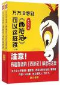

[万万没想到](https://pewae.com/gaan/aHR0cHM6Ly9ib29rLmRvdWJhbi5jb20vc3ViamVjdC8yNjkwMDEzOA==)

作者：李天飞出版社：陕西师范大学出版总社出版时间：2016

书名很俗烂，但内容真的非常非常好。可以说是我读过的最好的西游记参考书。
作者可谓旁征博引，从细微的命名和物品上，品读西游记背后的故事。
鲁迅和胡适说西游记的作者是吴承恩。李先生说：“我看不像”。然后列事实讲道理。李先生主张的作者不只一个与我的观点相同，当然我只是任性地看不起学术权威罢了，并不像李先生这样能列出子午卯酉来。
作者的关于角色“吸收”故事的观点非常好。民间故事总是会汇总到某些个【好】【坏】【蠢】【奸】的人身上，怪不得小时候读的东方朔、徐文长、阿凡提们都是那么那么的像。
要不是本书作者，还不知道有人一直在从事古籍的版本整理和校对工作。拿出自己20年前买的西游记，跟闺女新买的一比对，果然处处不同。
向他们致敬。

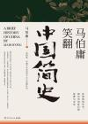

[马伯庸笑翻中国简史](https://pewae.com/gaan/aHR0cHM6Ly9ib29rLmRvdWJhbi5jb20vc3ViamVjdC8zNDg3OTAwOQ==)

作者：马伯庸出版社：湖南文艺出版社出版时间：2020

本书多少有些文不对题。或者是在大题目下选了一个很偏门的角度：自秦以降、中国每个朝代选择什么德性。
中国的统治者们，历来迷信，喜欢用一些稀奇古怪的东西来证明自己的正统。刚好战国末期的、在寻秦记里出场过的驺衍大忽悠提出了“五德”，于是历朝历代都要推出一个德性来彰显与旧时代的不同。而且君主们还耳根子特软，经常有改来改去的情形出现，特好玩。尤其是南北朝和五代十国时期等各种土大王们更要凸显自己的正统，就搞得很好玩。
豆瓣的评论里，有人指出马亲王这本书原创的东西不多，只是把别人的专业论文用白话翻译了一遍。
这咱也不了解，也不评论，自己觉得有收获就行。
何况还学了【奓】这么个大生字呢，值了。

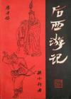

[后西游记](https://pewae.com/gaan/aHR0cHM6Ly9ib29rLmRvdWJhbi5jb20vc3ViamVjdC8zNDQ1NzQwMS8=)

作者：无名氏出版社：浙江文艺出版社出版时间：1985

小时候看过造化小儿和蜃精的两本连环画，便种了草。这回终于把原著补全了。
失望。原作者真对不起八十年代初小人书画家们的细心。
最大的毛病是思路僵化。套用四人组加一匹马的设定不说，仍旧是一和尚一猴子一猪一河童就过分。而又说唐半偈是唐僧的精神传承者，孙小圣是水帘洞的另一块石头，猪一戒是猪八戒和高翠兰的儿子，沙弥是沙和尚的徒弟。这tm就是在蹭热度啊。又有求完真经求真解，你当刷黄冈题库呢？至于孙小圣也同样要闹地府闹天宫，妖精里出现黑孩儿之类的，脸都不要了。
然后大多数时间枯燥乏味。虽然作者有些想法，见识方面明显是尊儒贬佛的。可说教的插入实在太生硬，什么造化小儿的酒色财气圈儿啊，什么颠倒大王啊，什么金钱压人啊，简直是把中心思想贴在脑门上，直接划重点了。作者文笔也差，对比《西游记》，《后西游记》人物对话非常生硬，为了推动情节而说，完全不考虑自己的身份背景，所有人说话的调调都差不多。动作神态细节更少，也就是“出来个怪，一棒子打死了，啊……”的文字RPG效果，缺少爽点。
西游里的诗就不怎么样，这部里的更加不堪。好在咱遇到诗也从来是跳过不看，算是没什么影响。
唯一生动一些的章节在中后段。《不老婆婆》篇直接开车，整章都是少儿不宜。虽然粗俗却把人物写活了。《蜃精》篇则强在设定上，利用传说中的怪物，把唐半偈三人组直接吞到肚子里，算是非常大的脑洞。而且还能圆回来，唐半偈通过念紧箍咒的办法给孙小圣发传呼，可以的。
反正浪费这时间不如去看小人书。

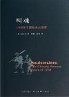

[叫魂](https://pewae.com/gaan/aHR0cHM6Ly9ib29rLmRvdWJhbi5jb20vc3ViamVjdC8yNTkxMjA3Ng==)

原名：Soulstealers: The Chinese Sorcery Scare of 1768作者：孔飞力译者：刘昶 / 陈兼出版社：三联书店出版时间：2014

确实是非常好的书。写的好，翻译的也好。
孔先生从普通民众、官僚、乾隆皇帝三个层面描述了荒唐的叫魂剪辫子妖术如何产生、流行、引起上层注意、调查，直至闹剧结束的来龙去脉。
底层民众的愚昧，官僚的敷衍以及乾隆的恐慌，都分析得特别透彻。
而且，由于是外国人的缘故，对于普通中国人司空见惯的诸如符咒、迷信的由来，鞭子的象征意义之类，都考据得极为严谨，对于知其然不知其所以然的中国人来说也大有裨益。
最精彩的是孔先生穿插在文中的对于中国封建帝国机制的种种点评。对于从未发生过根本性改变的帝国来说，言犹在耳。
实体书的正文部分有两套页码，带注释的和不带注释的，非常之不适，此为唯一扣分项。

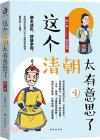

[这个清朝太有意思了 第一卷 努尔哈赤](https://pewae.com/gaan/aHR0cHM6Ly9ib29rLmRvdWJhbi5jb20vc3ViamVjdC8zNDg3NzQxNw==)

作者：张晓珉出版社：台海出版社出版时间：1970

清史的东西本来不感兴趣的。但既然老婆买了，那就看看呗。
没有太多的惊喜，该知道的都知道了。
作者功力比较扎实，也引用了朝鲜的资料作为佐证。
顶多是并没有标题说的那么有意思。
努尔哈赤就是个悍匪。

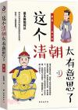

[这个清朝太有意思了 第二卷 皇太极](https://pewae.com/gaan/aHR0cHM6Ly9ib29rLmRvdWJhbi5jb20vc3ViamVjdC8zNDg3NzMxNw==)

作者：张晓珉出版社：台海出版社出版时间：2019

比起第一卷要差不少。多了一些无聊的评论，叙事上也有些絮叨，注水比较多。
对于悬案列出一二三种可能，也不说哪个更可信，其实挺不负责任的。
皇太极的故事主要分成两个部分：对内斗争和对外斗争。众贝勒内斗的故事之前没怎么读过，所以还算有点意思，可他讲得又不够多；对明朝战争的部分，之前《明朝那些事儿》读过了，虽然已经过去了十多年，但印象里也没什么大的出入，可能人家明史清史上就是这么写的，所以也远远谈不上有趣。

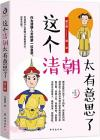

[这个清朝太有意思了(第三卷)](https://pewae.com/gaan/aHR0cHM6Ly9ib29rLmRvdWJhbi5jb20vc3ViamVjdC8zNDg3NjMxOQ==)

作者：张晓珉出版社：台海出版社出版时间：2019

可能是顺治在位时间太短的缘故，虽然名为顺治卷，其大多数时间却是在说多尔衮、吴三桂、李自成、南明什么的。
还是有些有意义的东西的，像对于史可法、马士英、吴三桂、郑成功这些人的认知。生逢乱世，出尽一时风头或许是机遇问题，但想笑到最后，运气和智慧都不可或缺。郑成功吴三桂同样是军阀，谁也没比谁好多少。
比较有趣的是着墨不多的顺治。活脱脱一个容易冲动的中二青年嘛！

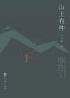

[山上有神](https://pewae.com/gaan/aHR0cHM6Ly9ib29rLmRvdWJhbi5jb20vc3ViamVjdC8yNjI1OTA5Mg==)

作者：王小峰出版社：百花洲文艺出版社出版时间：2014

王三表的作品。前半部分挺有意思，后半部分寓言味道太重了，以至于拘束。
三表的文字读来非常舒服，只是他似乎并不能很好地驾驭东北方言。或者说，吉林方言跟胶东还是有差别的。一些用字显得生分。
不大的村子里几年间死了好几个人：三个出村被山神“诅咒”死的，致富途中的两个垫脚石，以及最后成为新神祭品的郭翔姚贵。可是山村里人们对于死人的反应是麻木的，连哭都没有，该干嘛干嘛。这可能才是三表真的想隐喻的东西。

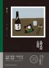

[北野武的小酒馆](https://pewae.com/gaan/aHR0cHM6Ly9ib29rLmRvdWJhbi5jb20vc3ViamVjdC8yNzE3NDEzMA==)

作者：北野武译者：姜向明出版社：雅众文化/新星出版社出版时间：2017

电影上的北野武总是一副又拽又痞的样子。书里的也是。名人出书这种东西，关于他们身世信仰的部分几乎一个字都不能信。北野武也不能例外。他的关于自己婚姻的理解，对于自己的那场车祸，就能够读出一种“故作”的滋味。只不过这位老哥不愧是相声演员，硬拗也拗得很有趣的说。
但是，对于电影的理解，北野武就不愧专业出身了。这段其实很短，但真的是说出了他最受我喜欢的部分，就是剪辑。真不愧是理工科出身。他谈到的要先把自己拍好的镜头了然于心，然后按照既定的方式组织起来，这就是导演的工作。还有关于CG和群演的认识，也特别好。拍部队打仗，找一万个群演，那一定会拍下一万张不同的脸。但如果用CG，即使是10人的团队，每个设计师恐怕也只能设计出10种表情，共计100张脸已经算很牛了，剩下的复制粘贴换皮。这真是一语道出了为什么CG制作的战争场面显得虚假的原因。
另外喜欢他对于数字化的吐槽。很多东西，数字化了以后真的就失去了乐趣。就像中国菜菜谱上的调味，永远是“适量、少许”，“稍多一点”这样的描述。非要列出准确的重量或者给出配比公式的话，不仅教条而且不好吃。

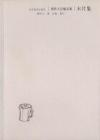

[木片集](https://pewae.com/gaan/aHR0cHM6Ly9ib29rLmRvdWJhbi5jb20vc3ViamVjdC8xMDM4MTc2)

作者：周作人出版社：河北教育出版社出版时间：2002

虽然是周作人自选，但已经是挑剩下的边角余料之残羹冷炙了，零碎得厉害。有写动物的，有文学评论，有品评人的，反正完全没有前后文可言。
文笔是通畅的，但也没写出什么特别的东西。好多知识怕是对于当时的学生什么的还有用处，现在不过是小学高年级必备的常识罢了，也不如教科书写得好。
同样写吃的，去年还说梁实秋写得并不见得多好，但周作人的这些拿出来一比较，就显出人家的好了。
倒是有一篇颇为吃重的，说学古文应该从韵文诗词开始，而所谓的散文有八股之气。这种观点颇合胃口。

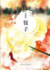

[饺子](https://pewae.com/gaan/aHR0cHM6Ly9ib29rLmRvdWJhbi5jb20vc3ViamVjdC8yNTczNzA0NA==)

作者：李碧华出版社：新星出版社出版时间：2013

李碧华的文字，一看就是那种长期从事影视编剧工作的老油子写出来的。画面感极强。这种文字读起来非常丝滑，进度非常神速。但是回味就比较弱了。
结构最好的当然是搬上了大银幕的《饺子》，文字比电影更加直接。第一个吃卤水鹅的故事比较失败，先猜到了就毫无感觉。其余的篇章里，《吃眼睛的女人》一股邪气，比较对胃口。而蛋挞那篇过于平淡了。

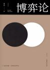

[博弈论](https://pewae.com/gaan/aHR0cHM6Ly9ib29rLmRvdWJhbi5jb20vc3ViamVjdC8zMDU3MzQ5MA==)

作者：翟文明出版社：中国华侨出版社出版时间：2018

知识是好知识，但是这作者吧，感觉就是抄的，没什么自己的东西，举的例子都不怎么严密。这对于逻辑学著作来说是致命的。而后半部分又罗里罗嗦，实在是很差劲的一本书。

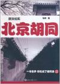

[北京胡同](https://pewae.com/gaan/aHR0cHM6Ly9ib29rLmRvdWJhbi5jb20vc3ViamVjdC82NzExNDUy)

作者：马玲出版社：世界知识出版社出版时间：2011

深度不行，广度也不行。作者对于胡同的各方面介绍都浮于表面，跟档案馆里的死资料毫无二致。
致命的是掺杂了好多胡同之外的内容——我要看紫禁城要看文革我还找你吗？
甚至把网友回帖都粘上了，你还能干点啥？有营养的内容很少，算是有杂质的白开水吧。
美其名曰图文纪实吧，这图的水平也差了些意思。
后面那篇所谓的小说掉牙漏风，尴尬得要命。

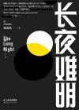

[长夜难明](https://pewae.com/gaan/aHR0cHM6Ly9ib29rLmRvdWJhbi5jb20vc3ViamVjdC8yNjkyMzM5MA==)

原名：The Long Night作者：紫金陈出版社：云南人民出版社出版时间：2017

把小说写得惊悚不难，能逐字逐句地圆回来就比较不容易。本作人物特点鲜明，注重人物关系和事件的刻画，倒并不是以推理抓人眼球。相反，是先抛出结果再探究目的和手段的方法。作者讲故事的手段技巧性很强。遗憾的是结尾，确切的说是结尾的最后一句话，除了过审别无他用。

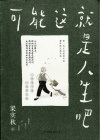

[可能这就是人生吧](https://pewae.com/gaan/aHR0cHM6Ly9ib29rLmRvdWJhbi5jb20vc3ViamVjdC8zNTE3MjQxNg==)

作者：梁实秋出版社：中国友谊出版公司出版时间：2020

梁先生的文字最棒的地方是节奏感。最喜欢他写国文老师的那一篇，堪称写人文章之典范。美中不足的是中间的大约1/4写吃的，跟之前的《雅舍谈吃》重复的，颇为不值。

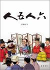

[人五人六](https://pewae.com/gaan/aHR0cHM6Ly9ib29rLmRvdWJhbi5jb20vc3ViamVjdC8yNzE4NjcyNQ==)

作者：张发财出版社：岳麓书社出版时间：2017

张发财的前面几本书都读了，而且还都是实体书。从总体质量上看，是呈阴跌之势的。是故这本读的是电子版。这本书发财兄舍弃了前面的世说新语式的微博体，改为千字文模式，但似乎并没有把握好史实与调侃之间的比例，“史”的含量明显下降了。对于厕上读物来说，shi量下降也就意味着可读性下降。没买实体书就对了。

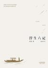

[浮生六记](https://pewae.com/gaan/aHR0cHM6Ly9ib29rLmRvdWJhbi5jb20vc3ViamVjdC8yNjYxMDg2NA==)

作者：沈复译者：张佳玮出版社：天津人民出版社出版时间：2015

这个版本颇为不爽。把张公子的译文放到前面，一句原文不带；四篇结束之后才是古文原文，一句解释不带。清朝中期的文章其实挺好理解的，上来就大篇幅的注解令人费解。而张公子的文字被束缚住了，根本没什么发挥。而且也没觉得他有多么高深的古文功力。难道是借助他翻译林语堂的英文版本？感觉以张佳玮为卖点算是双输。
文字本身感觉很一般，不解为什么被推崇。沈复这个人有多爱老婆吗？只觉得他是在炫耀自己的老婆有多么有趣，却不见一丝一毫他对于家庭的责任。发生家庭矛盾的时候没有为老婆说话，也不积极地找工作养家糊口，所有的一切不过是老婆死了之后嘴上夸夸而已。
当然不是一无是处。清代的婆媳关系啊，兄弟争家产啊，跟子女的分别啊之类的都很有意思。最喜欢的是《浪游记快》，写他跟朋友狎妓的心态，非常生动。

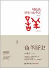

[鱼羊野史·第1卷](https://pewae.com/gaan/aHR0cHM6Ly9ib29rLmRvdWJhbi5jb20vc3ViamVjdC8yNTg0NjE4Mg==)

作者：高晓松出版社：湖南文艺出版社出版时间：2014

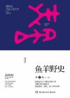

[鱼羊野史·第2卷](https://pewae.com/gaan/aHR0cHM6Ly9ib29rLmRvdWJhbi5jb20vc3ViamVjdC8yNTk0NTQ4Nw==)

作者：高晓松出版社：湖南文艺出版社出版时间：2014

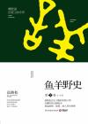

[鱼羊野史·第3卷](https://pewae.com/gaan/aHR0cHM6Ly9ib29rLmRvdWJhbi5jb20vc3ViamVjdC8yNjM0OTA0OA==)

作者：高晓松出版社：民主与建设出版社出版时间：2015

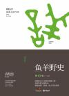

[鱼羊野史•第4卷](https://pewae.com/gaan/aHR0cHM6Ly9ib29rLmRvdWJhbi5jb20vc3ViamVjdC8yNjU5Mjg2OQ==)

作者：高晓松出版社：广东人民出版社出版时间：2015

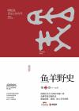

[鱼羊野史·第5卷](https://pewae.com/gaan/aHR0cHM6Ly9ib29rLmRvdWJhbi5jb20vc3ViamVjdC8yNjcwNjk2MQ==)

作者：高晓松出版社：广东人民出版社出版时间：2016

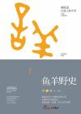

[鱼羊野史·第6卷](https://pewae.com/gaan/aHR0cHM6Ly9ib29rLmRvdWJhbi5jb20vc3ViamVjdC8yNjgwNzE3MQ==)

作者：高晓松出版社：广东人民出版社出版时间：2016

矮大紧的这套书看得有些煎熬。陪闺女去咖啡书店随手抽来的，不算太好也不算太坏，就读了下去。开头还好，到后来发现矮大紧这家伙太喜欢炫耀自己的外婆是专家，自己的妈妈是梁思成的学生，外婆家祖上家世显赫，以及他是清华肄业以及北影旁听生这几件事。叨逼叨的，半本之后就审美疲劳了。
历史上的今天这个题材，有多种写法。矮大紧这版主要说近代战争和娱乐圈的人。我向来认为，一本书对你有没有用，要看作者写书的level是不是比你高。
我不是军迷，所以读到矮先生写的一战二战中东战争什么的就挺有收获，起码他说的东西我之前不了解啊。但“祝某某（影星、歌星）生日快乐”这种事就像在注水，要么花样恭维人，要么通过“我跟某某有幸合作过”的句式花样恭维自己。
但其余的角度矮先生似乎又不太行。他说体育界的事，提到过乔丹、泰森和辛普森，内容却都有不准确的地方；说IT界MSN，引用的内容也不太对。便不由怀疑他在其他的方面是否也没那么专业。
有人不喜欢矮大紧，说他崇洋媚外屁股是歪的。我倒觉得并不如此，他是力度没掌握好。他提出批评的语气一直温和的、浅尝辄止的，无论是国内还是国外，但吹捧的时候却大吹法螺不遗余力。对国内的批评敏感的人群太多，容易被抓包。而赞美美国的内容一多，这帽子便扣下来了。其实他若是只批评不赞美，名声会比现在好很多。
最有价值的部分是他创作歌曲的感悟和技巧，这方面他却甚少提及。也许是一种敝帚自珍吧。写顾城的时候说了一点，他一向欣赏顾城，因为顾城的死大发感慨，一气呵成写出了《白衣飘飘的年代》等三首歌曲，并因此遭到了顾城母亲的表扬。
说到顾城就想到一桩诡事：华为荣耀系列的默认铃声，就叫《荣耀》，作词是高晓松。铃声用的是歌的高潮部分：“回首依然望见故乡月亮，黑夜给了我黑色眼睛，我却用它去寻找光明……”。从“黑眼睛”开始，高晓松又引用了顾城。高晓松酒驾肇事被判过刑，妥妥的劣迹艺人；被引用的顾城杀妻，虽然没经过审判，这私德一定是亏到家了，且此君移民新西兰之后诗集照样在国内出版，变成外国人之后照样在国内捞钱，这必须是为现在的粉红们所唾弃的行为。
既然电影电视剧涉及到污点艺人都不让播，那么粉红们只要看到荣耀手机就应该抢下来踩烂。

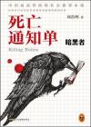

[死亡通知单·暗黑者](https://pewae.com/gaan/aHR0cHM6Ly9ib29rLmRvdWJhbi5jb20vc3ViamVjdC8yNTg4NDg5MA==)

作者：周浩晖出版社：北京时代华文书局出版时间：2014

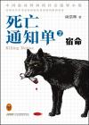

[死亡通知单2·宿命](https://pewae.com/gaan/aHR0cHM6Ly9ib29rLmRvdWJhbi5jb20vc3ViamVjdC8yNTkyOTIxMy8=)

作者：周浩晖出版社：北京时代华文书局出版时间：2014

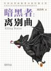

[暗黑者：离别曲](https://pewae.com/gaan/aHR0cHM6Ly9ib29rLmRvdWJhbi5jb20vc3ViamVjdC8yNjY5MzI1OC8=)

原名：死亡通知单3：离别曲作者：周浩晖出版社：中国城市出版社出版时间：2016

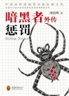

[暗黑者外传：惩罚](https://pewae.com/gaan/aHR0cHM6Ly9ib29rLmRvdWJhbi5jb20vc3ViamVjdC8yNjYxNDU4MS8=)

原名：原罪之惩罚作者：周浩晖出版社：中国城市出版社出版时间：2015

这哥们的作品有评书作家的特点，一惊一乍的。前两部的悬念感比较强，但是把警察描写的过于废物点心。
第二部明显是给出了南大案的一个解，最终BOSS藏得挺好。
第三部注水严重，作者有点儿蹭自己热度的意思。
倒是最后的外传换了风格，令人眼前一亮。

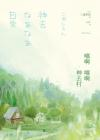

[哪啊哪啊神去村](https://pewae.com/gaan/aHR0cHM6Ly9ib29rLmRvdWJhbi5jb20vc3ViamVjdC8yNjI1MDA5NC8=)

原名：神去なあなあ日常作者：三浦紫苑译者：王蕴洁出版社：北京联合出版公司出版时间：2015

因为生动，所以有趣。
日本的生殖器崇拜真是深入人心，即使是三浦这样的中年大妈开起车来也轻车熟路。

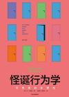

[怪诞行为学](https://pewae.com/gaan/aHR0cHM6Ly9ib29rLmRvdWJhbi5jb20vc3ViamVjdC8yNzU5OTM4MS8=)

原名：Predictably Irrational作者：丹·艾瑞里译者：夏蓓洁 / 赵德亮出版社：中信出版集团出版时间：2017

非常精彩的经济学读物，要是标题不那么哗众取宠就更好了。
深入浅出说明了日常生活经济活动中，商家常见的陷阱，以及人们心理活动对于买卖、价格、交易、合同的正负方向的影响。其实副标题更能体现出书的本意：可以预测的非理性。
不过这本实体书的封套实在太值得吐槽了，正面下方和背面两侧的前红色条，看上去真的太像被晒掉色了！

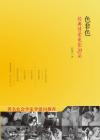

[色非色](https://pewae.com/gaan/aHR0cHM6Ly9ib29rLmRvdWJhbi5jb20vc3ViamVjdC8yNTc3MzkwNC8=)

作者：薛希白出版社：海峡文艺出版社出版时间：2013

当作加强版豆列来看的。不止正文，在注释里也隐藏了不少好东西。
性爱难分。作者的文笔是非常细腻的，对于爱情的分析比较透彻。奈何本人对爱情片一向无感。
把能找到的片子刷一遍回头再看吧。

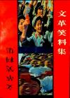

[文革笑料集](https://pewae.com/gaan/aHR0cHM6Ly96aC5ydTFsaWIub3JnL2Jvb2svMzQyNTA0NC9lMjAwYTE=)

出版社：西南财经大学出版社出版时间：1988

不要提什么时代背景创作初衷，作为一本笑话集，里面的内容70%不好笑就是原罪。
又及，作为一本八十年代的正式出版物，这本书里看人还是按照“敌我矛盾”的那套分类法，实在是不高明。
比如其中一则笑话说严慰冰同志揭发叶群，导致林彪不得不正式写材料证明叶嫁给他的时候还是处女。
陆定一是冤案不假，叶群不是好人也不假，林副主席写那种证明材料当然是笑话。可因为严反对的是叶群，叶群是坏人，就把严慰冰这个品格低下的人叫做同志，这同志二字也太不值钱了。谁要跟血口喷人还嫁祸他人的人做同志。

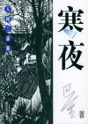

[寒夜](https://pewae.com/gaan/aHR0cHM6Ly9ib29rLmRvdWJhbi5jb20vc3ViamVjdC8xMTM4ODcyLw==)

作者：巴金出版社：浙江文艺出版社出版时间：2003

不愧是巴金最出色的小说。虽然文字间有些矫情，但其中的压抑和苦闷情绪绝对是到位了。
包括巴金本人都觉得，他写的是小人物被战争洪流裹挟的无奈。
我却觉得，这部作品的成功在于婆媳关系这一千古难题搬到了抗战的背景下。男主这样窝囊的人不论在哪个时代都会被憋屈死的。

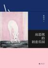

[房思琪的初恋乐园](https://pewae.com/gaan/aHR0cHM6Ly9ib29rLmRvdWJhbi5jb20vc3ViamVjdC8yNzYxNDkwNC8=)

作者：林奕含出版社：北京联合出版公司出版时间：2018

我完全接受不了这种神经病一样的遣词造句。

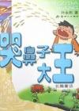

[哭鼻子大王](https://pewae.com/gaan/aHR0cHM6Ly9ib29rLmRvdWJhbi5jb20vc3ViamVjdC8xMjA3NjYwLw==)

作者：叶永烈出版社：新世纪出版社出版时间：1988

是个机器人就叫铁蛋，叶老师也是够敷衍的。
故作聪明地加入一些相声的元素，但是效果比较差。

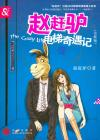

[赵赶驴电梯奇遇记](https://pewae.com/gaan/aHR0cHM6Ly9ib29rLmRvdWJhbi5jb20vc3ViamVjdC8xODg3MjY0Lw==)

作者：赵赶驴译者：赵赶驴出版社：中信出版时间：2006

这本书的作者是名噪一时的猫扑驴娃，但他火不等于我需要care他啊。
这厮当年戴着驴头搞签售会，还算是个小新闻。多年过去，这次终于有机会验验货。
搞什么啊，这种写法不就是把肉戏拿掉的小黄文嘛！这也能出版？
反正就是比一般的小黄文强点，不到《第一次的亲密接触》的水平。文中大量使用老许的歌词作为煽情手段，下作！
倒是一些用词和生活场景的点滴让我回到了十几年前：黑白机的键盘解锁，和faint这个词。

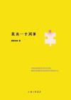

[我有一个同事](https://pewae.com/gaan/aHR0cHM6Ly9ib29rLmRvdWJhbi5jb20vc3ViamVjdC8xOTk5NTg3Ni8=)

作者：黄爱东西出版社：上海三联书店出版时间：2012

这些文字不太像女作者写的，因为太不正经；又不太像男作者写的，因为比较含蓄。
怀疑她的专栏是不是开在中缝里，因为文章的长度实在太短了，很多时候都是展开不够，戛然而止。
可能是公开发表的原因，有时候深度也不太够。
反正就是搞得你心里痒痒的，又不愿意彻底说透。

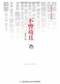

[不曾苟且](https://pewae.com/gaan/aHR0cHM6Ly9ib29rLmRvdWJhbi5jb20vc3ViamVjdC82MTI5NTM0Lw==)

作者：五岳散人 / 冯关军 / 冯唐 / 刀尔登 / 刘原 / 刘瑜 / 十年砍柴 / 和菜头 / 安替 / 易中天出版社：新星出版社出版时间：2011

散文和杂文合集，很考验编辑的水平。然而这本书选文章的标准就很值得商榷，似乎是看名气？几个作者不说风格，连主题也是五花八门，写人的、影评的、嘴馋的、游记的、时评的，乌泱乌泱往那儿一堆，实在没什么卖相。
再说作者们本身，大多都想走那种抽丝剥茧循序渐进的路子，但玩得好的并不多，于是多数文章就显得臃肿不堪。最明显的就是柴静写冯唐的那篇，实在是又臭又长。
11年的书，作者群中已经有一小撮被当成“臭公知”搞臭踩烂了，是最令人唏嘘的事。

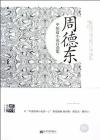

[周德东中短篇小说自选集](https://pewae.com/gaan/aHR0cHM6Ly9ib29rLmRvdWJhbi5jb20vc3ViamVjdC8xOTk3OTYwMi8=)

作者：周德东出版社：新世界出版社出版时间：2012

第一次读周德东。这哥们的写作技巧很棒，善于步步为营制造出神秘诡异的氛围。
再就是也不把问题说破，爱信不信，不害怕拉倒的结尾方式，也挺有意思的。
缺点是主角们总是显得过于神经质，略有雷同感。
最喜欢《J号楼保安》。

---

下面是本年度补完的漫画。只为弥补少年时代的遗憾，不评价。有兴趣的单独讨论。加这项只是为了显着多……

[猎魔兽女](https://pewae.com/gaan/aHR0cHM6Ly9ib29rLmRvdWJhbi5jb20vc2VyaWVzLzQwNjkw)

原名：デビルマンレディー作者：ダイナミックプロ / 永井豪出版社：讲谈社出版时间：1997-07 / 2000-10全套册数：17

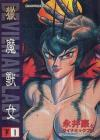

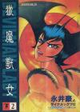

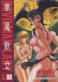

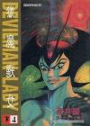

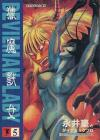

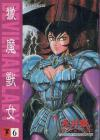

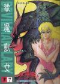

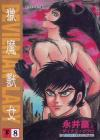

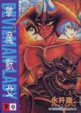

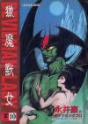

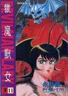

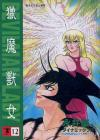

[学校怪谈](https://pewae.com/gaan/aHR0cHM6Ly9ib29rLmRvdWJhbi5jb20vc2VyaWVzLzE2MzE2)

原名：学校怪談作者：高橋葉介出版社：秋田書店出版时间：1995-08 / 2000-12全套册数：15

[我与恶魔的H生活](https://pewae.com/gaan/aHR0cHM6Ly9iYWlrZS5iYWlkdS5jb20vaXRlbS8lRTYlODglOTElRTQlQjglOEUlRTYlODElQjYlRTklQUQlOTQlRTclOUElODRIJUU3JTk0JTlGJUU2JUI0JUJCLzM3ODg4MjM=)

原名：オレたま 〜オレが地球を救うて!?〜作者：原田重光 / 瀬口たかひろ出版社：白泉社出版时间：2007-09 / 2010-04全套册数：6

[一年C组恐怖会议](https://pewae.com/gaan/aHR0cHM6Ly9iYWlrZS5iYWlkdS5jb20vaXRlbS8xJUU1JUI5JUI0QyVFNyVCQiU4NCVFNiU4MSU5MCVFNiU4MCU5NiVFNCVCQyU5QSVFOCVBRSVBRS8zMTE3MDYzP2ZyPWFsYWRkaW4=)

原名：1年C組恐怖会議作者：強矢和實译者：盧曉弘出版社：講談社出版时间：1995-07 / 1996-12全套册数：4

[自殺島](https://pewae.com/gaan/aHR0cHM6Ly9ib29rLmRvdWJhbi5jb20vc2VyaWVzLzExNTEw)

作者：森恒二出版社：白泉社出版时间：2009-08 / 2016-10全套册数：17

