本年度读书39本，与去年（38本）基本持平，目标达成。总页数比去年提高了1900页，但大部头的还是娱乐小说，没所谓的。

今年读书的题材比较分散，小说、散文（杂文）、历史仍是前三，这种情况估计很难产生变化。

今年读实体书16本，没有去年多，但也不少。现在很多新书的排版问题很大，未必会有比电子书更好的体验。

今年读过最长的作品是系列小说《侯大利刑侦笔记》。前7部是kindle电子书，第8、第9追的网络更新，为了追更新还刷了差不多半个月。本来做这个专题是没打算记网络小说的，这部小说算是破了例。而直到最后才记录下来，是因为我在等某瓣出最后一部的条目。但条目刷出来之后，才发现这个出版社太懒了，每本书的封面都长得一样，索性只取一本算了。在这里再给自己立个规矩，网络小说，如果读的是实体书，就按实际本数记；如果是电子书或追更，就只算一本。

今年读过最短的作品是《边城》。一种富有神韵的衰败，挺隽秀的，但不喜欢。
今年读书用时最长的是《诗词格律》。一边读一边做笔记，试图让自己的古文装逼能力更进一步。然而岁数大了，终究以失败告终。

今年读过最好的书是《动物庄园》。在我读来它比《1984》要平易近人得多。而且总觉得我小时候不是看过连环画，就是看过动画片，似曾相识。
《沉默的大多数》、《一句顶一万句》、《老残游记》也在今年除草。《沉默的大多数》温和有力，缺点是篇目的收集不好；《一句顶一万句》风格太顶；《老残游记》作者太喜欢炫技。

今年读的最失望的作品是《月亮与六便士》。故事本身是能够理解的，但读文学作品，又不是仅仅为了了解故事。我读的这个版本，翻译和排版的水平实在是令人火大。
相反，《蛤蟆先生去看心理医生》和《一个人的朝圣》的翻译都很棒。

明年的目标是把老婆大人搞回来的东西多清一清，20本实体书。

---

题外话：
本篇献给老朋友 @路易斯。
作为中年同龄人，我完全能理解并支持他做出离开的选择。
毕竟，我在书虫榜上又能前进一位了。
此刻，我退出路易斯拉我进的微信群。

---

下面是书目和个人简评：

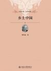

[乡土中国](https://pewae.com/gaan/aHR0cHM6Ly9ib29rLmRvdWJhbi5jb20vc3ViamVjdC8yMDM5NTQ3Ni8=)

作者：费孝通出版社：北京大学出版社出版时间：2012

通过一系列文章阐述了中国历史上的人与人之间的关系和组织结构。传统的国人是依存于土地的。但乡土不等于土，背井离乡后，人与人的关系越来越不乡土了。但是当今社会却并没有哪位学者肯潜心总结一下城市化的钢筋水泥丛林里人和人的组织形式是怎样的。或许不用研究，直接丛林法则即可。
费老书中对于孔子的话是直接拿来就用的，相当于他默认孔子的思想是社会上的通用准则。然而，对于社会上层如此，对于底层民众却是未必吧。

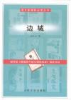

[边城](https://pewae.com/gaan/aHR0cHM6Ly9ib29rLmRvdWJhbi5jb20vc3ViamVjdC8xMDEzOTgwLw==)

作者：沈从文出版社：人民文学出版社出版时间：2003

盛名在外的一本小书。节奏极为缓慢，前面大量的笔墨花在摆渡人老头形象的建立上，后面却没有太大的用处。
作为小说来说，情节普通，人物也并不出彩。
对于景物的描写倒是很生动。

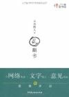

[乱翻书](https://pewae.com/gaan/aHR0cHM6Ly9ib29rLmRvdWJhbi5jb20vc3ViamVjdC81MzgxNDUwLw==)

作者：五岳散人出版社：中国民主法制出版社出版时间：2010

五岳散人的观点可以说跟我高度一致。
最喜欢的是“杂乱说”的真正的社会新闻时评部分，浅入浅出，在合理的范围内阐明了观点。但是，他写的东西也跟众多时评作家一样，从不给出解决方案，扬汤止沸罢了。
登记本书的时候愕然发现，五岳散人也被禁言销号了。当下，禁言仿佛已是时评作家的统一归宿。

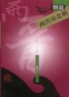

[细说两晋南北朝](https://pewae.com/gaan/aHR0cHM6Ly9ib29rLmRvdWJhbi5jb20vc3ViamVjdC8xMDUyNDExLw==)

作者：沈起炜出版社：上海人民出版社出版时间：2003

对于两晋南北朝和五代一直不怎么了解，这本书下载了很久，终于给读完了。这书跟南北朝的历史一样，很乱。
作者采用了一种很奇怪的手法，我把它叫做“记事不记本末体”。大概是以政权的变更和著名人物为线索，记述某势力的兴起和衰败。但是，就像写程序要求每个函数不能多于150行的硬规定一样 ，作者往往写到一个节点直接截断，然后跳转到大约同一时期的另一个势力。再转回来可能三五章之后了。真的很不友好。
还有不知道出版方怎么想的，这么乱的历史，说明的时候没加一张地图，没有一张图表，就在那干巴巴地说，真是令人火大。
读过之后收获不小，果然是段只要有武器就可以揭竿而起的军阀混战史。都说北方五胡乱华，不过是因为北方军阀是少数民族血统而已。汉人的南朝不也依旧是君臣相忌兄弟阋墙，上台一个皇帝就先血洗一波族亲。可惜仍旧不能很好地分辨十六国那些大小势力。

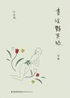

[书淫艳异录](https://pewae.com/gaan/aHR0cHM6Ly9ib29rLmRvdWJhbi5jb20vc3ViamVjdC8yMDQ1ODkwNy8=)

作者：叶灵凤出版社：福建教育出版社出版时间：2017

上篇正经些，下篇轻快些。所述的知识大多已过时，但野史逸闻读来也能增长一些见识，多一些吹牛的资本，至少能够按照人名索引到一些新领域。可惜下篇有很多篇目是直接的原文摘抄，没有评论，有骗稿费之嫌。

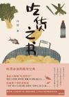

[吃货之书](https://pewae.com/gaan/aHR0cHM6Ly9ib29rLmRvdWJhbi5jb20vc3ViamVjdC8zNTIyNDMyMC8=)

作者：冯进出版社：江苏凤凰文艺出版社出版时间：2020

这书不好。作者苏州出身的缘故，书中大书特书苏锡杭美味，除此之外偌大的中国，只提了一句南京。就这怎么担当得起本书如此大的名头？
前两部分是对历史和骚客的总结，没多少自己的东西，别人文章写得好坏与你何干？第三部分只在江南小圈子打转转，而且对美食的描述并不详尽，却浓墨于几个老板，却不是广告？第四部分不知所云。

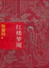

[红楼梦魇](https://pewae.com/gaan/aHR0cHM6Ly9ib29rLmRvdWJhbi5jb20vc3ViamVjdC8yMjc4Njg5Lw==)

作者：张爱玲出版社：上海古籍出版社出版时间：1995

正经红楼梦我只看到第八回（宝玉初试云雨情后又坚持两回）就放弃了，但是红楼同人小说却看过不下15部。但演绎的就是演绎的，读起张爱玲的这部长篇评论仍旧是拉稀的状态。张从作者的角度，阐述了红楼梦的版本迭代，哪个人哪个情节是因为什么原因在哪个版本加入的，哪件事因为犯了什么忌讳给删除了，哪里没删干净，哪里是最好修改的。张关注的是过程，根本不涉及高续哪里好哪里不好。
但是我根本不关心这个啊。所以就读得很吃力。
另一个原因是涉及到的众多版本、章回，在说明的之前或之后列张表格是最直观有效的办法，不知是张爱玲对自己的文字能力太有信心，还是发表的时候出版社觉得没必要，反正不自己手动犁张表出来，是搞不明白张说的哪版是哪版的。用kindle读又没地方画，所以这方面的体验非常差劲。

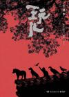

[玩儿](https://pewae.com/gaan/aHR0cHM6Ly9ib29rLmRvdWJhbi5jb20vc3ViamVjdC8yNzIwNDA3OS8=)

作者：于谦出版社：湖南文艺出版社出版时间：2018

老北京人身上那种飞鹰走狗到驴不倒架的混不吝劲儿表现得淋漓尽致。下沾网抓鸟一节生动具体，最后提了一句国家出台法律保护动物不让抓了，瞅瞅您前面那迫不及待的样子，有一点儿保护鸟类的觉悟吗？
最后一部分写谦儿哥自己的马场，因为涉及到产业，水准立刻下来了，老哥还是抹不开面子往死了吹打广告啊。

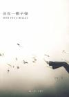

[送你一颗子弹](https://pewae.com/gaan/aHR0cHM6Ly9ib29rLmRvdWJhbi5jb20vc3ViamVjdC80MjM4MzYyLw==)

作者：刘瑜出版社：上海三联书店出版时间：2010

倒着看刘瑜，发现她最初的文字还是很活泼的，比后面的要好。只是开头若干篇中英文混用的装B范儿确实讨厌。

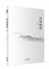

[诗词格律](https://pewae.com/gaan/aHR0cHM6Ly9ib29rLmRvdWJhbi5jb20vc3ViamVjdC8yNzA4Nzk1OS8=)

作者：王力出版社：天津人民出版社出版时间：2016

王力不愧是现代汉语的奠基人，这书写的底气十足，就没用商量的口气，一是一，二是二，平仄、韵音、粘句、对仗的用法直接给介绍清楚了。清楚是清楚了，想要学以致用却很难。出现了好几次的韵音表，差不多一半古音跟今音是不一致的，很难记住。而当我发现自己连七律的两组平仄规律都背不下来的时候，就知道往后这逼咱是装不成了。老了。
明明是一部语言文字的教材科普书，却偏偏读出了“毛泽东牛逼”的味道来。尤其最后那段结语，极尽谄媚之能。毛泽东牛逼，王力您拍马屁的本事更牛逼。

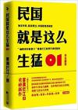

[民国就是这么生猛01](https://pewae.com/gaan/aHR0cHM6Ly9ib29rLmRvdWJhbi5jb20vc3ViamVjdC82MDQ4Mjc2Lw==)

作者：雾满拦江出版社：江苏文艺出版社出版时间：2011

作者一看便不是正宗研究历史出身，对于史料的引用取舍非常的不守规矩。因为身具江湖气，所以对开头武昌起义、广州起义的帮会性质的解析比较过瘾。但存在过度玩笑化，编排笑话不合时宜的问题。进入北洋——国民政府阶段后，倾向性太明显，再没了前面的群雄逐鹿的激荡感。作者在文中引梁启超的话，说人类都有标新立异出风头的需要。这句话套他自己身上最合适——袁世凯、孙中山、黄兴、陈炯明、章太炎、梁启超、蔡锷……民国大鳄有一条算一条，在作者嘴里总要给出个跟标准答案不同的结论来。推理是推理，可推理的过程又并不严谨，说孙中山是杀宋教仁主谋的唯一证据是同盟会的暗杀史，却决口不提袁世凯的暗杀史，忒不地道了些。这便是段子作者的局限性吧。
读过书之后，对于书里没提到的我党的合法性倒是有了很大的改观——如果你是个正经政府，那可以算我是非法组织；但你本身自己就乱糟糟一屁股粑粑，有什么资格说我是“匪”啊！
倒是想去读一读《饮冰室》了。

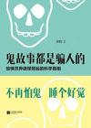

[鬼故事都是骗人的](https://pewae.com/gaan/aHR0cHM6Ly9ib29rLmRvdWJhbi5jb20vc3ViamVjdC8yNjE4NDczOC8=)

作者：史钧出版社：江苏凤凰文艺出版社出版时间：2014

列出鬼故事，给出解释。问题是鬼故事在20岁以上的读者看来就没什么新鲜的了，普通的记述也不见生动；而解释对于高中以上的读者来说也很枯燥——幻觉、臆想、癔症、神经病、不实之词，或者它们的组合，或者它们的群体效应。且作者本身是学生物的，对于幻想和癔症的解释，显然是换个神经科的来说会更好。
鬼故事写的实在太无聊了，连增加一丢丢酒后谈资的可能性都没有，所以该书毫无价值。

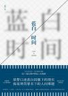

[蓝白时间](https://pewae.com/gaan/aHR0cHM6Ly9ib29rLmRvdWJhbi5jb20vc3ViamVjdC8zNDg4NTg2Mi8=)

原名：我们就爱在楼顶上吹风作者：黄辉出版社：江苏凤凰文艺出版社出版时间：2019

非常一般。故事没什么新鲜感，也不触及监狱行业的任何秘辛。还有一两篇非监狱生涯的，也是写人。可能作者觉得是对主角生涯的补充，能够完善人物，但实际上像20年前的知音家庭上的小作文一样毫无价值。另外，什么死掉的前女友，什么警察行业的老爸，什么跟主角不对付的同事，身上统统没发掘出故事，都是废步，失败啊！
作者还在豆瓣上特意感谢编辑给这本书起名字，这是在甩锅吧，是个人都知道中国的囚服根本不是巴拉多利德式的蓝白条，而是蓝灰色啊。

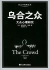

[乌合之众](https://pewae.com/gaan/aHR0cHM6Ly9ib29rLmRvdWJhbi5jb20vc3ViamVjdC8xMDEyNjExLw==)

原名：The Crowd: A Study of the Popular Mind作者：古斯塔夫·勒庞译者：冯克利出版社：中央编译出版社出版时间：2011

很有名的一本书，讲述的差不多是“作为群体的人很愚蠢很好骗，政治家和领袖并不需要科学的论证，就能够把群体带向他们想要的方向。”
然后呢？没了。群体的挟裹下应该如何自处，并没有说。所以这本书除了启发人多一些思考少一些盲从以外，意义并不大。
作者生活在100多年前的法国，所以举的例子大多来自拿破仑、大革命甚至罗马时代，对于中国读者来说不太友好。

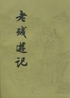

[老残游记](https://pewae.com/gaan/aHR0cHM6Ly9ib29rLmRvdWJhbi5jb20vc3ViamVjdC8zNTAyMTc1NC8=)

作者：刘鹗出版社：古吴轩出版社出版时间：2021

刘鹗的文笔很棒。虽然已经是100多年前的作品，读起来却一点儿都不累，其写景、写人的手法都很高妙。不过行文过程中，写景往往有夸大之词，评论时也喜欢把话颠倒着说两遍，很难让人不相信这是在骗字数注水。比如广为流传的的那篇课文，其实只是开头的一个小引子，跟主线半毛钱关系都冇。
大多数情节是类似天方夜谭那种讲故事的方式展开的。正文阶段两个主要故事：一个是酷吏玉大人，老残打了个交道以后就擦身而过，后续也没能力再管；一个是月饼灭门案，老残跟他朋友，招着妓女抽着大烟，call了个关系就把事儿平了。两个故事都很中国特色。续篇没啥意思，主要是跟小尼（婊）姑（子）聊天，再就是游了个地府，道理说的似是而非，就是挺有清末民初特色的。
最大的收获是，怪不得冯梦龙总喜欢写尼姑偷情的故事，到刘鹗这里算是给挑明了，尼姑庵和妓院就是一个大门两块牌子嘛。

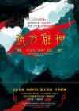

[号令群神](https://pewae.com/gaan/aHR0cHM6Ly9ib29rLmRvdWJhbi5jb20vc3ViamVjdC8zNTI0MTgzNi8=)

作者：李天飞出版社：江苏凤凰文艺出版社出版时间：2020

远不如上一本关于西游的《万万没想到》精彩。但还是好读物。
首先，似乎是为了封神电影宇宙造势的应邀之作，从腰封推荐名单里有个导演乌尔善就可以窥豹，导演算个啥啊，软广吧？
然后，评论集中在一张“封神榜”上，八成的内容围绕的是榜单上的人，以人写事，而不像写西游时那样按照原著顺序来。而人物当中，哪吒杨戬李靖韦护这些在上本书里都详细说过了，内容大同小异。对于各位正神，神职高些，在民间又名的便多写一些，职位没特色、没信仰的便写得少，似乎写的主题是“论封神人物在民间的来源及影响”。
还有，有的时候扯得真是太远了。像是从四大天王开始聊，最后落在关羽身上结尾，中间的转折实在太多了点儿。
优点也不少。李先生对于民俗方面，比如“煞星”的研究，高过全国99%的算命先生，这部分就既有趣又有用。又有，关于阐教西方教对截教，是影射道教佛教与民间教派的观点，也是别开生面。

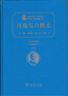

[月亮与六便士](https://pewae.com/gaan/aHR0cHM6Ly9ib29rLmRvdWJhbi5jb20vc3ViamVjdC8zMDE5ODIyOA==)

作者：威廉·萨默塞特·毛姆译者：刘永权出版社：商务印书馆出版时间：2017

这个版本太差了。翻译或许英文很好，但中文仅仅是能表达清楚的水平。不知道为什么这版非要把注释打括号放在正文里，这点非常不爽，你怎么知道我不知道你要解释的东西呢？你怎么知道我需要你的解释呢？
毛姆的六便士和远方，跟矮大紧所说的苟且和远方，一回事。你说你要去远方，那就别给别人添麻烦，麻溜滚。相信全球每年饿死的艺术家没有千万也有几百万，不差你一个。
主角与斯特里科兰的奇妙友情写得很有味道。

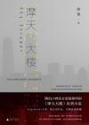

[摩天大楼](https://pewae.com/gaan/aHR0cHM6Ly9ib29rLmRvdWJhbi5jb20vc3ViamVjdC8yNjk0NDQ0NQ==)

作者：陈雪出版社：广西师范大学出版社出版时间：2017

写法非常有意思。作者试图用纷乱的人物自述表现出当代人的形形色色的生存状态，营造出类似罗生门的悬疑氛围。读到一多半的时候就产生了奇怪的念头：这种写法能坚持始终吗？终究是没有，美宝案结束后不久，就不得不改成了时间为主的线性逻辑。
作者其实并不是很在乎悬念的设置，她只是想表达“大厦是活的”这一理念。但是把本书当悬疑小说看的读者不答应啊。窃以为改成按时间叙事后崩得厉害。

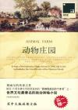

[动物庄园](https://pewae.com/gaan/aHR0cHM6Ly9ib29rLmRvdWJhbi5jb20vc3ViamVjdC8zODA4OTgy)

原名：Animal Farm作者：乔治·奥威尔译者：隗静秋出版社：上海三联书店出版时间：2009

所有动物一律平等，但有些动物比其他动物更平等。

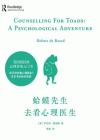

[蛤蟆先生去看心理医生](https://pewae.com/gaan/aHR0cHM6Ly9ib29rLmRvdWJhbi5jb20vc3ViamVjdC8zNTE0Mzc5MA==)

原名：Counselling For Toads: A Psychological Adventure作者：罗伯特·戴博德译者：陈赢出版社：天津人民出版社出版时间：2020

关于如何进行心理建设的书。作者和译者的水平都很高。前面的大量篇幅都是在引导蛤蟆认清自己。其实冷静下来，对自己进行反省还算容易，但要想摆脱出来却是不容易的。倒数第二次咨询最为精彩，蛤蟆先生通过大爆发，发泄了出来，才有了最后的全家福大结局。换成普通人，身边未必有那么好脾气的倾听者。我该如何爆发，对着谁爆发？靠喝闷酒吗？微斯人，吾谁与归？

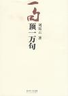

[一句顶一万句](https://pewae.com/gaan/aHR0cHM6Ly9ib29rLmRvdWJhbi5jb20vc3ViamVjdC8zNjMzNDYx)

作者：刘震云出版社：长江文艺出版社出版时间：2009

刘震云这种掰碎了往嘴里喂的写法实在很魔性，开始时难以接受，到后面却有些上瘾。
“万两黄金容易得，知心一个也难求。”
整本书说的是交流和交往的事，活生生的鸡毛蒜皮的小事。找人不是为了找人的故事出现两回，第一次把孩子丢了，第二次把自己丢了。又好笑又可悲。
许少年[[1]](https://pewae.com/2022/12/2022-reading-record.html#inner_anchor_1)说：“我想超越这平凡的生活，注定现在暂时漂泊。”
对于大多数人，一“暂时”就是一辈子。

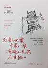

[好看的皮囊千篇一律有趣的灵魂万里挑一](https://pewae.com/gaan/aHR0cHM6Ly9ib29rLmRvdWJhbi5jb20vc3ViamVjdC8yNzY2MTk0MA==)

作者：老杨的猫头鹰出版社：现代出版社出版时间：2017

积极的、励志的、正能量的、睿智的、流畅的、清新的废话。书的内容不系统，东一耙子西一扫帚的。作者太喜欢自己树靶子自己打。
文字配不上封面。

[一个人的朝圣](https://pewae.com/gaan/aHR0cHM6Ly9ib29rLmRvdWJhbi5jb20vc3ViamVjdC8yNzA4MTI2NA==)

原名：the unlikely pilgrimmage of Harold Fry作者：蕾秋·乔伊斯译者：黄妙瑜出版社：北京联合出版公司出版时间：2017

所谓朝圣，是对自己的救赎。最后妻子出现拯救主人公且拯救自己的部分，很棒。
中间的插叙乍看之下有些小混乱，到后来才发现关于儿子的描述是堆叠情绪所必须的部分。
英格兰真是没多大，算算路程，差不多从大连走到铁岭，再走回来。
翻译水平不错。
狗跑了。

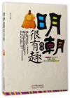

[明朝绝对很有趣](https://pewae.com/gaan/aHR0cHM6Ly9ib29rLmRvdWJhbi5jb20vc3ViamVjdC8yNzAyMjM0Mw==)

出版社：天津人民出版社出版时间：2017

一本没有任何价值的书。胡拼乱凑，没有章法。
而且书名起错了，什么宫斗官场杀人下套，血流成河的内容，哪里有趣了。

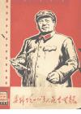

[批判毒草影片集：四十部影片毒在哪里？](https://pewae.com/gaan/aHR0cHM6Ly96aC5qcDFsaWIub3JnL2Jvb2svMTc0MTg5NjkvNGMyNDU0)

出版社：红卫兵文艺编辑部出版时间：1968

欲加之罪何患无辞，有意思的是这词儿怎么找。
首先肯定是要批刘少奇邓小平贺龙周扬夏衍阳翰笙罗瑞卿彭真陶铸陆定一三家村这些人的肯定意见。接下来就有意思了。什么英雄人物不能爱慕官家小姐啊，什么把敌人刻画得太聪明啊，什么没表现出毛泽东的指导作用啊之类，只能算常规操作。那些稀奇古怪的理由才是支持我把这本书读下去的动力。
比如批评《五朵金花》，说只顾谈情说爱还算正常，批评背景里的围墙上没有文革标语，这眼神也太好了。
再比如批评《刘三姐》，说本片违背了毛主席“枪杆子里面出政权”的指示，要是恶霸地主老财靠唱两句歌就能打赢，还要什么牺牲流血搞斗争啊。仔细咂摸，还挺有理的。
但是上纲上线的腔调看多了腻。

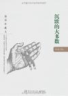

[沉默的大多数](https://pewae.com/gaan/aHR0cHM6Ly9ib29rLmRvdWJhbi5jb20vc3ViamVjdC8yNjczODcyOQ==)

作者：王小波出版社：湖南文艺出版社出版时间：2016

王小波的批评总是幽默而睿智。作为一位共和国最凄惨的老三届，文章里却不像那些苦大仇深的伤痕文学那样弥漫着戾气。这本书读得很慢，不少篇章值得反复品味。
王小波最深恶痛绝、评论最多的是文化革命，可这又20多年过去了，他所反对的犬儒、反智、国学、集权、盲从们不仅没消失，反而愈演愈烈。悲夫！
可惜王小波死得早，这本集子里一些明显是硬些的作业没有被剔除出去。另外王小波的影评和书评还是差了点意思。

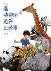

[逛动物园是件正经事](https://pewae.com/gaan/aHR0cHM6Ly9ib29rLmRvdWJhbi5jb20vc3ViamVjdC8zNDcxMDExMw==)

作者：花蚀出版社：商务印书馆出版时间：2020

一本介绍国际国内有名动物园的书。作者比较偏向动物保护和动物权益的部分，分析动物园的利弊，这点不能说独特，但也算很正。对于好的动物园的特色部分，介绍得很好。但是后半部分全国动物园巡礼，有的内容和特色动物是重复的。没特色你可以不说嘛，非要显得自己打卡都去过呗？所谓批评过于温和，而且很多地方仿佛是删减过的，不知是不是有动物园在付梓前交过了保护费。
大连动物园的篇幅很小，其中的一个特色说的是鹤类区。可我甚至都不知道现在的鹤类区在哪里。
又及，作为一本实体书，这本书的体验是比较差的。首先为了做到图文并茂，书被设计成了710mm*1000mm的奇怪开本，摆放就是个问题。其次仍旧是为了将就配图，文字的环绕方式千奇百怪，单栏双栏三栏都有，忒不好找。最后是近些年彩印图书的通病，新书有股化学品的怪味，令人作呕。

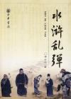

[水浒乱弹](https://pewae.com/gaan/aHR0cHM6Ly9ib29rLmRvdWJhbi5jb20vc3ViamVjdC8zMzk3MTM3)

作者：虞云国出版社：中华书局出版时间：2008

从水浒人物引出的宋朝文化生活的内容。新鲜的东西不多，还行。最后李师师的部分有些不协调。

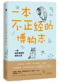

[一本不正经的博物志](https://pewae.com/gaan/aHR0cHM6Ly9ib29rLmRvdWJhbi5jb20vc3ViamVjdC8zNDk3ODcyMA==)

作者：安迪斯晨风出版社：百花文艺出版社出版时间：2020

书名起得大有问题。其一是挺正经的，其二是涉及面有限，不太博。
余者都不错，结合中国的人文和历史讨论科学话题，这种文理结合的思路很正点。
一个不经意的发现——中原的大头菜和我从小认识的大头菜，根本不是同一种东西！作者嘴里的大头菜，是芜菁，类似芥菜或者就是芥菜，是萝卜的近亲；而我认知里的大头菜，是圆白菜，一看就知道跟白菜走得更近。他嘴里的大头，指的是地里的头；而我认知的大头，则是曝露在空气中的头。看图片都挺大，都挺贴切。只能说十字花科真是接地气啊！
读书能有这样一点真正的收获真的很高兴。

[相声神探](https://pewae.com/gaan/aHR0cHM6Ly9ib29rLmRvdWJhbi5jb20vc3ViamVjdC8zNTc0Mzc3OQ==)

作者：王晓磊出版社：河南文艺出版社出版时间：2022

悬疑一般，推理一般，相声段子太老。江湖事的描述，还不如直接看连阔如的《江湖丛谈》。
比较精彩的是对卖膏药的挂门大侠的那段描写。

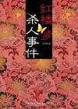

[红楼梦杀人事件](https://pewae.com/gaan/aHR0cHM6Ly9ib29rLmRvdWJhbi5jb20vc3ViamVjdC80OTM0MzYy)

作者：江晓雯出版社：新星出版社出版时间：2010

套了个红楼梦外皮的一般推理故事。人物其实换谁都可以。无聊的废话过多。结局毫不意外。

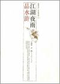

[江湖夜雨品水浒](https://pewae.com/gaan/aHR0cHM6Ly9ib29rLmRvdWJhbi5jb20vc3ViamVjdC8yMjcxMTc2)

作者：石继航出版社：中国人民大学出版社出版时间：2007

毫无新意。

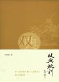

[双典批判](https://pewae.com/gaan/aHR0cHM6Ly9ib29rLmRvdWJhbi5jb20vc3ViamVjdC80ODkyODkx)

作者：刘再复出版社：生活·读书·新知三联书店出版时间：2010

大众的口味，不是你说转变说倡导就能转变得了的。所以你尽管批，老百姓不认便是。
对于水浒，崇尚暴力本来就是人类的天性。你可以说它不够好，却无法扭转。而对于女性的歧视那倒是真真切切，值得批评。
对于三国，其实三国就不是一个讲究诚的时代，事实上诚这个字，自古以来便是说说而已，一部小说揭露政治伪善的本质，不也挺好么。倡导一个本来便不存在的东西，也太虚伪了。
而且作者踩一捧一的手法很不喜欢：水浒三国固然不好，难道贾宝玉就是什么好人了？

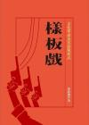

[样板戏](https://pewae.com/gaan/aHR0cHM6Ly9ib29rLmRvdWJhbi5jb20vc3ViamVjdC8zNTMzODIzMw==)

作者：张晴滟出版社：人间出版时间：2021

非常严肃的文艺理论，只不过因为题材的缘故，可读性甚高。
作者引用了大量史料和文艺理论著作，讨论了样板戏中的几部京剧的故事、唱段、表现形式、版本历史等方方面面。特殊时期的文艺创作理论的变化贯穿其中。
虽然我对京剧一窍不通，但《智取威虎山》、《沙家浜》、《红灯记》却都看过。窃以为《智》、《沙》都是不错的舞台剧。不管李云鹤女士的私心如何，她对京剧的改造其实是颇有贡献的。本书中可以看到几部样板京剧一次一次修改，既要领导满意，又要有突破，还要好听的创作艰难。现在的京剧没几个人爱看，我觉得曲目太老是重要原因，你抱残守缺那小几百个曲目，越唱受众越少。其实样板戏对于京剧来说是非常不错的突破——服装、唱腔、伴奏、舞台效果。可惜成也政治运动败也政治运动，如今的京剧丧失了创新能力和观众，早已是僵尸国粹了。

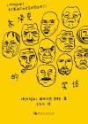

[齐泽克的笑话](https://pewae.com/gaan/aHR0cHM6Ly9ib29rLmRvdWJhbi5jb20vc3ViamVjdC8yNjgzODg3NQ==)

原名：Žižek‘s Jokes: Did You Hear the One About Hegel and Negation?作者：斯拉沃热·齐泽克译者：于东兴出版社：河南大学出版社出版时间：2017

“人民是支持政府的，凡是不支持政府的，就脱离了人民的队伍。”这原来并不是天朝独有的笑话。
虽然本书标榜的是恰到好处的黄色，但实际上黄色的部分都挺正统的，新意不多。而且齐泽克讲笑话的方式也很传统，每个笑话后面要跟着黑格尔的逻辑或者弗洛伊德的精神分析。严肃了些，也不太深。
有一种“会心一笑，吾道不孤”的感觉也挺好。

[侯大利刑侦笔记](https://pewae.com/gaan/aHR0cHM6Ly9ib29rLmRvdWJhbi5jb20vc3ViamVjdC8zNDk3Nzg4OQ==)

作者：小桥老树出版社：上海文艺出版社出版时间：2020

前三本非常不错，尤其在悬念的设置以及利用场景误导方面做得很好。但从第四本的一半开始，网文作者的顽疾开始发作，关联性差的案件开始乱入，偏离主线。尤其第7本开始，真相已经明朗化，却非要强行给人民警察降智，强行给反派增加盟友，强行死女主，迟迟不肯结局。
后期的“鱼竿模型”的引导型犯罪想法很好。可惜肖霄这个人物刻画得还是不够细致。

---

下面是本年度补完的漫画。只为弥补少年时代的遗憾，不评价。有兴趣的单独讨论。加这项只是为了显着多……

[脱线女教师](https://pewae.com/gaan/aHR0cHM6Ly9iYWlrZS5iYWlkdS5jb20vaXRlbS8lRTglODQlQjElRTclQkElQkYlRTUlQTUlQjMlRTYlOTUlOTklRTUlQjglODgvMTY3OTI4NzU=)

原名：どりる作者：石川優吾译者：高詹灿出版社：小学馆 / 青文出版时间：2001-12 / 2002-08全套册数：4

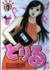

[因为太寂寞了而叫了百合风俗小姐的报告](https://pewae.com/gaan/aHR0cHM6Ly9ib29rLmRvdWJhbi5jb20vc3ViamVjdC8yNjgxNDczMw==)

原名：さびしすぎてレズ風俗に行きましたレポ作者：永田カビ译者：心像汉化出版社：イースト・プレス出版时间：2016-06 / 2016-6-17全套册数：1

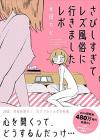

[Dr.吟子现在正在痴疗中](https://pewae.com/gaan/aHR0cHM6Ly9ib29rLmRvdWJhbi5jb20vc3ViamVjdC8zNTg3NzYzNw==)

原名：Dr.吟子はただいま痴療中作者：林崎文博出版社：日本文芸社出版时间：2018全套册数：2

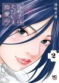

[狼口](https://pewae.com/gaan/aHR0cHM6Ly9ib29rLmRvdWJhbi5jb20vc2VyaWVzLzU1OTA=)

原名：狼の口 ヴォルフスムント作者：久慈光久译者：张益丰出版社：东立出版时间：2010-11 / 2016-11全套册数：8

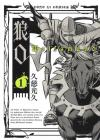

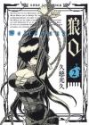

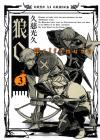

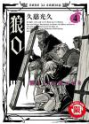

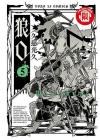

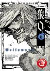

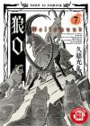

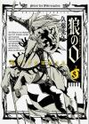

[电锯人](https://pewae.com/gaan/aHR0cHM6Ly9ib29rLmRvdWJhbi5jb20vc2VyaWVzLzUyMDMz)

原名：チェンソーマン作者：藤本树译者：赵秋凤出版社：东立出版时间：2019-08 / 2021-05全套册数：11

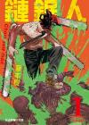

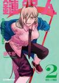

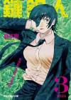

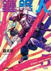

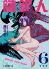

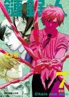

---

- [(1)](https://pewae.com/2022/12/2022-reading-record.html#inner_ref_1)：许巍《执着》