本年度读书36本，比去年少3本，页数多了200多页。
比较不幸的是立的“20本实体书”的flag没完成，只读了6本实体书。主要原因是12月的flag，3月份出趟差就忘了这回事了。

今年读的最多的仍旧是小说。
今年读过最好的作品是《围城》，果然文字比电视剧有趣多了。三闾大学那段实在太好玩了。其次是《冬泳》和《传统十论》，都是名声在外的书。
今年读过最无聊的作品是《西游补》。只是一本徒有想法手法极其差劲的同人小说。

今年读过最长的作品是《阴间神探》。跟所有的连载作品一样，开头精彩，中间注水，结尾跑偏。
今年读过最短的作品是《佛祖在一号线》。李海鹏的文字特点还是相当鲜明的。

今年读的失望作品比较多。
《渔猎》本身还凑合，但远远不该是豆瓣榜一的水准。连续两次失望以后，对豆瓣榜已经失去信任。
《我们生活在巨大的差距里》没有想象中劲爆。
《夜窗物语》，就没读过这么啰嗦的文言文。
《太阳照在桑干河上》是最扫兴的。丁玲是不是对群像的塑造有什么误解。

明年的目标依旧是20本实体书。如果还有余力，那就争取做到34本，把今年欠下的补回来。

---

下面是书目和个人简评：

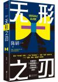

[无形之刃](https://pewae.com/gaan/aHR0cHM6Ly9ib29rLmRvdWJhbi5jb20vc3ViamVjdC8zNTM4MzcwMQ==)

作者：陈研一出版社：北京联合出版公司出版时间：2021

作者文字能力不错。
推理在大体上比较严密，男主角性格有些别扭。
结局有种出乎意料的俗。

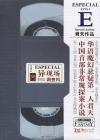

[异现场调查科ECIS-1](https://pewae.com/gaan/aHR0cHM6Ly9ib29rLmRvdWJhbi5jb20vc3ViamVjdC8zNzM1ODY2)

作者：君天出版社：万卷出版公司出版时间：2009

不灵异也不悬疑，平淡如白开水。

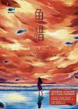

[鱼猎](https://pewae.com/gaan/aHR0cHM6Ly9ib29rLmRvdWJhbi5jb20vc3ViamVjdC8zNTkyMzE5MQ==)

作者：史迈出版社：湖南文艺出版社出版时间：2022

整体架构比较俗套，值得称道的是对友情的塑造。作者可能涉世未深，对于人心理的刻画都过于模式化了。不同视角的描述并没有对人物性格的建立产生什么推动作用，反倒显得乱。
结局太矫情。
反正在我看来，这本书是不值得当选豆瓣年度第一的。只能理解成Girls help Girls的加成。

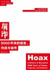

[有诈](https://pewae.com/gaan/aHR0cHM6Ly9ib29rLmRvdWJhbi5jb20vc3ViamVjdC8zNTQwNTgyMA==)

原名：Hoax:A History of Deception:5,000 Years of Fakes,Forgeries,and Fallacies作者：伊恩 ·塔特索尔译者：王寅军出版社：重庆大学出版社出版时间：2021

记录了人类历史上的50个比较著名的骗局。视角是西方的，主要是科学、经济、艺术和宗教方面的骗局，政治方面的比较少。
唯一牵扯到中国的是辽西“古盗鸟”，还充满了对中国恐龙专家徐星的敬意。
每个骗局描述的都不甚深入，尤其对于宗教和艺术的未知领域，不太能投入。
但是大脚怪尼斯湖葡萄酒包皮之类读起来就趣味盎然了。

[动物园](https://pewae.com/gaan/aHR0cHM6Ly9ib29rLmRvdWJhbi5jb20vc3ViamVjdC8yNjcyMzQyMw==)

原名：ZOO / ズ一作者：乙一译者：张筱森出版社：人民文学出版社出版时间：2016

好玩的篇目不是很多，不疯魔不成活的篇目过多。
同名那篇有些刻意。

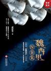

[魏西里探案集](https://pewae.com/gaan/aHR0cHM6Ly9ib29rLmRvdWJhbi5jb20vc3ViamVjdC8zNTI2ODQzOQ==)

作者：贰拾柒出版社：文化发展出版社出版时间：2020

没意思。

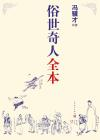

[俗世奇人全本](https://pewae.com/gaan/aHR0cHM6Ly9ib29rLmRvdWJhbi5jb20vc3ViamVjdC8zNDkyNDQ3Nw==)

作者：冯骥才出版社：人民文学出版社出版时间：2020

短篇集。市井人物传。
比故事会高明一些，但由于篇幅所限，人物也都没展开，特别新奇的故事也少。津味浓郁，对各色各类的混混的描画较为出彩。
本书最值钱的是老冯自己手绘的插画，也算得上是惟妙惟肖。

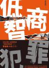

[低智商犯罪](https://pewae.com/gaan/aHR0cHM6Ly9ib29rLmRvdWJhbi5jb20vc3ViamVjdC8zNDk5NjY2Mg==)

作者：紫金陈出版社：天津人民出版社出版时间：2020

紫金陈这部作品感觉就是奔着电影化剧本写的。非常戏谑。很多地方强行制造巧合，好玩是好玩，却缺失了紧迫感。
结尾一般，没有触及体制。

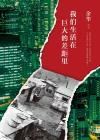

[我们生活在巨大的差距里](https://pewae.com/gaan/aHR0cHM6Ly9ib29rLmRvdWJhbi5jb20vc3ViamVjdC8yNjI5MTIxNg==)

作者：余华出版社：北京十月文艺出版社出版时间：2015

失望。这不是“我想看到”的余华，评论部分浅尝辄止且缺乏新意。关于文学创作的部分还可以，可以当作是名家导读。各地游记和看球杂记味同嚼蜡。
倒是附录里的《兄弟》和《第七天》的创作笔记很有价值，原来作家是这样构思情节和人物的。
能感觉到余华成名之后有些自恋了。

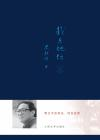

[我与地坛](https://pewae.com/gaan/aHR0cHM6Ly9ib29rLmRvdWJhbi5jb20vc3ViamVjdC81OTEwNjU2)

作者：史铁生出版社：人民文学出版社出版时间：2011

比较老派的写法，抒情比较多，不太对胃口。所以对名声在外的地坛二篇并不感冒。尤其是那篇《好运设计》简直是倒胃口。
倒是两篇写人的，真情实感，结合时代背景，颇有趣味。
总体感觉这部集子后面的文章比前面的松弛舒适。

[冬泳](https://pewae.com/gaan/aHR0cHM6Ly9ib29rLmRvdWJhbi5jb20vc3ViamVjdC8zMDM2MjE3MA==)

作者：班宇出版社：上海三联书店出版时间：2018

我在沈阳读了4年大学，但我始终不喜欢那个地方。这部短片小说集可以说是一幅沈阳底层人的众生相，恰好描绘出了我对沈阳这座城市所有厌恶的原因：穷。装。浮躁。冲动。
最喜欢的一篇是《肃杀》。喜欢萧树斌的热爱与不甘。对于沈阳海狮的零星描述也很有时代特色。

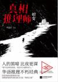

[真相推理师：嬗变](https://pewae.com/gaan/aHR0cHM6Ly9ib29rLmRvdWJhbi5jb20vc3ViamVjdC8yNjYwNDAzNA==)

原名：嬗变作者：呼延云出版社：江苏凤凰文艺出版社出版时间：2017

我太讨厌这种写着写着就出现幻听幻视内心大波澜的写法了。在我看来这就是水字数。
最后结局并没有很出乎意料，因为作者的戏份分配得太明显了，男主角写着写着就消失，分明有诈。转折太硬以至于很多地方没有写明白。搞那么多精兵强将来干嘛？就为了抓自己？还是为了拯救好基友？还有一根莫名其妙的办公室恋情感情线。

[为了活下去：脱北女孩朴研美](https://pewae.com/gaan/aHR0cHM6Ly93d3cuZ29vZ2xlLmNvLmluL2Jvb2tzL2VkaXRpb24vJUU3JTgyJUJBJUU0JUJBJTg2JUU2JUI0JUJCJUU0JUI4JThCJUU1JThFJUJCL2p1V1JEUUFBUUJBSj9obD1lbiZnYnB2PTA=)

作者：朴研美译者：谢佩妏出版社：大块文化出版时间：2015

年轻一辈的脱北者，对朝鲜的描述不像之前年纪大的那般深恶痛绝，只是觉得粮食短缺以及腐败横行。字里行间金二时期似乎真的对北部地区的控制没那么有力了。
更加生动真实的其实是中国的部分。买卖人口，偷渡，雏妓，黄色网站，黑社会。感觉哪怕某天韩朝统一了，这本书也不可能在中国大陆解禁。
中间的插图有这姑娘小时候的照片，对比封面，果然人一进入韩国就会化身医美爱好者，入乡随俗。

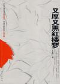

[又厚又黑红楼梦](https://pewae.com/gaan/aHR0cHM6Ly9ib29rLmRvdWJhbi5jb20vc3ViamVjdC8zMjYwMzc4)

作者：王小山出版社：东方出版社出版时间：2008

作为时评来说，有点浅薄；红楼梦中的事例也没采用很生僻的。主打一个插科打诨通俗易懂。
看标题会误认为是红楼结合时事的写法，实际上却完全反过来，有标题党之嫌。

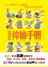

[完全神仙手册](https://pewae.com/gaan/aHR0cHM6Ly9ib29rLmRvdWJhbi5jb20vc3ViamVjdC8zODgzOTkw)

作者：王小枪出版社：国际文化出版社出版时间：2009

只描写了哪吒姜子牙申公豹土行孙雷震子这几个人物，跟“完全”完全没有关系。而故事上也没能脱离原著范畴，完全没有开脑洞的反转。
所以就很无趣。

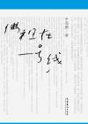

[佛祖在一号线](https://pewae.com/gaan/aHR0cHM6Ly9ib29rLmRvdWJhbi5jb20vc3ViamVjdC80ODcyNjcx)

作者：李海鹏出版社：文化艺术出版社出版时间：2010

李先生总能搞出一些别开生面的小比喻，挺好。
有种越写声音越小的感觉，分辨不出是成长了还是怯了。
李海鹏跟别的专栏作家相比有个优点，就是速战速决文字干练，绝不做多余的引申。难能可贵。

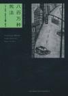

[八百万种死法](https://pewae.com/gaan/aHR0cHM6Ly9ib29rLmRvdWJhbi5jb20vc3ViamVjdC81Mjc1MjM4)

原名：Eight Million Ways to Die作者：劳伦斯·布洛克译者：潘源/王默出版社：新星出版社出版时间：2010

推理部分中规中矩，警察和匪帮的能力在范围内，主角也没有开挂。对于女性的态度比较宽容。最棒的是对酗酒戒酒的描写，忍得又真实又辛苦。

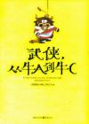

[武侠，从牛A到牛C](https://pewae.com/gaan/aHR0cHM6Ly9ib29rLmRvdWJhbi5jb20vc3ViamVjdC80MTE4NTk5)

作者：大脸撑在小胸上出版社：重庆出版社出版时间：2009

这书名只讨论金庸，出版社不亏心吗？不仅只有金庸，而且集中在几部长篇里，翻来覆去，几乎没有什么新鲜观点。
你是没看过连城诀吗？你是只看过雪山飞狐的电视剧吗？
排版更是恶心，穿插的题外话没做处理，括号里的解释也不合时宜。

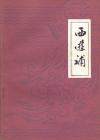

[西游补](https://pewae.com/gaan/aHR0cHM6Ly9ib29rLmRvdWJhbi5jb20vc3ViamVjdC8yMjg3MDk2)

作者：董说出版社：广东人民出版社出版时间：1981

全篇是孙悟空陷入鲭鱼精而产生的梦境，这倒没什么，关键是不热闹，没有西游的神韵。
穿越这回事，早在明朝就不新鲜了。

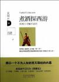

[煮酒探西游](https://pewae.com/gaan/aHR0cHM6Ly9ib29rLmRvdWJhbi5jb20vc3ViamVjdC80MDg2OTI3)

原名：西游记未解之谜作者：吴闲云出版社：湖南人民出版社出版时间：2009

脑洞还行。不考虑论证严密性的话，作为厕上读物还不赖。
论证必须吹毛求疵，有人批评吴闲云抠得细，大可不必。但是吴闲云的论证有个前提条件，那就是“吴承恩”作为小说作者，写书前有整体规划，草蛇灰线，前埋伏笔后有回音。
但是，且不说“吴承恩”这个人本身就有很大的疑问，西游本身也存在很多版本。这种公路片式的体裁是最容易注水的。“玉华洲”、“天竺国”的剧情明显水平之下，而孙悟空七回与唐僧身世七回，风格也明显不同，甚至有明显的证据，唐僧身世七回是后加进来的。如果真是一个人创作，那么乌巢的谒语跟最后的八十一难出入不可能那么大。
更不要说长篇创作的时候，顾头不顾腚的现象不是很常见的么？初版、再版、换出版社，舆论压力什么的导致改稿不是很正常么？《龙战士传说》我可是最少看过三个版本……
吴闲云的行为终究是值得鼓励的。凭什么你红楼就能发展出红学，我西游水浒就不能？吴某人又不吃国家大米。（三国是真不能）

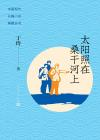

[太阳照在桑干河上](https://pewae.com/gaan/aHR0cHM6Ly9ib29rLmRvdWJhbi5jb20vc3ViamVjdC8zNTcxOTQ1Mg==)

作者：丁玲出版社：人民文学出版社出版时间：2022

鲁郭茅，巴老曹，冰心夏衍叶圣陶，一多艾青朱自清，还有立波和老赵。
我想，读书吧，总得把这些课本上的大牛们打一圈吧。
去年巴金，今年选了丁玲。这个后悔啊！我要知道丁玲是酱婶的，才不会选她。怪不得（我上学时）从来没学过丁玲写的课文，丁玲的原名也是不用记的。这水平果然是不行，不仅不如顺口溜里敬陪末座的老赵，甚至比不上她的闺蜜萧红。
这部盛名在外的小说最大的问题，是人物杂而不精，农会干部也好，小地主大地主恶霸地主也罢，都是一副浑浑噩噩的样子。什么聪明勇敢狡猾凶狠之类的特质都不存在。而丁玲还一下子把各式面孔一把撒开，搞得根本记不清哪个是哪个，便毫无代入感。
情节也是平平。所谓开展工作，也就是开会唠嗑，仅有的几次跟地主的正面交锋也完全没写出什么爽感。
可能唯一的亮点就是土改工作本身了。斗地主的时候只有情绪不讲证据，大伙抄家伙上，也算写实了吧。
据说本部作品获得了什么斯大林文学奖，不会是传说中的内销转出口，全仗着翻译的功劳吧？
看了后悔，强烈不推荐。

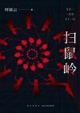

[扫鼠岭](https://pewae.com/gaan/aHR0cHM6Ly9ib29rLmRvdWJhbi5jb20vc3ViamVjdC8zNTA4MjEwMw==)

作者：呼延云出版社：新星出版社出版时间：2020

比前一本好了不少，起码矫情的感叹少了很多。直击慈善行业的丑恶也是值得鼓励的。
缺点就多了。首先是把刑警搞得像傻子一样，时间线上十年前，一个编外人员的一句话就误导了整个侦破过程，过于儿戏。而时间线上现时点的案子，最大的纰漏就是那个吃软饭的自己钻冰柜，简直是圆不回了机械降神。推理小说看到这也便没什么意思了。

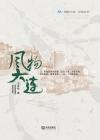

[风物大连](https://pewae.com/gaan/aHR0cHM6Ly93ZXJlYWQucXEuY29tL3dlYi9ib29rRGV0YWlsLzBhYTMyZTkwODEzYWI3YTUxZzAxMmE0OA==)

作者：王希君出版社：大连出版社出版时间：2021

官样写法，把个大连写得好生无趣。若是能由本书使得定居大连的外来人口减少，倒也算功德一件。

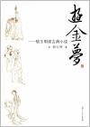

[游金梦](https://pewae.com/gaan/aHR0cHM6Ly9ib29rLmRvdWJhbi5jb20vc3ViamVjdC8yNTcwMzI4MA==)

作者：骆玉明出版社：复旦大学出版社出版时间：2013

猴王有惊人的本领，闹祸只嫌小不怕大，但他有时也就忘记了群猴乃是平常的猴子，他们会在猴王伟大的顽耍中失去一切。
读过的四大名著评论中，比较有人文精神的一部。不错。

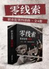

[零线索：职业犯罪四部曲](https://pewae.com/gaan/aHR0cHM6Ly9yZWFkLmRvdWJhbi5jb20vZWJvb2svNDI2MTI1NDY4Lz9kY3M9c2VhcmNo)

作者：一刀平五千出版社：博集天卷出版时间：2023

第一部节奏不太好，中间两部很精彩，最后一部有些技穷。
第二部对武侠的理解堪称精彩。
男主与小师妹之间的小暧昧拿捏的也不错。

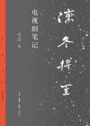

[凛冬将至](https://pewae.com/gaan/aHR0cHM6Ly9ib29rLmRvdWJhbi5jb20vc3ViamVjdC8zNTA0MzkxMA==)

作者：毛尖出版社：生活·读书·新知三联书店出版时间：2020

作者观看电视剧的感悟。大陆剧最多，其次美剧，也有专门的篇章写了英剧。
但对我来说完全完全没用，因为这些剧我一部也没看过。只有偶尔串台提到的电影还能咂摸一下。
很难说作者对于剧中人或者创作手法的评论是否专业，但看这样的实体书还是非常扫兴的。
倒是自己纠正了自己一个错误认识：我很长时间都认为，“剧”是“电视剧”的缩写，是不包括电影的。读此书是时候想了一下，电视剧本身是个偏正词，电视是剧的介质，同类还有戏剧、话剧、舞台剧；有电视剧，自然就有非电视剧。若是把电影看作戏剧的延申，倒也是可以称作剧的。

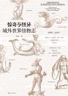

[惊奇与怪异](https://pewae.com/gaan/aHR0cHM6Ly9ib29rLmRvdWJhbi5jb20vc3ViamVjdC8zMDM1NDQ4Ng==)

作者：刘星出版社：九州出版社出版时间：2018

广度不够广。只有两河传说和欧洲传说。
深度不够深。只有欧洲的演化和故事。
严重怀疑是拿了两三本欧洲和中近东的怪物书进行了洗稿。

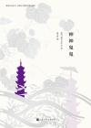

[神神鬼鬼](https://pewae.com/gaan/aHR0cHM6Ly9ib29rLmRvdWJhbi5jb20vc3ViamVjdC8zMDIzMDUwMQ==)

作者：老舍 / 胡适 / 鲁迅出版社：北京时代华文书局出版时间：2018

选编只看名气，文章内容参差不齐，沾一点鬼的边便入选了，不好。
什么唐弢之流，写的文章似乎只是为了政治正确。而周作人之类的又一副高高在上掉书袋的嘴脸。
反正很无聊。

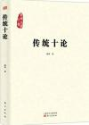

[传统十论](https://pewae.com/gaan/aHR0cHM6Ly9ib29rLmRvdWJhbi5jb20vc3ViamVjdC8yNTgzOTk5OA==)

作者：秦晖出版社：东方出版社出版时间：2014

几乎道尽了中国帝制的本质。很好。
但，说着是十论，实际上并没有十个观点。只是一些演讲稿的简单汇总，缺少编校整理。

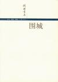

[围城](https://pewae.com/gaan/aHR0cHM6Ly9ib29rLmRvdWJhbi5jb20vc3ViamVjdC8xMDY5ODQ4)

作者：钱钟书出版社：生活·读书·新知三联书店出版时间：2002

围城二字其实指的不止是婚姻，而是（贵国）复杂的人际关系制度。
一群鸡儿灯。
杨绛的跋写的絮絮叨叨，非要把原本轻松幽默的原文往意味隽永上带，扫兴。

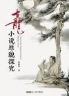

[古龙小说原貌探究](https://pewae.com/gaan/aHR0cHM6Ly9ib29rLmRvdWJhbi5jb20vc3ViamVjdC8zMDI5NzcwMw==)

作者：程维钧出版社：广州出版社出版时间：2018

为古龙这种不负责任的人作考据，这作者也真是闲的。
如果不是为了凑单，谁会花98块钱买这样的一本书，也真是闲的。
大量的篇幅纠结于分段。分段的节奏感对于古龙当然很重要，却也不必如此长篇累牍。
原貌这种东西，也许根本便不存在。比如广为流传的《白玉老虎》后记，作者找到了一段被删除的文字，意思是古龙的后记原文里有“赵无忌的故事还要继续”之类，被编辑删掉了，所以赞同白玉老虎没写完的说法。但换个思维，即使有这么一行，它怎么就不能是编辑为了吸引读者继续买报纸而擅自加上的呢？
作者考证出了《大沙漠》结尾时莫名其妙的“未遇见（未遇見）”其实是“宋甜儿（宋甜兒）”，也算是小有收获，一字之师吧。

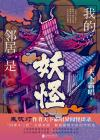

[我的邻居是妖怪](https://pewae.com/gaan/aHR0cHM6Ly9ib29rLmRvdWJhbi5jb20vc3ViamVjdC8zNTczMjIwMA==)

作者：天下霸唱出版社：北京联合出版公司出版时间：2021

普通的怪谈小说集。有一点点津味儿。
天下霸唱的这种写法注水过于严重。如果削掉65%，还能算是不错的故事。但这书一共也不过300多页。

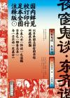

[夜窗鬼谈·东齐谐](https://pewae.com/gaan/aHR0cHM6Ly9ib29rLmRvdWJhbi5jb20vc3ViamVjdC8zMDIyMjIwNw==)

作者：石川鸿斋译者：王新禧出版社：九州出版社出版时间：2018

日本人写的文言文志怪小说，仿《聊斋志异》和《子不语》的写法。
作者的文言文水平不可谓不高。但把文言文写得层层叠叠可不是什么好事，完全没有了“言简意赅”的神韵。
并且本书成书较早，书中所载的六七成在动漫影视作品以及妖怪志之类的书籍中早有涉猎，所以本书于我意义不大。

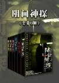

[阴间神探](https://pewae.com/gaan/aHR0cHM6Ly9ib29rLmRvdWJhbi5jb20vc3ViamVjdC8zNjEwMjI4Nw==)

作者：道门老九出版社：浙江出版集团出版时间：2018

前几卷法医结合灵异事件的写法还比较有趣。后面急转直下，风格变成了普通刑侦题材，无聊。
真难为作者，强行改道之后还能写那么久。
刀神是爷爷以及黄泉买骨人的身份这两大悬念都没藏住。
在倒数第二卷的作家杀人案里，还有借人物之口攻击读者的下作行为。你本来就是强行给主角团降智啊。一个反间计用了好几次，主角回回都上当，技穷了就别写下去呗。

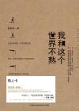

[我和这个世界不熟](https://pewae.com/gaan/aHR0cHM6Ly9ib29rLmRvdWJhbi5jb20vc3ViamVjdC8xOTk5NTc3Ng==)

作者：黄某某出版社：中国民族摄影艺术出版社出版时间：2012

气氛轻松。
在博客书里也不算上乘的。普通梗多，爆梗少。撅腚就知道要拉什么屎那种。
实体书一页4个边，偏偏把页码夹在书脊那边，设计者真是他娘的天才。
真是浅薄啊，八分之一比赛怎么就不能平了？

---

下面是本年度补完的漫画。只为弥补少年时代的遗憾，不评价。有兴趣的单独讨论。加这项只是为了显着多……

[摔角妖精宮殿](https://pewae.com/gaan/aHR0cHM6Ly9ib29rLmRvdWJhbi5jb20vc2VyaWVzLzYzMjk=)

原名：ここが噂のエル・パラシオ作者：青柳孝夫译者：陈钧然出版社：青文出版社出版时间：2010-09 / 2014-03全套册数：7

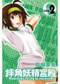

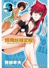

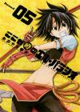

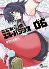

[奇子](https://pewae.com/gaan/aHR0cHM6Ly9ib29rLmRvdWJhbi5jb20vc2VyaWVzLzU5ODg2)

作者：手冢治虫译者：章泽仪出版社：东贩出版时间：1974-06 / 1975-08全套册数：3

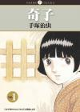

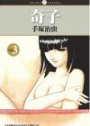

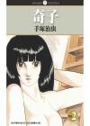

[尸囚狱](https://pewae.com/gaan/aHR0cHM6Ly9ib29rLmRvdWJhbi5jb20vc2VyaWVzLzMyNTIy)

原名：屍囚獄作者：室井正音译者：赖思宇出版社：尖端出版时间：2015-06 / 2017-04全套册数：5

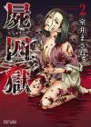

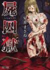

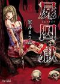

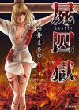

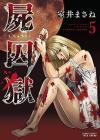

[尸姬](https://pewae.com/gaan/aHR0cHM6Ly9ib29rLmRvdWJhbi5jb20vc2VyaWVzLzExODMw)

原名：屍姬作者：赤人义一译者：陈冠安出版社：青文出版时间：2006-12 / 2016-10全套册数：23

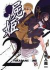

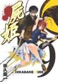

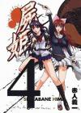

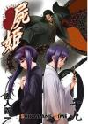

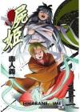

[女忍者魔宝传](https://pewae.com/gaan/aHR0cHM6Ly9ib29rLmRvdWJhbi5jb20vc3ViamVjdC80MDE4MTI4)

原名：くノ一魔宝伝作者：山口让司译者：吴励诚出版社：东立出版时间：2009全套册数：6

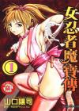

[横滨线的分身](https://pewae.com/gaan/aHR0cHM6Ly9ib29rLmRvdWJhbi5jb20vc2VyaWVzLzI4ODM5)

原名：横浜線ドッペルゲンガー作者：玉木凡妮莎千寻译者：李三滚出版社：集英社出版时间：2014-07 / 2015-01全套册数：4

[请叫我英雄](https://pewae.com/gaan/aHR0cHM6Ly9ib29rLmRvdWJhbi5jb20vc2VyaWVzLzY4Njk=)

作者：花泽健吾译者：尤静慧出版社：东立出版时间：2010-11 / 2020-06全套册数：22

[东周英雄传](https://pewae.com/gaan/aHR0cHM6Ly9ib29rLmRvdWJhbi5jb20vc2VyaWVzLzE2ODIx)

作者：郑问出版社：大辣出版时间：2012-07 / 2012-09全套册数：3

