本年度读书53本，比去年多17本，页数多了5600多页。量是不少的，主要得益于周末要带着闺女四处补课。而且其中有四本“看图写话”，画册的页数，也能算数的么？
其中实体书读了22本，完成了去年设定的20本的低级目标，离高级目标34本则还是差了好远。
本年度读的最多的仍旧是小说，其次是散文和杂文。读了一本诗集，感觉很糟糕，犹豫以后还要不要碰这个类别。
读的最多的是中国当代作家的作品，占了62%，其次是中国现代的名家，5本。

今年读过最好的作品是清代大才子袁枚的《子不语》。其实这部书读了很长时间，都跨了不止一年————前年开始读，去年换了项目就一直扔在旧工位上，今年回归才给续完。只重志怪，不像蒲松龄那样还要去刻画人物性格。
其次是三部名家小说：老舍先生的《开市大吉》、《离婚》和莫言的《蛙》，都是挺有滋味的作品。再往下是很流行的《万历十五年》，无需赘言。
《独裁者手册》、《苏东坡传》、《秧歌》、《国家的常识》、《开端》这些都是声名显赫的好作品，最终也没让我失望。
《铁浆》是名气较小但是读起来铿锵有力的作品，是意外惊喜。
《一只绣花鞋》、《平凡的世界》是两部失望作品，共同的缺点是拖泥带水。

今年读过最差的作品是给臭宝买的《中华传统规矩》，生搬硬套。下次看到这种不敢用真名编书的宵小一定要提高警惕。

今年读的最长的作品是臭宝学校指定的课外读物《平凡的世界》。这书与我三观相悖，浪费时间。
今年读的最短的作品是郭沫若的诗集《女神》。欣赏不来。除了离刷成六大作家的成就又进了一步之外，一点儿收获也没有。
今年读的耗时最长的作品是《国家的常识》。第一次接触这样的书籍，读一点要想一想，还要去查一些资料，有趣的体验。

今年读了两本有意思的书。
一是特殊年代的《论尊儒反法》，充斥着疯狂而有趣的逻辑；另一本是神标题系列的《农民进城防骗手册》，是本被标题耽误的有意义的工具书。

不能多讲的书读了两本。
《为人民服务》简直是随时都会发生的小故事，被禁只能说有些敏感了。
《雪白血红》则正好相反，无论从哪个角度看，无关部门都不会愿意看到它的流传。当然，作者的手法过于夸张，必须把水分挤一挤才能接着读。

明年20本实体书这个体量对我来说刚刚好，明年继续。六大还剩沈曹二位，先刷曹吧，起码从中学课文来看曹会更易读一丢丢。
臭宝的指定书目还堆得很高，给自己定一个4年内干掉它们的小目标。

---

下面是书目和个人简评：

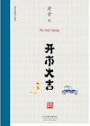

[开市大吉](https://pewae.com/gaan/aHR0cHM6Ly9ib29rLmRvdWJhbi5jb20vc3ViamVjdC8zNDgwOTA4NQ==)

作者：老舍出版社：天津人民出版社出版时间：2019

老舍先生真是写作界的天才。连短篇小说也能驾驭地如此纯熟。他最值得尊敬的便是能始终保持文字的有趣。
作家的眼光是毒辣的，中国人始终是那副丑德行。像《开市大吉》里的医疗骗子；《抱孙》里的医闹，以及《铁牛与病鸭》、《不成问题的问题》里的职场老混子。
被电影改编而名声大噪的《不成问题的问题》还是有点不舒服，因为里面直白的“XXX觉得”“XXX认为”有点多了。
但最喜欢的一篇却是《断魂枪》。生动演绎了什么是江湖越老胆子越小。

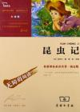

[昆虫记](https://pewae.com/gaan/aHR0cHM6Ly9ib29rLmRvdWJhbi5jb20vc3ViamVjdC8xMDg2Nzc0Nw==)

作者：法布尔出版社：商务印书馆出版时间：2012

这个版本非常不好。这种“励志版”对于原文长的，节选的标准太迷了。
仅就这本书，莫名其妙的删掉了最重要的一篇《蝉》。买这书就是为了孩子的新课标阅读，但是所谓新课标你又不知道考点是什么。
拿到卷子以后，翻着书找都找不到答案，这书还要来干嘛？
更何况所谓导读在我看来就是过度解读，无比难受。

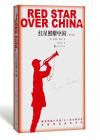

[红星照耀中国（青少版）](https://pewae.com/gaan/aHR0cHM6Ly9ib29rLmRvdWJhbi5jb20vc3ViamVjdC8yNzA3OTAzOQ==)

作者：埃德加·斯诺译者：董乐山出版社：人民文学出版社出版时间：2017

斯诺无疑是支持国际共产主义运动的，并且同样对于苏联颇有微词。这样在基本立场上，他与某党派可谓是天生的相性相符。
斯诺擅长写人。毛泽东，贺龙，彭德怀，胡金魁，林伯渠，徐特立，朱德等人在他的笔下都有血有肉。
同时他又很有站队的敏感性。张闻天只字未提，博古、肖克只有寥寥数笔，红军根据地为啥还有个“西南局”被选择性地割离了。仅在文末给李德说了几句话。
字里行间的一些细节还是能够窥豹的。
刚到延安时，第一印象里有一句，他们似乎不太在乎普通人的生死。随后又补了一句，也不太在乎自己的生死。
写长征，过草地，对于不肯配合卖粮食的藏民，作者鸡贼地采用春秋笔法引用了毛泽东的话：“这是我们唯一亏欠藏民的，以后要尽力补偿。”
写苏区禁烟，是（当时的）八项注意之一。却似乎全然忘却了，第三章他写毛泽东几乎烟不离手。
总之这还是相当有趣的书，但不适合中二的小朋友们配合现行的历史课本上来就读。对当时的历史有一定了解之后，把它当作一家之言还是很棒的。
这本书不好的地方在于，青少版几乎把照片删光了。

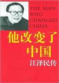

[他改变了中国](https://pewae.com/gaan/aHR0cHM6Ly9ib29rLmRvdWJhbi5jb20vc3ViamVjdC8xMjU4Mzc4)

作者：罗伯特·劳伦斯·库恩译者：于海江 / 谈峥出版社：上海译文出版社出版时间：2005

人比人得死，货比货得扔。
之前不知道王冶萍出访的时候为什么总缩个脖子，读此书之后才知道，王是长者相濡以沫的没有血缘关系的小表妹；王颈椎一直有病，长者接受采访时说：“我要是不扶着她，她一步都走不了。”
所以呢，看看一代们人均一个机要秘书；看看二代们人均离婚，人品差别立显。
缺点是与俄罗斯的交易以及对某组织的雷霆手段，语焉不怎么详。

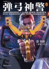

[弹弓神警](https://pewae.com/gaan/aHR0cHM6Ly9ib29rLmRvdWJhbi5jb20vc3ViamVjdC8zNDQyOTM1Ng==)

作者：常书欣出版社：上海文艺出版社出版时间：2019

总体质量不错。人物性格鲜明，故事没有明显漏洞。文笔也好过大多数网络作者。
缺点是煽情有些多。结尾节奏感下来了，有些不爽。

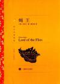

[蝇王](https://pewae.com/gaan/aHR0cHM6Ly9ib29rLmRvdWJhbi5jb20vc3ViamVjdC8yNTc3MzY1NQ==)

作者：戈尔丁译者：龚志成出版社：上海译文出版社出版时间：2014

拉尔夫和杰克，就像现实中的常凯申和李得胜。软弱而虚伪的民主和务实又强硬的独裁。都不是什么好干粮。
猪崽子这个不合时宜的人，轻信的普通人。
译本不好，西蒙之死、蝇王幻觉，以及最后的结局都像缺少了关键的描写。

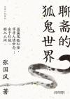

[聊斋的狐鬼世界](https://pewae.com/gaan/aHR0cHM6Ly9ib29rLmRvdWJhbi5jb20vc3ViamVjdC8zNDg1NjIzMQ==)

作者：张国风出版社：天津人民出版社出版时间：2019

为聊斋这样短小精悍的文章写如此冗长的评论，实在是煞风景啊！
太多的官样文章，读来的感觉就是：“这还要你说？”

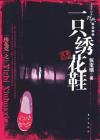

[一只绣花鞋](https://pewae.com/gaan/aHR0cHM6Ly9ib29rLmRvdWJhbi5jb20vc3ViamVjdC8xOTY1OTYy)

作者：张宝瑞出版社：东方出版社出版时间：2006

我父母那个年代的人所念念不忘的手抄本。读过之后无比失望。
作者创作的时候只有二十岁上下，应该读过一些书，但是写作经验无比匮乏。一些描写和叙事的文字水平尚可，但不断跳跃的插叙所形成时间线和大量无意义的人物，实在称不上什么好的阅读体验。
兼职风格杂糅的厉害，什么反特、侦破、惊悚、香艳，甚至还有特异功能，能搞的都搞上了，我毫不怀疑，在创作者眼里，反特只是一只大筐，他只是想把自己的那点学识全部卖弄出来，这是典型的中学生风格。甚至我还看到了当下网络小说水字数用的“抄百科”式写法。可真难为了当年那些一个字一个字手抄的叔叔大爷们，辛辛苦苦抄这种乐色。
开篇就是大连，可惜作者那时应该根本没来过大连，哪儿哪儿都对不上。老虎滩哪里有西门啊，广州街又是什么鬼地方啊。不熟悉的地点，还是不要用的好。

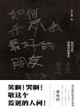

[如何杀死我最好的朋友](https://pewae.com/gaan/aHR0cHM6Ly9ib29rLmRvdWJhbi5jb20vc3ViamVjdC8zNTczMjAzOA==)

作者：宋小君出版社：中国友谊出版公司出版时间：2022

这部合集比较难以评价。上限很高，下限很低。第一篇同名作很好。最喜欢《肥皂男》。
但是中间的几篇有些乏味。
可能是因为我不是特别喜欢现实跟想象杂糅的写法吧。
里面有句矫情的话颇有同感：You are my fucking sunshine.

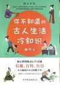

[你不知道的古人生活冷知识](https://pewae.com/gaan/aHR0cHM6Ly9ib29rLmRvdWJhbi5jb20vc3ViamVjdC8zNTgwNjU0NA==)

作者：曲水出版社：中国友谊出版公司出版时间：2021

知识含量不错。
两大严重问题：
第一是标题党严重。比如“古人是怎样避孕的”，东扯西扯一堆影视剧，最后得出结论：古人不怎么会避孕，只会堕胎。这tm也太走近科学了吧。
第二是时间线混乱。同一题目从来不肯从先秦写到清朝，要么截取一个朝代，要么大段跳跃，反正就是给“你学到了，但只学了一丢丢的感觉。”

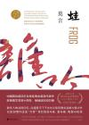

[蛙](https://pewae.com/gaan/aHR0cHM6Ly9ib29rLmRvdWJhbi5jb20vc3ViamVjdC8zNTAzNzMxNQ==)

作者：莫言出版社：浙江文艺出版社出版时间：2020

语言方面，无可挑剔。人物的形象也各具特色。
明线是姑姑的救赎，暗线却是强者对弱者的欺凌。无论万心、万足、袁腮、肖下唇，都在利用自己的地位，去欺凌弱者。
受害的是一个个普通女性。王仁美、王胆、陈眉。
夹杂书信，在我看来是不必要的，而最后一幕的剧本，有点乱，不喜欢。
现在网上攻讦莫言的人，可能根本没读过他的这本书，否则直接早把文革的部分摔他脸上当罪证了。

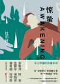

[惊蛰](https://pewae.com/gaan/aHR0cHM6Ly9ib29rLmRvdWJhbi5jb20vc3ViamVjdC8zNTUxMTc3OQ==)

作者：杜阳林出版社：浙江文艺出版社出版时间：2021

笔法细腻，但是从故事到人物都比较单一，趣味性不高。
作者不停地给主角一家堆积苦难，无论是施加苦难的人还是主角一家，性格都缺少变化，行为动机也不充分。主角4岁什么样，14岁仍旧什么样。二哥小时候冲动惹祸，长大了仍旧冲动惹祸。再便是爱用工具人，想写主角徒步讨饭回家，就突然蹦出一个被送人的舅舅，想让他生场大病，就忽然出现一个江湖神医。已经出场的人物也没什么延续性，没亲戚的大伯把主角鸡鸡烧了，竟然啥后续也没有，直到包产到户的时候才又跳出来捣乱，真不是成熟作家作品应有的样子。
腰封上说本书媲美《平凡的世界》，的确是一样的差劲啊。

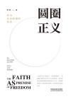

[圆圈正义](https://pewae.com/gaan/aHR0cHM6Ly9ib29rLmRvdWJhbi5jb20vc3ViamVjdC8zNDgxNTEzMg==)

作者：罗翔出版社：中国法制出版社出版时间：2019

张三老师的随笔。有些无奈的坚持。
作为刑法专家，他所重视的一直是法律与道德的关系。可以看出，他心目中的法律是有一种样子的，而且不是现在的样子。
只不过罗老师写作时有大量引用名人观点的习惯，这让我很不习惯。

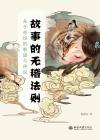

[故事的无稽法则](https://pewae.com/gaan/aHR0cHM6Ly9ib29rLmRvdWJhbi5jb20vc3ViamVjdC8zNjE4NDY5NA==)

作者：施爱东出版社：北京大学出版社出版时间：2023

都知道是编故事，但这本书解释了故事为什么要这么编，编故事的范式。非常有趣。
以后长个心眼儿，看到某地的传说，先想想为什么会这么编，可能就会少上点“来都来了”的当。
最后面的风水传说可能是涉及到施先生的专业范围了，理论多，故事少，反而没前面带劲。
另他也太喜欢配图了，这其实不是个好习惯。

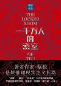

[一千万人的密室](https://pewae.com/gaan/aHR0cHM6Ly9ib29rLmRvdWJhbi5jb20vc3ViamVjdC8zNjIwNjMwMA==)

作者：蔡骏出版社：作家出版社出版时间：2023

明明是侦探小说，却能读出作者对于疫情防控的控诉。
本格派、社会派和作者所自称的“硬汉派”都沾了点，紧张悬疑的氛围是足够的。
作者蔡骏喜欢家牢骚评论，他的这种发癫的方式还挺对我胃口的。
缺点是犯罪手法还是糙了些，并不是非常巧妙的局。

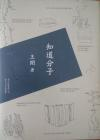

[知道分子](https://pewae.com/gaan/aHR0cHM6Ly9ib29rLmRvdWJhbi5jb20vc3ViamVjdC8yNjI4ODg4MQ==)

作者：王朔出版社：北京十月文艺出版社出版时间：2015

王朔的两个观点比较认同。
第一是，作家的作品，不都好，也不可能都不好。无论鲁迅、老舍，还是他本人。
第二是，作家最好的作品，永远存在于他的脑子里，写出来，便逊色了几分。就像他说的，他能描述一把刀，但很难描述好凛冽的刀光。由此类推，书到漫画，又递减了；漫画到动画、影视更加递减；这便是我喜欢文字和漫画胜过动画及电视剧的原因。
中间几篇序，不怎么有趣。
后面几篇关于电影和写作的访谈，应该是2010年前后的。觉得王朔作为电影人，对于市场的认知上限和下限波动太大，故而这些年快淡出电影圈了。

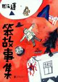

[笨故事集](https://pewae.com/gaan/aHR0cHM6Ly9ib29rLmRvdWJhbi5jb20vc3ViamVjdC8zNDgwMjc2Mw==)

作者：周云蓬出版社：磨铁·北京联合出版公司出版时间：2019

之前看过周云蓬的几个短篇，当时可没觉得他是这样的人：倚瞎卖瞎。除了说自己看不见，之前给人乐观向上的那个周云蓬是真的看不见了。按照人们心目中瞎子的固有印象来写，就是有卖点呗？
只有《高渐离》一篇不错。
封面很有设计感，表扬。但这书卖48块是真不值。
写这傻逼序的谁啊？

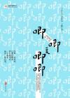

[唧唧复唧唧](https://pewae.com/gaan/aHR0cHM6Ly9ib29rLmRvdWJhbi5jb20vc3ViamVjdC8yNjY2Mzk1MQ==)

作者：王路出版社：北京联合出版公司出版时间：2016

观点写法都不新鲜，但胜在流畅。
缺点是太喜欢引佛经。

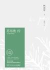

[苏东坡传](https://pewae.com/gaan/aHR0cHM6Ly9ib29rLmRvdWJhbi5jb20vc3ViamVjdC8zMDE3MTM4OQ==)

原名：The Gay Genius作者：林语堂译者：张振玉出版社：湖南文艺出版社出版时间：2018

林语堂先生的代表作品，因为是面向英文读者的缘故，往往会在一些奇怪的地方浓墨重彩，以至于节奏有些奇怪。比如某处浪费大量文字解释什么是“意”，实在煞风景。
写出了苏东坡的随遇而安。我不知道苏轼是否真的随遇而安，但在书中他就是一个赤子之心的长髯老汉。
很多人批评了林语堂对于王安石的诋毁。我并不以为然。毕竟林语堂的看法，与毛泽东的“王安石并不周知社会”还挺类似的。我也不想研究历史，更不想研究王安石这个人，只是想，中学课本上把变法失败归因于“触动了地主阶级的利益”，是大大的不妥的，很可能是单一化归因的谬误。可能有人是反对他的具体实施细则，可能有人是单纯讨厌这个装逼犯，可能有人是真心同情百姓，可能有人是跟着老爹不得不反对。
林语堂写苏轼的侧重点还是他的政治生涯，这当然很正确，但这些不新鲜。苏东坡爱说话，自然也容易被抓小辫子。彼时彼刻正如此时此刻，国人千年以来也忘不了文字狱的初心。
反正这书挺好看的。

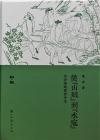

[从“山贼”到“水寇”](https://pewae.com/gaan/aHR0cHM6Ly9ib29rLmRvdWJhbi5jb20vc3ViamVjdC8zMDI5NjAxMw==)

作者：侯会出版社：浙江古籍出版社出版时间：2018

这个国度里除了红学，真的还有“水学。这本书就是一份水学专著。
作者搜集了大量资料，论证水浒的故事原型和人物原型。
第一部分对我来说大开眼界，从水浒传反向了解了杨幺起义。
第二段则太扯了。从一位明代的吴姓读书人的千字读书笔记，导出有一份“吴本”水浒传。然后就恶心了：因为武松打虎智深坐化的故事很精彩，而吴某人的读书笔记里没提到这些片段，所以“吴本”水浒里没有这些内容。进而推出今本水浒的武松打虎不是从吴本抄的。这根本没有逻辑啊！
后面就零碎一些，大概是说哪些人物或故事借鉴自哪些小说、戏剧或者历史。有的有道理，有的瞎扯的成分更多，还是逻辑能力堪忧。
总之，作者菌你有这时间干点啥不好。

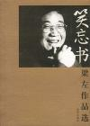

[笑忘书](https://pewae.com/gaan/aHR0cHM6Ly9ib29rLmRvdWJhbi5jb20vc3ViamVjdC8xMDQwNjcz)

作者：梁左出版社：华艺出版社出版时间：2002

梁左的原著并没有电视上的相声和电视剧那么出彩。他写的小说远不如喜剧作品有趣。故事简单量又少。
对于早期春晚的评价有些意思，颇有些对于相声创作遭遇的大环境的抱怨。这抱怨声音又小，显得特别小心翼翼，生怕触碰了领导忌讳的样子。

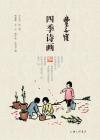

[丰子恺·四季诗画](https://pewae.com/gaan/aHR0cHM6Ly9ib29rLmRvdWJhbi5jb20vc3ViamVjdC8zNTU1NjA2Nw==)

作者：丰子恺出版社：上海三联书店出版时间：2021

丰子恺的古诗新画。
老先生的画风亲民，民国版的水墨写生，很惬意。生活里总少不了小女仆和猫，以及，民国的时候大夏天都穿着长衫？
每季卷首的散文质朴真诚。写冬天过节的一篇里，他说那时嘉兴的元宵节已经是“聊以应名”而已。而当下的大大小小的节，更是没有一个不是聊以应名的了。
缺点是注解的词有些莫名其妙。

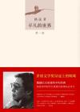

[平凡的世界](https://pewae.com/gaan/aHR0cHM6Ly9ib29rLmRvdWJhbi5jb20vc3ViamVjdC8yNzE4NjI5OA==)

作者：路遥出版社：北京十月文艺出版社出版时间：2017

教育部把这部小说作为初中的必读书，绝对是浪费时间。读完之后感觉本书真当得起一句又臭又长。
虽然很长，但有营养的部分却不多。路遥喜欢写各路人物的心理活动，喜欢加突兀的评论用于转场，却不擅长描写任何细节。你一部描写农村生活的小说，却只在第一部喂了一次不到100字的猪，第二部写了两次每次不到100字的抢种和除草，然后就没了。孙少安办砖厂这个主要剧情简直太失败了。总结起来就是办砖窑，赚了，贷款扩大生产，赔了，借钱又干，赚了。除了赔钱说了一句原因以外，其余原材料、燃料、运输、销售、组织人事等等一个字都没写。就仿佛随便把一个人放到砖厂厂长的位置上，就能赚钱。唠这些废嗑有意思吗？第三部井下挖煤的细节上来了，便也比前两部可读性提高不少。
平凡的世界？裙带的世界吧。最受不了的是书中充斥的一股“官迷”味儿。跟主人公一家来往的，不是这什么长就是那什么书记。主角两兄弟确实够努力，但他们办事更多靠的是找关系和机械降神，跟他们的努力和守望没多少关系。姐夫闯祸了，找小相好的，用地委书记的路子给压下来；毕业了没工作，一向不对路子的二叔利用大队副书记的身份给安排个村办教师；进城打工没活干，被个村长捡走，还给解决了城市户口；又没工作了，小女朋友假借地委书记老爹的名义安排到矿上上班——这一切跟孙少安孙少平是否奋发是否坚韧可以说半毛钱关系也没有。
金波这个人物，还是可圈可点的。
大姐孙兰花是文盲，嫁个二流子；孙少安读小学，找了个青梅竹马田润叶，田润叶的爹是大队书记；孙少平读中学，找了个青梅竹马田晓霞，田晓霞的爹是地委书记，后来是省会城市书记；孙香兰读大学，找了个男朋友吴仲平，吴仲平的爹是省委副书记。“读书改变命运”这件事被你们老孙家懂完了！

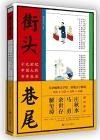

[街头巷尾](https://pewae.com/gaan/aHR0cHM6Ly9ib29rLmRvdWJhbi5jb20vc3ViamVjdC8yNzExNDI3Mg==)

作者：领读文化出版社：九州出版社出版时间：2017

图不错，文字稀碎。排版对电子书非常不友好。
观察一下清末有哪些流行的错别字倒也有趣。

[秧歌](https://pewae.com/gaan/aHR0cHM6Ly9ib29rLmRvdWJhbi5jb20vc3ViamVjdC8zNDk3MzgyOA==)

作者：张爱玲出版社：皇冠出版时间：2020

接着奏乐，接着舞！
一个名叫李得胜的兵痞和同伙抢了老乡一口猪，抓了他们儿子当壮丁。张爱玲一定是故意的。

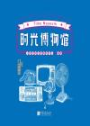

[时光博物馆](https://pewae.com/gaan/aHR0cHM6Ly9ib29rLmRvdWJhbi5jb20vc3ViamVjdC8zNDc3ODQwOQ==)

作者：人民日报社新媒体中心出版社：中国画报出版社出版时间：2019

展览本身就很肤浅，做成书就更傻了。谁买谁傻子。
除了图片就是微博上的彩虹屁留言，编辑要脑子何用！
15分钟翻完。

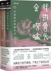

[我的骨头会唠嗑](https://pewae.com/gaan/aHR0cHM6Ly9ib29rLmRvdWJhbi5jb20vc3ViamVjdC8zNjIwNzE2Mg==)

作者：刘八百 / 廖小刀出版社：金城出版社出版时间：2023

法医的检测手段并不新鲜，都是法医小说里写烂了的那些。
因而侦破手段也很单一，就是查DNA，查身份，排查走访，分析社会关系那些。
所以整体比较平淡。但转念一想，刑侦其实是个体力活。

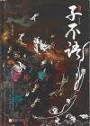

[子不语](https://pewae.com/gaan/aHR0cHM6Ly9ib29rLmRvdWJhbi5jb20vc3ViamVjdC8yNjg0OTI0NQ==)

作者：袁枚出版社：天津人民出版社出版时间：2016

言简意赅。我就喜欢怪力乱神。
唯惜数量不少的故事现在看来没那么怪。
注释如果稍微加个20%就更好了。

[为人民服务](https://pewae.com/gaan/aHR0cHM6Ly93d3cucWluZGlzLmNvbS9yZWFkL3dlaXJlbm1pbmZ1d3Uv)

作者：阎连科出版时间：2005

趣味性不大，侮辱性极强。

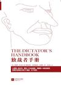

[独裁者手册](https://pewae.com/gaan/aHR0cHM6Ly9ib29rLmRvdWJhbi5jb20vc3ViamVjdC8yNTg4MTEwMg==)

原名：The Dictator's Handbook: Why Bad Behavior is Almost Always Good Politics作者：布鲁诺·德·梅斯奎塔 / 阿拉斯泰尔·史密斯译者：骆伟阳出版社：江苏文艺出版社出版时间：2014

阉割版可以阉割文字，但无法阉割联想。

> 津巴布韦的白人农场主遭遇到相似命运。罗伯特·穆加贝的政府没收了他们的土地，理由是将土地重新分配给贫穷的黑人，他们在前殖民统治和少数白人统治下一无所有。实际情况与此大相径庭。土地终究还是聚集到了穆加贝的党羽们手上，他们当中没有哪个是农民。

确实，太平天国也是这么说的，也是这么做的。

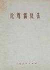

[论尊儒反法](https://pewae.com/gaan/aHR0cHM6Ly9ib29rLmRvdWJhbi5jb20vc3ViamVjdC8zMDM2NzI5MA==)

出版社：江西人民出版社出版时间：1973

虽然满口胡言，却可以从中体会出这种胡说八道写法的内在无逻辑的推导逻辑。
孔子是奴隶主阶级的代言人，所以孔子是错的。
秦始皇代表地主阶级，封建社会替代奴隶社会是进步的，所以秦始皇焚书坑儒是对的。
法家反对儒家，儒家是错的，所以法家是对的。
孔子提倡仁，老蒋也提倡仁，孔子是错的，所以老蒋是错的。
刘少奇鼓吹“以德报怨”、“己所不欲，勿施于人”，孔子是错的，所以刘少奇是错的。
孔子认为改变世界的是圣人，林彪提出超天才，孔子是错的，所以林彪是错的。
司马光代表旧地主儒家，王安石是法家，法家是对的，儒家是错的，所以王安石是对的。
鲁迅反对三纲五常，所以鲁迅是坚定的无产阶级战士。
农民起义是对的，王阳明曾国藩镇压农民起义，是错的。它们是儒家的代表，所以儒家是错的。
反正是充斥着各种简单粗暴的“四条腿好，两条腿坏”式的归纳和演绎。
如果世界这么简单的话，用一枚硬币就可以解决所有问题了，还要什么几核多少位的CPU啊。还要什么光刻机啊。
要不我们程序员这个行业，杠精多，反贼多呢。我们的判断条件，除了bool，还有enum，还有int，还有不能直接用等号的float，还有它们之间的与或非，还有括号来约束判断顺序……
不过……

> 历代的剥削阶级在他们没有得势的时候，并不看重孔子，有时甚至可以骂孔子，但一旦取得了统治地位，他们就往往求助于孔子的亡灵来巩固他们的统治。

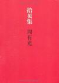

[拾贝集](https://pewae.com/gaan/aHR0cHM6Ly9ib29rLmRvdWJhbi5jb20vc3ViamVjdC81OTA3NTQx)

作者：周有光出版社：世界图书出版公司出版时间：2011

周老爷子90多岁以后的文字。能看的出那时他多么地推崇全球化。
字里行间可以看出他对苏联对斯大林对共产主义有多么厌恶。老爷子晚年学会了上网。可惜还是早走了10年，否则真想看他跟现在的年轻人对线啊。
分低因为电子版排版混乱。

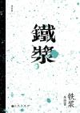

[铁浆](https://pewae.com/gaan/aHR0cHM6Ly9ib29rLmRvdWJhbi5jb20vc3ViamVjdC8zMDM0NTQxNg==)

作者：朱西甯出版社：九州出版社出版时间：2018

平实有力的典型性短篇小说。作者对乡土有很深的理解，悲悯而又冷酷。

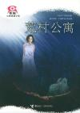

[荒村公寓](https://pewae.com/gaan/aHR0cHM6Ly9ib29rLmRvdWJhbi5jb20vc3ViamVjdC8xMDE5NDMx)

作者：蔡骏出版社：接力出版社出版时间：2005

前戏过长，故事老套。
女主的身份一开始就很明显，翻四辈的故事恐怖和悬疑程度都有所欠缺。

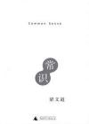

[常识](https://pewae.com/gaan/aHR0cHM6Ly9ib29rLmRvdWJhbi5jb20vc3ViamVjdC8zMzQ0Njc2)

作者：梁文道出版社：广西师范大学出版社出版时间：2009

标题起大了。梁先生的观点多少有些——嗯——两头不讨好。
还是把自己置身于共同体里而进行表达，不太超脱。

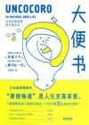

[大便书](https://pewae.com/gaan/aHR0cHM6Ly9ib29rLmRvdWJhbi5jb20vc3ViamVjdC8zMTgxOTI3)

作者：寄藤文平 / 藤田纮一郎译者：吴锵煌出版社：北方文艺出版社出版时间：2008

金黄色的真美啊。
画非常棒，简约真切，而且充斥着日式猥琐流。文字差点，毕竟文字作者只是个牙科医院的寄生虫专家。

[女法医手记系列](https://pewae.com/gaan/aHR0cHM6Ly9ib29rLmRvdWJhbi5jb20vc3ViamVjdC8yMDE3MjU2OA==)

作者：刘真出版社：湖南人民出版社出版时间：2012

第一人称写法医自己，第三人称写警察沈恕，设计得比较巧妙。
法医手段上，中规中矩，但感觉挺真实。像分析毒药，花粉证据之类。
写到后面手法上有些单调，陷入坏人就在出场人物中的桎梏。3000字不到就能猜到凶手的阅读体验是不大好的。
夹枪带棒地讽刺系统内的领导，挺过瘾。
吃人肉那个故事有些刻意的恶趣味了。

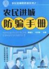

[农民进城防骗手册](https://pewae.com/gaan/aHR0cHM6Ly9ib29rLmRvdWJhbi5jb20vc3ViamVjdC8xOTI5ODI1)

作者：蔡建文 / 马文胜出版社：湖南人民出版社出版时间：2006

被书名耽误的好书。
把当下常见的市井骗术拆解的相当透彻，不仅是农民工，对于见识没那么丰富的毕业学生、海归高知、要转行的知识分子，都具有相当的指导意义。
前两章的街头骗术和求职骗术特别到位，能遇到的情况应讲尽讲；然后的短信骗局、婚介骗局、求医骗局也都不错。消费骗局一章有些冗长。窃以为说说商家手段就可以了，没必要具体罗列如何分辨红酒如何分辨母猪肉。
可惜是写成18年了，电话方面的诈骗已经很少出现，而老鼠仓、赌球、电信诈骗的内容又推陈出新。如果能与时俱进，改个书名出新版，高低要给家里的老人小孩都买一本。

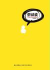

[俗话说](https://pewae.com/gaan/aHR0cHM6Ly9ib29rLmRvdWJhbi5jb20vc3ViamVjdC80ODIyMTgz)

作者：东东枪出版社：新星出版社出版时间：2010

微博体实在是不太适合整理成书。看着挺有意思，但也是真累。东东枪一个一个如此喜欢讲笑话的，能讲好笑话的人，近些年却很少说话，噤若寒蝉了。遗憾。下面这条他给自己拟的腰封其实就挺好。

> 这是一本俗气又无聊的书，谈的都是些鸡毛蒜皮，胡思乱想，但是，或许你会觉得它很有趣。因为有时候，你也和那些说它有趣的人一样，是个俗气又无聊的人，对不对？

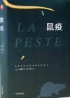

[鼠疫](https://pewae.com/gaan/aHR0cHM6Ly9ib29rLmRvdWJhbi5jb20vc3ViamVjdC8zMzQyNzk1OA==)

作者：加缪译者：李玉民出版社：北京燕山出版社出版时间：2019

盛名之下，其实难副。加缪笔下的封城，跟现实中我所经历的两年前的八月相比，算个屁啊！北非的小城里并没有多少恐慌，咖啡照喝，音乐会照开，球照踢。寥寥几句物资供应不足，又不是连市场都不让去。所谓的心态描写，真心不如我所经历的。
主人公团队一直在忙于防疫，但正如加缪在文中说的，鼠疫的消退跟他们的工作也根本没什么关系。我甚至觉得后半段安排塔鲁染上鼠疫过于刻意了。
收尾倒是极好。

> “说说看，大夫，他们要建造一座鼠疫死难者纪念碑，这是真的吗？”
> “报上这样报道。造一座石碑，或者一块纪念碑。”
> “我早就断定了。还会有人发表演说。”
> 老人大笑，笑得喘不上来气儿。
> “我在这儿就听得见他们说：‘我们这些死者……’回头他们就去大吃大喝。”

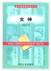

[女神](https://pewae.com/gaan/aHR0cHM6Ly9ib29rLmRvdWJhbi5jb20vc3ViamVjdC8zMTIwMDMz)

作者：郭沫若出版社：人民文学出版社出版时间：1977

我tm就不适合读诗歌。大多数时间我都不知道老郭想说啥。比如下面这首：

> 鹭鶿！鹭鶿！
> 你自从哪儿飞来？
> 你要向哪儿飞去？
> 你在空中画了一个椭圆，
> 突然飞下海里，
> 你又飞向空中去。
> 你突然又飞下海里，
> 你又飞向空中去。

再比如这个。这不就是中杯大杯超大杯吗？

> 一个，两个，三个，三个金字塔的尖端
> 排列在尼罗河畔——是否是尼罗河畔？——
> 一个高，一个低，一个最低

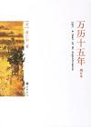

[万历十五年](https://pewae.com/gaan/aHR0cHM6Ly9ib29rLmRvdWJhbi5jb20vc3ViamVjdC8xOTgxMDQy)

作者：黄仁宇出版社：中华书局出版时间：2007

皇帝、首辅、将军、官吏、思想家。都在体系里瞎折腾。因为体系是错的，所以怎么搞都没什么用，大明王朝进入了垃圾时间。
你的儒家思想就是虚伪的，你的道德仁义就是空洞的，你朱元璋的大明律就是局促的。改良没有出路。帝国也没有出路。
可悲的圆。

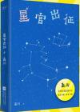

[星官出征](https://pewae.com/gaan/aHR0cHM6Ly9ib29rLmRvdWJhbi5jb20vc3ViamVjdC8zNjQzOTIxMA==)

原名：十五年前，妃子死了……作者：孟川出版社：江苏凤凰文艺出版社出版时间：2023

梗又破又浅。段子里可以半分钟之后就翻包袱，但小说里还是埋得深一些才好。推理小说的结局设成这样近乎骗子了。
人物设计的也不好。主人公的转变缺少契机，女主写着写着没戏份了。其余配角工具性过于明显。也就一个和尚还行。
这样的书敢卖49.8，现在的出版社真是该死啊！

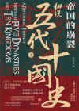

[帝国的崩裂：细说五代十国史](https://pewae.com/gaan/aHR0cHM6Ly9ib29rLmRvdWJhbi5jb20vc3ViamVjdC8zNTI3NjExNQ==)

作者：李奕定出版社：天地出版社出版时间：2020

不怎么细。对于主要人物没太多评述，只是照搬史书。语言也显得颇为老态龙钟，给“红包”特意打上引号的年代离当下已经颇为遥远了。可能五代十国本来就乱把，读起来感觉东一头西一头的。
五代真是个遍地草头王的吃人时代。
宋祖真的厉害吗？未必，可能天下人只是打累了打怕了吧。

[国家的常识](https://pewae.com/gaan/aHR0cHM6Ly9ib29rLmRvdWJhbi5jb20vc3ViamVjdC8yMjgwNjU4Mw==)

原名：Countries and Concepts: Politics,Geography,Culture作者：迈克尔·罗斯金译者：夏维勇 / 杨勇出版社：世界图书出版公司出版时间：2013

第一次接触比较政治学这种东东。可能是某种教科书，所以比较浅。
写了各个国家的问题：英国的区域自治问题，法国的教育问题，德国的东西德不平衡和移民问题……当读到英国工党因为放弃社会主义主张而赢得大选的时候，颇为吃惊。
尼日利亚作为非洲最大的经济体，竟然是这个熊样。再联系到百年前的黑奴贸易，更多的是国王和酋长们自己抓来卖给白人的，所以现在的非洲兄弟，不过是换了个头衔罢了。
对俄罗斯和前苏联的谴责不遗余力。似乎是把屎盆子扣在叶利钦身上。批评普京修宪的时候，列了个世界上主要国家领导人的任期表。

> 卡尔·马克思认为，在社会主义消灭了阶级差别以后，国家将“消亡”。德国的社会学家马克斯·韦伯持相反的观点，认为社会主义需要更多的国家权力和一个更加庞大的官僚机构。马克思错了；韦伯是对的。苏联的官僚机构成为一个怪物，大约有1800万认管理着苏联生活的每一个刚面。官僚化（bureaucratization）导致了苏联的解体。苏联公务员在工作上是迟缓的、勉强胜任的、没有弹性的、漠视效率的、腐败的，并对除了来自X的高级官员外的批评一概不顾。这种官僚机构部分源自于苏联建立之初。

读到的版本是把删掉的东大部分加了回来。不过作者显然对东大一无所知，前面所有的国家无论是发达国家还是发展中国家，都详细解释了他们的议会制度。却对东大的人民当家作主的制度自信只字未提。半吊子嘛！不过对于民族主义的警告倒是很有先见之明，十年弹指一挥间，言犹在耳。

[半身侦探](https://pewae.com/gaan/aHR0cHM6Ly9ib29rLmRvdWJhbi5jb20vc3ViamVjdC8yNzA5MTE2NA==)

作者：暗布烧出版社：中国工人出版社出版时间：2017

不是小看所有的女性推理作家，但这位的玛丽苏思维实在是伤害了作品。
警察被写得奇蠢无比，72万字的长篇，女主和她的助手没有一件案子是推理正确的。而且完全不讲究证据链和人物关系，没有任何询问和审问的技巧，就只沉迷于破解一个又一个的密室。
从头到尾啊，实在是太单调了。时不时的自我陶醉和与闺蜜的勾心斗角真是不合时宜。

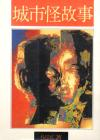

[城市怪故事](https://pewae.com/gaan/aHR0cHM6Ly9ib29rLmRvdWJhbi5jb20vc3ViamVjdC8yMzM3NDgw)

作者：倪匡出版社：皇冠出版时间：1994

轻松愉快的志怪故事。思想和表达是完全没有的。倪匡的绝大部分作品就是为了恰饭。
好就好在不讲逻辑的对于奇诡的追求。比较喜欢《猫》。

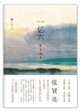

[一亿六](https://pewae.com/gaan/aHR0cHM6Ly9ib29rLmRvdWJhbi5jb20vc3ViamVjdC8xMTU4NzQwOA==)

作者：张贤亮出版社：北京十月文艺出版社出版时间：2012

在张贤亮这个传统作家眼里，这个故事够荒诞了。实际上并没有。
二百五这个人物比较失败。
结尾不好，但也没有写下去的必要了。

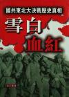

[雪白血红](https://pewae.com/gaan/aHR0cHM6Ly96aC53aWtpcGVkaWEub3JnL3poLWhhbnMvJUU5JTlCJUFBJUU3JTk5JUJEJUU4JUExJTgwJUU3JUJBJUEy)

作者：张正隆出版社：解放军出版社出版时间：1989

正确的集体记忆会告诉你：“当然，长时间围城，也给城市人民带来一些苦难。”
模糊的个体记忆会跟你说：“我的邻居XXX死了”、“1946年立功得的100万金圆券，在1948年的长春只能买3两高粱。”、“XXX追着空投粮食的飞机，被粮袋砸死了”。
“正确的集体记忆”并不是华大妈的发明，她只是说出了一个既定的事实。所以这本书甫一出版就被封禁实在太正常了，因为写了太多太多的个体记忆——写了林彪的指挥和林毛之间的争执与互相妥协，写了罗荣恒和稀泥的手腕，写了蒋介石的犹豫和强硬，写了蒋经国的虎头蛇尾，写了吴黄李邱的赫赫战功，写了双方抓壮丁，写了国军的派系斗争，写了共军抢攻和抢战利品，写了双方埋在战场上的民夫，写了被俘又被救回来后的里外不是人，写了双方对得不到也不能让对方得到的对工业基础的破坏，写了冬天强行渡河被冻得下半身瘫痪的女兵，写了深入敌后时要带的硬通货中包括烟土。
故此哪怕是在风气最开放的八十年代，也不行。
你只需要知道四平有个解放纪念塔就够了；如果你了解到塔的四面曾经有4个人的题字，也还凑合；但如果你去深究这4个人是谁，为什么把他们的字给铲掉了，对不起，你的问题太多了。
正确与真实，群体与个体，肉食者与底层。
这本书究竟好不好？那却决于读者身处于什么位置。而且典型的“报告文学”式写法，实在有太多夸张的成分了，每段读完都要先在脑子里挤挤水才行。

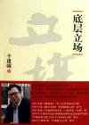

[底层立场](https://pewae.com/gaan/aHR0cHM6Ly9ib29rLmRvdWJhbi5jb20vc3ViamVjdC81NDA2NDU4)

作者：于建嵘出版社：上海三联书店出版时间：2011

内容还行，但是前半部分关于农村问题的重复内容太多太多了，裹脚布似的。要是没那么多内容你可以选择不出书。
于先生认为应该推广基层自治，成立基层组织。开玩笑，你看村民基层选举这事儿，这十几年来还提吗？

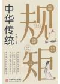

[中华传统规矩](https://pewae.com/gaan/aHR0cHM6Ly9ib29rLmRvdWJhbi5jb20vc3ViamVjdC8zNjY2MTIzMQ==)

原名：中华传统规矩：中国上下五千年古代家风家训礼仪文化常识书籍 中国式应酬酒桌文化礼仪人际交往为人处世的书籍作者：朝歌出版社：华龄出版社出版时间：2023

糟粕与废话齐飞。选取的内容非常不靠谱。第一章“家风家规”生搬硬套，就是在舔屁沟。再后面，也不分古今，不分地域，葫芦绞茄子弄在一起，一团糟。
总之非常不值。

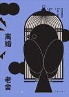

[离婚](https://pewae.com/gaan/aHR0cHM6Ly9ib29rLmRvdWJhbi5jb20vc3ViamVjdC8zNTA4MjY0MQ==)

作者：老舍出版社：作家出版社出版时间：2020

每个人都在卑微的活着。即使是一些轻微的改变，可能内心中已经经历了惊涛骇浪。谁也别笑话谁。

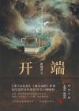

[开端](https://pewae.com/gaan/aHR0cHM6Ly9ib29rLmRvdWJhbi5jb20vc3ViamVjdC8zNTI4NjI5Nw==)

作者：祈祷君出版社：青岛出版社出版时间：2021

通过无限循环手法把一个简单的案件讲得生动有趣，值得夸奖。缺点就是主线故事太简单了。小人物的心理描写比较出色，主角没有开挂，这点很棒。
番外的快递员的故事很好。

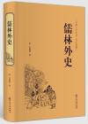

[儒林外史](https://pewae.com/gaan/aHR0cHM6Ly9ib29rLmRvdWJhbi5jb20vc3ViamVjdC8zMDU0MjcwMQ==)

作者：吴敬梓出版社：中国文联出版社出版时间：2016

花了好久，总算是磕磕绊绊读完了。这种人物串联起来的中短篇小说“凑”出来的长篇，有点儿像水浒传前面的鲁达武松林冲故事那种串联，但出场的人物实在太碎，后面蹦出一个人，往往要往回倒好几章才能找到人名。找到人名后也很无奈，往往就是参加了一个饭局，他就是下个故事的主角了。
作为课文的范进中举固然写得不错，但更令我动容的是，范进的老娘因为太高兴，“呛了一口痰”，嘎了，然后范进还没上任就在家里丁忧。可惜教科书篇幅有限，不然把这一段加上更有意义。
另一个课本里出现的严监生，被马铁丁先生当作吝啬鬼的代表，则有些冤枉。严监生是吝啬不假，但这不是他的主要性格，他的钱都用在给他大哥严贡生填坑，以及讨好两个舅哥身上。两个舅哥光拿钱不办事，不能保护严监生身后的孤儿寡妇，严贡生直接黑掉兄弟的家产，这才是作者想反应的读书人本色。
其余人物里，印象比较深刻的还有走向堕落的匡超人、李代桃僵的假牛布衣和散财童子杜少卿。尤其杜少卿是后半部的主角，作者似乎对他的豪爽仗义非常赞赏，在我看来就是手太松，正常发展这人早就该潦倒饿死了。
不知是是否是我的错觉，觉得本书的前半部分人物比较生动，后半部分有些流俗，什么遇到老虎和行军打仗的故事，有些放飞了。
全书的结尾非常突兀，倒数第二章甚至有点撂挑子的意味。最后一章根本没啥意思。唯一的优点就是，这部书有个结尾。
这种白话文小说，如果没有有趣的故事做支撑，读着读着就累了。这方面还需要加强锻炼。

---

下面是本年度补完的漫画。只为弥补少年时代的遗憾，不评价。有兴趣的单独讨论。加这项只是为了显着多……

[切子](https://pewae.com/gaan/aHR0cHM6Ly9ib29rLmRvdWJhbi5jb20vc3ViamVjdC8yNjM1NTQwMQ==)

作者：本田 真吾出版社：日本文芸社出版时间：2015全套册数：2

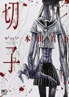

[变异体少女](https://pewae.com/gaan/aHR0cHM6Ly9ib29rLmRvdWJhbi5jb20vc2VyaWVzLzI4MDgz)

作者：冈本伦译者：ENTEI出版社：长鸿出版时间：2006-10 / 2008-10全套册数：12

[十七岁：女子高生监禁杀人](https://pewae.com/gaan/aHR0cHM6Ly9ib29rLmRvdWJhbi5jb20vc2VyaWVzLzE0MjQx)

作者：藤井诚二 / 镰田洋次译者：张益丰出版社：东立出版时间：2006-01 / 2006-12全套册数：4

[疯狂怪医芙兰](https://pewae.com/gaan/aHR0cHM6Ly9ib29rLmRvdWJhbi5jb20vc2VyaWVzLzgyNTE=)

原名：フランケン·ふらん作者：木木津克久译者：楊季叡出版社：台湾东贩出版时间：2009-08 / 2011-09全套册数：8

[疯狂假面](https://pewae.com/gaan/aHR0cHM6Ly9ib29rLmRvdWJhbi5jb20vc3ViamVjdC8zMTY2NzEw)

原名：瘋狂假面作者：安藤庆周译者：付国忠出版社：東立出版时间：1995-06 / 1996-06全套册数：6

[死神](https://pewae.com/gaan/aHR0cHM6Ly9ib29rLmRvdWJhbi5jb20vc2VyaWVzLzQ4NTc=)

作者：久保带人译者：张益丰出版社：东立出版时间：2002-06 / 2016-02全套册数：78

