为了庆祝臭宝中考渡劫，6月24~27日我们全家开始了一趟4天3夜的重庆之旅。重庆是臭宝唯一的目标。所以虽然老婆大人已经三进山城，却也仍旧不得不再来一次。我？我的意见重要么？呵呵。

## DAY1 我要从白走到黑

航班早到了半小时。老婆大人在十八梯附近定的民宿，我们也没拎什么重行李，所以搭地铁9号线换2号线前往住处。
虽然已经来过两次，但老婆大人还是谨慎地让我开了步行导航。导航给的是从11号口出地铁站。出站就是著名的十八梯，高德温馨提示：“向右前方出发，30米后左转，进入凤凰台阶。”
What？不愧是著名景点啊，还给楼梯起名字了？是不是还有麒麟台阶、金乌台阶啊？但是走台阶我这膝盖可不行。赶紧撺掇老婆再跟民宿确认一下路线。果然，民宿给出的是从5号口出地铁站。便杀回了地铁站，从另一侧出来之后，高德再次温馨提示：“向右前方出发，xxx，上天桥，150米后左转，进入凤凰台阶。”
我艹，我还躲不开你个破台阶了是吧？那边下楼梯，这边上楼梯，你把楼盖在半山腰？解锁一看地图，哦，人家民宿所在的这条街叫凤凰台/街。
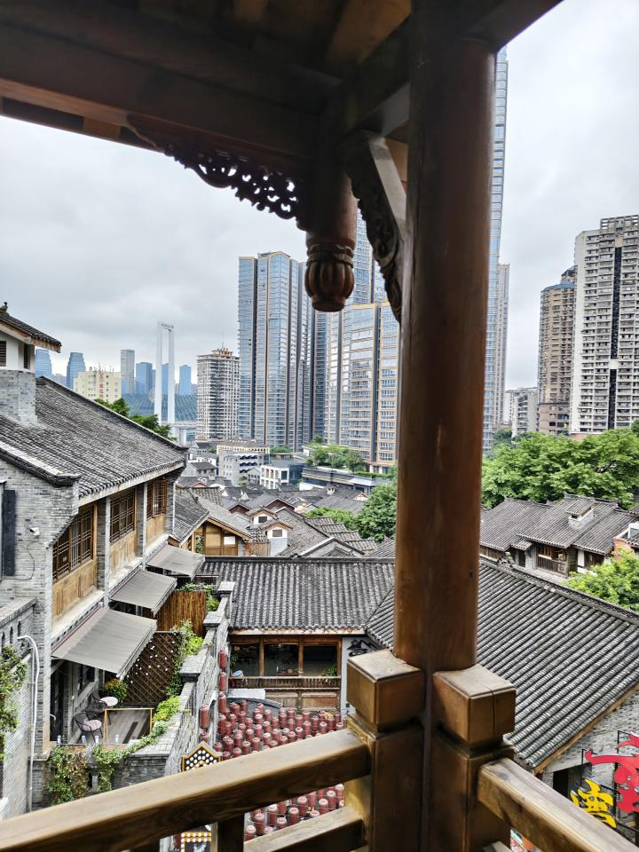

放下行李臭宝就吵吵饿了。这回真的穿过了十八梯，又经过了一条美食街和解放碑，来到一家老婆大人慕名已久的火锅店。真不愧是大城市啊，一个普通的工作日的下午，解放碑周边也还是乌泱乌泱的。连个霸王茶姬门口都那么多人排队！
这家火锅店的对面就是“重庆大轰炸惨案遗址”，完全没有去参观的意思。到了地方就得吃点特色的东西，点了不常见的干黄瓜、发鱿鱼和肠头。干黄瓜火候不好掌握，要么太软要么太硬，没工夫伺候它。肠头非常非常好吃！水发鱿鱼也意外的好吃。
火锅店的装修很简陋。墙上写有重庆油碟的配料和地道重庆油碟的配料，主要是差在折耳根上。然而店家调料区当天并没有折耳根，让勇于尝试的臭宝颇为扫兴。
开了两瓶本地的“乐堡”啤酒，失望。
这家店遇到了3位独自吃火锅的客人，非常意外。
后文就不写“慕名已久”这个词了，如果不做特殊说明，所有午餐和晚餐都是她慕名已久的网红店。
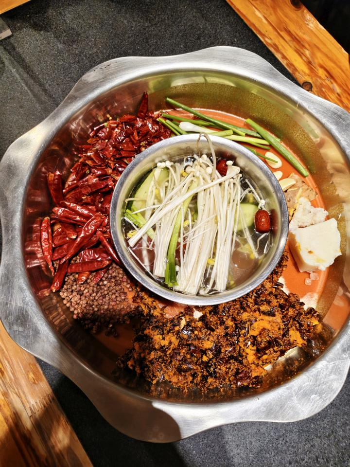

酒足饭饱继续出发，目标魁星楼。我和臭宝上去各瞅了一眼，都没觉得有传说中那么神奇。拍照感叹的时间还不如我开着导航在医院里找厕所的时间长。
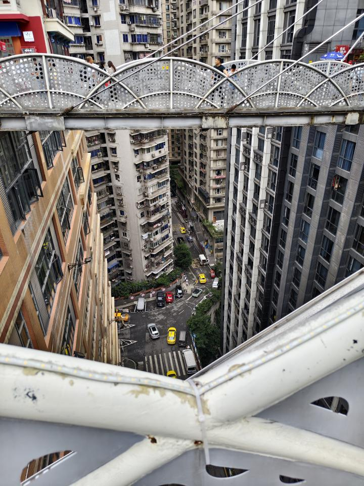

接下来老婆大人安排的是戴家巷，离得不算太远，但臭宝此时坚决不走了。打车。
老婆大人在戴家巷是有夙愿的，一家前两次没找到的炸土豆。
风景挺好，但也就那样。重庆的老街总给人一种潮乎乎黑了吧唧要发霉长毛了的感觉，虽然并没有霉。
戴家巷沿江的步道并没有多长，眼瞅着要到洪崖洞了，又不得不折回来，随便找了家店喝水。
坐到饭点，去吃江湖菜。路上老婆终于找到了那家网红土豆，4块钱，等了15分钟，第3次寻找，吃两口扔了。
去的是“樊氏江湖菜”。非常好吃！麻辣鱼、辣子鸡和黄喉都很好吃。我上次吃这么好吃的辣子鸡还是20年前在北京的川办。
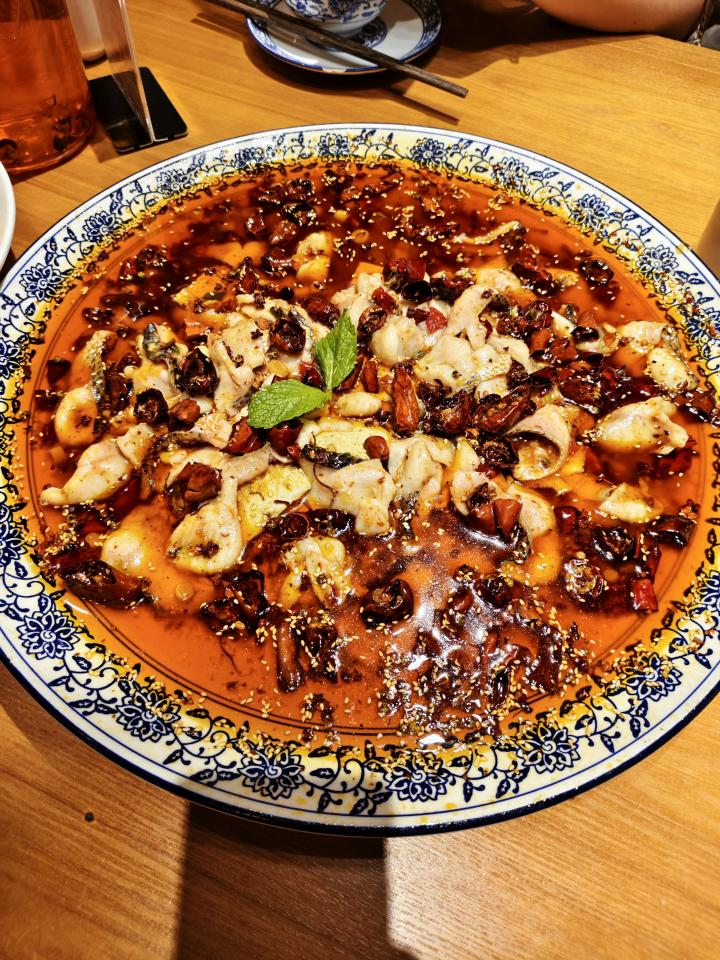

然后当然就是洪崖洞了。老婆大人之前分别拍过了洪崖洞的正面和江对面的远景，所以这次当然要上千厮门大桥。
上桥的时候大概7点，已经是人山人海。臭宝说了句非常有道理的话：“亮灯有什么好看的，你没看过亮灯啊！再说你都看过两次了！”然后她就在路边背对着洪崖洞方向直接坐下，开始玩手机。
我本来也想走，但看着老婆大人向往的神情又不忍心。劝说臭宝等到8点，付出的代价是这期间她的流量都要走我的热点。
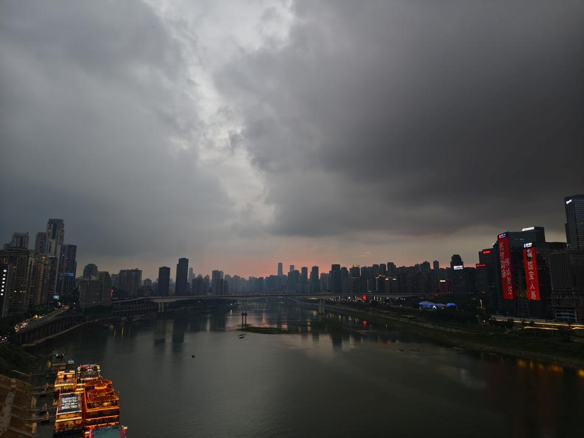

灯亮之后人群就开始散了。人实在太多，根本打不到车，步行回住处。刚好经过了白天路过的筷子楼、解放碑。
臭宝满脸疑惑：“为什么要叫‘垂万’大楼？难到是Three-One，三合一的意思？”
娘俩在小吃街大肆采购了一批宵夜。再次路过霸王茶姬，哦，原来排队是因为这家店周三半价！
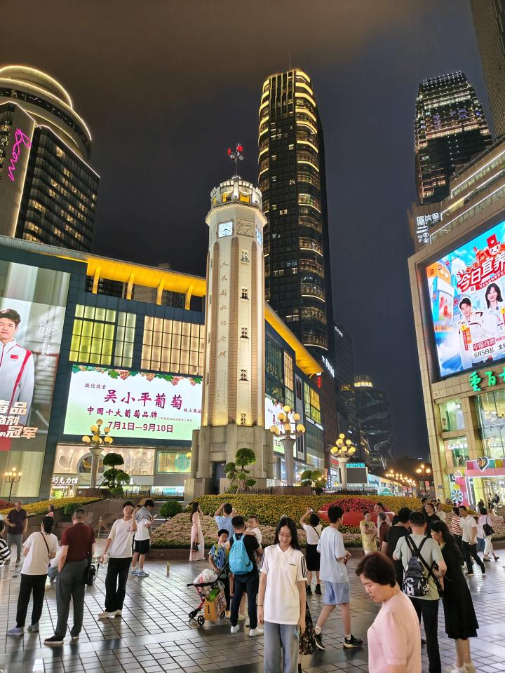

## DAY2 人间奇观

我们要去看一幢平平无奇的写字楼。它的高度在重庆根本不上数，我们住的民宿都比它高。楼里面也没有什么名吃名店，甚至跟很多格子监狱一样，外人是无法上到2楼以上区域的。
但是就这么个破楼，在任何一个重庆的文创店都不可或缺，明信片冰箱贴打卡本一样都不能少。
每个人的心中都有个耶路撒冷，每个楼姐的心中都有个长江国际。对于臭宝来说，长江国际18楼[[1]](https://pewae.com/2025/07/2025-summer-chongqing-travels.html#inner_anchor_1)就等于哭墙。

这处风景名胜的名字叫：“送弟弟上班。”
门口站的女孩子都是像我姑娘一样，考完试的初三高三的应届生，来看TF家族四代练习生真人的。这些练习生大多生于2011年~2012年，是名副其实的弟弟。扫地阿姨说，为了抢位置，最早的早上6点她上班以前就站那儿了。9点半以后这些小孩会陆续来上班。女孩们就会一个一个地记哪个来了，哪个没来。一直到十几个人都进楼上班了，才会散。
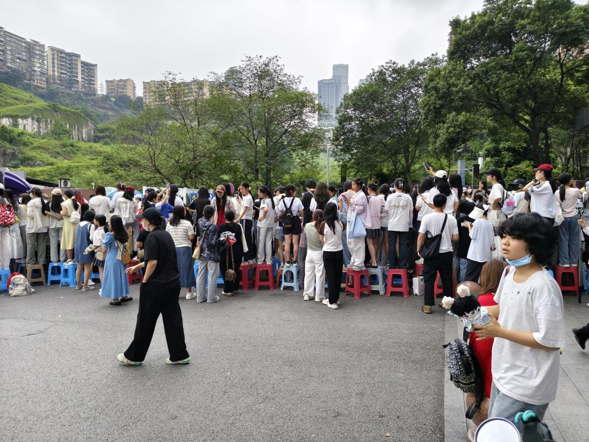
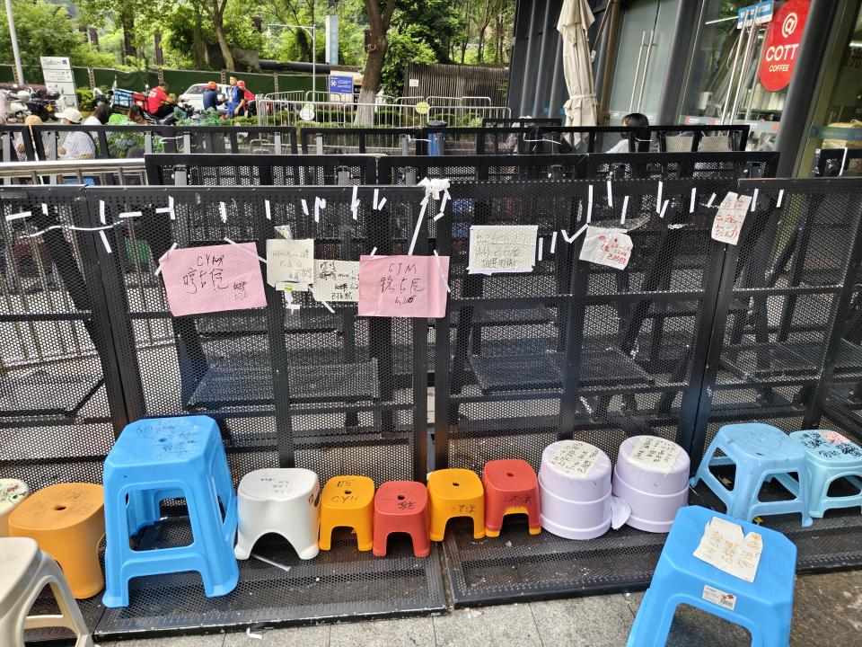

言语无法形容我见到此情景的震撼。此前我一直觉得电视上的夹道欢迎都是演的。直接上视频吧，视频源分别来自我们一家三口的手机，里面拍的也确实不止一个练习生。

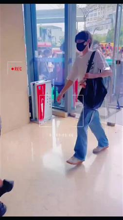

此情此景我想起一位叫杨丽娟的初代网红，她出名可是献祭了自己的老父亲啊！

人山人海，翻山越岭啊，臭宝好不容易挤进楼里，去罗森打了个卡。我真想把昨天她给她妈的话都反弹给她：“没见过罗森啊，咱家小区罗森你一天去三回！”
臭宝在这里非常开心，自拍打卡，还交了不少新朋友。
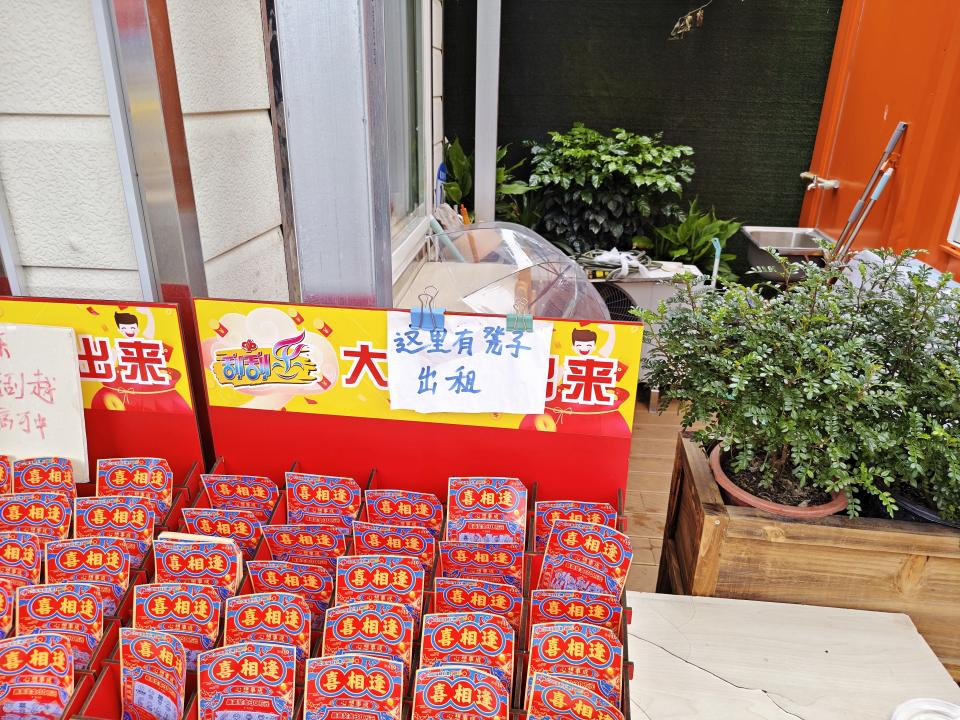

下一站是个地铁站旁边的网红电梯。这时已经接近中午，云开雾散，气温急剧上升。臭宝表示，接下来的行程必须打车，再坐地铁就翻脸。
（电梯有什么好拍的，你们娘俩没见过……）
还顺路去了个小篮球场，因为臭宝喜欢的某个偶像曾经在物料中出现在这个篮球场上。
臭宝坐在一个石凳子上，老婆给拍照。忽然旁边跑过来另一个小姑娘，指点臭宝：“XXX在物料里坐的不是这个凳子，是旁边那个。”
随后两个人开心地交换了微信名片。

中午饭去万达吃的。老婆心心念念的一家蛋糕店，拿破仑加咖啡。
（你是没吃过拿破仑啊！更何况还是家连锁店……）

下午打车去下浩里。抬头一看是台阶，终究还是躲不过啊。入口的地方斗大的白漆写的“这很重庆”，映衬得楼梯上写的“下浩里”也“这很白目”。
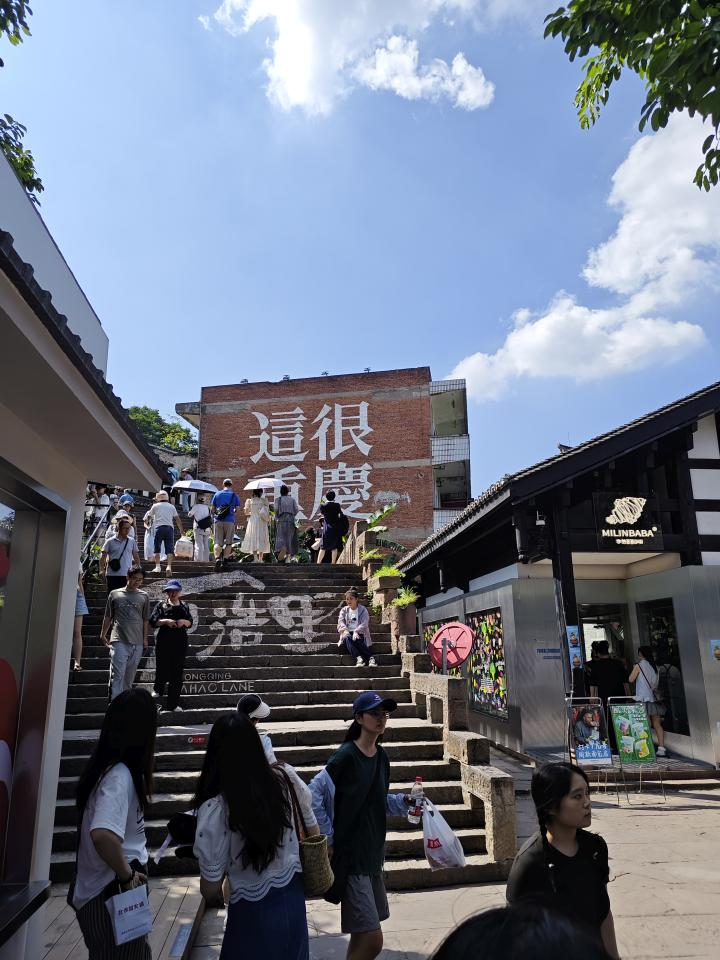
臭宝的目的性很强，要追着偶像去一个茶楼，吃同款的小点心。
此时的导航就像热坏掉了一样，根本无法正确指示出那些仅容一人通过的小楼梯。主要可能是高度定位不准。还是通过一层一层扫荡的方式找到了那家茶楼。点心很贵、茶也很贵，离谱的是这么贵的茶，冷萃的还卖空了，只剩热茶。
点心看着好看，实则非常难吃。既然买了坐，就不能浪费。在茶楼坐了3个多小时，看江景，吹空调。
这里景色非常不错，在太阳的帮助下，我终于第一次在重庆辩清了方向。此处的长江居然是朝北流的！大江北去，听着就带劲啊。
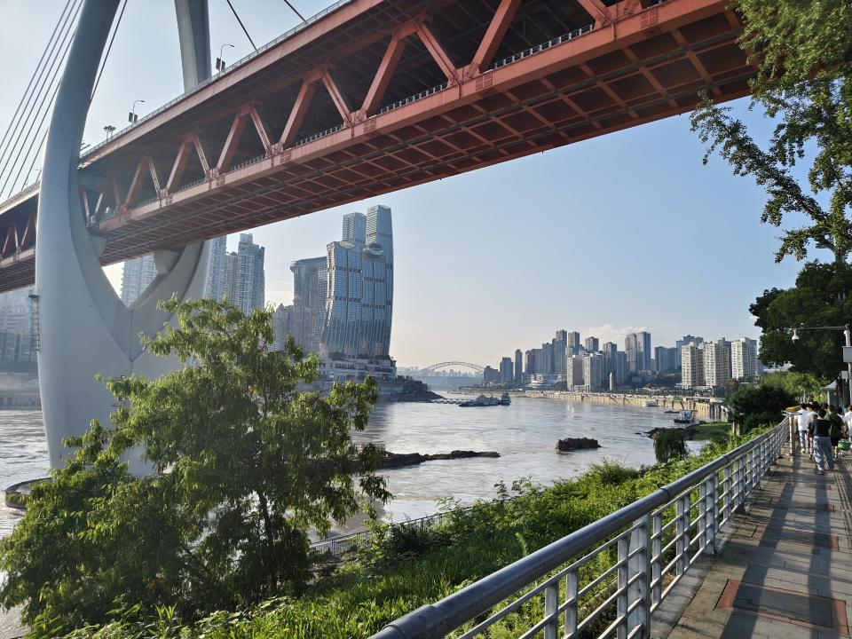

晚饭回到了后堡。一个普通的地摊，尝试了一下正宗的烤苕皮和一些七七八八的东西。这是个生活气息很浓的地方，旁边是普通的市场。我在市场上买了之前很少见的烤兔肉和猪小肚。不难吃，但也没多么好吃。
问烧烤摊老板：“你们本地人平常喝什么啤酒啊？”“山城。”
也一般。
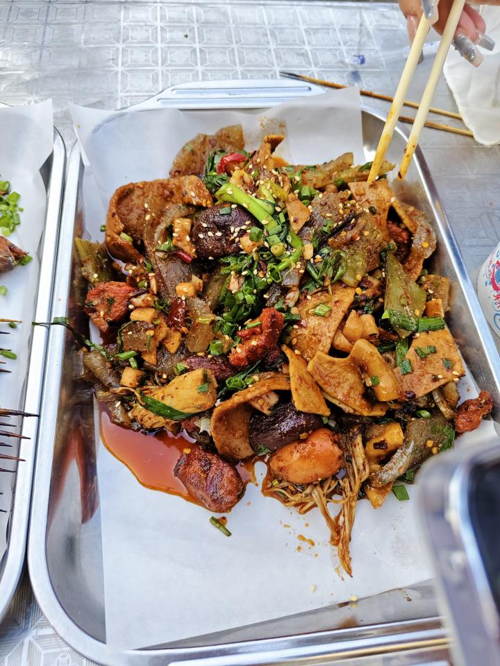

太阳落山后，穿过地铁站，我们又回到了长江国际的楼下。
臭宝上午打卡的是长江国际，晚上要打卡的是长江国际的夜景。这很合理。
随即解锁了新知识：“接弟弟下班。”
晚上的阵仗比甚至上午还大，因为上午能来的只有初三高三，而这是晚上，初一初二高一高二可都放学了，说不定还有小学的。而且接下班可以说比送上班更辛苦。因为上班是有准确时间的，而练习生下班说不准是11点、12点还是下半夜。
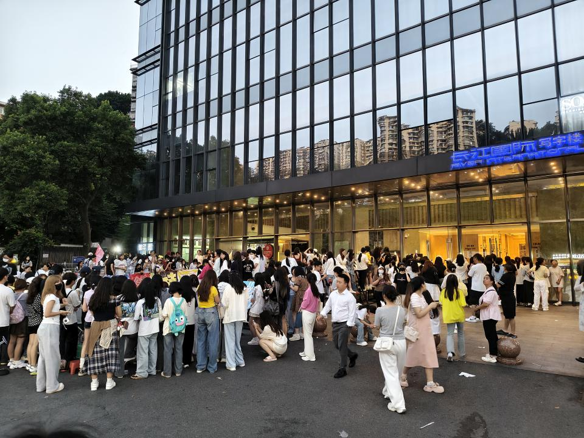

臭宝并不迷恋楼里的4代，打完卡随手在路边小摊买了些串串。这次终于跟老板娘要到了一小口折耳根，舌尖一舔吐了。
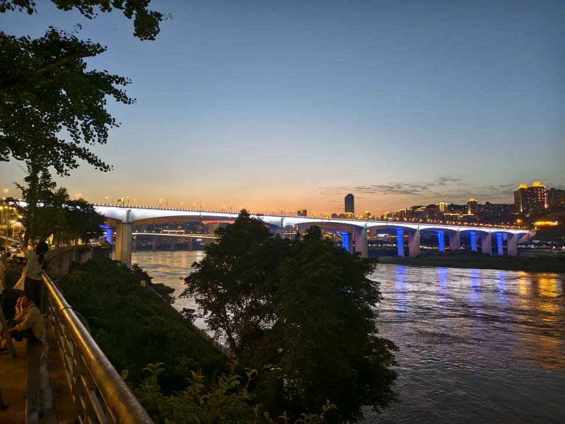
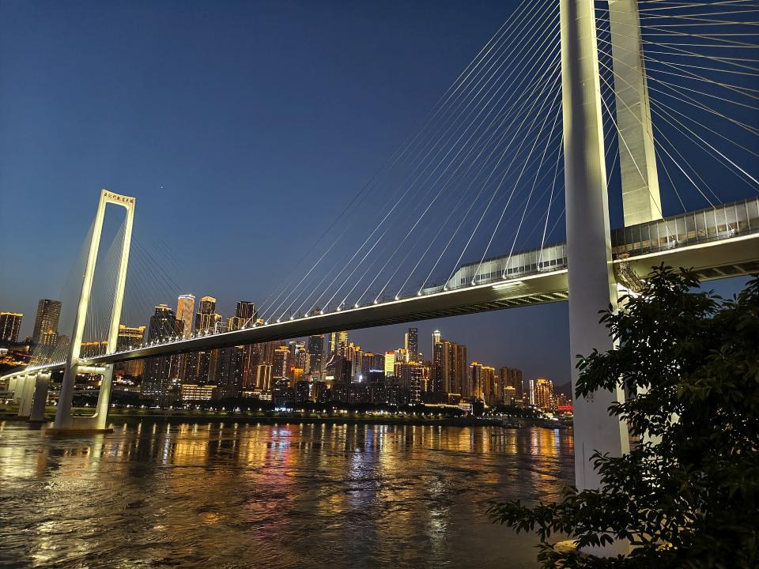

回程没有直接回住处，而是夜游了一趟山城步道。很失望，原来重庆并不是所有的景点都营业到很晚，山城步道上除了几个酒吧还在营业，基本都打烊了。
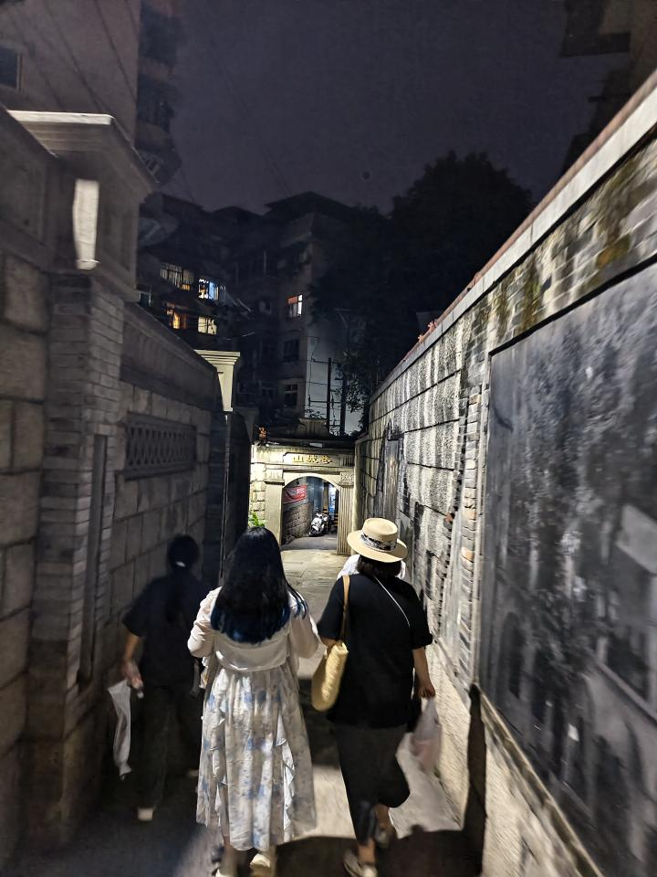

## DAY3 红白油漆不要钱咩

上午先去鹅岭二厂。
路过了甲A年代的老朋友，大田湾体育场。原来大田湾不是个湾，而是半山腰。

这二厂啥也妹有啊。还没有以前我爹工作的工厂大呢。而且在我爹厂里还能玩翻斗车搅拌机，这所谓的工厂连个印刷机模型都没有算个什么工厂。
二厂边上有个居民楼，小斜坡上用红白油漆写着我在重庆也不是我爱重庆的，就这还要排队打卡！？
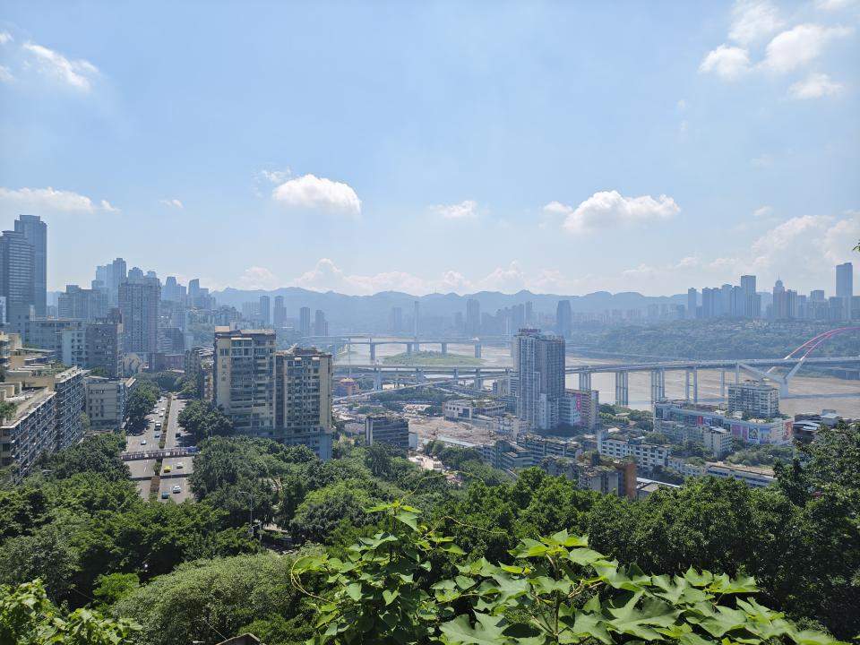
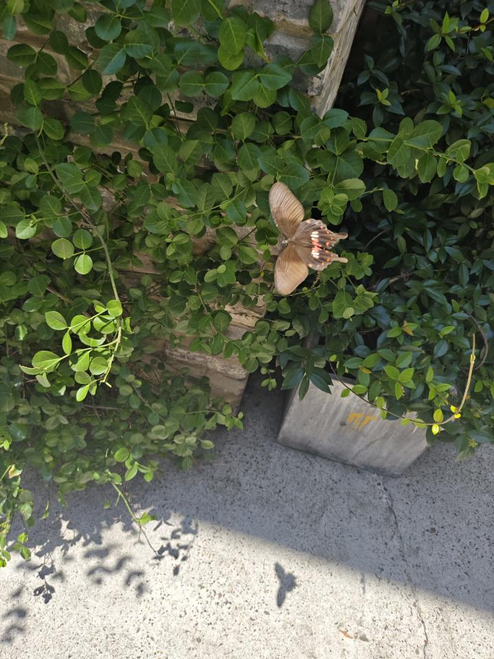

我们高中的化学老师对于旅游曾经有过精辟的评论：“旅游就是别人在那竖块石头，刻个东西，或者刻几个字，或者装个老乌龟，然后一帮彪呼呼的外地人就跑去照相。”
重庆这里都不需要刻字啊，就弄两桶油漆写四个宋体字就完事了，成本简直低到令人发指。

本来老婆大人的计划是从二厂下山步行去李子坝吃轻轨。臭宝一停要步行立刻就给否决了。叫车奔观音桥。
重庆渝中的路非常窄，设置了很多单行道，跟大连一样没有非机动车道，以至于经常能看到小电驴在马路中间乱窜。而重庆的司机也非常有素质，喇叭嗷嗷按。观音桥这种明显后开发的地方，道路好不少。

观音桥吃了家破锅烂蹄花。虽然也是连锁店，但好吃。我喝了一肚子猪蹄汤。
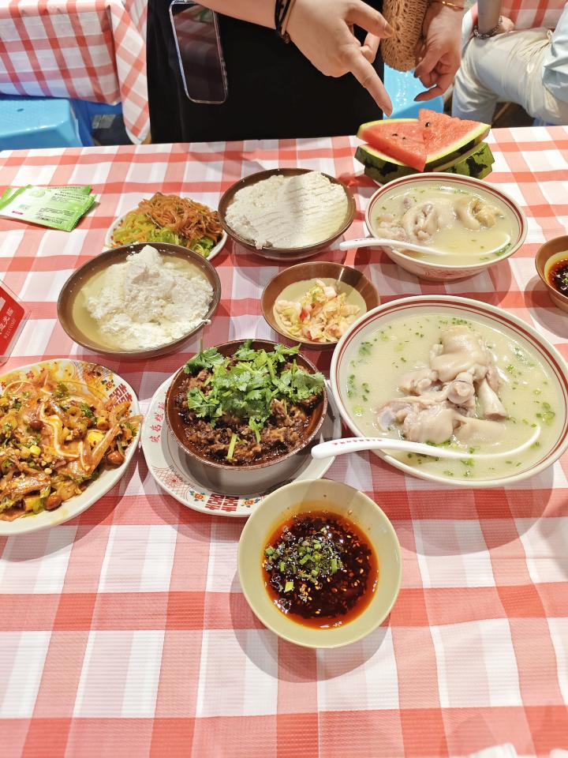

大下午顶着大太阳打车1.9公里，到了观音桥。虽然下出租到进商场只走了几步路，但还是找了家奶茶店缓了半天。
然后老婆提出带臭宝去观音桥的打卡地拍照。到了地方一看，不过是把二厂的红白油漆升级成了电子屏，还是要拍我在重庆那几个破字。
臭宝坚决不干，扭头回商场，又找了家咖啡店，继续吹空调。

7点多出商场，啊，全是人！
本来说去小吃街逛吃逛吃就不吃晚饭了，但还是忍不住进了家店，又来了一顿火锅。这家没有很多新奇的东西，但牛肉和毛肚都很棒。

## DAY4 黄色法拉利拉了个大的

最后一天，起床后我跟老婆下楼去给同事买伴手礼，臭宝留在民宿吹空调。
我俩先随机去了路边一家小店，吃了当地特色早餐“油茶”。个人觉得这玩意儿非常好吃，建议外地引进。
是的，整个行程我对重庆的饮食特别满意，因为我虽然不是顶级的吃辣选手，但我非常非常喜欢吃花椒。
但是重庆的很多小店的装修风格太粗犷了，大部分都是墙上用红白油漆写几个字几句俏皮话，墙连刷都不刷，普通的水泥地，放两条板凳完事。不是一两家，不是三四家，而是普遍现象。一星半点叫个性，遍地都是叫审丑疲劳。
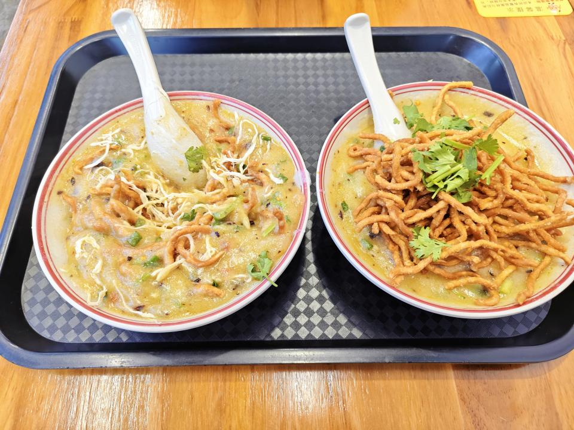

我们俩把东西买回酒店后，臭宝开始着急，忽然提出她也要给小伙伴买礼物。
好在最后一站磁器口，别的没有，买礼品的遍地都是。

去磁器口的路上车览了轻轨穿楼。

臭宝偶像在磁器口的大门牌子处出现过，所以本来她只要在门口拍一张，就收工了。
其余的时间都在给小伙伴挑礼物。逛了2个多小时，最终选的是长江国际的明信片。
（你前天倒是在长江国际的楼下买啊？！）
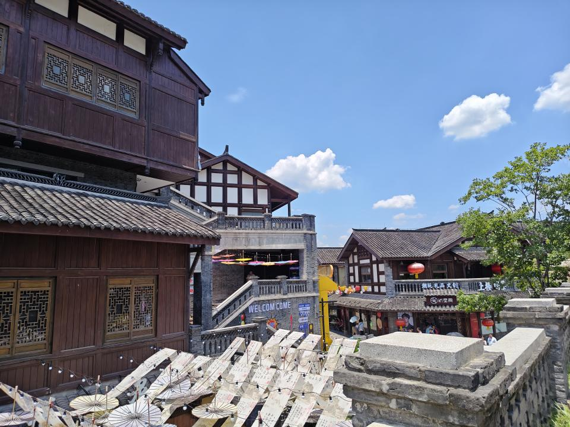

最后一顿饭，臭宝仍旧坚持要吃火锅。
在磁器口对面就地选了一家，匆匆吃几口，打车奔赴机场。
16：00的飞机，上车时间13：40。
司机小哥很健谈，聊的很愉快。他热情地建议我们下次再来重庆去周边转一转，比如武隆。
着急嘛，我一路都开着地图瞅着路线。离江北机场还有20公里的地方，司机小哥忽然脸色一变，给什么大哥打电话：“X哥啊，我的电只有32%了，现在在XXXX地方，你说能开到机场不？”
挂了电话，他默不作声地把空调关了。
我们忍了大约5分钟，他先开口了：“实在不好意思，忘记充电了，我现在必须下道了，给你们送到一个能继续打车的地方。”
此时是14：10。
下道后不久，真的没电了。当时打表是45。他说大哥实在不好意思，你给35就行。
tmd我要不是着急，一分钱都不会给。不过懒得跟他多说，赶紧结账下车。刚好后面有辆空车，接上了。
屁股坐稳我就开始后悔，看地图，下道再上道的过程明显也不止10块钱啊。

好在14：40的时候还是顺利进了机场大门。
只不过6月28号是充电宝新政第一天，我们一家三口的3个充电宝被收了俩。其中一个还是公司发的2023年春节纪念品。
收就收吧，大连大雾，早一天晚一天飞机都落不下来。
从35℃回到25℃，回家真好。
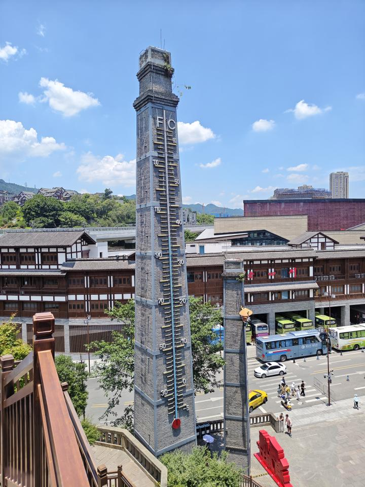

---

- [(1)](https://pewae.com/2025/07/2025-summer-chongqing-travels.html#inner_ref_1)：长江国际18楼是娱乐公司“时代峰峻”的艺人培训机构，尚未出道的练习生通常情况会比他们的粉丝年纪小，因此这些追星者也自称“楼姐”。时代峰峻的第一批产品是TFBOYS，二代是时代少年团(TNT），三代是登陆少年团（TOP），还在楼里练习的四代尚未出道。