本年度读书36本，比去年少了17本，倒是跟前年持平。
读的少主要还是时间原因。上半年臭宝冲刺中考，周末的补课不由我来陪，而是改成她妈直接开车接送，美其名曰节省时间。下半年臭宝高中入学后，作息时间大幅度调整，而且每天晚上要拿出近一个小时时间散步。阅读时间就这样大幅度缩水了。
另一个是选书的原因。电子书在《古船》身上卡壳了，啃不动。这事说来挺奇怪的 —— 实体书日拱一卒，哪怕是几十页十几页，都能感受到进度带来的正向激励；而电子书往往陷入点开–切走的死循环。
《世说新语》直接读古文，有大量生词和人名要查，进度也慢。
以及《白鹿原》，读完一遍觉得劲头太大，翻回去趁热又来了一遍。

实体书15部，没达成20本的预期，倒也还好，毕竟有《两晋悲歌》这样一本顶好几本的大部头存在。

今年读过最好的作品是《世说新语》。主要胜在文体。精炼的古文小段子，准确，少废话，稍有余味，堪称三上极品。
另外《金锁记》、《白鹿原》、《妻妾成群》也很好。也都是声名赫赫的名家名作，也没必要过多褒扬。
今年读过最差的书是《大连南部海域底栖生物图谱》。本来满心欢喜地买来打算去市场指点江山一番。没想到图片又小又模糊，还全都是泡在福尔马林里的，完全不符合对于“图谱”二字的心理预期。文字部分也千篇一律，分部习性什么的写了还不如不写，完全对不起198元的售价！
另外一本《居家风水大全》的凑单实体书，是一坨缝合怪，同样买了后悔。
一本名为《罪案现场：你所不知道的刑侦》的电子书也挺差的，干巴巴的缺少新鲜感。按分类搜电子书容易踩坑。
今年的最后一本《这个世界，没那么简单》也是非常的恶心，打着高维思维的旗号胡扯洗脑。如果把生拉硬扯叫做高维思维的话，那我宁可一路低级到底。

《翦商》、《古船》、《食南之徒》、《江湖异闻录》、《长尾理论》、《海边的卡夫卡》、《少数派的感受》、《喧哗的大多数》、《猫城记》、《狂飙》、《五号屠场》、《游戏的人》均未达到预期。这种蔓延的失望情绪某种程度也影响了读书的动力。
《伤风败俗文化史》是唯一超出预期的书。作者花样作死的精神令人钦佩。

今年读的最长的作品是渤海小吏的《两晋悲歌》，感觉写的有点虎头蛇尾，西晋贾南风八王之乱还好，但到了东晋之后就失去了节奏。不知是水平问题还是东晋十六国本身就乱导致的。有机会再观察他一次吧。
今年读的最短的作品是《喧哗的大多数》。书中的内容完全不像封面那么透彻具体，有用，不多。

明年的目标仍旧是实体最低20本、最高40本。并且要攻克茅、曹！谨记！

---

下面是书目和个人简评：

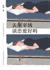

[去屠宰场谈恋爱好吗](https://pewae.com/gaan/aHR0cHM6Ly9ib29rLmRvdWJhbi5jb20vc3ViamVjdC8zNDg0MTQxMQ==)

作者：李小婧出版社：四川文艺出版社出版时间：2019

女作者，小确丧风格，文风比较对胃口。
环境和氛围感很棒，情节也不错，只是人物读多了略有雷同。
喜欢中间的两篇《没有星星的岛屿》和《送你一颗陨石》。作者以女性的角度对女性消费主义进行了批判，当然男性也一样。
最不喜欢的反倒是同名篇目《去屠宰场谈恋爱好吗》，有些跳脱。

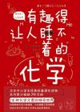

[有趣得让人睡不着的化学](https://pewae.com/gaan/aHR0cHM6Ly9ib29rLmRvdWJhbi5jb20vc3ViamVjdC8zNDk5NDE1OA==)

作者：左卷健男译者：郝彤彤出版社：北京时代华文书局出版时间：2020

非常普通的科普读物，把不熟悉的元素符号过一遍，也算有收获。
优点是对初高中化学接触范围外的元素有个概要的了解，像稀土啊，镧系之类。再有是每个元素名都写出了来历，纪念科学家或是发明地或是元素特性或是神话传说，确实挺有意思。
缺点是过于日本化了。比如焰色反应的那套口诀，变成中文后一点儿谐音都没有，想必翻译也很尴尬吧。
从101号开始的人工合成元素，介绍只有一行：XX是人工合成的元素。唯一的例外是113号“鿭”，详细介绍了发现的过程和认证的艰辛，嗯，这玩意儿是日本人搞出来的，谁说外国不重视爱国主义教育、不夹带私货的？
总之不值49块8。

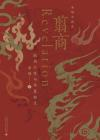

[翦商](https://pewae.com/gaan/aHR0cHM6Ly9ib29rLmRvdWJhbi5jb20vc3ViamVjdC8zNjA5NjMwNA==)

作者：李硕出版社：广西师范大学出版社出版时间：2022

作者基本上写了两件事：商朝血腥的人殉和人祭风俗，和周朝的创立者与这种风俗的斗争。
说故事和脑补的本事不错，这书平易近人。但是推理的过程瑕疵有点多。
说个最大的问题。周文王被囚禁在朝歌的时候，作者推测他的四个比较大的儿子：伯邑考、发、鲜、旦，都在他身边。由此推出三个弟弟不仅目睹了伯邑考被做成肉酱，甚至可能被迫也一起吃了兄长的肉。进一步地，推导出姬发因此而做噩梦，周公吐哺是因为觉得肉恶心。更进一步地，再次推导姬发因此迷信延续商朝的人祭制度，而周公下决心要彻底把这一习俗从历史上抹去。作者在进行第一个推测的时候没用任何依据，第二次推测的时候就把姬发和姬旦就在朝歌当成了事实，导出二人就在剁肉馅现场，导出二人吃了肉，再导出后面的系列不良反应。这个推导若不成立，本书后面大半关于姬发和姬旦的行为分析就根本无从谈起。
针尖上盖了座大秋裤。基础太薄弱了。
还有同样的臆想，让人觉得作者就不像是位严谨的学者：作者说武王的王后邑姜的邑，就是伯邑考的邑，因此武王从大哥那里继承了老婆和老丈人。可是，主流的观点，【伯】【邑】【考】这三个字都是敬称，“伯”是老大，“邑”是国，“考”是先人，伯邑考是个名字不详的人。如果这样人家王后的前缀加个“国”，这有什么问题？当然也有看法，说“邑”是私名。您要采取这种观点，可以，但需要论证，而不是简简单单的“伯和考都是敬称，所以周昌的长子名字是周邑。”
本书的优点也很明显。对我来说，作者对于周易爻辞的新解令我眼前大亮，抓俘虏、砍人、填坑什么的，可比孔老二的解释有趣得多了。
总之不当正史看是相当有趣的书。

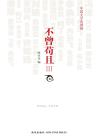

[不曾苟且3](https://pewae.com/gaan/aHR0cHM6Ly9ib29rLmRvdWJhbi5jb20vc3ViamVjdC8yMDQzNTI1Nw==)

作者：冉云飞 / 冯唐 / 宋石男 / 张晓舟 / 李承鹏 / 李海鹏 / 柴静 / 老愚 / 阿丁 / 阿乙出版社：新星出版社出版时间：2012

选取的标准更迷了。
相对来讲柴静和刀尔登更舒服一些。
不喜冯唐。
饕餮那两篇太造作了，拉低了全书的水准。

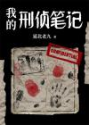

[我的刑侦笔记](https://pewae.com/gaan/aHR0cHM6Ly9mYW5xaWVub3ZlbC5jb20vcGFnZS83MjM3MzE5OTAxMjQ3OTY2MjYw)

作者：延北老九出版社：博集新媒出版时间：2023

普通。
主角性格不鲜明，倒是搭档和老婆轮廓清晰。
案件的复杂程度也不咋高。

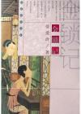

[金锁记](https://pewae.com/gaan/aHR0cHM6Ly9ib29rLmRvdWJhbi5jb20vc3ViamVjdC8zMDE3ODU3)

作者：张爱玲出版社：哈尔滨出版社出版时间：2005

鲁迅提出一口抽象的酱缸，张爱玲夹出一块具体的酱菜。
所谓传统，就是这样一辈一辈一层一层压将下来，直到人们喘不过气。曹七巧并不讨喜，却很真实。人啊，活着活着就死了。
张爱玲的十年转场只用了百字，非常惊艳！

> 风从窗子里进来，对面挂着的回文雕漆长镜被吹得摇摇晃晃，嗑托嗑托敲着墙。七巧双手按住了镜子。镜子里反映着翠竹帘子和一副金绿山水屏条依旧在风中来回荡漾着，望久了，便有一种晕船的感觉。再定睛看时，翠竹帘子已经褪了色，金绿山水换了一张她丈夫的遗像，镜子里的人也老了十年。

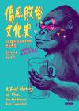

[伤风败俗文化史](https://pewae.com/gaan/aHR0cHM6Ly9ib29rLmRvdWJhbi5jb20vc3ViamVjdC8yODk0OTY3Ng==)

原名：A Brief History of Vice - How Bad Behavior Built Civilization作者：罗伯特·埃文斯译者：郑焕升出版社：時報出版出版时间：2018

有趣的书。探究XXX是怎么来的，古人是怎么用的。
作者对于音乐、个人崇拜、性爱这些东西的研究，并未有什么爆点。但进入抽烟喝酒，尤其是药物和致幻剂的部分之后，异军突起，深入浅出生动有趣。最棒的部分就是作者依照古法做的那些复古嗑药实验，以第一人称视角描述了什么是high。对，翻译的也好。
我这可怕的好奇心啊，读完本书竟然产生了去云南吃蘑菇的冲动。
资源是宝岛出版的繁体版。果然繁体这件事是完全不影响阅读体验的，竖版才是。期间还能因为两岸的学术名词不同而学到了一些奇怪而无用的知识。
比如，【醯】字。书中出现的地方是“麥角酸二乙醯胺”[[1]](https://pewae.com/2025/12/2025-reading-record.html#inner_anchor_1)，乍一看都不知道这个字是不是繁体字、对应的简体字是啥。查过之后方知，化学领域【醯】就是【酰】的旧称，大陆改了，台湾没改。顺手又复习了一下什么是【酰】。既学语文又学化学，还增长历史知识，读书真好。

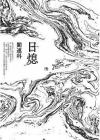

[日熄](https://pewae.com/gaan/aHR0cHM6Ly9ib29rLmRvdWJhbi5jb20vc3ViamVjdC8yNjY5MDQ1OA==)

作者：阎连科出版社：麦田出版时间：2015

老阎笔下的梦，是欲望放大器。梦里的人有另一副面孔。梦里想干啥干啥，梦里啥都有。
结合创作年代，这样的题材不啻于贴脸开大，钩直饵咸，纯找罐子拔。
阎连科的写法比较少弯弯绕绕，过瘾但不够巧妙，所以稍显后劲不足。最后的高潮部分想体现出天下大乱，但场景跟开始雷同度比较高，所以没达到那个兴奋点。另外整体故事也有点像脱胎于《人类清除计划》。
书中的第三人称的阎连科，过于给自己脸上贴金了。
舅舅的形象塑造得很生动。
结局太平庸。

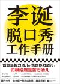

[李诞脱口秀工作手册](https://pewae.com/gaan/aHR0cHM6Ly9ib29rLmRvdWJhbi5jb20vc3ViamVjdC8zNTU1MjY1NQ==)

作者：李诞出版社：江苏凤凰文艺出版社出版时间：2021

李诞强调这是他所认为的脱口秀的样子，所以坚持要在书名的开头加上“李诞”二字。确实这是李诞的个人理解。他强调这是一份工作，强调普适性而不是独特性，强调要坚持，要像生产线一样模式化地制造然后去芜存菁。
完成比完美更重要。张博洋赵晓卉可能就是他眼里那种每年只能产出20分钟的段子手，在蛋总眼里，不能称之为职业脱口秀演员的那种人。可见根本就没有黑幕，而是从一开始理念就不合。
很多人怀念的狂野的脱口秀大会前二季，在蛋总眼里是摸索阶段的失败产物，而被诟病的脱三才是他眼中真正的节目。
他是一个脱口秀工作者，为大家带来快乐是附带的。
这本书比他的小说要真诚的多，前半部分的内容紧实凝练富有活力。但是后半部分的问答却是对前面观点的凑字数的补充，反刍一般，意义真不大。

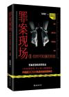

[罪案现场：你所不知道的刑侦](https://pewae.com/gaan/aHR0cHM6Ly9ib29rLmRvdWJhbi5jb20vc3ViamVjdC8yNjgwODE2NA==)

作者：徐龙震出版社：南海出版公司出版时间：2016

语言匮乏情节老套，不适合12岁以上人士阅读。什么“我所不知道的刑侦”啊，我每个故事看开头1000字就能把后面全猜出来好嘛！
即使是这样，最后一部分也是乐色中的乐色，给两个反派BOSS强行降智收尾，实在不是成熟作家的表现。

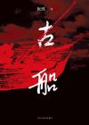

[古船](https://pewae.com/gaan/aHR0cHM6Ly9ib29rLmRvdWJhbi5jb20vc3ViamVjdC8yNzEyNzQ4OA==)

作者：张炜出版社：人民文学出版社出版时间：2021

人物性格复杂，叙事手法老套。细节尚可。
三兄妹的性格都挺窝囊的，没什么爆发。老大成天读共产党宣言，啥事不干，读了个粑粑；老二看似阴险实际没脑子，被人当枪使；老三隐忍缺少弧光。
反派四爷爷和赵多多倒是写得不错。
遗憾的是象征意义的船，最终也没出海。缺少长风破浪的快感。
插叙的使用是柄双刃剑，前两次对人物的塑造，故事的延申很有好处；但是后面仍旧插插插，未见得有什么变化，令人疲惫。

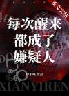

[每次醒来都成了嫌疑人](https://pewae.com/gaan/aHR0cHM6Ly93d3cuamp3eGMubmV0L29uZWJvb2sucGhwP25vdmVsaWQ9NTI4NDQwMQ==)

作者：徐小喵出版社：晋江文学城出版时间：2023

魂穿成嫌疑人，以当事人视角查案，手法上还算比较新颖。
案件的曲折程度一般，办案什么的也是种没太大的亮点。
结局所有姐妹联合起来，流俗，略失望。
关键写侦破就侦破好了，夹杂着腐臭的恋爱算啥。
看门的孙老头也没起到什么作用，废步嘛。

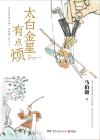

[太白金星有点烦](https://pewae.com/gaan/aHR0cHM6Ly9ib29rLmRvdWJhbi5jb20vc3ViamVjdC8zNjMyODcwNA==)

作者：马伯庸出版社：湖南文艺出版社出版时间：2023

西游同人都被写烂了，太白金星作为主角的也不鲜见。甚至天庭公务员系统也不是新系统了。马伯庸选择这个主角，就注定了不会太出彩。
同人小说本来根本不用动脑子构思主轴，就跟着取经的流程往里填空就行。
然而马伯庸还是厉害的，他把六耳的命运作为抓手，到宝象国猛然跳出桎梏，是相当厉害的。
结局的转向非常猛烈，不说大圆满但也还不赖。
最重要的是没有抱着主线水字数，值得表扬。

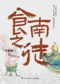

[食南之徒](https://pewae.com/gaan/aHR0cHM6Ly9ib29rLmRvdWJhbi5jb20vc3ViamVjdC8zNjcxMDU5Nw==)

作者：马伯庸出版社：湖南文艺出版社出版时间：2024

悬疑的部分比较浅显，不过文笔很好，后半部分情绪到位。
以篇幅体量来说，写得非常好。
但是主线其实有点牵强，赵佗是怎么死的并没有那么重要。而从这个角度来说，主使庄大夫有些过于不称职了。
但甘蔗和黄同的刻画都还不赖。

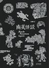

[南美怪谈](https://pewae.com/gaan/aHR0cHM6Ly9ib29rLmRvdWJhbi5jb20vc3ViamVjdC8zMDQzMDkwNw==)

作者：王觉眠出版社：陕西人民出版社出版时间：2018

可能是因为南美都是些部落没有统一的原因，传说故事的分布太散，没有什么体系。部落和部落间传说也都不挨着。所以就挺累。
再就是这些传说很大程度上并不纯粹，无法把白人来之前的部分与白人来之后割裂开。像是仙女偷土豆被少年把衣服偷了，不得不下嫁的故事，怎么看也是从欧亚大陆传过去的。
想想白人到达美洲也500多年了，嘉靖年代瓷器要是能传下来也是老古董了，就很正常。
缺点是各个神祗的名字没有原文，无法对照进行更深一步的了解。
加勒比竟然是食人族的意思，怎么不见加勒比海诸国抗议呢？
插图不错。

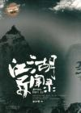

[江湖异闻录](https://pewae.com/gaan/aHR0cHM6Ly9ib29rLmRvdWJhbi5jb20vc3ViamVjdC80NzE4Mzg5)

作者：本少爷出版社：陕西人民出版社出版时间：2010

仿笔记小说白话文翻译的写法很独特，可以把一些评论的东西直白地写出来。
人物塑造有些流俗，部分人物雷同。
缺点是电子版不友好，后续出现前面出现过的名字，往回查找十分不便。
最后的长篇番外差评。

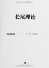

[长尾理论](https://pewae.com/gaan/aHR0cHM6Ly9ib29rLmRvdWJhbi5jb20vc3ViamVjdC8xMTU4OTk1MQ==)

原名：The Long Tail: Why the Future of Business is Selling Less of More作者：克里斯·安德森译者：乔江涛 / 石晓燕出版社：中信出版社出版时间：2012

Web2.0时代的圭臬，现在看来更像反讽。
几句话就能说明白的观点，啰里巴唆像在倒嚼一样。
现在的厂商更多信奉的是重头理论，也就是乌合之众占据了上风。它们能从80%的用户身上赚到90%的钱，剩下的那点残羹冷炙，就不在乎了。而且用“热搜”这种粪水浇灌出来的用户，喂啥吃啥，逐渐失去思考能力，就更不会在乎长尾了。
跟作者的愿景正相反，这年头冷门资源是越来越难找了。
TIKTOK的全球范围的流行，似乎证实了作者的失败。
作者没考虑到，维护那长长的尾，其实也是需要成本的，而且成本还不低。什么人力啊、算法啊、存储啊、电费啊、版权啊。不知是疏忽还是故意。

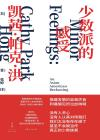

[少数派的感受](https://pewae.com/gaan/aHR0cHM6Ly9ib29rLmRvdWJhbi5jb20vc3ViamVjdC8zNjY3ODUzMw==)

原名：Minor Feelings: An Asian American Reckoning作者：凯茜·帕克·洪译者：张婷出版社：上海人民出版社出版时间：2024

非常感性的书。
不知道亚裔+女性的身份给这本书的流行带来了多少政治正确的加成。
跟书名挺符合的，确实是在说她是怎么想的。还有一丢丢自吹。
但是我发现自己并不关心她是怎么想的。无法共情一点儿。

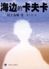

[海边的卡夫卡](https://pewae.com/gaan/aHR0cHM6Ly9ib29rLmRvdWJhbi5jb20vc3ViamVjdC8xMDU5NDE5)

原名：海辺のカフカ作者：村上春树译者：林少华出版社：上海译文出版社出版时间：2003

一切都没有发生。一个十五岁少年内心的成长。
并没有多少感同身受，因为我早已告别了十五岁的自己。

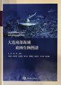

[大连南部海域底栖生物图谱](https://pewae.com/gaan/aHR0cHM6Ly9ib29rLmRvdWJhbi5jb20vc3ViamVjdC8zNjE1Nzk5Mg==)

出版社：海洋出版社出版时间：2022

非常失望，图片既小又模糊，根本没有细节。而且不是动物的活体状态，而是福尔马林泡过的，发白变形，没多少指导赶海的意义。
这样的书还要198，怎么不去抢！

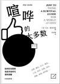

[喧哗的大多数](https://pewae.com/gaan/aHR0cHM6Ly9ib29rLmRvdWJhbi5jb20vc3ViamVjdC8zNDk1MTM3NA==)

原名：How to Think:A Survival Guide for a World at Odds作者：艾伦·雅各布斯译者：刘彩梅出版社：中信出版集团出版时间：2020

封面上的宣传词基本是在夸大其词，那些东西涉及了，但不是直接的。
这本书基本在讨论如何独立思考。涉及了个体与群体的关系，文字与语言的关系，是非标准等话题，进而讨论应该如何独立思考。
书中大篇幅的讨论内容，是作者认为人的思考是受群体影响的，故而要求在思考时一定要考虑到你自己是否真的属于那个群体，你是否把群体中的个体意志当成了集体意志，甚至于，必要的时候要脱离那个群体。
这部分对于我就挺没用的，因为我一直就啥也看不上。
有用的部分也是有的。

> 有时你可以不说实话，但那不叫说谎。你可以大肆强调某些你并不那么信服，但内心深处也觉得确实有些道理的东西；你可以稍微避开那些容易引起争议的话题。

简而言之：忍住。

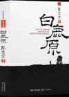

[白鹿原](https://pewae.com/gaan/aHR0cHM6Ly9ib29rLmRvdWJhbi5jb20vc3ViamVjdC8yNzAyODIzMQ==)

作者：陈忠实出版社：长江文艺出版社出版时间：2017

配得上名声的好书。
好就好在人物生动而又复杂。白孝文和黑娃这一黑一白，鹿兆鹏和鹿兆海这一兵一匪，白嘉轩和鹿子霖这一正一邪，对比之下都非常有味道。
革命只是冲动和盲目，各方都是扯虎皮拉大旗，为自己谋利益，铲除异己才是“正义”。哪怕是白嘉轩，也在白孝文的问题上低声做小，并且成了既得利益者，甚至在最后默认了借种的事。可能作者在暗示，所有的封建家长，难免步入说一套做一套的桎梏之中。
唯一的微光来自朱先生。他那句遗言好哇：

> 折腾到何日为止！

非常喜欢对于鹿子霖的老阴逼的塑造，符合地主老财恶劣乡绅的刻板印象。
缺点是某些分支剧情不太有必要，比如大拇指。

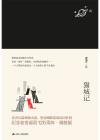

[猫城记](https://pewae.com/gaan/aHR0cHM6Ly9ib29rLmRvdWJhbi5jb20vc3ViamVjdC8zNDQzODk2NQ==)

作者：老舍出版社：江苏人民出版社出版时间：2019

不在老舍的舒适区，对话直白，味道很冲。而且后半部分非常仓促，就更加没有味道了。
因为《猫城记》风格独特，所以跟后面几个短篇也不怎么搭调。当然质量是高的。
只是很难分辨当时的老舍究竟在骂谁：

> 大家本来不懂什么是政治，大家夫斯基没有走通，也只好请出皇上；有皇上到底是省得大家分心。到如今，我们还有皇上，皇上还是“万哄之主”，大家夫斯基也在这万哄之内。

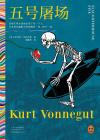

[五号屠场](https://pewae.com/gaan/aHR0cHM6Ly9ib29rLmRvdWJhbi5jb20vc3ViamVjdC8zNTgxNTU5Mg==)

原名：Slaughterhouse-Five作者：库尔特·冯内古特译者：虞建华出版社：河南文艺出版社出版时间：2022

吃不了一点儿细糠。
这非线性叙事也太跳了，而且很多篇幅就像精神病在呓语，接受不了。翻一页之后经常会怀疑自己是不是翻错页了，幸亏是实体书，还可以对照页码，如果是电子书早就给出漏章节的差评了。
说好的黑色幽默也体会不到。大头兵是挺傻的，但全世界所有的年轻人不都一样吗？

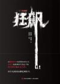

[狂飙](https://pewae.com/gaan/aHR0cHM6Ly9ib29rLmRvdWJhbi5jb20vc3ViamVjdC8zNjIxODU0Mg==)

作者：徐纪周 / 朱俊懿 / 白文君出版社：青岛出版社出版时间：2023

剧本改的小说。在没看过剧的我看来，小说不及格。
优点是节奏流畅，剧情一气呵成，没有多余的废话。
缺点是人物塑造上，除了高启强高启盛兄弟和老默以外的人物，包括主角安欣在内，都是薄薄的纸片工具人，一眼看到头。作者尤其不擅长女性角色的塑造，无论是陈书婷、孟钰、程程还是黄瑶，都是为了完成某种使命，用完既扔，没有铺垫也缺乏尾韵。
后期某种程度崩坏了，蒋天和过山峰纯属没有困难制造困难。徐忠的出现也是一种机械降神。
腐败止于副职，跨越三个历史时期市委书记竟然都没出现过，也是够恶心的。

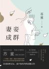

[妻妾成群](https://pewae.com/gaan/aHR0cHM6Ly9ib29rLmRvdWJhbi5jb20vc3ViamVjdC8zMDQ1OTUxMg==)

作者：苏童出版社：浙江人民出版社出版时间：2019

有点相信张艺谋的好作品原著成色要足的说法了。读过小说之后，发现小说比电影更扎实。
电影中巩俐是被挂灯笼和捏脚这样的小细节侵蚀之后，逐渐开始黑化宫斗的，而原著的颂莲一进门就言行合一，有着极强的的战斗力，只是缺少经验罢了。从这个角度上说，捏脚有些画蛇添足。
电影中为了营造压抑的氛围，把院子里弄得很压抑，人也少，男主故意不给正面镜头；而原著是平和的，你甚至会觉得陈佐千前半部分通情达理，对于妻妾管理缺乏手段甚至有些窝囊，直到梅珊沉井，忽然闪现出狰狞面目，如此下来反转的冲击力特别强烈。在几个女人与老爷的相处的日常逢迎中，潜移默化的显示出家里的女人是附庸这一主题，比电影高明不少。电影关于颂莲和雁儿的冲突也没拍好。

《红粉》则是一曲独立女性的赞歌。秋仪和小萼对比强烈，吃汉子不如靠自己。另外明里暗里攻击大改造运动，怪不得当年电影难产了那么久。换现在怕根本都没人敢立项。
《园艺》名气最小，却很有意思。故事比较普通，但是苏童把人物弄得很活，读起来有味道。傻儿子折进去之后，宅女闺女继续查，有一种莫名的无奈和好笑。闺女不爱出门是因为有狐臭，意料之外，情理之中。可惜结局有点潦草。
苏童成名的时候才二十六七，这人也太牛了。

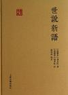

[世说新语](https://pewae.com/gaan/aHR0cHM6Ly9ib29rLmRvdWJhbi5jb20vc3ViamVjdC8yOTkwNTI4)

作者：刘义庆译者：余嘉熙出版社：三秦出版社出版时间：2012

名士风流。以前以为重点是“风流”，读过之后才得知，重点在于“仕”，换句不好听的说法，名仕放个屁都是香的。
像什么“死便埋我”的刘伶，就是个酒蒙子嘛；什么“卿可赎我”的温峤，就是个烂赌狗嘛！若不是他们有名，这狗屁倒灶的算啥事啊？
其实现今也一样。涛哥爱打乒乓球，涛哥跟福原爱打乒乓球的事，后人做传时势必要作为轶事写进去的。我同事老李也爱打乒乓球，有人在意么？更不要说福原爱陪打、王楠笑嘻嘻当裁判了。
坏事也一样，福原爱搞婚外情是新闻，老李也搞婚外情，同样连个水花都冇啊。
世说对我来说非常好读，因为其中的古文简单直接，语法清晰，不求甚解地读起来甚好，极具古文之美。

除了事实还有言论，且不论其是否基于史实吧，明显就算是说过那也是商业吹捧。尤其是各种谶语预测，什么这个人以后一定有出息，或者什么我早看出你厉害，所以还是我更厉害。要不是你们都是高门大阀，说过的话鬼才记得啊。

缺点是主要人物大多时候敬称官职，少部分是表字，而书中只有人物在第一次出场的时候才给注释，往后就不加了，看到后面疲惫期完全不知道说的是谁。电子书不便往前翻的缺点此时被放大了。

这一版注释除了人名一点以外，很满意，完美适配我的水平。

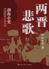

[两晋悲歌](https://pewae.com/gaan/aHR0cHM6Ly9ib29rLmRvdWJhbi5jb20vc3ViamVjdC8zNjU4MDczMQ==)

作者：渤海小吏出版社：中国大百科全书出版社出版时间：2023

明显是想复刻当年当年明月成功的道路。到八王之乱的部分还算有趣，后面这片大陆更乱了，作者写作的节奏也乱了。
评论忒多了，而且说教味道太重。司马懿洛水之誓确实不厚道，但你也不必隔个三五章就拿出来说一次吧。
目录似乎想以战争作为脉络，但是渤海小吏写战争的水平不行，写人倒还可以。
再就是真的写到东晋灭亡就戛然而止，对于刘裕来说太不公平了。然后一直是南人正统视角，一边说胡人没文化，另一方面却并没有写出南人比北方文化高明在哪里。

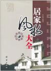

[居家风水大全](https://pewae.com/gaan/aHR0cHM6Ly9ib29rLmRvdWJhbi5jb20vc3ViamVjdC81OTA3OTI4)

出版社：团结出版社出版时间：2011

知识不能说没有，但真心不多。章节间缺少统筹，仿佛是个野鸡教授把每个章节分给学生写，然后不经审核地攒到一起。就一个简单的貔貅，提及4次便罢了，每次都要从头介绍，都要说这两个字叫皮休，咋了，老师要检查作业么？
部分章节明显地抄百科水字数，庭院里种啥花啊？跨几把中国十大名花列一遍，艹，要编辑何用！

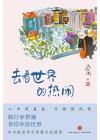

[去看世界的热闹](https://pewae.com/gaan/aHR0cHM6Ly9ib29rLmRvdWJhbi5jb20vc3ViamVjdC8zNjIwNzY3MA==)

作者：蔡澜出版社：天地出版社出版时间：2023

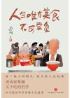

[人生唯有美食不可辜负](https://pewae.com/gaan/aHR0cHM6Ly9ib29rLmRvdWJhbi5jb20vc3ViamVjdC8zNjIwNzY2OA==)

作者：蔡澜出版社：天地出版社出版时间：2023

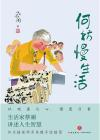

[何妨慢生活](https://pewae.com/gaan/aHR0cHM6Ly9ib29rLmRvdWJhbi5jb20vc3ViamVjdC8zNjIwNzYzOA==)

作者：蔡澜出版社：天地出版社出版时间：2023

蔡澜的东西，精炼朴素，蜻蜓点水。典型的专栏味儿。
换句话说，就是干货不太多。

> 我的文章愈写愈好，读者有十亿人。真的，反正不要钱嘛，说多一点有什么关系？写啊写啊，又骗多一篇稿费，何乐不为？

三本集子当中，《去看世界的热闹》是游记，《人生唯有美食不可辜负》写食物，《何妨慢生活》是写人和小品。
蔡先生最擅长的还是写吃食，哪怕是游记中也是写吃的部分最精彩。

> 什么东西最好吃？妈妈的菜最好吃。这是肯定的。你从小吃过什么，这个印象就深深地烙在你脑里，永远是最好的，也永远是找不回来的。老家前面有棵树，好大。长大了再回去看，不是那么高嘛，道理是一样的。

有一篇篇幅颇长写了大连。比较中肯，包括对于环境的失望。他表扬的吃食，是海胆和河豚熬粥，确实识货。提及了海菜包子。但他弄混了吸（xǔ）波螺和香波螺，也是马有失蹄啊。
文采嘛，其实也就那么回事，说东西硬就说像鞋垫，说没味道就说像发泡胶，看起来老蔡其实也没吃过几样塑胶产品嘛。
有意思的是，蔡澜称呼金庸一直是用金庸先生，尊敬而又疏远；称呼倪匡是倪兄，黄霑是霑兄，但倪兄出场次数可远远多于霑兄，甚至亦舒周华健出现的都比黄霑要多。也许好朋友是不必挂在嘴上的吧。

这套书只是简单按照题材分了个类，并没用附上具体的发表时间，是个败笔。毕竟他当时是那么想的，不等于永远是那么想的不是？何况有好几篇“重游”“再游”之类，完全对不上茬口，扫兴。

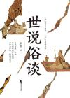

[世说俗谈](https://pewae.com/gaan/aHR0cHM6Ly9ib29rLmRvdWJhbi5jb20vc3ViamVjdC8zNjE4MjY4Mw==)

作者：刘勃出版社：浙江文艺出版社出版时间：2023

世说新语的排列是离散的，而本书以人为线索，把这个人在世说中都说了些啥一一罗列，这样对于历史人物和历史事件对于读者来说就很清晰。
于是世说新语中的重点人物，让阮籍、山涛、嵇康、潘岳、王羲之、庾亮、桓温、谢安这些人物活龙活现起来。
关键这位作者很实在，评论中往往出现“我觉得这一条不真，这俩人A此时在哪，B此时在哪，所以他们碰不上”，“我觉得这一条是夸大”，“我觉得这一条是编的”之类，读起来就觉得踏实。

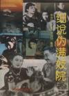

[细说伪满妓院](https://pewae.com/gaan/aHR0cHM6Ly9ib29rLmRvdWJhbi5jb20vc3ViamVjdC8zNTMwMDc0)

作者：常淑珍出版社：时代文艺出版社出版时间：1993

这说的不能叫细啊，只能叫零碎。
内容非常杂乱，一点点东西颠而倒之倒而颠之来来回回。
故事会体。最多的是一个又一个再一个妓女的故事，还都差不多的苦大仇深，不是被爹妈卖了就是被丈夫卖了，有点像小时候看过的忆苦思甜材料。
再夹杂些个嫖客的故事，偶尔还要强行上价值观：

> 随着环境恶变，日本人称工人为苦力，并以棍棒相待。他心中恨透了日本侵略者。下班后，他再也不在寮里看书了。便到处看戏，在经过“新德里”妓院门前时，北一个叫桂舫的妓女给他拉近了堂院，终于开了“盘子”。桂舫要求他明日再来，并答应为他留铺，他守信赴约，按时入院，从此忘掉了仇恨，失去了理想，陷入淫情孽海之中。不到百日，他把所有的积蓄全部扔进妓院。

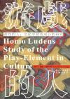

[游戏的人](https://pewae.com/gaan/aHR0cHM6Ly9ib29rLmRvdWJhbi5jb20vc3ViamVjdC8yMjY5MDQ3)

原名：陈慧娴作者：约翰·赫伊津哈译者：何道宽出版社：花城出版社出版时间：2007

哦，哦，哦，哦，然后呢？
“打完就跑”这种写法令人挺郁闷的。很多时候游戏的概念被作者夸大了，比如战争，当所谓的战争法则被“兵者诡道也”替代之后，你还能以游戏的角度取看待战争么？这波我站马克思，生产力决定游戏规则。
站作者倒也是可以的。我可以替作者总结一下他的观点：人类为了满足生物生存本能以外的活动，都是玩。

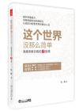

[这个世界，没那么简单](https://pewae.com/gaan/aHR0cHM6Ly9ib29rLmRvdWJhbi5jb20vc3ViamVjdC8yNjQzNzA1NA==)

作者：张鹂出版社：北京大学出版社出版时间：2015

强行捏合核心价值观与自然科学。像极了高中写作文的我。
所谓的高维，就是用利用物理和数学公式玩托物言志那一套。举个栗子:

> 把这段话说得通俗一些就是：铁、镍等质量很大的原子，并不能脱离于环境而产生。并不会有哪个原子，从一个小小的氢原子开始，一路通过不断聚变而独自成为铁、镍等原子，一骑绝尘、独孤求败，这样的事是不合天理的。再高级的原子也需要等待，等周围的环境升温，自己才能继续升级，并且还能保持生命的活力。同理，一个富裕的人，要等待周围的人也富裕起来，自己的能量级才有望继续提升；先富的人带动后富起来的人，事实上也是为自己进一步升级创造条件。

哥们，您这前后挨得着吗？原子有个毛线的生命活力啊！氢原子变成铁原子怎么就升级了？同你妈个逼的理啊？恶心！

---

下面是本年度补完的漫画。只为弥补少年时代的遗憾，不评价。有兴趣的单独讨论。加这项只是为了显着多……

[漂流教室](https://pewae.com/gaan/aHR0cHM6Ly9ib29rLmRvdWJhbi5jb20vc2VyaWVzLzcyNQ==)

作者：時報文化译者：缪世真出版社：時報文化出版时间：1996-02 / 1996-11全套册数：10

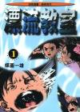

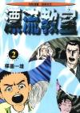

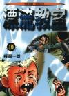

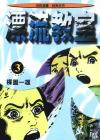

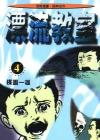

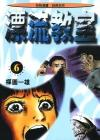

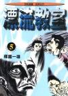

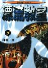

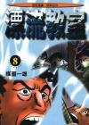

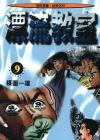

[杀手寓言](https://pewae.com/gaan/aHR0cHM6Ly9ib29rLmRvdWJhbi5jb20vc2VyaWVzLzY2NjI1)

原名：ザ・ファブル 作者：南胜久译者：平川遊佐出版社：尖端出版时间：2022-02 / 2024-02全套册数：21

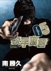

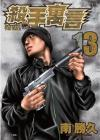

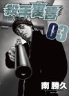

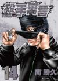

[魍魎之匣](https://pewae.com/gaan/aHR0cHM6Ly9ib29rLmRvdWJhbi5jb20vc2VyaWVzLzYyMTE=)

作者：京極夏彥 / 志水アキ译者：LKH出版社：角川出版时间：2009-08 / 2011-06全套册数：5

[脏物岛](https://pewae.com/gaan/aHR0cHM6Ly9ib29rLmRvdWJhbi5jb20vc2VyaWVzLzc2MDcw)

作者：外薗昌也出版社：LINE Digital Frontier出版时间：2009-11 / 2010-05全套册数：4

[金田一少年之事件簿 新系列](https://pewae.com/gaan/aHR0cHM6Ly9ib29rLmRvdWJhbi5jb20vc2VyaWVzLzEzODQw)

作者：佐藤文也 / 天树征丸译者：张益丰 / 林捷瑜出版社：东立出版时间：2006-01 / 2012-07全套册数：12

---

- [(1)](https://pewae.com/2025/12/2025-reading-record.html#inner_ref_1)：就是LSD