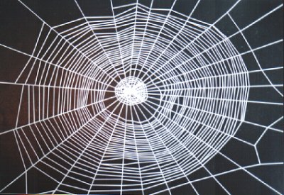

短短20年而已。我们家嘻嘻正好年满20岁，上大二了。

跟2010年相比，网络在技术上并没有什么突破性的进展。不过是带宽宽了一些，硬件速度快了一些，信息交换方式快捷了一些。而已。
但是，从“互联”这个意义上来说，却是进入了真正的“云”时代。


手机/笔记本/MP（345）/DV/PSP/PDA/电子词典…所有的这些在2022年开始就被合成了一种叫“网络终端”的硬件设备。苹果、诺基亚、摩托罗拉、索尼、西门子（没错，它又杀回来了）、松下等十数家大型企业瓜分了硬件的市场份额——这也是没有办法的事情，谁叫人家合伙出钱，重现了当年的“铱星”计划呢！而且财大气粗，所有的卫星线路都是免费提供个各国的网络供应商使用的——前提只有一个，必须使用它们的网络终端。
终端看起来很简单，无非是屏幕+按键+麦克风+喇叭+触摸屏+内置动作感应器+摄像镜头而已。但是它所实现的功能却大不一般。不仅是通信设备，同时也是办公设备，娱乐设备，个人金融设备和身份识别装置。

就以我儿子/女儿嘻嘻的一天来说明一下2030年的网络情况吧。
清早，当然是被终端设置的闹铃唤醒的。
第一件事情当然是上厕所，不要小看这个，可是跟网络有关哦！如果智能马桶通过你的排泄物发现我儿子/女儿的身体状况出现异常，就会立刻将数据发送给他/她的保健医生。医生通过facebook提供的个人资料可以迅速的作出判断，将饮食或者治疗计划发送到他/她本人和直系联系人（也就是我）的终端上，必要的话，医生也可以选择直接语音或视频直接跟他/她或者我进行通话。嗯，技术是由twitter、skype、google、AT&T四家联合开发的。其中的利益也由三家按比例分配。
最痛恨智能网络马桶的可能就是运动员和教练员了——因为基本杜绝了服用兴奋剂的可能性。所有的注册运动员资料，国际奥委会运动员委员会和兴奋剂检测中心都有权查看（部分）。如果发现了异常——嘿嘿，证据都是现成的。而最喜欢智能马桶的当然是缉毒警察。

早起的第二件事情是洗漱，挺个人的，但是我女儿是个小浪包，她定制了付费的“好友防撞车”系统。在洗漱化妆的时候把终端放置在合适的位置，可以在她准备打开香水或者梳理头发的提示，跟你今天行程表上可能会遇见的朋友xxx撞车了。如果脖子后面没洗干净的话也会提示，不过是免费的。
关闭水龙头的时候，本次的用水量立刻发送到了终端和自来水公司的数据中心。如果个人把用水监控级别设置的严格的话，终端产生“今天你比昨天多用了3ml水”这种龟毛的提示也完全有可能。

在去餐厅的路上，个人终端和处理器会不断的交互信息，在进门前10秒为他/她分配位置。至于学校的厨师那边，也只需要由终端安排好早餐的工作计划，从早5点半工作到早8点半，按照工作终端机排列出的食品列表一个一个地制作就可以了。餐厅的开放时间是非常准时的——即使厨师想加班，餐厅经理的终端上也会立刻提示：“厨师xxx即将开始加班，贵公司将支付每分钟￥xx.xx的加班费，请在2分钟内批准或制止这项活动。”如果批准或者不处理的话，两分钟后加班信息就直接发到政府的劳动监察部门去了。所以劳动的统计和工资的发放也是非常轻松的事情，只要判断个人终端跟工作终端的连接时间就可以了。员工的权利也得到了保证，请假都是直接由劳动系统批准的。当然这些系统是由政府部门和各企业直接跟各软件公司定制购买的。
我儿子可能矫情不去吃饭，不过如果作为监护人的我老婆早把他的早餐情况设置为了通知内容。一过早餐时间老婆就直接知道了儿子的“恶行”。

该上课了。想逃课是不太可能的。授课老师可以直接调出目前教室里的所有同学的资料——当然也可以调出没有在教室里的同学的。甚至在中小学，班主任教师可以直接通过卫星定位查找到学生的位置。除去由请假系统和医疗保障系统提供的病事假名单的话——小样，往哪儿跑？
是的，个人资料完全交给了facebook等SNS社区进行维护。不同时期的同学/同事关系会自动加入到列表中。同时，国家也维护着部分资料，像犯罪记录之类。当然不同的人有不同的查看权限。我作为监护人是可以查看我儿子大多数的记录到22岁的。
纸质的书早已被淘汰了。终端上显示的都是教师事先通过数字图书馆、youtube、wikipedia、ESI、Microsoft、Open team事先编排好的教案。个人终端也会自动记录下教师的授课内容，放置到个人的youtube类服务收藏中，方便复习时使用。配合授课内容，我儿子/女儿可以随时触摸屏上的不解名词，或者直接写下有疑问的问题。授课系统会汇总这些问题后给授课老师列出答疑表。当然，教师也可以选择不为学生作答，如果他想让这份不负责报告直接传到学校的考评系统的话。

下午恰好没有课。我儿子有场球赛要打。这时他换上了装在护腕上的便携式终端。双方队员和场上裁判统统都要装备上，然后选择进入一场足球比赛。每当有身体接触，数据处理系统会自动通知裁判这是哪方的犯规还是合理冲撞。至于边线球球门球过没过线越没越位的问题，简直不算是问题！无论是场地门框还是皮球，都是被数据采集终端武装起来的。场上留个裁判也只是为了符合传统而已。当然，这只是业余比赛，每个人只安装一个数据终端就够了，如果是世界杯，每个人甚至要装上7个数据采集器以保证公正，赶上拍阿凡达了！

至于我女儿，下午选择了购物。2030年的网购和现实购物区别已经不是很大了。只是订货过程是当面还是通过视频而已。商品上都有自己的特殊终端，送到消费者手中后只要通过个人终端的扫描，费用立刻从绑定的个人账户上划出，该给商家的给商家，该上税的上税，该给物流的给物流了。如果拒收也很简单，也是扫描一下后让物流给送回去就可以。商品回到商家之后再划一次，所有的中间费用就从该出血的部门划出了。

晚上了，继承我基因的儿子女儿开始了娱乐活动。
儿子玩游戏。已经无所谓单机版还是网络版了，反正都没有本地资料，一起都需要连接到中枢服务器才可以。不过可以连接鼠标或键盘或电视或音箱这些外部扩展设备。当然在进入之前，价格是一目了然的。也没有点卡之类的概念，反正直接从银行划给各个游戏商就是了。电影，图书，音乐……也都是这样，直接观看就是，数字版权得到了最好的体现，因为直接跟银行账户挂钩。同样，对于个人开发者来说，只要开发出了有价值的作品，就可以挂到个人平台上卖钱。Technorati、Delicious、Digg类的网站也同BBC、联合早报等传统媒体进行了整合，他们给终端用户提供最新最有价值的资料。传输的方式，无非就是skype类、twitter类、flickr类、IM类、youtube类或它们的综合。wordpress和blogger之类的服务已经跟个人平台绑定到了一起，在平台上定制任何一种表达方式都可以无障碍地跟自己所有的联系人沟通。是的，无所谓是邮件联系人，IM联系人还是图片分享联系人。

女儿跑去钓凯子了。电影票自然是通过个人终端自动订来的，还自动识别成了学生票。不过浪漫的约会进入高潮的时候，我女儿的终端忽然提出了警报：“发现HIV携带者，要继续吗？”

是的，在2030，世界上的大多数国家，过得就是这样网络无处不在的生活。

```
http://www.gmexpo2010.com
http://blogpk.gmexpo2010.com
```