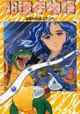

[46亿年物语](https://pewae.com/gaan/aHR0cHM6Ly93d3cuZG91YmFuLmNvbS9nYW1lLzExNTk5MzMyLw==)

原名：46億年物語 はるかなるエデンへ机种：SFC厂商：ENIX类别：ACT发行年月：1992-12耗时：14

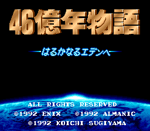

这是本系列第一次出现SFC（超级任天堂）游戏。
按照十多年前的构想，超任也是要从A到Z撸一遍的。但是，后来越写越发现，时间实在是有限。而且对于只摸过两次超任真机的我来说，情感储备也不够丰富。
所以，这个SFC列表上第一的游戏，也就自动转移到了“知新篇”当中。
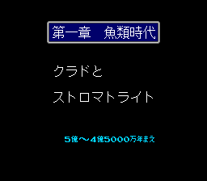

本作是ENIX脑洞大开后的作品，展现了其丰富的想象力。玩家控制的主角，从一开始的鱼类进化到两栖类、爬行类，鸟类、哺乳类，历经地球的数十亿年的发展历史，血雨腥风之下，变成人……
可以说十年前大热的PC游戏《孢子》，创意是ENIX人玩剩下的。
ENIX现在已经不是独立的公司了，但就游戏创意来说，是强于老对手SQUARE的。同样是SFC平台上的上的《天地创造》也是一部富含脑容量的作品。
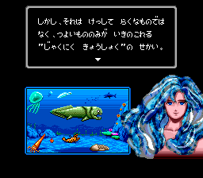

很多网站习惯把这部作品划分为ARPG，我不敢苟同。我觉得它跟恶魔城一样，只能算一部有一些RolePlay成分的ACT游戏。游戏里的引导员是萌化的大地女神盖亚。因为在西方也有把地球叫做盖亚的说法，所以ENIX也算是玩了个双关，而且结尾的时候点题，双关玩的很出色。
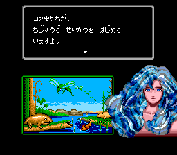

虽然画面华丽音乐动听，本作的实际内涵却很残酷——弱肉强食的达尔文主义。玩家想要获得更高的攻击力就得进化，进化需要进化点，进化点的来源就是不停地吃。不管NPC是食肉的还是食草的，是否具有攻击性，在主角面前一律都是食物。
印象比较深的，爬行那关有个剧情，打完某中BOSS后回到场景，会出现BOSS的家小，轻松赶尽杀绝。然后盖亚女神出现，一顿嘚啵嘚。

主角一开始是条鱼，然后是娃娃鱼一样的东西，接着是犰狳一类的爬行类，然后可以选择变成鸟，继而是丰富的哺乳动物。无论哪种形态都可以选择不同的身体部分，头什么样，爪什么样，带不带翅膀之类的，极大丰富了动作的种类。当然我玩的时候比较土鳖，什么贵选什么。其实游戏的并不如此，像什么选鹿头+鹿角顶人有加成，狮子加鬃毛有攻击加成之类的小设定，比比皆是。
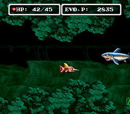
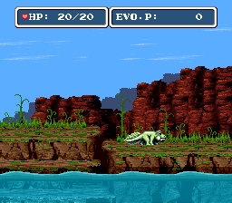
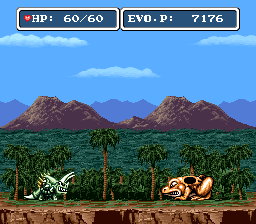
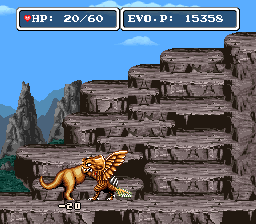

唯一为玩家所熟知的隐藏分支是，进入哺乳时代之后，选择猫头+兔子身体能进化成猴子，然后其余的进化分支就会消失，产生新的猿类分支，进而进化成人。
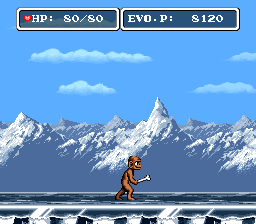
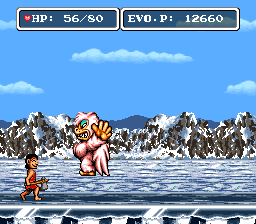
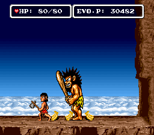

变成人之后，攻击力是很强，但攻击方式很无趣，而且只能在大型人类和小型人类里换来换去，不爽。
据说最后一个地图上，如果进入海里的时候没进化成人，能够有一个人鱼形态。也遗憾地错过了。
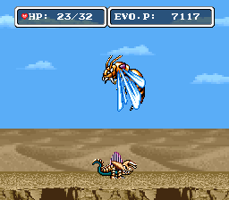

还有个有趣的功能，就是自认为好用/强大/有趣的躯体，可以通过道具记录下来。在适当的时候读取身体，能起到意想不到的效果。最起码血量恢复全满。
更多的时候，应该记录的是特供的奇行种。比如传说种的龙，打最后BOSS的时候变身出来，就很好用。
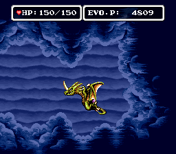

败笔也还是有的。比如处处刷存在感的外星人，再比如莫名其妙的一些怪物。
倒数第二个BOSS就是一只海底的怪物。还能给你一个二选一的机会，如果选了是，就会成为它的小弟，达成被人类捕捉的恶结局。
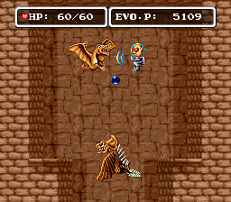
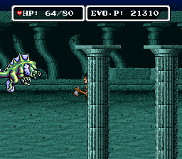
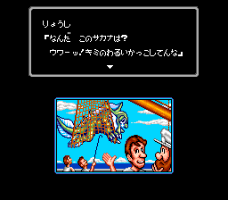

恐龙时代那一大关，背景和剧情是极好的，但主角的进化始终在鳄鱼之类的土鳖爬行类身上徘徊，进化不成大型的恐龙，很不爽。
倒是恐龙时代的大结局氛围渲染得极好。
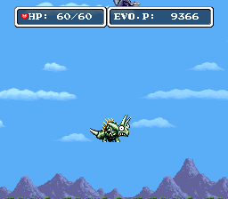
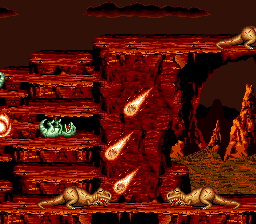
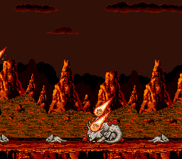

最后的BOSS是个像触手怪一样的东西，能化成各种形态打你，攻防都挺强的。但是只要攒够了钱，在大个子人和小个子人之间来回切换就一点儿也不难打（因为切换的时候会满血）。
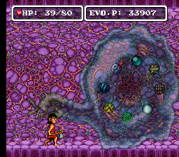

大结局。好像是说外星人研究半天，说这个星球是无法征服的，回去了。
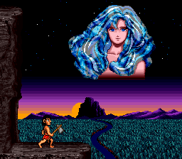
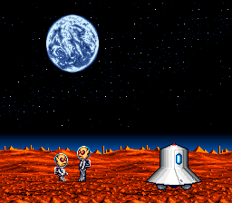
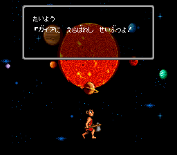
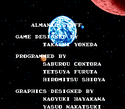
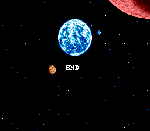