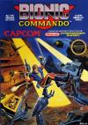
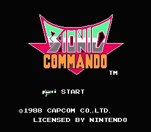
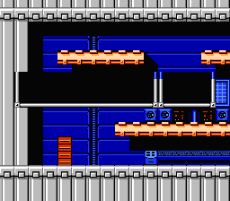
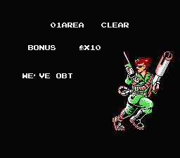
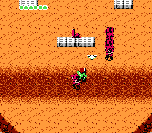
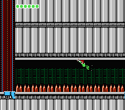
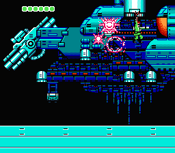
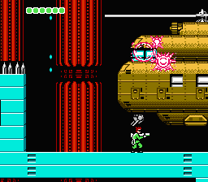
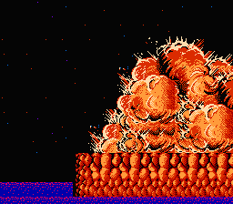

[希特勒复活](https://pewae.com/gaan/aHR0cHM6Ly93d3cuZG91YmFuLmNvbS9nYW1lLzI2MzkyMTMxLw==)

原名：ヒットラーの復活 TOP SECRET别名：Bionic Commando / 希魔复活 / 刺杀希特勒机种：FC厂商：卡普空类别：ACT / STG发行年月：1988-07耗时：72

一个十分精彩的游戏,当年跟朋友一起玩得废寝忘食.
游戏的系统很特别,对于玩惯了系列的朋友来说,最大的问题可能就是没有”跳”.
所有的动态移动都是靠”钩子”(实际上是主角的生化手臂)
游戏中需要在各个敌区中取得情报和武器.
这个游戏还是有点难度的.在接触模拟器之前,根本没有通关的可能

普通boss的所在地

当年可以打那么远很大一个原因是这个游戏实际是可以无限次continue的.
打地图上的补给车,打出鹰形的就是”继续”

完全需要连续飞钩才能通过的地形

最终boss.
以前最远也只能打到这里.

对要逃跑的希特勒完成最后一击

通关.
