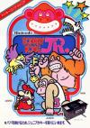
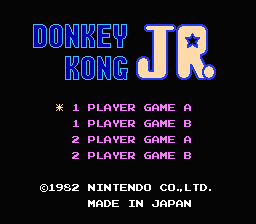
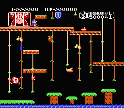
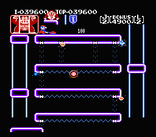
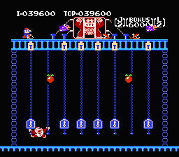
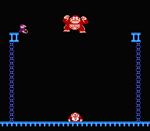
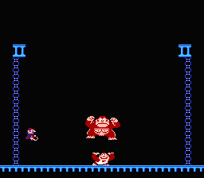

[大金刚Jr.](https://pewae.com/gaan/aHR0cHM6Ly93d3cuZG91YmFuLmNvbS9nYW1lLzI2MzQ3NzYzLw==)

原名：ドンキーコングJr.别名：大金刚2 / 猩猩救父机种：FC厂商：任天堂类别：ACT发行年月：1986-06耗时：16

金刚系列是名作，但金刚系列在FC上都不好玩。金刚Jr从游戏时间上讲，发生在一代马里奥(彼时还木有名字)英雄救美把老猩猩关起来之后，所以这一代被称为猩猩救父，因此在国内被成为金刚2。其实真正用金刚2(King Kong2)是科纳米的。FC上任氏的三代金刚都是从街机移植的，所以基本是按受欢迎程度倒着来的，83年出的，反而是最好玩的。

每关的目的就是跳到猩猩老爹边上的平台上。其实游戏的操作性很差，稍微高一点的地方掉下来就会摔死。

第三关反倒比第一第二关简单

把最后一关的钥匙都推上去就可以把猩猩老爹救出来了

