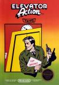
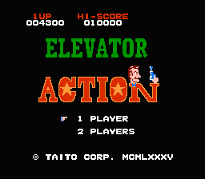
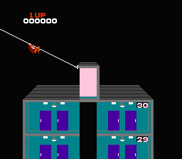
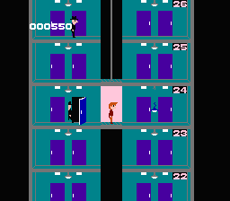
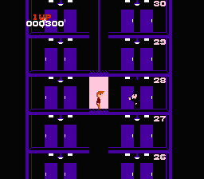
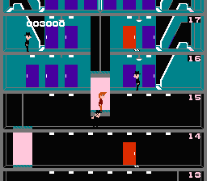
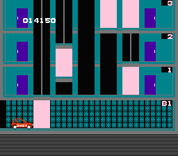

[电梯大战](https://pewae.com/gaan/aHR0cHM6Ly93d3cuZG91YmFuLmNvbS9nYW1lLzI2MzY3OTY0Lw==)

原名：エレベーターアクション / Elevator Action别名：电梯 / 电梯迷宫机种：FC厂商：TAITO类别：ACT / STG发行年月：1987-08耗时：20

称为动作游戏或者射击游戏都差不多,早年都流行这类游戏.当年俺弄来的76合一里面最爱玩的就是这个游戏.游戏没有翻版画面,但是二周目的最后6层打起来也是相当的刺激过瘾.
不知道小岛做MGS的时候是不是受到了这个游戏的启蒙.

开场时还有简单的动画.

游戏的乐趣1,把灯打下来,就会变成漆黑一片,敌人似乎会变笨.当然更可能是心理作用.

最大的乐趣不在于用枪杀人而在于把人压死.

逃到地下停车场就算过了一关了.
