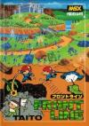
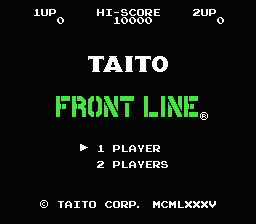
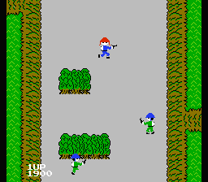
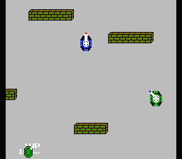
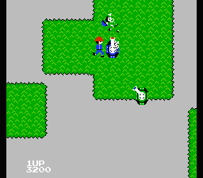
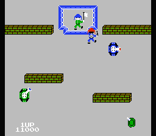

[前线](https://pewae.com/gaan/aHR0cHM6Ly93d3cuZG91YmFuLmNvbS9nYW1lLzI2MzU4ODM4Lw==)

原名：Front Line机种：FC厂商：TAITO类别：ACT / STG发行年月：1985-08耗时：24

竟然又是个tatio的游戏.说实话,这个游戏,操作感是真差,其音效也真的记忆犹新.尤其是死掉的时候.
当年没少研究这个游戏,尝试过只用手雷,不坐大坦克,不坐坦克,不放枪等诸多变态的玩法.

坦克这东东,自然是有大不不坐小的,大坦克的好处是可以多挨一下,虽然从坦克里往外蹦的时候有高达33%的概率挨黑枪…

最后一个藏在围墙里的坦克需要跳出来拿手雷炸.看到最后的白旗,还蛮受用的说.
