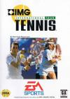
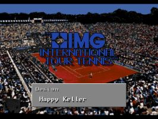
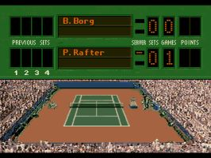
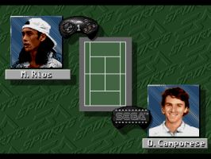
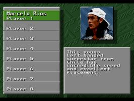
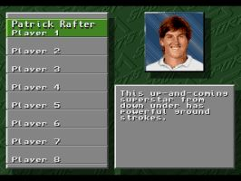
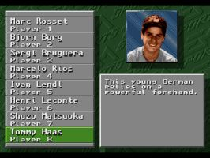
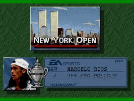
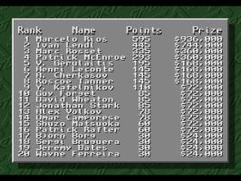
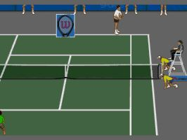

[网球巡回赛](https://pewae.com/gaan/aHR0cHM6Ly93d3cuZ2lhbnRib21iLmNvbS9pbWctaW50ZXJuYXRpb25hbC10b3VyLXRlbm5pcy8zMDMwLTIwMzUyLw==)

原名：IMG International Tour Tennis机种：MD厂商：EA Sports / high score productions类别：SPG发行年月：1994-05耗时：4

实话实说，每个字母开头都找个游戏真的有点儿形式主义。I开头的游戏本就没几个，好玩的就更少。就一个昆虫大战的飞机游戏还可以。但飞机游戏这东西有即时存档的话随便打打就通关了，实在没啥诚意。
索性找了个网球游戏，权当怀念中二时期的那些网球英雄们。

最红的桑普拉斯应该是没取得肖像权，阿加西正在闹别扭世界排名100以外，张德培还没爆冷夺冠，贝克尔不知什么原因。倒是我喜欢的几位选手一个都不少。唉，蹉跎岁月啊，看看英年早~~逝~~退的拉夫特，看看被称为年轻选手的哈斯和里奥斯……

游戏做得还算比较精细，比如选中里奥斯，你控制的那个小人就会用左手击球。当然，也没有太精细了，所有小人的衣服整个比赛打下来都不带换的。

游戏比较别扭的地方是上方视角的发球局，总会不自觉的跑错方向。
一个遗憾是不能选年度比赛之类，只能一个巡回赛一个巡回赛地打，打过了之后除了奖金累计的数字之外，别无成就感。

说两个操作和攻关方面的小技巧吧。
A是挑网前，且只适用于在底线附近挑，其余位置挑必然飞出底线。B是切球,速度稍慢，近网的时候也是切球，但封网的时候用B反手切球非常非常容易出底线。C是平抽，但基本打不出威胁，光用C的话等着输吧！
发球的时候站发球线中间位置，然后网球在离拍顶大约一个球的位置发出，容易出Ace球。
