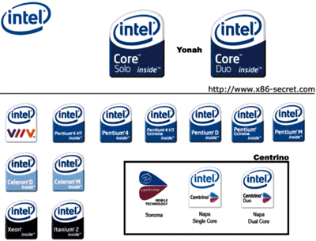

**Day1 **

先说说Intel圆圈R(中国) 的位置。从上海火车站不用出来直接坐地铁1号线坐到头换地铁5号线坐6站到什么川路下车之后打5块钱的貌似QQ的黑的跑大约4km，才会到。

Intel的楼不高，只有4层，一眼看过去就知道是用什么材料临时搭起来的。北边靠着河，南边是中国动物检验检疫局征的一块垃圾场，西面是微软和微创征的空地，东北是花王的工地，正东是某化工厂征用的荒地——换句话说，除了Intel，这附近就没有喘气的建筑物。

先跟负责我们项目的Simon通了个电话，这厮叼着根油条就跑了出来把偶们一行三人接了进去。前台的小姐太丑了，以至于我不得不把注意力放到他们的安全工作上。Intel的安全工作非常到位，在领取了Visitor的拍照以后，还要经过安检门才能进门。而且，在Intel楼里的每时每刻都需要under这帮人的control，如果单独出现在任何一个楼内设施中（包括Washingroom）都要被安保部门的人叫去谈话。

首先是跟Simon确定计划，他决定由手下的两个Team的Leader为我们进行培训。由于没有自己的位置，只好在休息间等Leader甲来上班。Intel的休息间真是没话说，有免费的饮料和小点心，还有微波炉和冰块。Intel是没有考勤制度的。我们在休息间消耗了15瓶碳酸饮料，6包3+2小包装饼干和2杯咖啡后，终于在10点半等到了Leader甲，培训了1小时以后可以开始午饭了。

鸟是有很多，拉不拉屎不知道。反正可以确定的是Intel方圆1,000m内没有卖报纸的

下午在实验室里按照上午Leader甲说的东西做了点试验。2点的时候，他们内部有重要事宜，外来人员一律撵出来，第一天就这么结束了。

**Day2**
原来他们昨天的外来人员不能参与的项目竟然是他们内部的所有招贴都换了新logo。
真人PK“跑得快”到凌晨3点，有点睡眠不足又有点感冒，带队的家伙赢了我80多，所以半真半假的装病是很顺理成章的。

今天讲课的是Leader乙，他花了3个小时让我们明白了，我们要做的事情就是，按照他写的Driver提供的接口，写的10行的验证程序即可。

装病的坏处就是，不能随心所欲的点想吃的红烧肉，只能草草的要碗阳春面了事。

**Day3**
其实已经没什么事情了。所以我们晃到10点才去。
跟Simon要了一份厚度不超过25页的文档之后，Mission Complete。

终于可以回家了。