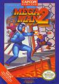

[洛克人2：威利博士之谜](https://pewae.com/gaan/aHR0cHM6Ly93d3cuZG91YmFuLmNvbS9nYW1lLzI2MzM5Njg2Lw==)

原名：Mega Man 2别名：洛克人2机种：FC厂商：iam8bit / 卡普空类别：ACT / STG发行年月：1989-07耗时：18

秘技:(洛克人系列通用)按暂停键换枪时,洛克人身上会出现短暂的闪光.这个过程可以用来躲子弹.
同时按下START+SELECT+a+b可以自杀.

之前3p问俺,怎么没有洛克人系列.这不就出现了么.他一直以为俺最擅长的是1代.其实,一代俺根本过不去黄豆那一关,也就是说一直没能翻版.
跟俺感情最深的就是这个二代.那个时候,中午俺不吃饭,到书摊溜达一圈以后就到宝宝奶奶家等他吃完饭,然后就一起跑到前面楼他自己家,偷着玩一会游戏(其实是他玩我看).那时主要玩的就两个游戏:洛克人2和霸王大陆.
通常我们玩到12点40多收拾东西往回跑.要是跑过马栏河桥能追上rock的话,就平安无事,可以不用再跑了.否则俺俩基本就肯定迟到了.
其实,洛克人到二代的时候系统还没有完全完善,这个时候还没有攒枪和铲腿系统.
个人感觉二代在整个系列中难度算比较低的.
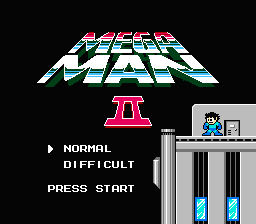
二代的密码系统比较特殊.当时为了不留下任何马脚,俺们都是用脑袋生记的.
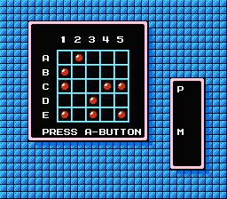
熟悉的关卡选择画面.第一个一定要打左下角的罐头皮.
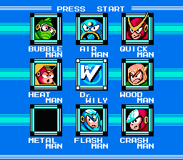
永远不死的威利博士,永远的boss.
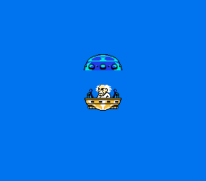
洛克人的又一个传统,打最终boss前要把之前的所有boss重新再来过一遍.
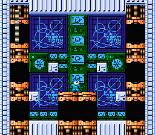
最终boss,博士变身成的沙鲁(?),只能用最不好控制的水泡枪对付.如果没有足够的水泡枪就只好自杀了.
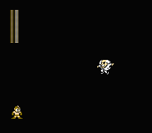
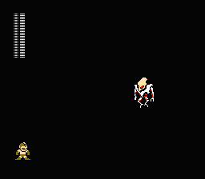
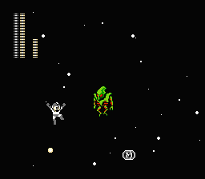

看着通关画面,总能想到那首歌”走过~春天~走过~了~四季”
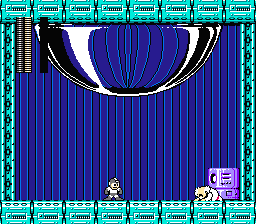
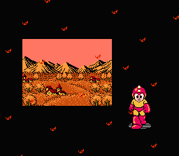
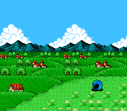