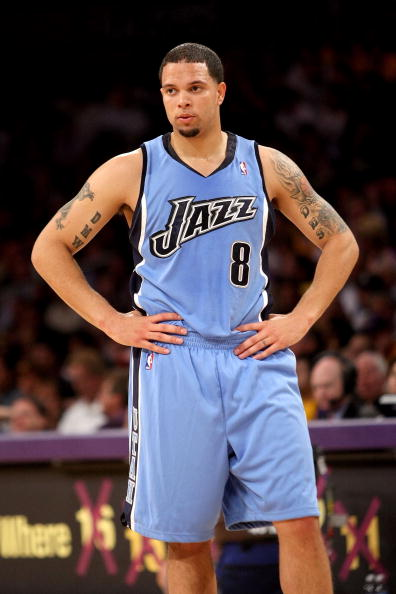
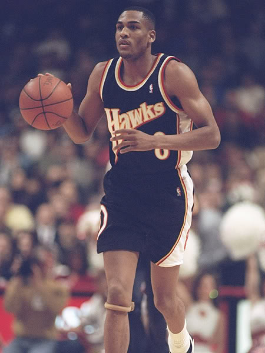
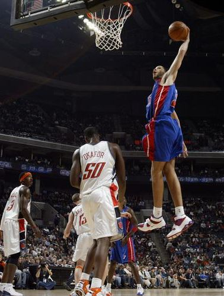
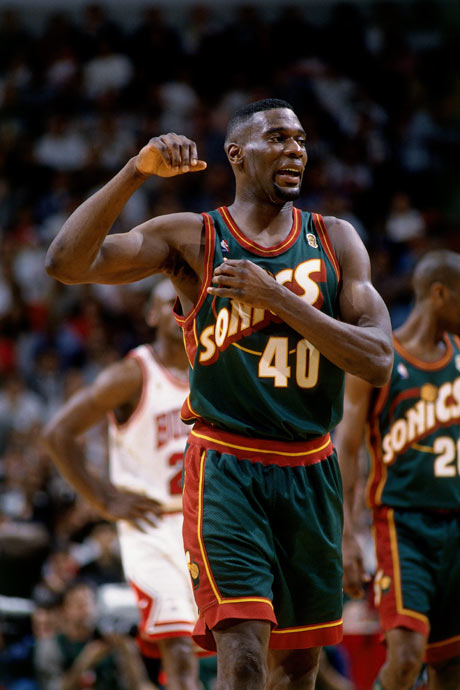
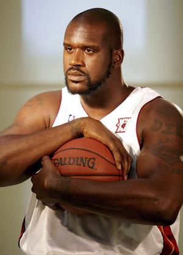
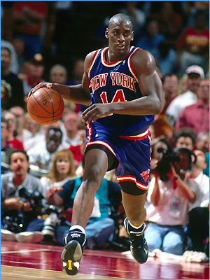
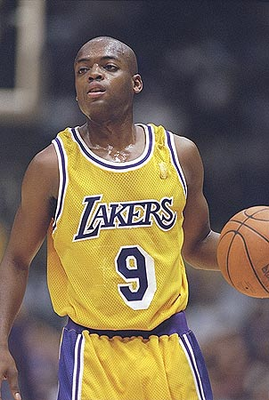

My Big Five

应TM之邀，写个最喜欢的篮球阵容出来。
其实我看篮球的年头儿不比看足球短。只是没有看足球那么投入而已。

钟爱的球员类型也不看中“花哨”和“灵气”，以踏实肯干为首要评判标准。白巧克力韦伯之流向来是看不上的。
同样也不喜欢那种一个人占了全队大部分出手资源的，所以排除了帮主啊科比啊詹姆斯啊AI啊之类的大部分顶级明星。

开始。

**控球后卫（PG）：德隆.威廉姆斯（Deron Williams）**
1984/07/26 1.91m 95kg
2005年探花；2008年奥运会（梦8）成员。
生涯（2005-）： 17.2PPG 3.2RPG 9.1APG 1.0SPG
德隆小胖子，控卫中的最爱。一直觉得他是我心目中标准的控卫模板——高大、强壮、视野开阔、责任心。当然这也可能跟爵士队的整体打法有关系，前面总有至少两个人在跑位，一个人拉出来做挡拆。正常情况下德隆要做的就是保证球的运转。实在不行了，就自己上，反正一般的控卫也防不住德隆。这样的人不入选全明星简直没天理啊！控卫的第一要务就是把球送到该在的位置。你玩那么多花活有啥用啊？当然，德隆的打法比较依靠身体，老了之后可能会数据下滑。可身体好这优势为什么不用？但是看看他的模板基德吧，三十好几还能混得风生水起。德隆投篮可是要靠谱多了！

**得分后卫（SG）：史蒂夫.史密斯（Steve Smith）**
1969/03/31 2.03m 100kg
1991年第一轮第五顺位；1次入选全明星阵容；1994年世锦赛（梦2）、2000年奥运会（梦4）成员。
生涯（1991-2005）： 14.3PPG 3.2RPG 3.1APG
意外吧？SG和摇摆人位置上的牛人多如牛毛，怎么就选了他了呢？跟我的篮球理念有关——SG就是拿来投篮的。主攻的应该是内线，外线的任务就是给我把球稳稳扔进去就拉倒。史密斯投篮很标准，不温不火地带着鹰队这样的平民球队连续进季后赛。后来还加盟了开拓者前锋群。能在职业生涯的晚期混个总冠军也算有福了。
为什么不选君子雷——密尔沃基难道出场率比亚特兰大高？为什么不选老米勒——我不喜欢他的投篮弧线。为什么不选汉密尔顿——这厮这两年的状态实在太差了！

**小前锋（SF）：泰夏安.普林斯（Tayshaun Prince）**
1980/02/28 2.06m 97kg
2002年第一轮第23顺位；2008年奥运会（梦8）成员。
生涯（2002-）： 12.8PPG 4.7RPG 2.7APG
对！我就是讨厌2、3号位的超级明星，你把我怎么样？最欣赏小王子的是他的敬业精神。每年每年，他防老杯具都防得很辛苦；每年每年，他都是活塞队出场时间最长的。4号位没人，他拖着不到200斤的小身板往里硬吃；1号位没人，他站在弧顶控球被无数小豆子抢断挨骂也无怨无悔。一个比较有趣的现象是，他得分全队最高的时候，活塞往往打得生涩而输球。而他只混个十几分的时候，说明活塞运转顺畅。02届他应该是季后赛经验最丰富的了吧？看看残垣断壁的姚老板，看看未老先衰的邓~~丽欣~~利维……

**大前锋（PF）：肖恩.坎普（Shawn Kemp）**
1969/01/29 2.08m 127kg
1989年第一轮第十七顺位；6次入选全明星阵容（5次先发）；1994年世锦赛（梦2）成员。
生涯（1989-2003）： 14.6PPG 8.4RPG 1.6APG 1.1SPG 1.2BPG
如果没有最后三年在波特兰和魔术的蹉跎，那么雨人的最终的生涯数据统计会提高一大截；如果不是去了更有钱途的骑士，坎普的荣誉怕也不会最终止步在总决赛上。一个有小前锋灵活性的擅抢篮板的超级大前锋。坎普的扣篮，百看不厌。

**中锋（C）：沙奎尔.奥尼尔（Shaquille O’Neal）**
1972/03/06 2.16m 147kg
1992年状元秀；15次入选全明星阵容（连续14次入选全明星阵容）；1994年世锦赛（梦2）、1996年奥运会（梦3）成员。
生涯（1992-）： 23.9PPG 10.9RPG 2.5APG 2.3BPG
不用多说了吧。在我心目中，奥尼尔就是第一中锋。中锋就应该挂着两个人也能生生把球上进。躲在外线放中投的，白瞎了那身板儿了。

**替补内线：安东尼.梅森（Anthony Mason）**
1966/12/14 2.03m 120kg
1989年第三轮；1次入选全明星阵容；94-95赛季最佳第六人。
生涯（1989-2003）： 10.9PPG 8.3RPG 3.4APG
敢正面跟奥尼尔叫板的不多，而且出于94年尼克斯的偏爱，一直很喜欢这个暴力而又睿智的胖子。

**替补外线：尼克.范.艾克塞尔（Nickey Van Exel）**
1971/11/27 1.85m 86kg
1993年第二轮；1次入选全明星阵容。
生涯（1993-2006）： 14.4PPG 2.9RPG 6.6APG
不喜欢“攻击型组织后卫”但非要有一个的话，非“范疯子”莫属。

再加一个里克福克斯或者埃迪琼斯的话，基本就是个完整轮换阵容了。成绩应该不会太差。