这部算是GB上的RPG大作，花了不少时间才啃下来的。

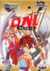

[ONI-5：隐忍继承者](https://pewae.com/gaan/aHR0cHM6Ly93d3cuZG91YmFuLmNvbS9nYW1lLzM0OTg3Njc1Lw==)

原名：ONI V 隠忍を継ぐ者机种：GB厂商：BANPRESTO类别：RPG发行年月：1995-03耗时：11

[自制攻略](https://pewae.com/gaan/aHR0cDovL3dpa2kucGV3YWUuY29tL2Rva3UucGhwP2lkPXdpa2k6Z2I6b25pX3ZfJUU5JTlBJTkwJUU1JUJGJThEJUU3JTlBJTg0JUU3JUJCJUE3JUU2JTg5JUJGJUU4JTgwJTg1)
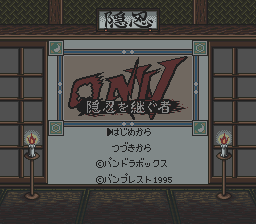
当年砖头机的盗版合卡上，这是款经常出现的游戏。但我在真机上没打穿玩过，一小会儿就放弃了。因为初期实在太tm难了！加上没有攻略，地图也不是太清楚，所以没玩多久就搁置了。

但是电软上时不时来篇秘技，搞得人心里痒痒的。偏偏正刊一直都不出攻略。直到99年的把攻略出在《绝对GAMEBOY读本》上。
高考完了，攻略和两部GB都被我带去了沈阳。然而头一个月都在玩口袋金银，一个月之后配了电脑，GB就落灰了。
后来模拟器盛行，在模拟器上开整。到一多半的地方，卡关，有个关键的回马枪电软的攻略没说。
没过多久，硬盘挂了，所有资料丢失。没想到这一搁置就是15年。
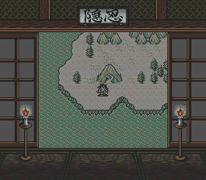

作为一个RPG，这游戏的初期太tm难了！系统指令繁琐，小杂兵出现特频繁而且攻击力高，还变花样，有的必须变身才能打得动，有的则物理攻击无效只能用魔法。要知道不能平A的RPG是非常讨厌的。
唯一好的一点是可以设置自动攻击的战术，所以这款游戏是可以用罐头瓶子大法练级的：设置好自动攻击的战术和加血策略，找一个罐头瓶或者字典什么的压住方向键，然后坐着等。还不能等太长时间，牧师没魔可就悲剧了。
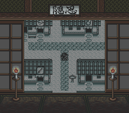

出品方是眼镜厂。您还是去搞您熟悉的机器人吧。这游戏做得乏善可陈。
题材是穿梭现在和过去。问题是现在跟过去根本没什么差别，从系统到敌人，只是把地图做得乱糟糟的而已。
敌人几乎都是日式特色妖怪，种类也不多。
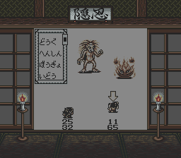
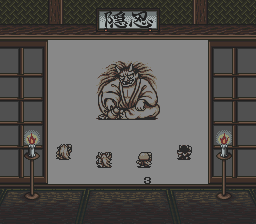

魔法……还算华丽吧。其实效果还可以，用“清秀”来形容可能更好。
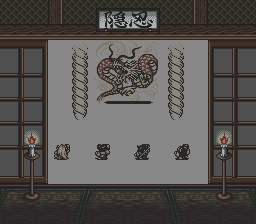
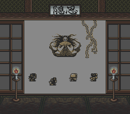

角色都是这“丸”那“丸”。唯一的女性角色可能是因为没长“丸”吧，反正不叫啥丸。
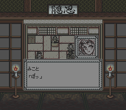

帮助主角穿梭时空的什么博士，长了一张活该被手撕的脸。
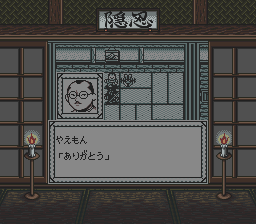

前期特别活跃的反派，最后打的时候特别脆，就知道肯定不是最终boss。果然只是个死跑龙套的。
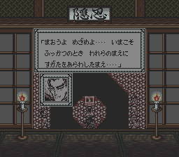
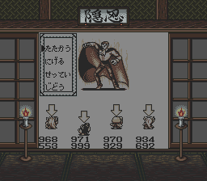

这个才是最终boss。血巨长无比。我都改满了还打了15分钟才磨死。
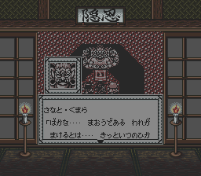
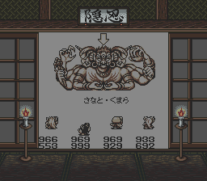

女主要回到过去了。这才是沙扬娜拉的正确用法。
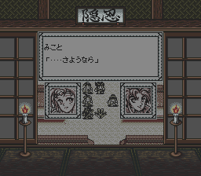

通关！结局画面应该是三个男主变身魔人的样子。然而这个设定除了麻烦没什么卵用。
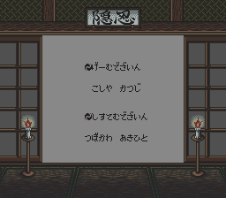
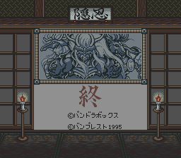