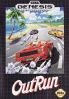

[OutRun](https://pewae.com/gaan/aHR0cHM6Ly93d3cuZG91YmFuLmNvbS9nYW1lLzI1Nzg0NDg0Lw==)

别名：户外大飙车机种：MD厂商：世嘉类别：RAC发行年月：1991-12耗时：0.5

秘技:
1.在有START和OPTION的画面上,按11次A,3次B,8次C,START。这时会进入超级option画面（背景变为红色）。可以选关。另外在模式里增加了一个HYPER模式，该模式下不会翻车。
2.最终结局。通关后在输入名字的地方输入ENDING，可以看到最终的结局。

这是本人第一次介绍RAC游戏。因为我确实不喜欢这个类型。主观上自己不是个操作系，反应总慢半拍；客观上RAC游戏总需要按住油门，累手。
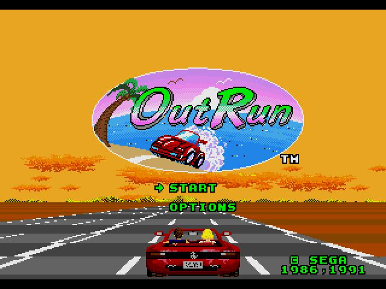
本作是1991年世嘉为MD造势而特意移植的大型机作品。出品人是大名鼎鼎的SEGA AM2的铃木裕哦。
在赛车游戏里，out run算比较休闲比较简单的，难度并不高。A/C加速，B刹车，上下键换档。
当你觉得自己开的挺好但周围却没有其余的车的时候，一定要瞅一眼档位，很可能是不小心换回低档了。
每关临近终点的时候有一次选择路线的机会。不同的路线难度相差不大，但风景不同。
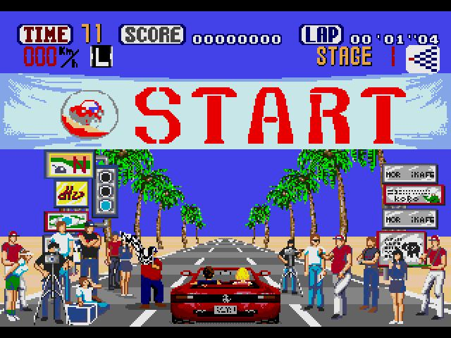
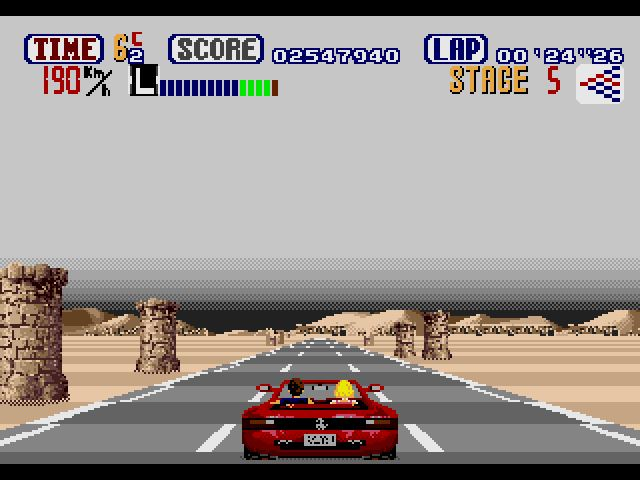
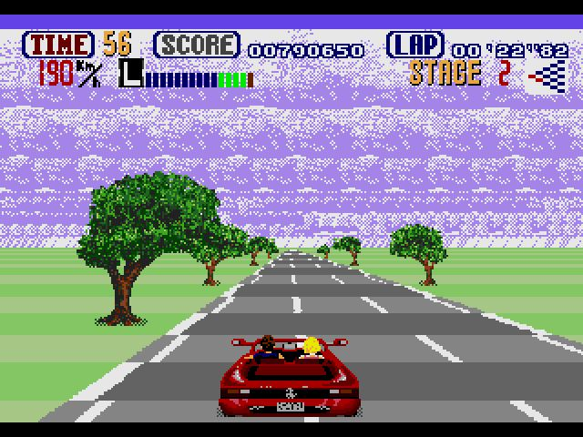
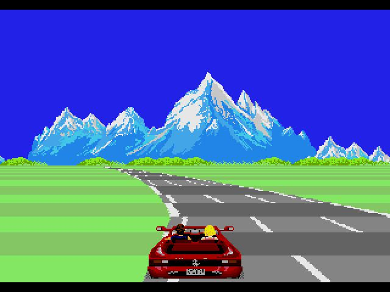
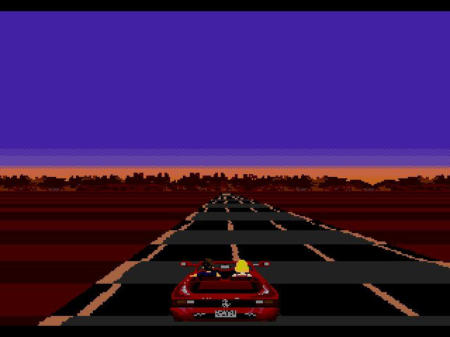
共有五种结局。其中ABDE区别不是很大，唯有C会出现骆驼，被称为完美结局。
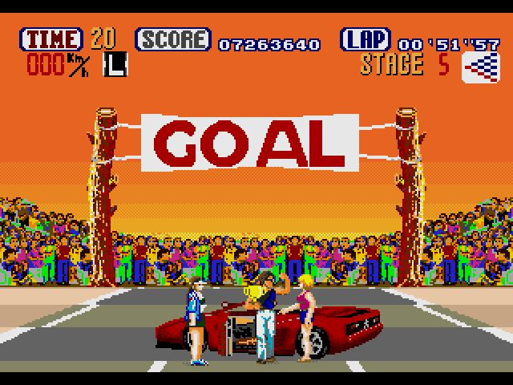
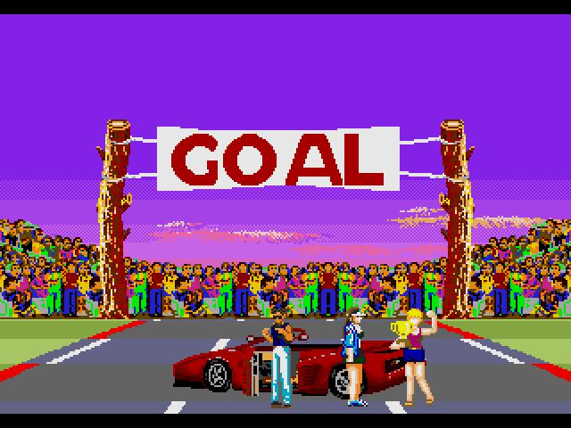
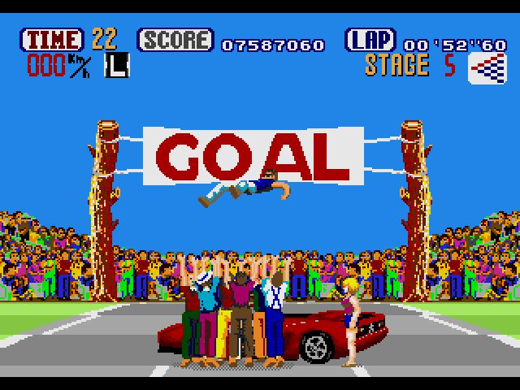
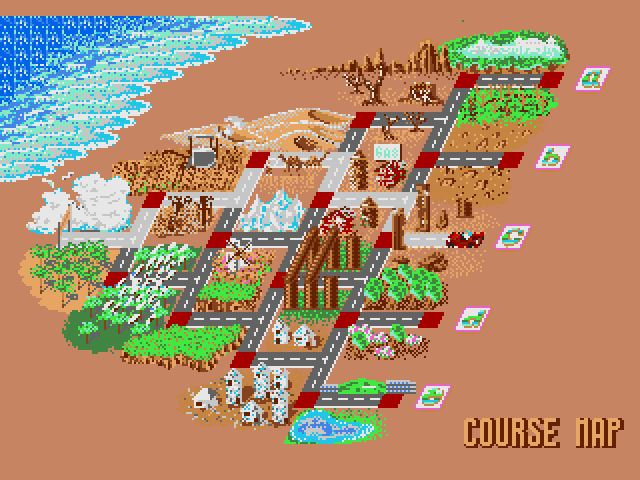
下面是线路C的“完美结局”。完美结局出现的时候连续按C，会出现第二张图的里完美结局。
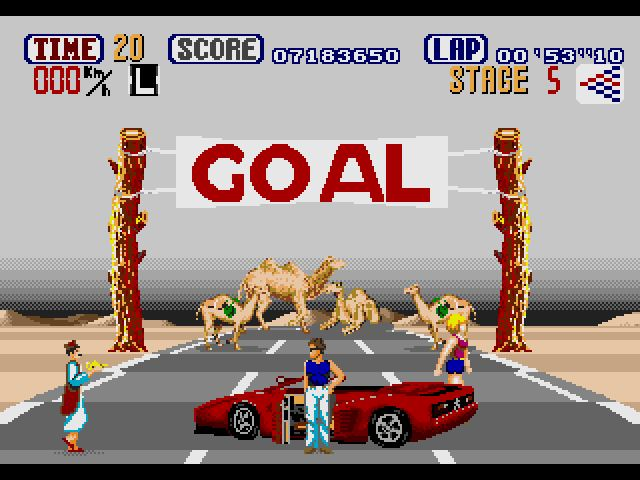
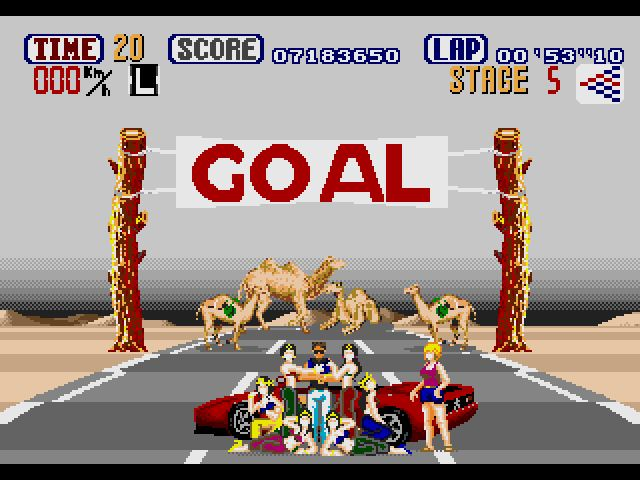
秘技1成功的话，option画面背景会变成红色
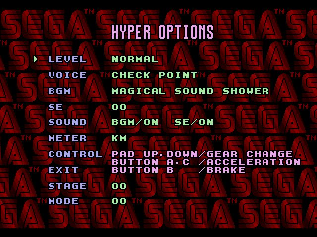
秘技2输入的时机
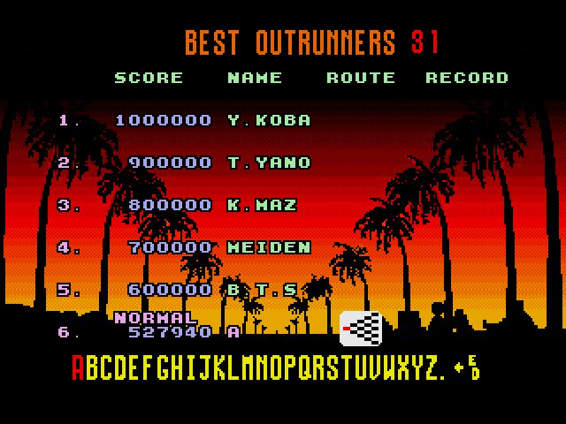
半路翻车
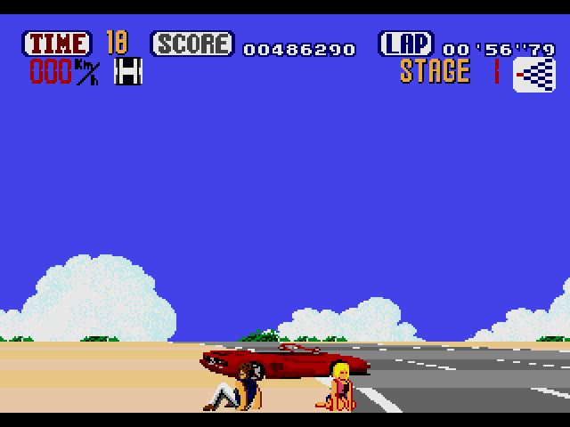
秘技2得到的最终结局
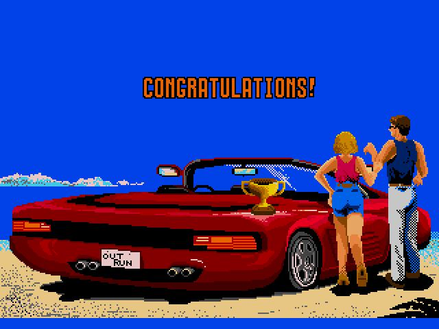