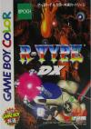

[R-Type DX](https://pewae.com/gaan/aHR0cHM6Ly93d3cuZG91YmFuLmNvbS9nYW1lLzI1Nzk1NTY3Lw==)

别名：异形战机机种：GBC厂商：Bits / 任天堂类别：STG发行年月：1999-06耗时：7

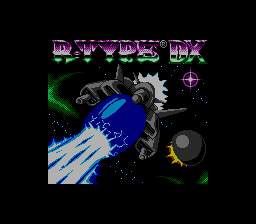
R-Type在香港被译作“异形战机”，当年的电软直接用了R-Type这个名字，所以我对港译名并没有多少感触。
倒是DX二字颇有来头。话说1998年10月21日，跟GBC同日发售的首发游戏里，任天堂就炒了一款冷饭《俄罗斯方块DX》，后来不久又来了《塞尔达传说～梦见岛DX》，其实就是在原有Gameboy游戏的基础上，重新上色制作成彩色版，并增加了一些新关卡小彩蛋，号称豪华（Deluxe）版。也就是说，DX二字差不多等同于“骗钱”。
在英语里，Deluxe是个法语外来词；而在日本以外的地方，很少有人把Deluxe缩写成DX——デラックス取头尾再转换成英文就是DX，但把重音“la”给丢了……
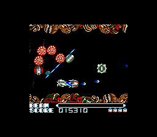

一般带DX的都是任天堂本社的作品，IREM却来凑了个热闹,在原有黑白版的基础上增加了一个Deluxe模式，除了颜色变化，没觉得多了什么。但仅就颜色变化已经足够了，相当于4色到8色的进步，一个数量级呢。而且本作的颜色配得特别舒服。下面第一张是模拟器跑真彩色时的截图，第二张则是后来找到了模拟GBC液晶颜色的效果，柔和了很多，但跟真机仍旧有差距。
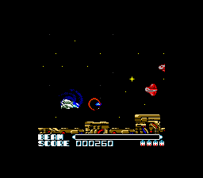
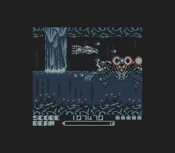

R-Type街机版的素质非常高，在IGN的十大硬核（HardCore）游戏中排名第七。它最早开创了副枪可以放出去打的模式，配合前后变化，使得很多关卡的战术变得丰满。这种副枪外放的模式后来被著名的1945系列发扬光大。
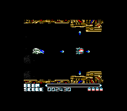

不光是火力系统有特色，本作的关卡背景也非常复杂，不再是一个放枪+躲子弹的游戏——你还得背版子。一旦攻击模式或者走位不正确，很容易穷途末路的。
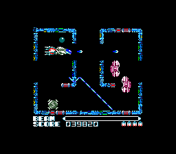

当年真机上，只能打到第三四关的样子。从汤球球手上接过二手GBC的时候，是不想接这盘卡的。汤球球给R-Type+DQM一起作价35，单DQM要价30。贪便宜整回来的。
其实还是傻，他机器都卖给我了，卡带剩手里还能下崽儿不成！

要说始于1979年的《异形》真是伟大的系列电影，影响了无数的衍生作品。港译“异形战机”还是有一些道理的，因为本作里的R-Type指的就是类似异形的量产的没脑子的外星生物。看看BOSS们的样子就知道了，很外星。
前几张是真彩色的，后面的是模拟液晶配色的。
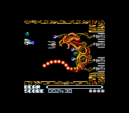
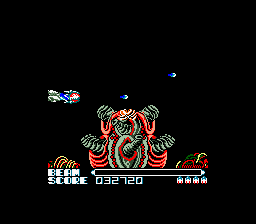
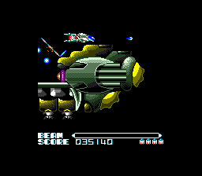
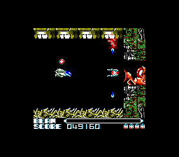
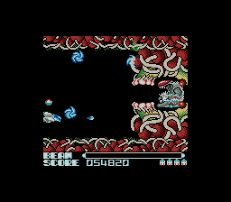
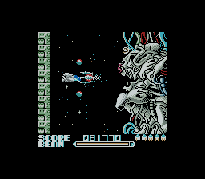
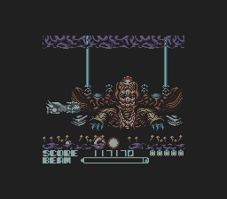
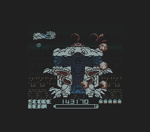
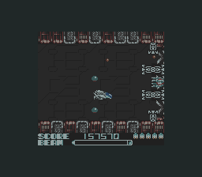

最后的BOSS没什么特色，而且还可以有直捣黄龙的操作。
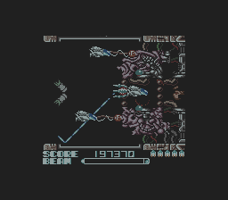

通关！注意到那个坑爹的命中率了吗？所谓的Hardcore要素可能就是这些地方了吧，Who cares。
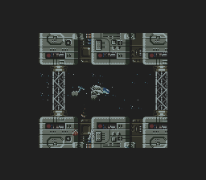
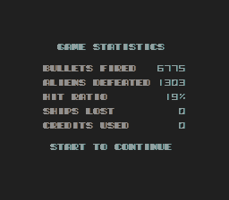