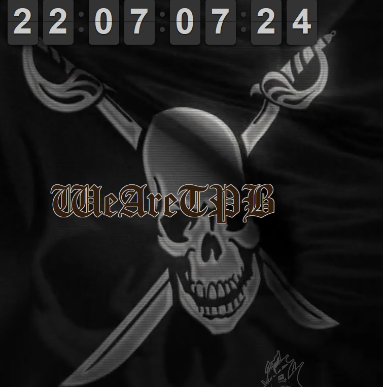

*在雨中 我送过你
在夜里 我吻过你
在春天 我拥有你
在冬季 我离开你
有相聚 也有分离
人生本是一段戏
有欢笑 也有哭泣
不知谁能 谁能躲得过去
…
–刘家昌*

**2014.12.05 极影BT发布页**
极影本就是贪婪大陆（greedland）的替代品。之前打击bt的那会儿，贪婪跟着挂了；这个冬天打击字幕组，极影的发布页又成了人人的陪葬品。因为不追美剧，所以人人挂掉的时候还没怎么感慨，但转过天来极影也连不上了，这可真要了亲命。虽然结婚以后已经不怎么追新番了，但三大民工动画里还在连载中的那两个还是要追的，看了10多年的柯南还是要继续的，复刻版的龙珠也还是要怀旧的，新制的乔乔也是要品鉴的……虽然像上次贪婪挂掉一样，很快找到了替代品，但这种感觉真的不舒服。有点儿像当年小品《超生游击队》里的黄宏和宋丹丹，这东躲西藏的日子，啥时候是个头儿呢？！诚然，十多年来我们看的是盗版，但我们有正版可看么？《航海王》跟《海贼王》是同一个东西？搞siao呢么～
虽然只是一个小小的发布平台，但极影做得已经够多了，感谢。

**2014.12.14 海盗湾**
说来巧，正好赶上了海盗湾前一秒还能访问，后一秒无法解析的那个当口儿。因为那天写东西，发现自己收藏的《天书奇谭》已经读不出来了，一时找不到高清版本，就想去海盗湾碰碰运气。鉴证到了海盗湾被抄家的历史时刻的我却没有自觉，没留下个截图做纪念什么的——当时只是以为我的SSH出口端屏蔽了海盗湾，毕竟它在全球范围内是“臭名昭著”的。第二天上推才知道，瑞典政府把海盗湾给突然袭击了。
从道义上讲，海盗湾提供了全球70%的盗版影音内容，而其中的35%又是色情内容，这在全球保护版权的大环境下绝对是异端，绝对应该被打入十八层地狱。但是，对于我这种常常为猎奇心理驱动的怀旧老骨灰来说，许多长尾的“尾巴”上的内容，往往是在出版后的5-15年才得到资讯。被奉为经典的还好，许多糟粕怕是连当时的主创人员都不愿意再提了。这时，海盗湾就成了我唯一的归宿。只有在这里，我才能找到高中时期steps乐队的整套专辑、西村喜广拍的不知所云的血浆片或者1080p的《一部塞尔维亚电影》、《下水道人鱼》、《人体蜈蚣2》这样反人类的极品。
当然，还有那35%。业界良心那边只是黄皮肤的比较强，花样翻新还得上海盗湾……呃，难道真有人翻墙是为了上facebook？别扯了！
期待海盗们的卷土重来。

**2015.01.08 fqrouter**
非常非常意外。作者在最终留言上说，他认为对抗现今的高墙已经不是技术上的事儿了，所以就不弄了。这东东非常之好用，以至于手机上连SSH工具都没装。但人开发者说感觉不到挑战了，你还能说啥？免费的工具就这特点，有上顿没下顿的。
开发者，好运。

**2015.01.08 动感新时代/动感新势力**
跟上面三个不同，这是一份杂志。跟上面三个死法也不同，这份杂志是被生生憋死的——它没有拿到15年的杂志出版号。实事上，几年前的扫黄打非把它列入黑名单后，它就一直处在非常险恶的环境中，到了15年，终于死了。其实跟这份谈不上有多少感情，只在初期买过几期。关注是因为它的出身——它早先是《[电软](https://pewae.com/2012/02/who-remembers-the-gamesoftware-magazine.html)》的子刊，曾经的主编是电软著名撰稿人Akira。继12年电软无疾而终后，动新也没了。电软系团灭。
光腚总急你手敢伸得再长一点儿不？
R.I.P.

宅男给国家浪费电，宅男给国家浪费纸，但宅男也给国家节约警力啊！像埃及那样把宅男都整到街上茉莉花好啊！？对于某总来说，这帮死太监真是一群猪队友。

P.S：其实还有一份，但写的时候展开得太多，而且放一起有些不敬，整理整理择日再发。