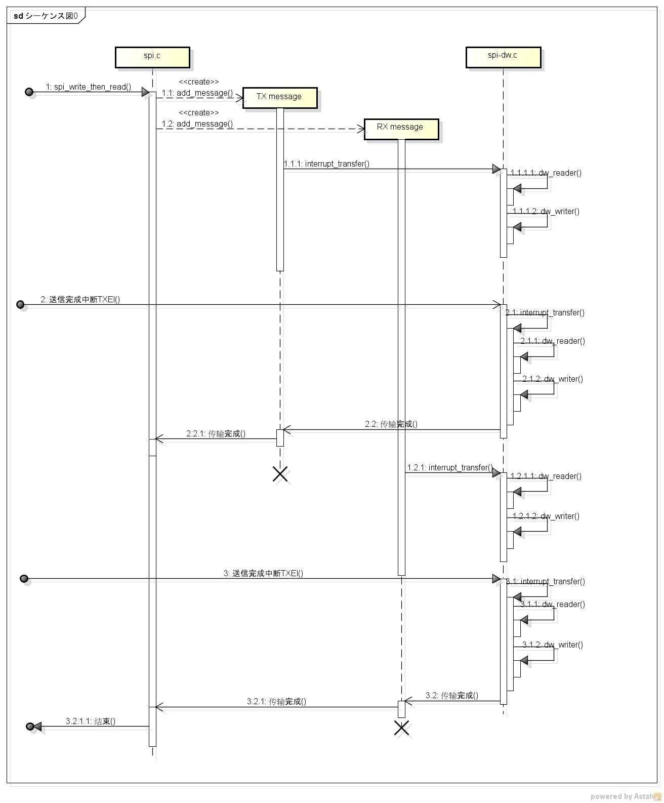
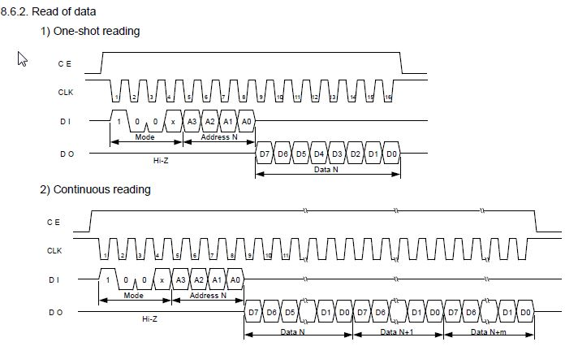

EPSON的时钟芯片RX4803，其官网上给出了一个[驱动的例子](https://pewae.com/gaan/aHR0cDovL3d3dzUuZXBzb25kZXZpY2UuY29tL2VuL2luZm9ybWF0aW9uL3N1cHBvcnQvc29mdC9yeDQ4MDNfazMuOC12MS4wLnppcA==)。但在实际使用中，该驱动配合Synopsys DesignWare SSI标准的SPI驱动（spi-dw.c）无法对rx4803芯片进行操作。

**先说结论：**
SSI SPI与RX4803采用SPI_CPOL | SPI_CPHA方式进行接续时，无法使用SPI的spi_write_then_read()函数进行数据通信，必须改用同步接口才能正常通信。

**然后分析原因：**
spi_write_then_read函数调用的时候，spi.c会将命令请求拆分成两个message，发送给实际的底层驱动spi-dw.c。spi-dw.c（内核版本4.7.2）的消息处理函数interrupt_transfer会被调用多次。其时序图如下：
以单独的取时间函数rx4803_get_time为例，说明一下按原来时序，整个通信过程是如何操作的。

I。写消息处理
1.1.1.1，通过长度判断不读取，读0byte。
1.1.1.2，写入命令0x90，写1byte。
II。第一次中断处理。
2.1.1，读1byte，由于4803的特性，这一个byte值为0xFF，正好废弃。
2.1.2，写0byte。
III。读消息处理
1.2.1.1，通过长度判断不读取，读0byte。
1.2.1.2，写7个byte。
IV。第二次中断处理。
3.1.1，读7byte，这一部分是有用的数据。
3.1.2，写0byte。

然而理想是丰满的，现实是骨感的。问题出在步骤2.1.2跟1.2.1.2的衔接上。datasheet中Read的波形说明图很好地给出了解答。

请注意CE管角的电平。当SPI端采用SPI_CPOL | SPI_CPHA连接，意味着4803的ENABLE由bus控制，只有在数据进行传输的时候，才会将电平拉高。第一个消息跟第二个消息之间，消息的弹出需要相～当～长的一段时间。在这段时间内，使能管角被拉低后再次拉高了。所以对于RX4803芯片来说，第二次接收的就成了一个新命令，而不是原有命令的延续，所以当然会返回一连串的FF了。实测两次写入间打个printk都会被当作两个不同的命令，就更不要提消息处理这么大的时间间隔了。

即使把SPI的工作模式设成polling模式也是无用。polling模式虽然是先读后写，但两个message之间的时间间隔仍旧无法避免。

**最后是解决方案：**
其实找到了原因就很好解决了。只要让读写不被分割成两个message就好了。spi.h里本身就有一个spi_sync()接口，可以直接拿来用。只是该接口看起来比较恶心，简单封装一下，就万事大吉了。其实RTC命令最长的也就8个byte，也根本没有分开的必要嘛。

```
int spi_trans_sync(struct spi_device *spi, void *transbuf, unsigned len)
{
static DEFINE_MUTEX(lock);

int			status;
struct spi_message	message;
struct spi_transfer	ts;
u8			*local_buf;

if ( 0==len )
return -ENOMEM;
local_buf = kmalloc( len, GFP_KERNEL | GFP_DMA);/*照搬其他函数，可能不另申请内存问题也不大。*/
if (!local_buf)
return -ENOMEM;
spi_message_init(&message);
memset(&ts, 0, sizeof (ts));
memcpy(local_buf, transbuf, len);
ts.len = len;
ts.tx_buf = local_buf;
ts.rx_buf = local_buf;

spi_message_add_tail(&ts, &message);
/* do the i/o */
status = spi_sync(spi, &message);
if (status == 0)
memcpy(transbuf, ts.rx_buf, len);
kfree(local_buf);

return status;
}
EXPORT_SYMBOL_GPL(spi_trans_sync);
```

以上就是上个月我调查了接近一个礼拜的问题。希望能给同样做驱动的难兄难弟以帮助。本人写驱动也是摸着石头过河，理解也不一定正确。有问题欢迎一起讨论。