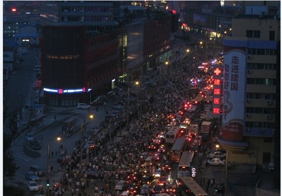

臭宝幼儿园旁边，新开了一家“京城皮肤病医院”，大概快一年了吧。广告做得蛮有创意：

> 血（xuě）干净，blabla

“血（xiě）”在大连话里是副词，特别的意思，“血干净”也是使用特别频繁的组合。这句广告巧妙地利用了大连话的“血”字做双关。可惜后半句完全记不住，也不知这样的广告在我这儿算成功了还是失败了。
不管成功失败，在广告上是有提到牛皮癣白癜风有XX%的几率完全治愈的——所以这广告新年过后一夜之间消失了。
灯同学30多年的祖传牛皮癣，在他的熏陶下20多年前就知道所有自称能根治的都是耍流氓。去年那个被他奉为神医的老头，也只是保证他五年不大规模发作而已。
由此看到铺天盖地广告的时候，就知道又一个骗子来了。

论到广告，就不得不提小几年前公交上广播里漫天宣传的“星海医院”。其广告词为“星海医院不在星海，而在南石道街”。
——一句想要吐槽却不知从何说起的话。

建国医院是11年反PX事件里的最大受益者。

老丈人勤（tan）俭（xiao）持（pian）家（yi），蓝天医院塞门上的软文杂志被他收集起来，吃鱼的时候撕下来接鱼刺用。一天臭宝吐完鱼刺，指着纸上的照片问：“妈妈，这个阿姨怎么了，怎么这个表情？”
老婆大人遂暴怒，把老丈人攒在门边的半人高的废纸全扔了。

吾友小X，若干年前不听劝阻，非要去阳光医院而不是公立医院做皮包环切，说环境好。术后主治老头要他每天去烤红光，美其名曰好得快。小X每天都问：“还要烤几天？我自己吃点消炎药行不行？”老头儿每天都说：“再烤烤就好了。”
第六天上他再也受不了了，落荒而逃。喝酒的时候，跟我说：“大致，一次红光120啊！而且那老头还建议我去查前列腺，我qnmlgb，彪一次还不够啊！”

家族的一个朋友，李大大，退休前是某公立医院的外科主任。退休后觉得自己还能接着干，在朋友的介绍下去了渤海医院。待了两天受不了，回家了。
“也不让我去坐诊，老板和些个医药代表来给我上课——什么药利润大，还有如何根据病人的衣着和语气判断他能花多少钱在这个病上……”

长城医院就开在我家边上。每天上下班都会路过。
两年前的一天，这个医院被一伙黑衣人堵住了大门。拉起的白底黑字大横幅上写着：“做引产能死人吗？”

欺骗性最高的是四〇三医院。一个医院两套牌子，另一个名字是“黄海医院”，部队医院的名头是个噱头，内部哪些科室被承包了出去外人永远搞不清楚。
我去看膝盖，一老头捏了两下，说：“吃药吧。”
我说：“我们单位有保险，麻烦你给开范围内的药。”
老头刷刷刷给开了两种药，每种5盒，一共一千二百多块。其中有种叫“XX素”的药，回家一看根本没批号，连健字都不带。没敢吃，直接扔了。
收单的保险专员看到我的单子就一楞：“你怎么跑四〇三去看病了？”
我：“离家近啊。不是说大连市所有的医院都是医保范围内的吗？再说他家软伤科不是挺厉害的吗？”
保：“单子我收了，以后别去了，那家医院有问题。得让你们办公室发个邮件，不能去四〇三和武警。”
那种没批号的药，保险公司终于是没给报。