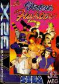

[VR战士](https://pewae.com/gaan/aHR0cHM6Ly93d3cuZG91YmFuLmNvbS9nYW1lLzI1ODc0OTE4Lw==)

原名：Virtua Fighter别名：VF机种：32x厂商：世嘉类别：FTG发行年月：1993-12耗时：3

虽然我对格斗游戏尤其是3D格斗游戏不太感冒，但VR战士的大名却如雷贯耳。1994年买到的第一期[电软](https://pewae.com/2012/02/who-remembers-the-gamesoftware-magazine.html)，封面就是结城晶为首的VR战士。
可以说，94年作为SS首发游戏的VR战士，带来的是颠覆性的震撼。VR战士是家用机上第一款3D格斗游戏。
尤其，杂志上把世嘉AM2研的实力吹得神乎其神，什么从河北沧州专门找了几个拳师，为他们作动作捕捉。
嗯。在没有武林大会的年代里，我确实是靠着VR战士才知道有八极拳贴山靠这回事的。
![[32X]_Virtua_Fighter_005](./images/d9c019552964a62a568b613e1ee3ef31.jpg)
本作是先出的街机版，然后是土星版，MD-32X版出得最晚。MD-32X可以说性能非常不赖，除了多边形数量稍显不足以外，流畅度操作性帅得一塌糊涂。只能说32X秉承了世嘉一直以来的生不逢时+定位不明的传统。世嘉在32X上推出VR战士的理由是,“让买不起土星的玩家也可以在家里玩到3D格斗游戏”，可是即使这样也没能带动32X的销量。隔壁的PS马上要起势了。
本系列的译名也比较有趣。Virtua应该取是“虚拟”的词根。但国内一直叫做VR战士这种半中半洋的名字。后来又有缩写成VF或者VRF的，其实全系列的名字都没变过。翻译成《虚拟战士》是不是就显得完全没气势了？
![[32X]_Virtua_Fighter_000](./images/a5c7b32a0dff7bf7060f27b3478e155e.jpg)
我玩格斗游戏的原则就是，有女的就一定要选女的。
莎拉也算得上是老牌女性格斗家了，从一代一直活跃到最新的五代。
看看这青涩的样子。我也是才知道她竟然姓布莱恩特！
![[32X]_Virtua_Fighter_001](./images/96438f508592ecf163ea45be2771076a.jpg)
请不要看到这粗糙的多边形就把它束之高阁。相信我，本作的动作和打击感非常出众。不需要搓太多的大招，你觉得应该用拳脚投，就怎样去拳脚投。我觉得随心所想和拳拳到肉是对一个格斗游戏最好的评价。
![[32X]_Virtua_Fighter_006](./images/8ca8794389c9dcbf4de4a7f6a33a13db.jpg)
![[32X]_Virtua_Fighter_007](./images/431857a5a9799519aa68560a43616bda.jpg)
最终boss。
通关。
![[32X]_Virtua_Fighter_003](./images/b9e89028071d72df5731b31070aeecc7.jpg)
![[32X]_Virtua_Fighter_004](./images/e5fe2d413ec00bcc515035574d698b39.jpg)