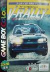
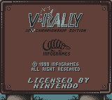
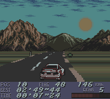
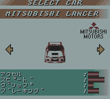
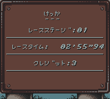
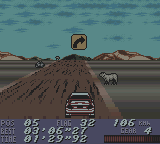
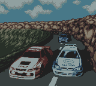

[V世界拉力锦标赛](https://pewae.com/gaan/aHR0cHM6Ly93d3cuZ2lhbnRib21iLmNvbS9uZWVkLWZvci1zcGVlZC12LXJhbGx5LzMwMzAtNzUxMC8=)

原名：Need for Speed: V-Rally机种：GBC厂商：bit / Infogrames类别：RAC发行年月：1999-10耗时：3

每次选“V”开头的游戏都是最痛苦的。好在这是最后一次了。
世界拉力锦标赛是个很大的系列，各个平台各个时期的作品都有。
GB上这款的制作公司是infogrames。

这是款比较中规中矩的赛车游戏，有四款赛车可选，赛道的话，EASY、NORMAL、HARD关卡各有不同。
其实玩起来差别不大，只是路边的路障有不同而已。这些路障不论是高大的仙人掌还是低矮的石块，共同点就是——撞上就翻！
赛车游戏是我最不擅长的游戏类型。要不是有即时存档帮助，我根本打不了通关的。

嗯。这可能是这个系列以来倒数第二敷衍的游戏介绍了。
通关！
