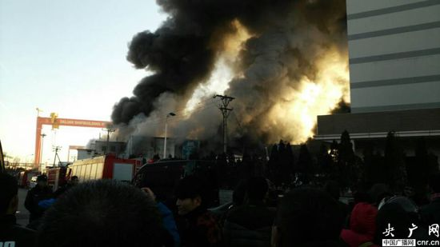
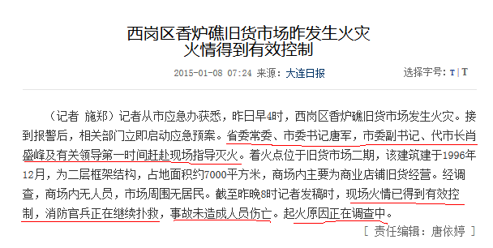

昨儿凌晨，香炉礁旧货市场发生了火灾。事发地点离我家直线距离不到一千米。

因为家几乎在旧货市场平行的西面，昨天又几乎刮的正北风，所以家里味道还没那么强烈。但南边的大半城区就没那么好运。比如我姑娘的幼儿园，老师上午就在微信群里劝家长把孩子接走。“幼儿园里烟味太大。”是啊，能不大嘛！旧货市场只是沿袭下来的旧称，其实里面主要经营的是劳保用品和建材。什么皮手套线手套电线油漆安全帽泡沫海绵油毡纸……除了化纤就是橡胶。这家伙烧将起来，味道不要太爽！
火几乎着了一天。晚上下班回家的时候，天已经黑了，仍旧能看到天空中被北风带出来的烟。有好事儿的朋友晚上8点多驱车去看眼儿，说仍有隐约的火光。

可这么大的事儿，在咱本地官媒上简直就是赖蛤蟆放屁——好大的动静。本地两份阅读量最大的“都市报”——昨天还来不及采编的话——今天也应该有跟进有展开吧？没有，只字未提。党媒官网则是一篇满是狗屎味道的官样文章。嗯嗯，估计明天这坨狗屎会一点儿不差地照搬到两份地方都市报上。

有死党曾经在这两家报纸之一工作过，喝酒时曾经诉苦：“TMD来个台湾团，连个没死人的交通事故这样的屁事儿都不让报，怕影响招商……”所以这等大事儿，神马委神马部还不风声鹤唳噤若寒蝉？尤其哈尔滨那边才烧死5个烈士、国务院6号才开了大半天的安全生产电视会议——大佬们屁股都快坐出褥疮了，你这厢就出这等事儿，这不上眼药么？

香炉礁旧货市场这儿真可以说是块“旺地”。大同街旧货市场搬迁甫一搬迁过来，这次被烧的大厅还没盖好的时候，自由形成的集市就小规模着过一次；这大厅盖好以后，大概是我上大学的时候（2000年左右），又着过一次——当时本地的电视节目还做了两期特别新闻。所以这地儿本来应该是重点关照对象才对。尤其讽刺的是，旧货市场还是全市最大的防火防爆器材市场。灭火器消防栓什么的，应有尽有，包括应付检查用的空罐子……
消防部门你tm死哪儿去了？主管安全的市局级头头儿都tm死哪儿去了？还有敬爱的X委书记大人，刚把前市长变成现政协书记的你tm死哪儿去了？

唐XX，前年你忽悠百姓、信誓旦旦说PX会搬走的时候的劲头哪去了？本以为能站车上举着收破烂喇叭喊话的，起码是个有担当的，结果咧？PX不就是风头过后鸟悄登了块套套盒大小的“不搬迁通知”就偃旗息鼓了？
真希望不是传闻的那样，是个Xn代，前外长的……
你倒是出来说话呀，你露头啊，别躲里面不出声，我知道你在壳里呐，唐XX，你露头啊，露头露头露头啊……

人……天……

Sorry，这篇博的标题我又玩文字游戏了。其实是《旺的火，铁的心》。