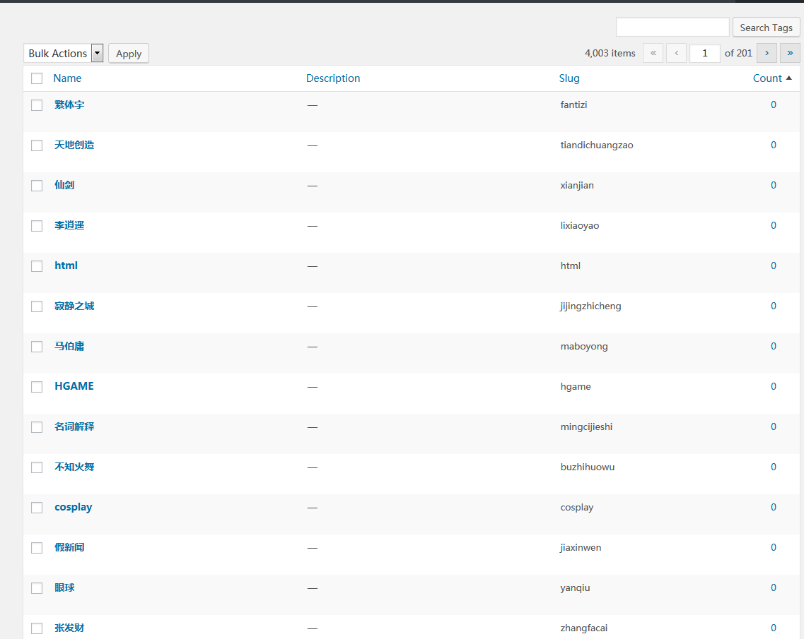
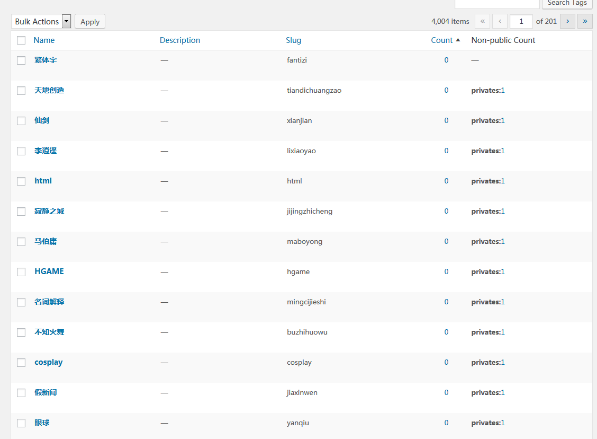

不知道你们是否注意过后台Posts -> Tags 列表中的 Count列？这里其实有个问题，那就是，这以列显示的数字只包括’public’类型的post，而没有统计’private’和’draft’类型的post。如果有自己定义的其它类型的post_type，同样也不列入统计。
对于像我这样，存稿和私密都很多的人来说，这样会产生一个问题：在对tag进行维护时，遇到count=0的，并不能判断这个tag已经废弃了，非要点击一次，进到对应的post编辑页面中，看到post列表为空，才能放心地删除这个tag。


对于程序员来说，多点一次也是不乐意的。经过两天的研究，终于被我找到了在taglist中增加列，显示非public post中tag总数的方法。
主要参考的是[官方文档（墙ed）](https://make.wordpress.org/docs/plugin-developer-handbook/10-plugin-components/custom-list-table-columns/#how-do-i-add-custom-list-table-columns)

往WP_List_Table类中加列需要两步：加标题和加内容。需要用到两个钩子函数，manage_edit-{$taxonomy}_columns和manage_{$taxonomy}_custom_column。
跟以往经常接触的钩子不同，这俩钩子是带参数的。因为我们针对的修改对象是taglist，所以$taxonomy=post_tag，于是这两个钩子变成了：
manage_edit-post_tag_columns和manage_post_tag_custom_column。
所以这种钩子有种局限性，他们容易随着WP版本的升级而改名。

增加标题的代码：

```
function edit_post_tag_column_header( $columns ){
$columns['none-public-count'] = 'Non-public Count';
return $columns;
}
add_filter( "manage_edit-post_tag_columns", 'edit_post_tag_column_header', 10);
```

没任何可说的。

增加内容的代码：

```
function apip_edit_post_tag_content( $value, $column_name, $tax_id ){
$args = array(
'numberposts' => -1,
'post_type'   => 'post',
'post_status' => array('private', 'draft'),
'tag_id'      => $tax_id,
);
$myquery = new WP_Query( $args );   //查询类型为private和draft，并且包含tag_id与$tax_id的所有post。
$p_count = 0; //private count
$d_count = 0; //draft count
foreach ($myquery->posts as $p) {
//对两种类型分别计数
if ($p->post_status == 'private') {
$p_count++;
} else {
$d_count++;
}
}
if (0 === $p_count + $d_count) {
return "—";
}
$term_slug = get_term( $tax_id )->slug; //URL需要tag的slug
$ret = "";
$p_str = "";
$d_str = "";
$url_base = home_url('/',is_ssl()?'https':'http').'wp-admin/edit.php?post_type=post';
if ($p_count) {
$p_str = sprintf('privates:%d', $url_base, $term_slug, $p_count); //加编辑用的超链
}
if ($d_count) {
$d_str = sprintf('drafts:%d',$url_base, $term_slug, $d_count);
}
return sprintf("  %s  %s", $p_str, $d_str);
}
add_action( "manage_post_tag_custom_column", 'edit_post_tag_content', 10, 3);
```

这个函数只对第一个函数增加的column有意义。column中增加了不止一项时，要对$column_name进行判断。
中间用了一次WP_Query。很多人对这个类的使用有误解，认为会破坏主循环。这种认知是错误的。WP_Query调用几次都不会影响主循环的检索结果。影响结果的是have_posts()和the_post()！

改完了，看一下效果就一目了，这下可以直接对计数为0且新统计也为0的tag下手了。
