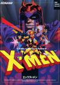

[X战警](https://pewae.com/gaan/aHR0cHM6Ly93d3cuZG91YmFuLmNvbS9nYW1lLzM1NjI0Mzc3)

原名：X-MEN机种：ARC厂商：科乐美类别：ACT发行年月：1992-04耗时：4

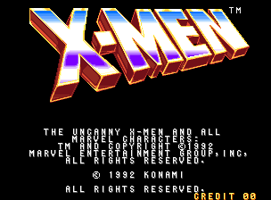
1996年的十一，酒足饭饱之后我嫌屋里烟味太重，下楼溜达。意外发现离奶奶家300米的两栋居民楼之间新开了一家游戏厅。
买了两块钱的币，玩了一会儿就准备离开。
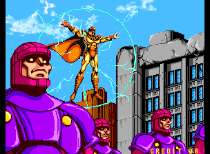

在街厅最后一个币的常规操作，就是扔进“苹果机”里博一把。那天没有选低倍数🍎🍊🍋，而是鬼使神差拍了个20倍的🔔，中了！
那就不能走了啊，就瞄上了此间游戏厅里最有人气的游戏《X战警》。倒不是说游戏本身有多么好玩，而是支持4人同时游戏太抓人眼球了。
我在2P位置上选了金刚狼，剩下3个位置上陆续有人上有人下，打到第二关之后3P上是个高手，我就跟在他屁股后头混，最终用17个币混了个通关，剩下3个币送给了邻居小孩，高高兴兴回家去了。这辈子在街厅打动作游戏，也只豪横过这么一回。
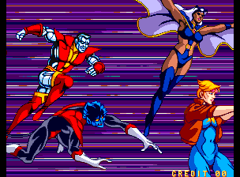

这款游戏的最大卖点，便是最多同时支持6人一起上场游戏了。不知是不是科乐美的机台不如卡婊容易破解的缘故，那些年我在伊尔廷市只在三家游戏厅见过这款游戏，且都是4人机，没见过6人机。不同于《忍者神龟》4只乌龟同时上场时分不清哪个是哪个，本作的6位角色形象还是相当鲜明的。金刚狼、镭射眼、风暴女这御三家之外，还有钢人、夜行者和炫音。
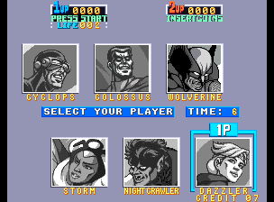
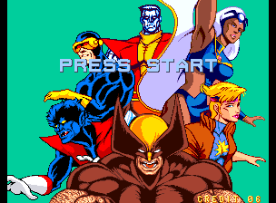

有女的选女的，这部的风暴女形象太磕碜，就选了炫音（DAZZLER）。炫音在X战警中实在是过于不出名了，在维基上都不配拥有一个中文页面的那种。出场的游戏我只玩过这一部，电影版据说也只在几年前的《X战警：黑凤凰》里有过镜头。那个烂片我都看睡着了，没留下丁点印象。按照设定，炫音的超能力是把声音转换成光能。在游戏里就是放保的时候扔出一个大光球。
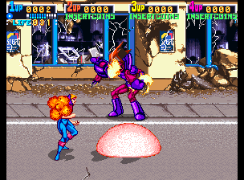

这个游戏的优点和缺点都挺明显的。优点是打击感很好，人物超大，揍起来过瘾。缺点是动作和打法单调，没有加速跑、连续技或者大招，只能一拳一拳地A。
投技倒是威力强大，但是判定又很迷，距离很难把握。
敌人小兵种类过少，流程又长，容易倦怠。
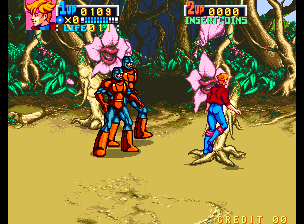
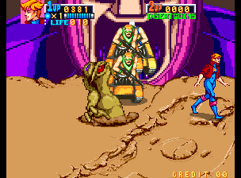
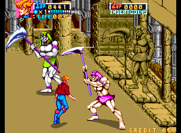

总的说来游戏难度不高，敌人的小兵没有动作特别快的，远程兵的前摇也比较长，容易预判。只有飞行兵能稍微造成一些困扰。困扰的点在于，本作的跳A，是否在最高点A是两个完全不同的动作，太容易用错。
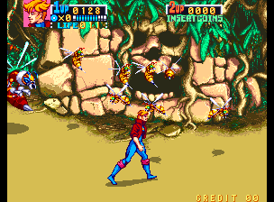

科乐美的清版动作游戏喜欢加倒地追击。本部作品的倒地追击动作非常有魅力，威力也大，很容易上头。
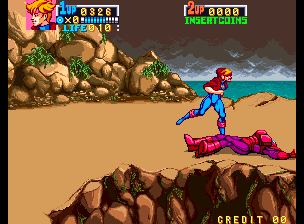
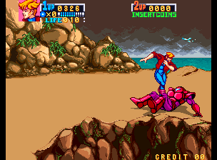

大部分BOSS长得硬，不吃连续的A，只能一拳一拳地摸着打。好在BOSS血量都不咋高，当年的哨兵就是被我不计成本放保轰死的。最后一关见到万磁王之前，还有一组BOSS RUSH，打到这里千万不要傻乎乎地往前冲，要一个一个来。否则把他们全引出来就等着哭吧。
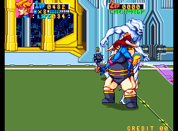

前几关的BOSS或者中BOSS：火人、肉球、Wendigo、哨兵、红坦克、白皇后。
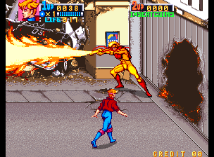
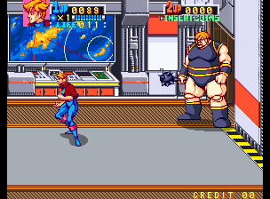
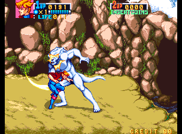
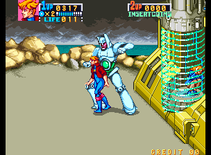
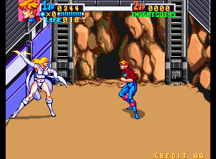
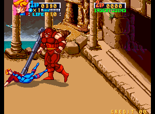

最后当然是打万磁王，第一次见到的万磁王是魔形女假扮的，什么招数都不会，菜得很。
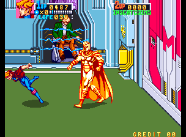
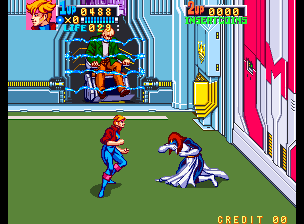

哦对了，游戏的故事主线是救被抓走的X博士和幻影猫。在某年IGN的漫威英雄榜里，这二位排名分列二、三名，也不知道怎么就成了人质了，是分别占了“老残”和“幼弱”么？
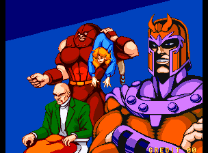

真正的万磁王就很厉害了，能近身能发波，还会开无敌的大电磁场。
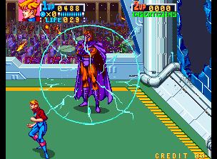
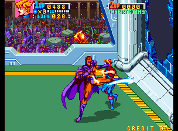

通关！
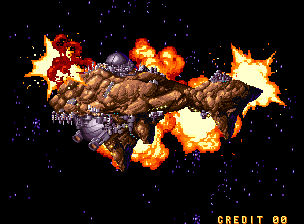
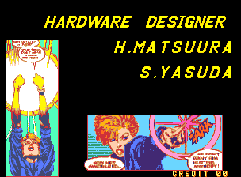
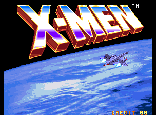