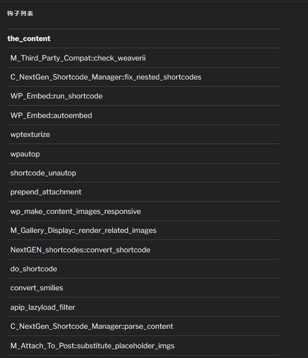

不明白wordpress的filter和action为何物的，不必往下再看。

玩wordpress稍微进阶一点之后，wppers就会明白filter和action机制是WP的精髓所在。除非简单粗暴地修改源码，否则插件php部分的功能的实现都是通过添加或修改各种钩子来实现的。
尤其是开发程度比较高的插件，追求大而全，会在不同的时机伸出各种各样的钩子。可能这些插件的很多功能是用不到的，把用不到的功能空跑一遍当然就会影响速度。这就造成了很多人口中的“插件影响速度”。

然而我是个大插件党。人家写好的功能，何苦自己再搞一遍呢？又累又不安全。
但我一直追求最小功能的原则，会把自己用不到的功能屏蔽掉。小插件还好说，搜一下add_filter和add_action，然后判断一下用途做出取舍即可。可对于源码量上M的重型插件来说，这么搜就是给自己找不痛快。
那么，把某个页面（index/search/page/single）上的钩子打印出来，不就可以了吗？
搜了一圈没找到现成的，只好自己动手。即使是在调试的时候，我也不愿意多打哪怕一行字。所以就作成了widget的形式，只有super user能看到内容。至于单栏爱好者……调试的时候先换成个2017呗？

用法很简单，后台挂上这个widget，在第二栏里填写想查看的filter或者action就可以了，中间用半角逗号分割。回前台刷新就能看到结果。如果是类的成员函数，函数前会显示类名。
不是不能作成打印所有钩子，只是觉得没必要，关注重点区域就好。

下面是代码，想要的收走。

```
class APIP_Widget_Hook_List extends WP_Widget {

public function __construct() {
$widget_ops = array(
'classname' => 'APIP_Widget_Hook_List',
'description' => '显示当前页面的钩子列表',
'customize_selective_refresh' => true,
);
parent::__construct( 'APIP_Widget_Hook_List', '钩子列表', $widget_ops );
}

public function widget( $args, $instance ) {
$title =  empty($instance['title']) ? '钩子列表' : $instance['title'];
$filters = explode(',',$instance['hooks']);
if ( !is_super_admin() )
return;
if ( empty( $filters ) )
return;
echo $args['before_widget'];
if ( $title ) {
echo $args['before_title'] . $title . $args['after_title'];
}
$content = '
```

';
$session = '';
$line = '';
foreach ($filters as $filter){
$tags = $GLOBALS['wp_filter'][ $filter ];
if (empty($tags))
continue;
$session = sprintf('- **%s**
', $filter );
foreach ( $tags as $priority => $tag )
{
foreach ( $tag as $identifier => $function )
{
if ( is_string( $function['function'] ) )
{
$line = sprintf('- %1$s
', $function['function'] );
}
else
{
$cname = is_string($function['function'][0]) ? $function['function'][0] : get_class($function['function'][0]);
$line = sprintf('- %1$s::%2$s
', $cname, $function['function'][1]);
}
$session .= $line;
}
}
$content .= $session;
};
$content .= '
';
echo $content;
echo $args['after_widget'];
}
public function update( $new_instance, $old_instance ) {
$instance = $old_instance;
$instance['title'] = sanitize_text_field( $new_instance['title'] );
$instance['hooks'] = sanitize_text_field( $new_instance['hooks'] );
return $instance;
}
public function form( $instance ) {
$instance = wp_parse_args( (array) $instance, array( 'title' => '', 'hooks' => 'the_content,wp_enqueue_scripts,wp_head,wp_footer' ) );
$title = sanitize_text_field( $instance['title'] );
$hooks = sanitize_text_field( $instance['hooks'] );
?>

==== UPDATE ====
补效果图。twenty seventeen暗色风格，底部sidebar。其实我一句css都没加了啦！
