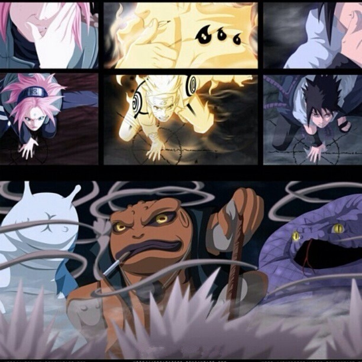
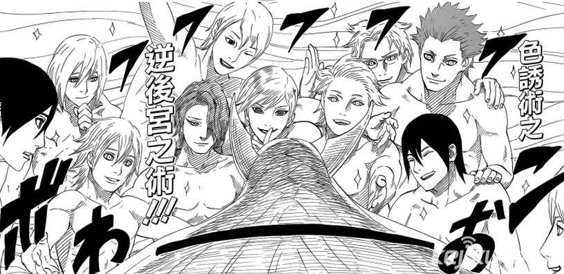
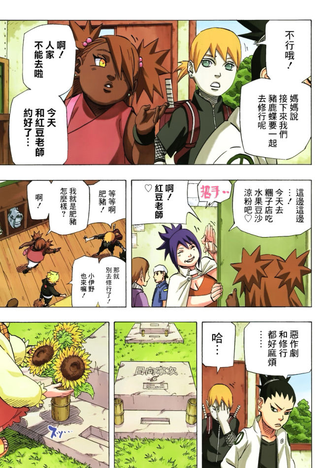

十天以前，听闻《火影忍者》完结，匆忙在手机看漫画的应用上下载了最后的120回（大概是能接上看过的动画的进度），然后用了几天的时间把后面的这点儿内容补完。
多少有点儿强迫症的感觉——终于可以了结了，早死早投胎。匆匆又匆匆，赶任务一样翻过了120回，却没有一丝丝的留恋和不舍。就这么平平淡淡结束，感受什么的完全谈不上。不写点儿什么又心有不甘，毕竟也是十多年上百小时的关注。写哪儿算哪儿吧。

本来，在本人婶婶的脑海里，火影是有特殊地位的。02年暑假的时候，大概是TV版第8集开始就追番，算是本人的第一部从头开始追的长篇动画。甚至于04年出差期间，还特地嘱咐fndhrt童鞋帮忙下载指定汉化组的作品回来时一并刻盘补番，不可谓不上心。

然而只能说动画自己不争气，从佐助夺回战开始，动画版为了同步进度的原创剧情水得一塌糊涂，外传外传不停地外传，木叶十二小强纷纷出来主演自己的小剧场，连木叶小吃店的拉面西施都被绑架了好几次。主线剧情100集都没啥进度，导致关注度大大降低。90多集开始，每周的火影就成了用听的拖的糊弄糊弄就过去了，每集的信息含量少得可怜。
就是这么个态度，从07年一直持续到10年，有了宝宝之后，更是一攒几个月，一次性补十几集只用俩小时。细细想想，也许并不完全是原创剧情的缘故。作品本身的问题似乎更大。

开篇的故事还是蛮有创意的。一个班级里的“拉巴丢”得到一本禁法之后把自己的弱项补成了大杀器。同时埋下主人公身世、第二主人公身世、前期大反派动机几条主线，加上人物个性比较鲜明，所以红是必然的。但从“晓”出场开始，似乎岸本的存稿用光了，质量急转直下。从后续的剧情看，完全有理由怀疑那次结局泄漏事件泄出的就是原本的大纲，导致后来的情节智商不大够用。

第二部《疾风传》完全起错了名字。这分明是《眼球传》好么。练得好不如血统高贵；血统高贵比不上眼珠子牛叉；眼珠子牛叉跟神兽附体不相上下；最后有什么都不如开挂仙人模式。每进一阶，前面曾经牛过的就变成渣渣，这样真的大丈夫吗？看得出宇智波一家的眼球论是整个故事的线索，但也不必把效果搞得那么夸张吧！从轮回眼复活了整个村子那一刻起，这故事就彻底崩了。

讲个老段子。

> 十个男的和一个女的飞机失事掉到一个岛上，过没多久女的自杀了，因为她觉得这些日子过得实在太恶心了。没过多久男的把女的埋了，因为他们觉得这些日子过得太恶心了。没过多久男的又把女的抠出来了，因为他们觉得这些日子过得太恶心了。

——“秽土转生！”

boss能力太强，怎么办？少年漫画中其实不乏“说得”的先例。比如《圣斗士》里的一辉、撒加，比如《七龙珠》里的短笛、贝吉塔，比如《幽游白书》里的飞影，但一来人家反派加入都是在中前期，二来都是主角打服了的手下败将，三来跟倒戈的相比还是被干掉的更多——哪儿有火影这样，大boss见一个说一个的——我爱罗，长门，带土甚至大蛇丸。难怪鸣人最强的能力被吐槽为“言术——化敌为友”。

整个浏览漫画的过程，印象深刻的镜头只有两个。一个是第七小队三人分别召唤出蛤蟆蛞蝓和蛇，感想是：“早知道会有这出。”；另一个是鸣人对辉夜用出了“逆后宫术”，感想是：“尼玛这是在凑字数吗？”

通篇下来，总有一种岸本齐史在抄绝代双骄的感觉。而且跟古龙一样，在单主角跟双主角之间产生过动摇。只不过古龙先生最后坚定了单主角，而岸本始终在摇摆，然而效果确实难尽如人意。最后鸣人和佐助联手打辉夜的场景，因为之前的铺垫不足（主要是佐助游离于剧情之外的时间过长），导致毫无感觉。跟樱木流川的击掌相比，单薄得太多。

第七班的爱情故事活脱脱就是江小鱼花无缺铁心兰第二啊！小樱在两个人之间摇摆不定，最后跟了男二。而男一最后找了爱自己的女二。岸本你是看古龙死了没人跟你打官司是吧？
可能由于漫画年龄层定位的问题，火影里的爱情故事简直就是儿戏。最后的大结局看着一对一对的出场，感想就是呵呵呵呵不断。直到手鞠发型的小胖黑丫头出场——尼玛，鹿丸这是被土肥圆NTR了吗？！

配角的渣化严重降低了趣味性。
除了第七班和雏田以外的九小强在最后的战役里可有可无。鹿丸本是前期最欣赏的角色，在后来猪鹿蝶只联手清了几只小怪；同样还有油女、犬冢和小浓眉；雏田作为女二号不过是多摆了几个花瓶造型；天天和樱井，还不如挂掉的宁次印象更深一点。
五影，那tm是五影唉！除了神兽我爱罗以外，包括纲手在内的其他四个是来跑龙套领盒饭的么？最后要靠着几个僵尸和活死人来帮主角打boss！这么看来成了火影也没什么用啊。
大蛇丸，把佐助扶上马送一程以后就biu～消失了。还有佐助的三个小跟班，除了眼镜娘起到了补魔的作用以外，剩下那俩存在的意义在于当观众画表情凑字数？

叨叨了那么多，大都是缺点。可能在火影陪伴下长大的小盆友眼里我都罪无可恕了。没办法，谁叫咱接触这东西的时候已经过了中二的年龄了呢！可海贼王咋没这赶脚呢。

要说羁绊，还是会有那么一点支持我看动画版的动力。最后一集有一个长大的木叶丸的镜头，好期待大谷育江配成年男子啊！！可万一没台词咋整？