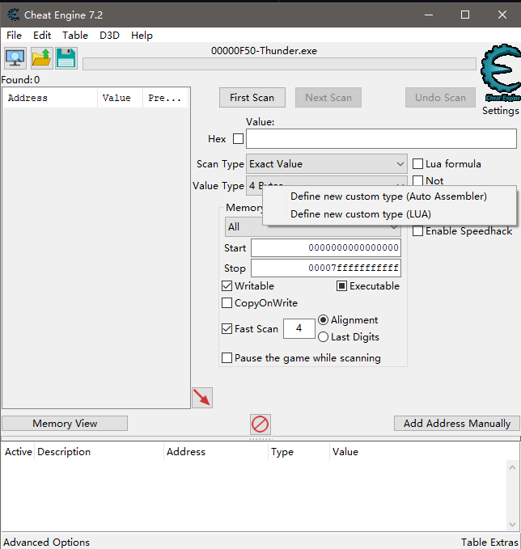
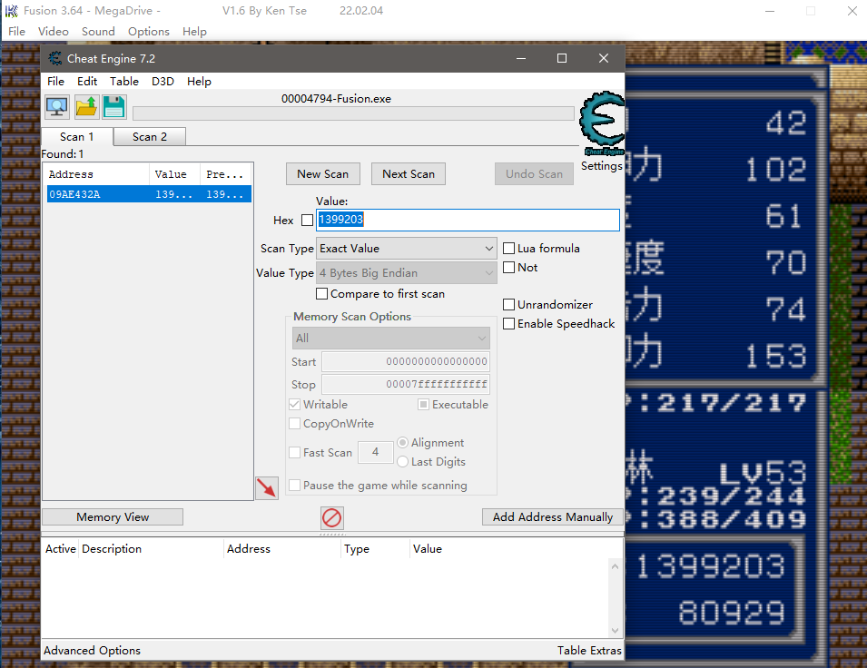

Cheat Engine是当下我所知的唯一好用的Windows下的内存修改器。这个工具有个巨大的缺陷——搜索的数据只能以小端（small endian）排列。搜索双字节或四字节数据时，并不像国人开发的上个时代的FPE或者金山游侠那样，自动转换字节序，只能先用计算器把数据拆成字节，然后用字符串数组才能搜索到结果，非常不便。
今天偶然被我找到了支持多字节大端字节序的方法，特此分享。

来自[作者的github](https://pewae.com/gaan/aHR0cHM6Ly9naXN0LmdpdGh1Yi5jb20vam9yZGFuYnR1Y2tlci8zODRiNjdkMmI3Y2NmNGU0NzhmYjIwYWU4NmIxM2E0MQ==)

照例，我没用过汉化版的CE，故直接用英文菜单描述，如有不便请忍耐。

1.打开Cheat Engine
2.打开任意进程
3.在【Value Type】下拉列表框上单击鼠标右键
4.点击【Define new custom type (Auto Assembler)】

5.用下面的代码覆盖弹出对话框里的代码
6.点击OK
7.重复步骤3-6，把三份代码都添加进去。分别是float的大字节序（Float Big Endian），四字节的大字节序（4 Bytes Big Endian）和双字节的大字节序（2 Bytes Big Endian）。
8.重启CE（否则新添加的工具不好用）

代码1：Float Big Endian

```
alloc(TypeName,256)
alloc(ByteSize,4)
alloc(ConvertRoutine,1024)
alloc(ConvertBackRoutine,1024)
alloc(UsesFloat,1)

TypeName:
db 'Float Big Endian',0

ByteSize:
dd 4

UsesFloat:
db 1

ConvertRoutine:
[64-bit]
xor eax,eax
mov eax,[rcx] //eax now contains the bytes 'input' pointed to
bswap eax //convert to big endian
ret
[/64-bit]

[32-bit]
push ebp
mov ebp,esp
mov eax,[ebp+8] //place the address that contains the bytes into eax
mov eax,[eax] //place the bytes into eax so it's handled as a normal 4 byte value
bswap eax
pop ebp
ret 4
[/32-bit]

ConvertBackRoutine:
[64-bit]
bswap ecx //convert the little endian input into a big endian input
mov [rdx],ecx //place the integer the 4 bytes pointed to by rdx
ret
[/64-bit]

[32-bit]
push ebp
mov ebp,esp
push eax
push ebx
mov eax,[ebp+8] //load the value into eax
mov ebx,[ebp+c] //load the address into ebx
bswap eax

mov [ebx],eax //write the value into the address
pop ebx
pop eax
pop ebp
ret 8
[/32-bit]
```

代码2：4 Bytes Big Endian

```
alloc(TypeName,256)
alloc(ByteSize,4)
alloc(ConvertRoutine,1024)
alloc(ConvertBackRoutine,1024)

TypeName:
db '4 Bytes Big Endian',0

ByteSize:
dd 4

//The convert routine should hold a routine that converts the data to an integer (in eax)
//function declared as: stdcall int ConvertRoutine(unsigned char *input);
//Note: Keep in mind that this routine can be called by multiple threads at the same time.
ConvertRoutine:
//jmp dllname.functionname
[64-bit]
//or manual:
//parameters: (64-bit)
//rcx=address of input
xor eax,eax
mov eax,[rcx] //eax now contains the bytes 'input' pointed to
bswap eax //convert to big endian

ret
[/64-bit]

[32-bit]
//jmp dllname.functionname
//or manual:
//parameters: (32-bit)
push ebp
mov ebp,esp
//[ebp+8]=input
//example:
mov eax,[ebp+8] //place the address that contains the bytes into eax
mov eax,[eax] //place the bytes into eax so it's handled as a normal 4 byte value

bswap eax

pop ebp
ret 4
[/32-bit]

//The convert back routine should hold a routine that converts the given integer back to a row of bytes (e.g when the user wats to write a new value)
//function declared as: stdcall void ConvertBackRoutine(int i, unsigned char *output);
ConvertBackRoutine:
//jmp dllname.functionname
//or manual:
[64-bit]
//parameters: (64-bit)
//ecx=input
//rdx=address of output
//example:
bswap ecx //convert the little endian input into a big endian input
mov [rdx],ecx //place the integer the 4 bytes pointed to by rdx

ret
[/64-bit]

[32-bit]
//parameters: (32-bit)
push ebp
mov ebp,esp
//[ebp+8]=input
//[ebp+c]=address of output
//example:
push eax
push ebx
mov eax,[ebp+8] //load the value into eax
mov ebx,[ebp+c] //load the address into ebx

//convert the value to big endian
bswap eax

mov [ebx],eax //write the value into the address
pop ebx
pop eax

pop ebp
ret 8
[/32-bit]
```

代码3：2 Bytes Big Endian

```
alloc(TypeName,256)
alloc(ByteSize,4)
alloc(ConvertRoutine,1024)
alloc(ConvertBackRoutine,1024)

TypeName:
db '2 Bytes Big Endian',0

ByteSize:
dd 2

//The convert routine should hold a routine that converts the data to an integer (in eax)
//function declared as: stdcall int ConvertRoutine(unsigned char *input);
//Note: Keep in mind that this routine can be called by multiple threads at the same time.
ConvertRoutine:
//jmp dllname.functionname
[64-bit]
//or manual:
//parameters: (64-bit)
//rcx=address of input
xor eax,eax
mov ax,[rcx] //eax now contains the bytes 'input' pointed to
xchg ah,al //convert to big endian

ret
[/64-bit]

[32-bit]
//jmp dllname.functionname
//or manual:
//parameters: (32-bit)
push ebp
mov ebp,esp
//[ebp+8]=input
//example:
mov eax,[ebp+8] //place the address that contains the bytes into eax
mov ax,[eax] //place the bytes into eax so it's handled as a normal 4 byte value
and eax,ffff //cleanup
xchg ah,al //convert to big endian

pop ebp
ret 4
[/32-bit]

//The convert back routine should hold a routine that converts the given integer back to a row of bytes (e.g when the user wats to write a new value)
//function declared as: stdcall void ConvertBackRoutine(int i, unsigned char *output);
ConvertBackRoutine:
//jmp dllname.functionname
//or manual:
[64-bit]
//parameters: (64-bit)
//ecx=input
//rdx=address of output
//example:
xchg ch,cl //convert the little endian input into a big endian input
mov [rdx],cx //place the integer the 4 bytes pointed to by rdx

ret
[/64-bit]

[32-bit]
//parameters: (32-bit)
push ebp
mov ebp,esp
//[ebp+8]=input
//[ebp+c]=address of output
//example:
push eax
push ebx
mov eax,[ebp+8] //load the value into eax
mov ebx,[ebp+c] //load the address into ebx

//convert the value to big endian
xchg ah,al

mov [ebx],ax //write the value into the address
pop ebx
pop eax

pop ebp
ret 8
[/32-bit]
```

搞定！试试效果：
