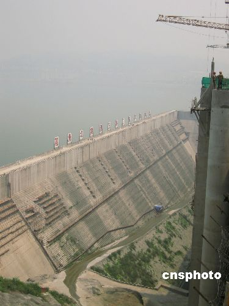

http://news3.xinhuanet.com/newscenter/2006-05/20/content_4575627.htm

为了今后的某年，在讨论炸坝的时候，留下点论据，我把全文贴上来。
最讨厌动不动拿13亿人来说事。你的决策可能是正确的英明的伟大的无与伦比的永垂不朽的功在当今利在千秋的，但俺就是反对行不行？

*五月十九日凌晨四时，三峡大坝主体工程最后一仓一千零一十七点五立方米混凝土开始浇筑，预计二十日上午十一时前全线到顶至一百八十五米高程。
五月底，三峡大坝将具备挡水功能，六月初进行RCC围堰爆破拆除。
图为将爆破的RCC围堰。
作者：艾启平* *中新网三峡工地五月二十日电 题：中华民族”筑”起新的长城*

中新社记者 艾启平 全安华 王士斌

十三亿中国人，一个世纪的三峡长梦，这一刻被浇筑坝体的混凝土”凝固”：
公元二00六年五月二十日十四时整，举世瞩目的三峡大坝全线建成。

一座混凝土大坝，承载着十三亿中国人复兴大梦。
当代中国人用勤劳和智慧，在滚滚长江上，”筑”起了中华民族新的长城。

中国人的智慧无可限量。
繁荣的经济，灿烂的文化艺术，辉煌的科学技术。几千年不长，但华夏文明成就蜚然，让人类快步”蜕身”蛮昧。
带着”四大发明”一路走来，华夏子孙在母亲河长江的惊涛拍岸前，无计可施。肆虐的洪魔，平均每十年一次，无情地吞噬着生灵，以至饿殍遍野……

苦难萌发三峡梦。
“平水患，兴水利”，“改良此上游一段，当以水闸堰其水，使舟得溯流以行，而又可资其水力”，“我不希望仅是一个梦——理想的天国，
总有一天会在地上实现”，”截断巫山云雨，高峡出平湖”……
从孙中山先生到毛泽东主席，建设三峡工程的伟大设想，由模糊逐渐变得清晰起来。

一百年的”南柯一梦”，浓缩于十七年的浩瀚工程。
百万民众成功大移民，改写世界工程移民史。
经历三千零八十个日日夜夜，三峡大坝浇筑最后一仓混凝土，全线到达一百八十五米设计高程，大坝即将开始全面挡水。
桀骜不驯的长江被驯服，中国人让江水随梦想而流淌。

大坝上的一组世界级数字，足以让世界科技”汗颜”，
中国已代表国际筑坝技术先进水平：
大坝坝轴线全长二千三百零九点四七米，水电站机组七十万千瓦二十六台，年发电量八百四十七亿千瓦时，
泄洪闸最大泄洪能力十点二五万立方米每秒，……

防洪、发电、通航，三大效益让三峡工程无比”神威”。
在长江中下游，至少一千五百万人口和一百五十万公顷耕地告别”水患”。
大坝左右岸电站年总发电量八百四十七亿度，可照亮大半个中国。
长江航道条件将彻底改善，万吨级船队可从上海直达重庆，”黄金水道”让”黄金”不再滚滚空流。

大规模建设十三年后，充满了”世界之最”的三峡大坝今日全线建成。
十三亿中国人相信，三峡工程全部竣工后，必将成为助推中国经济腾飞的”引擎”。

在国人心目中，三峡工程已非普通水电工程，而具有”治国安邦”意义。
它的全线建成，也让世界人民看到了中华民族自强不息、和平发展的身影。(完)