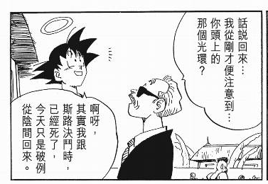
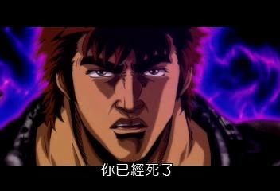
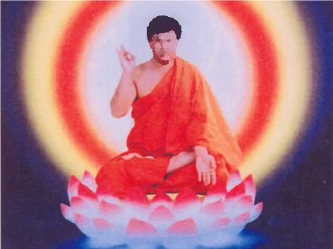
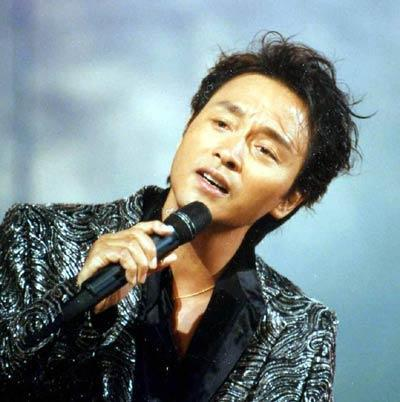

有的人死了，他还活着。

有的人活着，他已经死了。

有的人，每年总要死上那么一两次。

也有的人，动不动就会复活。

忽然想起了公元1997年的年初。
高一的寒假，因为补课，在2月20号的时候已经接近了尾声。电视上忽然一下变得只有几种节目：新闻、回顾、纪录片，AV6第一天的时候还有辽沈战役平津战役放，第二天开始就只剩淮海战役百色起义了。AV5、DLTV更是干脆跟AV1并了机。没有网络没有PC而且关键是没过正月十五老爹还在家的情况下，倒是把寒假作业补了个整整齐齐。

后面的一个召集日，在学校得到的通知是，某天必须穿着整齐地在学校里参加追悼会。
那个下午，整得很严肃，先是操场上下了半旗，然后一只不少地坐在教室里听哀乐配诗朗诵。嗯，记不大清楚了，也可能是站着的。
过程又臭又长。

广播结束之后，大家交换了一下抄作业的心得，就各找各妈了。