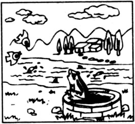

前日大博同学在遥远的德意志遭遇晨雾，于是从fog想到frog，然后想起一次高中测验，让写fog而露露天尊写了一只青蛙的故事。
显然大博同学的记忆出现了偏差，是因为他会拼frog，饱汉子不知饿汉子饥。
故事的发生是这样的：

1996年的冬天抑或是1997年的春天，班里的大多数人交钱参加了一次英语竞赛——万一中了，高考时加分了怎么办？
最后一道题是作文，看图写作文。具体什么图忘记了，反正青蛙是关键路径，大概是下图这个意思。

我敢对灯发誓，frog这个单词，在高一以前绝对不是课本范围内的，这个简单的单词把哥难到膀胱肿胀了都。
……
考试的地点是位于金家街的76中。对于大多数家住沙河口区的同学们来说，这地方很陌生，所以要搭伴去搭伴回。
回程往车站走。露露天尊跟旁边的路人甲问：“青蛙怎么拼啊！”
路人甲：“frog。”
露露：“唉，我不会啊！”
路人甲：“那你作文咋写的啊？”
露露：“There is an animal. Its name is Bob. 后面就写Bob怎样怎样就行了。”
这个段子没走到车站就在班里传开了。

当时我就走在露露的身后，听到这个解决方案惊为天人。跟她一比我简直蠢到家了，哪里还好意思再张嘴。所以谁都不知道我也不会拼青蛙。
哥冥思苦想后用的是Prince！

这就是20年后我能够第一时间纠正大博错误的原因。