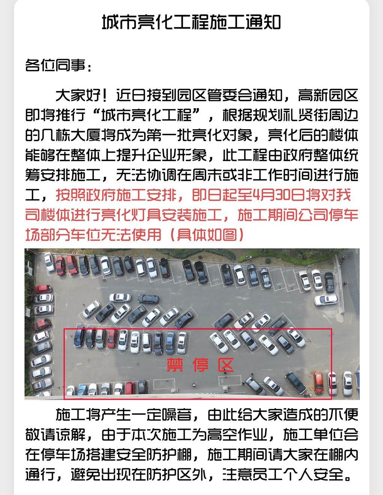
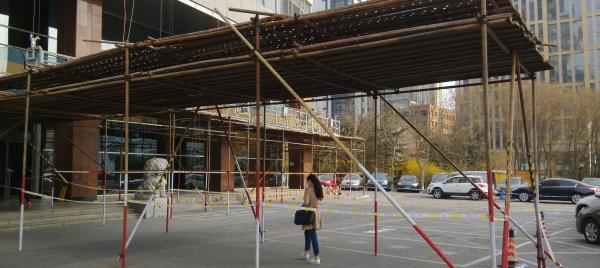

周记 No.541

鬼子那边一直希望我们用某工具进行单体测试。可他们自己却一拖再拖，以至于负责人哈啦先生收到试用版License的第一时间忘记通知了我们。10天的试用期，交给我们的时候已经过去了3天。
上周五阿兵哥拿到License的时候已经是临近下班的四点半了，紧急问组里成员周六周日能不能加班。我第一时间回了句：“太晚了，已经有安排了。”
我真的是非常讨厌这种意外打乱我计划的事情。
周末我没参加，他们几个忙活了两天，也没取得什么突破性的进展，连环境都没搭起来。客户那边其实只是想根据我们的情况调查一下这个软件到底有没有用有多大用处。国内官网查到的结果，一个正式版License价值人民币25万呢！

我倒还真是有安排。周六中午跟3P喝了顿酒。算算竟然差不多一年多没见了，好不容易找到个两人都不用带孩子的时间，让加班见鬼去吧！

他们几个在屋里加班，屋外政府安排了个“亮化工程”，搭了两天架子。这工程由政府出钱，所以施工方极尽磨洋工之能，一个礼拜下来好像只装了两根LED。按照我们公司大楼的周长来算，能在一个月内搞定就要感谢老天开眼了。从已经架好的两根纬线LED管来看，晚上亮不亮不知道，白天看我们的楼丑得一B型。

车位一下减少了一半，开车来上班的同事已经丧心病狂了。8点上班，6点40就没位置了。我真是不明白他们这样的开车图个啥。
我这种公交党也收到了影响。因为这丧门工程不只是在我们大楼一家开整。目测周边至少6个大厦同时上了脚手架。所以大量的想明白了“这样开车图个啥”的IT民工选择了改承公交。所以这几天202路有轨电车挤得就像春运时的绿皮车。
政府一下惹了这么多宅男，小心半夜被麒麟臂拍死啊！

周一的时候进行前一段任务的最后收尾，要把镜像烧到TF卡上直接从卡上起操作系统。按照说明从头到尾做了一边，烧出的东西不好使。从头排查一遍，没找到问题。怀疑是卡不好，换了一张再试，仍旧是相同的现象。
慌了，连忙让旁边老唐用他的版子搞一边，一模一样的的步骤，一次成功。
于是我战战兢兢地从盒子里拿出了第三张卡来烧。
这回好了。抽到两次前21M里能找到坏道的卡，我这个手真是够潮了。

回头再说那个软件。一个礼拜都用来跟它较劲了。
到周五的时候测试程序都写得差不多了，唯有一个地方预期结果我用了静态变量的地址作为返回值，再传回来的时候工具无法设预期值，分支走不到。打给价值25万的软件的中国客服问怎么才能解决，人家折腾了一个上午，回了一封邮件说他们的软件支持不了，并且委婉地问我为啥要用那么怪异的用法。
反正试用阶段我们是大爷，我直接回他说这么写我可以省一个变量。那边就没下文了。
阿兵哥对着那个鲜红的50%跟我商量：“大致，你说这代码咱应不应该改？”
我态度非常坚决：“功能没错，用法也没错，单体和结合都做完了，这个时候改你能要出工时吗？”
还有一句话我没说。

我最喜欢看别人不爽却又无可奈何的样子。