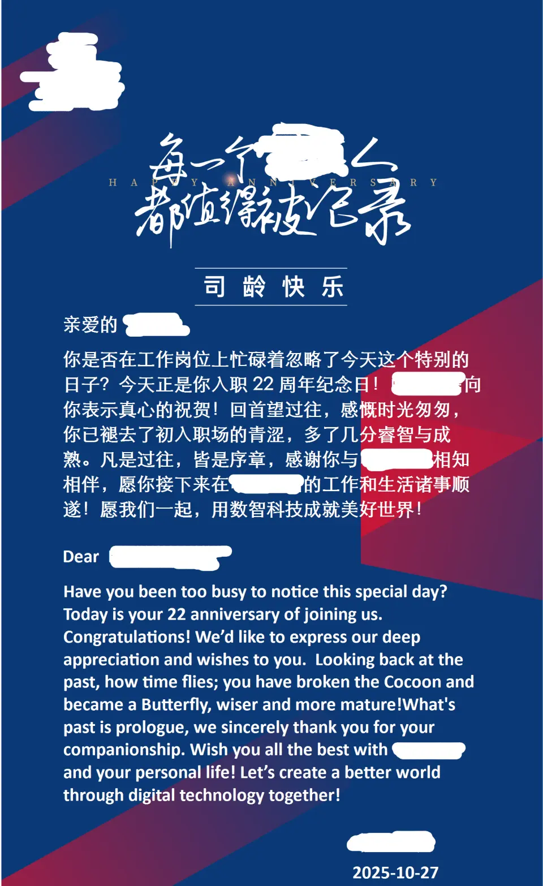

为了不换工作，我换了家公司。
一个寻常的连项目带人被挖墙脚的故事。

2019年底被G记收购之后，我们大连site的Y记实体并没有注销，跟日本客户的业务往来，不管是原有合同的延续还是新项目，用的都是Y记的名义。
但是公司的原高层陆续因为不同的原因离开。2025年下半年，已经没人有能力护着老招牌，G记要求废掉Y记这个马甲，所有业务都要统一用G记的名头。

央企根本不在乎日本客户。哪怕我们跟这个客户已经合作了20多年。
副部级的集团董事长只来视察过一次，直接指出：“哪怕干外包也不能只盯着欧美日，要响应国家号召，开拓一带一路国家的外包市场。”
说得轻巧。一带一路国家，除了中东土豪，有几个有能力往外发软件项目的？难不成火中取栗，让越南菲律宾把日本的项目转包出来？

日本客户同样对中字头心存忌惮。
老美的FDA认证对于他们贩卖医疗器械来说是“死生之事，不可不察”。不仅仅因为美国市场大，而且有很多小国家不会单独对医疗产品进行评估，只要FDA给过了就可以在它们国家卖。这些年的美中关系是那个奶奶样，天天以各种理由互相卡脖子，一旦被FDA以项目中有中国央企背景参与而叫停或打回重审，这代价客户根本承担不起。
自从被中字头收购以后，客户已经不让我们参与核心功能的开发了。只给发一些不列入FDA审核资料的测试工具及测试基板的活过来。

这次换名让客户愈加犯膈应了。
我们部门的前任部门长，大约M3.5级别吧，见缝插针，找了个日本老头当法人，合伙办了个日企，然后回大连投资。我们就这样被连窝端了。

2025年十一过完的那个礼拜，项目经理娜娜（M2）忽然神秘兮兮地找我，周末出来坐坐。
见到前任部门长的那一刻就啥都明白了。没等他开口，想了不到1分钟就已经提前答应了。多犹豫一秒都是对这个干了18年的项目的不尊重。

干活嘛，无非图个活少钱多离家近。我要是不走，没项目 = 没活 = 没钱。走了呢，活一样，钱能多一丢丢，新公司离老公司300米。
缺点是大家知根知底，上次工资还是新老板没离开的时候给我涨的，跟他谈不能也没必要狮子大张口。涨一点大家面子上过得去就完事了。
这么多年以来，钱挣的是不多，但活也不多啊。
这大环境有个班上就不错了，要啥自行车。

“人无远虑，必有近忧”这句话在我看来就是放屁。
人有没有远虑都有近忧。何况我也不是没考虑。
唯一值得留恋的就只有22年司龄。

不管是部门长还是HR，动一个22年的P8都需要仔细斟酌，这是事实。
项目没了我也有一个赖着不走的可选项。

老婆大人就强烈支持我赖着不走，等着被裁拿22 + 1或者调岗。
我要是还差8年退休，就这么耗下去了，问题是还有18年呢，变数太多。
项目没了，我就没有根了。岁数又大，工资又高，哪个部门会要我呢？
更何况江湖传闻，现在有个部门专门吸纳待岗人员。工资变成4000多+绩效，因为没有活干就没有绩效。一年以后再按（23 + 1）清算，被乘数可就变成4000了。
传闻。

项目结束，所有的设备要“还给日本”——其实这就违反常规——因为那异常麻烦的通关手续，以前几乎所有项目，客户的要求都是打眼销毁，视频留证。
虽然现在的部门长心里也是门儿清，但最后的交接也仍旧要做样子给上面看。
于是邀请客户的M4级别BOSS大冢桑来唱一场双簧。客户逐一清点封箱，公司这边当然就免责了。
东西不少，15个箱子300公斤出头。
客户顺丰到付，老公司也没人犯贱去纠缠拉到哪里。
——当然是拉到300米外的新公司。

组里原来12个人，挖走了7个。一月先去了新公司4个。
因为大冢的出差申请出了岔子，所以娜娜、我和小木头多留了一个月，维护项目。
让我多留一个月，一方面是我待的最久，了解各种设备的来龙去脉；另一方面估计也是嫌我工资高，他能省一个月是一个月。

我堂堂一个开发，在老公司的最后一周，3个晚上是在陪客户喝酒。弄得像个营业似的。
周一，老公司给大冢接风。
周三，新公司给大冢过生日，第二天回老公司上班。
周四，新公司第一次全员团建，第二天回老公司上最后一天班。

周五离职，周一入职，无缝衔接。与其说跳槽，更像是换了个办公地点，其余啥都没变。

唯一的担心是，不晓得在新单位带薪拉屎的时候，马桶用不用得惯。

新的一年，新的开始。愿世（rì）界（yuán）和（jiān）平（tǐng）。