丁酉年闰月，全年383天=54.71周。本人在这一年里观影86部，平均每周1.57部。
本年度共进电影院3次。两次是沾小朋友的光，看的动画片；一次是因为情怀去看了描写摇滚乐的《缝纫机乐队》。
三张票合计95元。本人基本没为国家的566亿票房做出任何贡献。

从评分分布来看，虽然略苛刻，但还是符合正态分布的。
以10分制计算，满分电影两部，分别为西班牙悬疑片《看不见的客人》和日本犯罪片《冰冷热带鱼》；0分电影三部，为国产动作片《大话西游3》、国产剧情片《没出息的晓丽》、国产不知什么片《赌神2017之千绝天下》。
0分和10分表示两种极致，再往上或者往下评就没什么意义了。

从地区分布上看，未能免俗，还是国产片为主，陆港台合计占了56%强，但是大陆片表现还是令人怏怏，平均下来只有4.75分。
近年来对好莱坞量产片逐渐厌恶，所以常开脑洞的日本片的比例超过了美国片，个性较强的欧洲片数量也与美国片并驾齐驱。
出于猎奇心理，看了两部阿根廷片和一部巴西片。因为能传到我耳朵里的都是有一定口碑的作品，所以评分虚高。除此之外还是日本片更合我的胃口。
香港电影表现也比较令人失望，还是靠两部类型片撑着，不然会更差。

从类型分布上看，除了不好分类的电影，还是偏爱恐怖片和喜剧片。
动作片的表现令我非常失望。一方面可能是年龄大了，看得多了，缺乏新鲜感；另一方面则是电脑的小屏幕无法把动作表现得淋漓尽致。
对喜剧片比较宽容，但其表现仍旧是扶不起来的阿斗，没有任何一部作品留下深刻印象。
评分最高的是犯罪片，其实是因为样本少，被两部高分片把平均值拉高了。
动画片表现尚可，毕竟基数小。

观看方式来说，自己下载为主，盒子观看的占另外1/3。
我还是习惯“看榜单-看简介-搜索-下载-看”这一传统模式。
遥控器乱碰的遇雷率非常高，以后看到猎奇的标题一定要克制。
有两部老片没搜索到资源，在B站和youku上直接观看的，其质量差强人意。

有7部影片是豆瓣上没有记录的，它们的资料来自imdb。
虽然没有详细统计，但这个数量应该是小于上一年的，意味着本人没看过的禁片越来越少了。
而禁片也没那么好看。

本来想单独统计三级片和B级片。但各国标准难以统一，查资料太困难，自己分级又太主观，于是放弃了。

开始记录的时候没记录观影时间，也没去查影片的发行时间，戊戌年会补上。
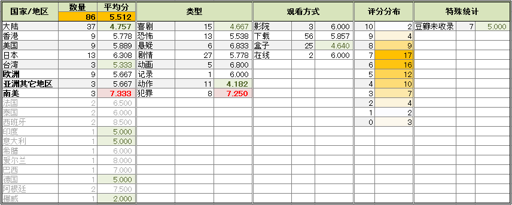

下面是影片的详细信息和三句话简评。
评论皆原创。

[了不起的菲丽西](https://pewae.com/gaan/aHR0cHM6Ly9tb3ZpZS5kb3ViYW4uY29tL3N1YmplY3QvMjYzODI3Njcv)

原名：Ballerina导演：艾瑞克·莎莫 / 艾瑞克·韦林主演：乔·谢里丹 / 伊拉娜·盖尔 / 凯特·麦克金农 / 卡莉·蕾·杰普森 / 塔米尔·卡皮利安 / 布朗温·曼特尔 / 戴恩·德哈恩 / 朱莉·卡纳 / 杰米·沃森 / 梅尔·布鲁克斯类型：冒险 / 动画 / 喜剧 / 歌舞地区：加拿大 / 法国首映时间：2017

舞蹈班老师推荐小朋友们看的，为了鼓励她们练舞蹈。
可被主人公PK掉的小朋友同样都很努力啊！
所以片子的主旨是：苦练不重要，重要的是要有个好老师，以及考官看你顺眼。

[故事的故事](https://pewae.com/gaan/aHR0cHM6Ly9tb3ZpZS5kb3ViYW4uY29tL3N1YmplY3QvMjU3Njc3NDcv)

原名：Tale of Tales导演：马提欧·加洛尼主演：乔纳·利斯 / 克里斯蒂安·利斯 / 卡特里内尔·马龙 / 托比·琼斯 / 文森特·卡索 / 斯塔西·马汀 / 杰西·卡芙 / 海莉·卡迈克尔 / 碧碧·凯芙 / 约翰·C·赖利类型：剧情 / 奇幻 / 恐怖地区：意大利 / 法国 / 英国首映时间：2015

中规中矩，美轮美奂。
无聊。

[地球防卫遗孀](https://pewae.com/gaan/aHR0cHM6Ly9tb3ZpZS5kb3ViYW4uY29tL3N1YmplY3QvMjU3NTYzNjcv)

原名：地球防衛未亡人导演：河崎实主演：TABO / きくち英一 / なべやかん / ノッチ / 佐藤文則 / 元冬树 / 元気屋エイジ / 古谷敏 / 坛蜜 / 堀内正美类型：科幻地区：日本首映时间：2014

脱衣舞打败怪兽、拯救世界的“创意”，估计也就日本人能想出来。
用七八十年代的技术做怪兽，不知是经费不足还是故意为之。
片子的唯一亮点是把中日美韩政府统统黑了一遍。

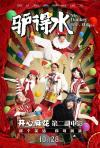

[驴得水](https://pewae.com/gaan/aHR0cHM6Ly9tb3ZpZS5kb3ViYW4uY29tL3N1YmplY3QvMjU5MjE4MTIv)

导演：刘露 / 周申主演：任素汐 / 刘帅良 / 卜冠今 / 大力 / 王堃 / 王峰 / 苏千越 / 裴魁山 / 阿如那 / 韩彦博类型：剧情 / 喜剧地区：大陆首映时间：2016

幸亏有民国。
大长脸女主角是年度新发现。
最喜欢的剧情是周铁男的转变，每个人都是铁男，不愿意对枪口认怂的都死掉了。

[猛鬼食人胎](https://pewae.com/gaan/aHR0cHM6Ly9tb3ZpZS5kb3ViYW4uY29tL3N1YmplY3QvMTMwODM1NS8=)

导演：梁宏发主演：吴辰君 / 张锦程 / 徐锦江 / 李兆基 / 黄斌 / 黄秋生类型：剧情 / 奇幻 / 恐怖地区：香港首映时间：1998

节奏明快，是快餐式三级片里的精品。
王晶恶搞《大红灯笼高高挂》。
一直觉得吴辰君长了张女鬼标配脸，不演鬼可惜了，这回终于得偿所愿。

[最后的武林](https://pewae.com/gaan/aHR0cHM6Ly9tb3ZpZS5kb3ViYW4uY29tL3N1YmplY3QvMjY4NjA3OTc=)

导演：霍穗强主演：余斯昌 / 子望 / 王子清类型：喜剧 / 武侠地区：大陆首映时间：2017

一则广告拍成这样不错了。
虽然主角也是群众演员，但群众演员严重出戏。
滥用特效。

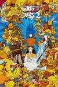

[西游伏妖篇](https://pewae.com/gaan/aHR0cHM6Ly9tb3ZpZS5kb3ViYW4uY29tL3N1YmplY3QvMjU4MDEwNjYv)

导演：徐克主演：包贝尔 / 吴亦凡 / 大鹏 / 姚晨 / 巴特尔 / 张美娥 / 杨一威 / 林允 / 林更新 / 汪铎类型：动作 / 古装 / 喜剧 / 奇幻地区：大陆 / 香港首映时间：2017

1分给蜘蛛精王丽坤，1分给篮球运动员巴特尔，其余人等，演技都不在线。
第一次看吴亦凡演的东西，四字评语：什么玩意儿！
都说特效好，但我觉得徐老怪对特效的应用跟《蜀山》比起来毫无进步。

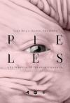

[肌肤](https://pewae.com/gaan/aHR0cHM6Ly9tb3ZpZS5kb3ViYW4uY29tL3N1YmplY3QvMjY5NjQ0MzQv)

原名：Pieles导演：爱德华多·卡萨诺瓦主演：伊洛伊·科斯塔 / 伊西娅尔·卡斯特罗 / 华金·克莱门特 / 卡罗琳娜·邦 / 卡门·马奇 / 哈维尔·博多洛 / 坎德拉·佩尼亚 / 塞康·德拉罗萨 / 安娜·波沃罗萨 / 安娜·玛丽亚·阿亚拉类型：剧情地区：西班牙首映时间：2017

相对于猎奇的题材，结局太美满了，这样不好。
看完后满脑子在想，如果嫖不犯法而且有个没眼睛的妓女，我会不会去猎奇一下？多半是会的。

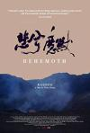

[悲兮魔兽](https://pewae.com/gaan/aHR0cHM6Ly93d3cuaW1kYi5jb20vdGl0bGUvdHQ0OTAxMzA0Lw==)

原名：Behemoth导演：赵亮类型：纪录地区：大陆 / 法国首映时间：2015

题材好，可是节奏太拖沓了。

[大闹天竺](https://pewae.com/gaan/aHR0cHM6Ly9tb3ZpZS5kb3ViYW4uY29tL3N1YmplY3QvMjYzODk2OTYv)

导演：王宝强主演：刘昊然 / 岳云鹏 / 朱时茂 / 林永健 / 柳岩 / 王宝强 / 王祖蓝 / 白客 / 陈佩斯 / 马浴柯类型：冒险 / 动作 / 喜剧地区：大陆首映时间：2017

最后的致敬环节莫名其妙，并不是每个80后的心里都住着一只猴子，我就没有。

[情圣（2016）](https://pewae.com/gaan/aHR0cHM6Ly9tb3ZpZS5kb3ViYW4uY29tL3N1YmplY3QvMjY4NzkwNjAv)

原名：情圣导演：宋晓飞 / 董旭主演：乔杉 / 代乐乐 / 克拉拉 / 周晓鸥 / 小沈阳 / 岳小军 / 常远 / 徐冬冬 / 王迅 / 田雨类型：喜剧地区：大陆首映时间：2016

一分送给闫妮的化妆师，其余一无是处。
以后看到STAFF里有小沈阳的电影电视我一律直接跳过。

[无名女尸](https://pewae.com/gaan/aHR0cHM6Ly9tb3ZpZS5kb3ViYW4uY29tL3N1YmplY3QvMjYzMzkyMTMv)

原名：The Autopsy of Jane Doe导演：安德烈·艾弗道夫主演：埃米尔·赫斯基 / 奥尔雯·凯瑟琳·凯莉 / 奥菲利亚·拉维邦德 / 布莱恩·考克斯 / 帕克·索耶 / 简·佩里 / 迈克尔·麦克埃尔哈顿类型：恐怖地区：英国首映时间：2016

女尸很漂亮。
前3/4引人入胜，无懈可击，最后的部分落入俗套，似乎也没有更好的处理方法了。
国产恐怖片总要归于精神病，欧洲则喜欢用宗教和魔鬼，都是套路。

[有完没完](https://pewae.com/gaan/aHR0cHM6Ly9tb3ZpZS5kb3ViYW4uY29tL3N1YmplY3QvMjY4MjgwMTkv)

导演：王啸坤主演：于笑 / 刘俊昊 / 刘长生 / 孔连顺 / 宋阳 / 张美娥 / 徐小溢 / 李俊豪 / 林更新 / 柴蔚类型：剧情 / 喜剧地区：大陆首映时间：2017

范伟这爹演得不错，但那谁谁根本不会演儿子。
客串扣分，尤其是那个直播的老外和薛之谦，跳戏。
还以为老太太是神秘人呢，结果后面没了，莫名其妙。

[疯岳撬佳人](https://pewae.com/gaan/aHR0cHM6Ly9tb3ZpZS5kb3ViYW4uY29tL3N1YmplY3QvMjY4MTU4NTYv)

导演：钟少雄主演：古筝 / 孙坚 / 孙榜 / 岳云鹏 / 张磊 / 杨能 / 汤晶媚 / 潘斌龙 / 石小满 / 艾伦类型：喜剧 / 爱情地区：大陆首映时间：2017

小岳岳不是个合格的电影演员，唯一值得褒扬的是认真。
小岳岳不是个合格的相声演员，唯一值得褒扬的是认真。
每一部烂片的背后都有一个烂剧本。

[女间谍](https://pewae.com/gaan/aHR0cHM6Ly9tb3ZpZS5kb3ViYW4uY29tL3N1YmplY3QvMjU3NTIyNjEv)

原名：Spy导演：保罗·费格主演：50分 / 卡洛斯·庞丝 / 娜吉丝·法克利 / 彼得·塞拉菲诺威茨 / 扎克·伍兹 / 李威尹 / 杰森·斯坦森 / 杰西卡·查芬 / 梅丽莎·麦卡西 / 米兰达·哈特类型：动作 / 喜剧 / 犯罪地区：美国首映时间：2015

译名完全把片子的主旨毁掉了。
作为一部屎尿屁电影，搞笑不足。
斯坦森反差萌。

[生吃](https://pewae.com/gaan/aHR0cHM6Ly9tb3ZpZS5kb3ViYW4uY29tL3N1YmplY3QvMjY2NTM4MzMv)

原名：Grave导演：朱利亚·迪库诺主演：乔安娜·普莱斯 / 伯利·兰内尔 / 加朗斯·马里利埃 / 拉巴·纳伊·乌费拉 / 洛朗·吕卡 / 玛丽安·费尔努 / 维吉尔·勒克莱尔 / 艾拉·朗夫 / 让-路易·斯比尔 / 贝兰奇尔·麦克尼斯类型：剧情 / 恐怖地区：意大利 / 比利时 / 法国首映时间：2016

姐姐比妹妹更像主角。
喜欢吃肉过敏那段情节。

[早死早投胎之地狱摇滚篇](https://pewae.com/gaan/aHR0cHM6Ly9tb3ZpZS5kb3ViYW4uY29tL3N1YmplY3QvMjY0MTMyNjkv)

原名：TOO YOUNG TO DIE! 若くして死ぬ导演：宫藤官九郎主演：古田新太 / 古馆宽治 / 坂井真纪 / 宍户佑名 / 宫泽理惠 / 尾野真千子 / 桐谷健太 / 森川葵 / 清野菜名 / 皆川猿时类型：喜剧 / 奇幻 / 音乐地区：日本首映时间：2016

中文译名太糟烂了，内容比片名好5个神木隆之介。
每次转生都从马桶里钻出来，很恶俗，我很喜欢。
宫泽理惠依旧很美。

[失眠](https://pewae.com/gaan/aHR0cHM6Ly9tb3ZpZS5kb3ViYW4uY29tL3N1YmplY3QvMjY3NDgyMjMv)

导演：邱礼涛主演：卫诗雅 / 叶清方 / 吴俐璇 / 李耀曙 / 李育萳 / 林家栋 / 舩木壱辉 / 苏伟曜 / 蔡宝珠 / 蔡炜祥类型：恐怖地区：香港首映时间：2017

弹尽粮绝的邱礼涛和黄秋生，好题材没拍出彩来，并没有《人肉叉烧包》和《伊波拉病毒》带来的那种震撼，虎头蛇尾。
露蛋蛋的三级片可谓凤毛麟角。
吴俐璇发挥不错。

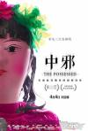

[中邪](https://pewae.com/gaan/aHR0cHM6Ly9tb3ZpZS5kb3ViYW4uY29tL3N1YmplY3QvMjY4MjA4MzMv)

导演：马凯主演：何佳 / 冯丹菊 / 刘荣惠 / 孙德强 / 文中学 / 王丹丹 / 董天文 / 谢印梅 / 贺媛媛 / 赵树达类型：恐怖 / 惊悚地区：大陆首映时间：2016

难得的国产恐怖片，用心讲故事，可惜结尾还是被和谐大神干预了。
如果真是像说的那样只有5万块成本，那这个编导（一体）可以封神了。

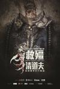

[救僵清道夫](https://pewae.com/gaan/aHR0cHM6Ly9tb3ZpZS5kb3ViYW4uY29tL3N1YmplY3QvMjY3NTk3ODMv)

导演：甄栢荣 / 赵善恒主演：吴耀汉 / 曾志伟 / 李尚正 / 林明祯 / 欧锦棠 / 章彦琦 / 罗莽 / 蔡瀚亿 / 袁祥仁 / 詹瑞文类型：喜剧 / 恐怖地区：香港首映时间：2017

中老年版的钱小豪比青年版耐看多了。
年轻的男女主角都不行。
感觉吴耀汉大叔的身体越发不行了，他会不会像午马一样死在片场？

[神偷奶爸3](https://pewae.com/gaan/aHR0cHM6Ly9tb3ZpZS5kb3ViYW4uY29tL3N1YmplY3QvMjU4MTI3MTIv)

原名：Despicable Me 3导演：凯尔·巴尔达 / 埃里克·吉隆 / 皮埃尔·柯芬主演：克里斯汀·韦格 / 内芙·沙雷尔 / 史蒂夫·卡瑞尔 / 史蒂夫·库根 / 安迪·尼曼 / 崔·帕克 / 布莱恩·T·德莱尼 / 朱莉·安德鲁斯 / 珍妮·斯蕾特 / 皮埃尔·柯芬类型：冒险 / 动画 / 喜剧地区：美国首映时间：2017

除了小黄人卖萌，就只有反派的人设有点儿意思了。

[大话西游3](https://pewae.com/gaan/aHR0cHM6Ly9tb3ZpZS5kb3ViYW4uY29tL3N1YmplY3QvMjYyODQ1OTUv)

导演：刘镇伟主演：何炅 / 元奎 / 刘镇伟 / 吴京 / 周艺轩 / 唐嫣 / 张瑶 / 张超 / 曹承衍 / 王一博类型：喜剧 / 奇幻 / 爱情地区：大陆 / 香港首映时间：2016

刘镇伟拍烂片才是常态，其实剧本还可以，大话是对西游的解构，为什么不能对“大话”再度解构？
唐嫣无愧中戏之耻的绰号，豆瓣一句评论特别好，“总有一天，他会驾着七彩祥云，打死紫霞。”
特效拖沓冗余，一坨坨华丽的狗屎。

[比海更深](https://pewae.com/gaan/aHR0cHM6Ly9tb3ZpZS5kb3ViYW4uY29tL3N1YmplY3QvMjY2OTQ5ODgv)

原名：海よりもまだ深く导演：是枝裕和主演：中川雅也 / 中村友理 / 古馆宽治 / 叶山奖之 / 吉泽太阳 / 小林聪美 / 小泽征悦 / 峰村理惠 / 树木希林 / 桥爪功类型：剧情 / 家庭地区：日本首映时间：2016

简单的故事，精致的电影。

[濑户内海](https://pewae.com/gaan/aHR0cHM6Ly9tb3ZpZS5kb3ViYW4uY29tL3N1YmplY3QvMjYzNjIzNTEv)

原名：セトウツミ导演：大森立嗣主演：中条彩未 / 冈山天音 / 宇野祥平 / 池松壮亮 / 菅田将晖 / 铃木卓尔类型：剧情 / 喜剧地区：日本首映时间：2016

这才是正版的致青春！
坐那儿聊天，无聊吗？不无聊吗？无聊吗？
不然干嘛？

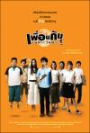

[鬼朋友](https://pewae.com/gaan/aHR0cHM6Ly9tb3ZpZS5kb3ViYW4uY29tL3N1YmplY3QvMjU4OTkzNDQv)

原名：เพื่อนกันเฉพาะวันพระ导演：Theeratorn Siriphunvaraporn主演：Kachapa Toncharoen / 踏那·苏提格蒙类型：喜剧地区：泰国首映时间：2008

看泰国电影，缅怀九十年代港片。

[看不见的客人](https://pewae.com/gaan/aHR0cHM6Ly9tb3ZpZS5kb3ViYW4uY29tL3N1YmplY3QvMjY1ODAyMzIv)

原名：Contratiempo导演：奥里奥尔·保罗主演：伊尼戈·加斯特西 / 何塞·科罗纳多 / 佩雷·布拉索 / 圣·耶拉莫斯 / 大卫·塞尔瓦斯 / 巴巴拉·莱涅 / 布兰卡·马丁内斯 / 帕科·图斯 / 弗兰塞斯克·奥雷利亚 / 玛蒂娜·乌尔塔多类型：剧情 / 悬疑 / 惊悚 / 犯罪地区：西班牙首映时间：2017

无以伦比的悬疑片！
但是不必要看第二遍。

[乘风破浪](https://pewae.com/gaan/aHR0cHM6Ly9tb3ZpZS5kb3ViYW4uY29tL3N1YmplY3QvMjY4NjIyNTkv)

导演：韩寒主演：张本煜 / 彭于晏 / 易小星 / 李淳 / 李荣浩 / 董子健 / 赵丽颖 / 邓超 / 金士杰 / 高华阳类型：剧情 / 喜剧地区：大陆首映时间：2017

挺有诚意的电影，笑点凑合。
可惜最后剧情有点儿生硬。
我很喜欢这部片里的动作戏，街头王八拳很有感觉。

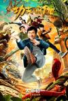

[功夫瑜伽](https://pewae.com/gaan/aHR0cHM6Ly9tb3ZpZS5kb3ViYW4uY29tL3N1YmplY3QvMjYxODI5MTAv)

导演：唐季礼主演：姜雯 / 尚语贤 / 张国立 / 张艺兴 / 成龙 / 李治廷 / 母其弥雅 / 索努·苏德 / 艾米拉·达斯特 / 迪莎·帕塔尼类型：冒险 / 动作 / 喜剧地区：大陆首映时间：2017

典型的成龙电影，搁30年前能得8分，放现在就一一切都不新鲜了，只能折半。
本来冲张艺兴的努力加了一分，但到片尾的舞蹈乱入又给扣回去了。

[激战](https://pewae.com/gaan/aHR0cHM6Ly9tb3ZpZS5kb3ViYW4uY29tL3N1YmplY3QvMjAzODgyMjMv)

导演：林超贤主演：刘畊宏 / 姜皓文 / 安志杰 / 张家辉 / 彭于晏 / 李菲儿 / 李馨巧 / 梅婷 / 王宝强 / 高捷类型：剧情 / 动作 / 运动地区：大陆 / 香港首映时间：2013

华语片少见的题材，张家辉很拼命。
文戏不如武戏，武戏动作略单调。

[花魁](https://pewae.com/gaan/aHR0cHM6Ly9tb3ZpZS5kb3ViYW4uY29tL3N1YmplY3QvMTg1MDk2My8=)

原名：さくらん导演：蜷川实花主演：土屋安娜 / 安藤政信 / 成宫宽贵 / 木村佳乃 / 椎名桔平 / 永濑正敏 / 石桥莲司 / 菅野美穗 / 萨布 / 远藤宪一类型：剧情 / 历史地区：日本首映时间：2007

女主角后半段的妆有点丑。
画面很好看，苹果姬的配乐很赞。
就是故事太俗了，杜十娘跟韦小宝的爱情故事。

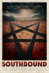

[一路向南](https://pewae.com/gaan/aHR0cHM6Ly9tb3ZpZS5kb3ViYW4uY29tL3N1YmplY3QvMjY1OTE2NDkv)

原名：Southbound导演：大卫·布鲁克纳 / 帕特里克·霍瓦特 / 瑞迪欧·赛伦斯 / 罗克珊·本杰明主演：克里斯蒂娜·佩希奇 / 安萨·拉姆西 / 戴维·约翰逊 / 查德·威利亚 / 汉娜·马克斯 / 法比娜·泰蕾兹 / 纳塞利·洛芙 / 苏珊·伯克 / 达纳·古尔德 / 马特·贝蒂内利-奥尔平类型：恐怖 / 悬疑 / 惊悚地区：美国首映时间：2015

好好的恐怖片，搞那么多教育意义干啥。

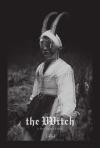

[女巫](https://pewae.com/gaan/aHR0cHM6Ly9tb3ZpZS5kb3ViYW4uY29tL3N1YmplY3QvMjYyNzYzNjQv)

原名：The VVitch: A New-England Folktale导演：罗伯特·艾格斯主演：丹尼尔·马力克 / 凯特·迪基 / 卢卡斯·道森 / 哈维·斯克林肖 / 安雅·泰勒-乔伊 / 拉尔夫·伊内森 / 朱利安·瑞钦斯 / 艾丽·格兰杰 / 芭丝谢芭·加内特 / 莎拉·史蒂文森类型：恐怖地区：加拿大 / 巴西 / 美国 / 英国首映时间：2015

这就完了？

[一路顺风](https://pewae.com/gaan/aHR0cHM6Ly9tb3ZpZS5kb3ViYW4uY29tL3N1YmplY3QvMjY3Njk0ODAv)

导演：钟孟宏主演：吴中天 / 庄益增 / 庹宗华 / 戴立忍 / 林美秀 / 梁赫群 / 纳豆 / 维他亚·潘斯林加姆 / 许冠文 / 金士杰类型：冒险 / 剧情 / 喜剧 / 犯罪地区：台湾首映时间：2016

我就讨厌台湾电影的这股墨迹劲。
只有许冠文这个香港人演得好。

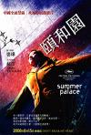

[颐和园](https://pewae.com/gaan/aHR0cHM6Ly93d3cuaW1kYi5jb20vdGl0bGUvdHQwNzk0Mzc0Lw==)

导演：娄烨主演：崔林 / 段奕宏 / 白雪云 / 郝蕾 / 郭晓冬类型：剧情 / 爱情地区：大陆 / 法国首映时间：2006

禁片≠好片，本片就是68-72那一代人的《致青春》，然而导演跟现在的导演一样，即使是女性视角，青春里也只有炮声隆隆，脑子里流淌的全是雌二醇，不停地“干干干……”。
不存在的那一年夏天是那代人绕不过去的故事，片子里已经够轻描淡写地简化成枪声了，但仍旧不让过——即使没有这部分，也肯定无法过审，床戏和裸戏实在太tm多了。
郝蕾神一般的发挥。

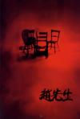

[赵先生](https://pewae.com/gaan/aHR0cHM6Ly9tb3ZpZS5kb3ViYW4uY29tL3N1YmplY3QvMTMwMjM4NC8=)

导演：吕乐主演：张芝华 / 施京明 / 蒋雯丽 / 陈怡南类型：剧情地区：大陆 / 香港首映时间：1999

片子很闷，镜头很干净，完全没有被禁的理由，只能套用东成西就里表妹的一句话来定罪：“想也不行，想也有罪。”
上有恶狼下有毒蛇的时候，项少龙选择眼前的蜜糖，人人交口称颂；家有老妻喋喋不休，外有小三咄咄逼人，赵先生选择跟刚认识的路人谈谈情跳跳舞，人人骂之渣男。
究其原因，无非项少龙有地位古天乐有脸，而赵先生是个穷教书的。

[缝纫机乐队](https://pewae.com/gaan/aHR0cHM6Ly9tb3ZpZS5kb3ViYW4uY29tL3N1YmplY3QvMjY5MjYzMjEv)

导演：大鹏主演：乔杉 / 于洋 / 于谦 / 古力娜扎 / 大鹏 / 岳云鹏 / 曲隽希 / 李鸿其 / 王劲松 / 韩童生类型：喜剧 / 音乐地区：大陆首映时间：2017

古力娜扎，啧啧，腿玩年啊！
这帮东北二人转演员真心演不好摇滚不死的主题，出戏，听口音就自行偏转到二人转不死上了。
肖楠已经那么老了。

[毒吻](https://pewae.com/gaan/aHR0cHM6Ly9tb3ZpZS5kb3ViYW4uY29tL3N1YmplY3QvMjI1OTMxMi8=)

导演：陈兴中主演：吴博 / 孙新强 / 师小红 / 张力 / 徐蕾 / 李兢 / 杨帆 / 谢衍 / 阎青妤 / 高明类型：剧情 / 恐怖 / 科幻地区：大陆首映时间：1992

曾经的中国电影也不缺少脑洞，抛开技术来讲，这片子真心拍得不错，可惜现在四个自信之下片子类型越来越少了。
男主角最后被雷劈死了，化作飞灰，印象里这应该是独一份。

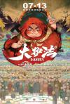

[大护法](https://pewae.com/gaan/aHR0cHM6Ly9tb3ZpZS5kb3ViYW4uY29tL3N1YmplY3QvMjY4MTE1ODcv)

导演：不思凡主演：佟心竹 / 叶知秋 / 图特哈蒙 / 小连杀 / 幽舞越山 / 李佳怡 / 李兰陵 / 藤新 / 邢凯新 / 郝祥海类型：冒险 / 动画 / 喜剧 / 奇幻地区：大陆首映时间：2017

除了主角装逼犯的台词和配音偶尔脱线以外再无瑕疵。
还真有人照着徐锦江先生的造型搞人设，没想到啊没想到。

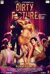

[不雅照](https://pewae.com/gaan/aHR0cHM6Ly93d3cuaW1kYi5jb20vdGl0bGUvdHQxOTU0MjA2Lw==)

原名：The Dirty Picture导演：milan-luthria主演：emraan-hashmi / tusshar-kapoor / vidya-balan类型：传记 / 剧情 / 喜剧地区：印度首映时间：2011

youtube的一个中国禁片列表找到的，本以为是三级，没想到只是非常普通的传记片，只不过主角是个艳星而已，看完也没get到值得禁的点在哪里。
传记片真不是我的菜，何况这部还非常冗长，何况还是印地语，整体看下来，像一部禁烟禁酒的宣传片。
中间有一首插曲非常好听。

[猫脸老太太](https://pewae.com/gaan/aHR0cHM6Ly9tb3ZpZS5kb3ViYW4uY29tL3N1YmplY3QvMjY3MzAxMjkv)

导演：赵小溪主演：卢峰 / 吴曦 / 张国荣1 / 彭中扬 / 柏安 / 王翀 / 田淼 / 翟红玉 / 肖彦博 / 郝文婷类型：恐怖 / 悬疑 / 惊悚地区：大陆首映时间：2016

难得的有良心的国产恐怖片。
女主颜值不赖，不知是不是整的。
废镜头略多。

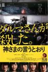

[要听神明的话](https://pewae.com/gaan/aHR0cHM6Ly9tb3ZpZS5kb3ViYW4uY29tL3N1YmplY3QvMjU3Nzc1MTIv)

原名：神さまの言うとおり导演：三池崇史主演：中川雅也 / 优希美青 / 前田敦子 / 大森南朋 / 山崎努 / 山崎纮菜 / 染谷将太 / 水田山葵 / 神木隆之介 / 福士苍汰类型：恐怖 / 惊悚地区：日本首映时间：2014

GAME感十足，但仍旧不够猎奇。
原来日本的小鲜肉也是面瘫的居多。

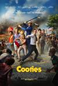

[僵尸小屁孩](https://pewae.com/gaan/aHR0cHM6Ly9tb3ZpZS5kb3ViYW4uY29tL3N1YmplY3QvMjQ4NTk4OTUv)

原名：Cooties导演：乔纳森·米洛特 / 加里·穆利昂主演：伊丽莎白·博古什 / 伊利亚·伍德 / 凯特·弗兰纳里 / 摩根·莉莉 / 杰克·麦克布瑞尔 / 桑尼·梅·艾利森 / 瑞贝卡·马绍尔 / 纳西姆·帕杜雷德 / 艾丽森·皮尔 / 豪尔赫·加西亚类型：动作 / 喜剧 / 恐怖 / 科幻地区：美国首映时间：2014

以小成本B级片的标准来评价，相当不错，剧情大体来讲比较俗套，却也有亮点，比如手撕熊孩子什么的。
把鸡块这种食品黑了个底儿掉，金拱门完全可以起诉制作方了。

[你好，疯子！](https://pewae.com/gaan/aHR0cHM6Ly9tb3ZpZS5kb3ViYW4uY29tL3N1YmplY3QvMjY2OTY4Nzkv)

导演：饶晓志主演：万茜 / 刘亮佐 / 周一围 / 曹卫宇 / 李虹辰 / 王自健 / 莫小奇 / 金士杰类型：剧情 / 喜剧 / 悬疑地区：大陆首映时间：2016

从台词到布景，舞台味儿太重了。
万茜这姑娘演得吧，既不像逼乎上吹得那么神，也不像逼乎上贬得那么烂，75分吧。

[丢羊](https://pewae.com/gaan/aHR0cHM6Ly9tb3ZpZS5kb3ViYW4uY29tL3N1YmplY3QvMjY4NDEwNzM=)

导演：汪小平主演：任帅类型：剧情地区：大陆首映时间：2016

前半部分稀松平常，结局令人作呕，这种东西在竟然能得7分，看来中宣部早就入驻豆瓣党支部了。

[迷奸犯](https://pewae.com/gaan/aHR0cHM6Ly93d3cuaW1kYi5jb20vdGl0bGUvdHQwMTEzODA3Lw==)

导演：叶伟信主演：侯焕玲 / 张睿羚 / 林家栋 / 欧阳震华 / 钱军类型：犯罪地区：香港首映时间：1995

作为90年代量产三级片，没什么特色，不过本片是《旺角风云》《爆裂刑警》《杀破狼12》《叶问1234》的叶伟信的第二部独立执导影片，算是不尴不尬的黑历史吧。
欧阳震华这浓眉大眼的，也演过三级片啊！（屁话，三级片老王子徐锦江先生可是标准的浓眉大眼……）
而且这部拍摄于1995年，欧阳震华就快红了，黎明前的黑暗啊——跟他搭档的是林家栋。

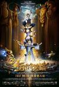

[十万个冷笑话2](https://pewae.com/gaan/aHR0cHM6Ly9tb3ZpZS5kb3ViYW4uY29tL3N1YmplY3QvMjY3NTk1Mzkv)

导演：卢恒宇 / 李姝洁主演：九孔 / 佟心竹 / 卢恒宇 / 图特哈蒙 / 宝木中阳 / 山新 / 李佳怡 / 李姝洁 / 藤新 / 郝祥海类型：动画 / 喜剧 / 奇幻地区：大陆首映时间：2017

剧本太过于好莱坞三段式了，怀旧配乐卖情怀，鸡贼可耻，反正都是套路缺乏新意。
笑点大多是文字梗，几乎没有通过动作表现出来的设计，“现在的动画片啊，越来越像相声了”。
最后的黑白战3D值得称道。

[恐怖假日](https://pewae.com/gaan/aHR0cHM6Ly9tb3ZpZS5kb3ViYW4uY29tL3N1YmplY3QvMjYzMzU4NTMv)

原名：Holidays导演：Adam Egypt Mortimer / Anthony Scott Burns / Dennis Widmyer / Ellen Reid / Kevin Kolsch / Sarah Adina Smith / 凯文·史密斯 / 尼古拉斯·麦卡锡 / 斯科特·查尔斯·斯图瓦特 / 盖瑞·肖主演：Harley Morenstein / Madeleine Coghlan / Savannah Kennick / 乔赛琳·唐娜休 / 克莱尔·格兰特 / 哈莉·奎恩·史密斯 / 安德鲁·鲍文 / 洛伦扎·伊佐 / 珍妮弗·拉弗勒 / 艾娃·阿卡雷斯类型：喜剧 / 恐怖地区：美国首映时间：2016

宗教味道太浓。
血腥程度也不够看，倒是第二个故事里的小女孩长相非常惊悚。

[绝世高手](https://pewae.com/gaan/aHR0cHM6Ly9tb3ZpZS5kb3ViYW4uY29tL3N1YmplY3QvMjY3NTQ4MzEv)

导演：卢正雨主演：仓田保昭 / 何蓝逗 / 卢正雨 / 孔连顺 / 杨迪 / 柯达 / 汪聪 / 艾伦 / 范伟 / 蔡国庆类型：喜剧地区：大陆首映时间：2017

编导脑洞尚可，对喜剧片要求真不高，哥斯拉汤大战孙悟空汤的镜头我觉得蛮有趣的。
两首主要“致敬”歌曲，《封神榜/神的传说》首播于1990年冬、《戏说乾隆/问情》首播于1991年夏，看来77-83年龄段是目前情怀牌的主要针对对象。
范厨师终于演了一回厨师。

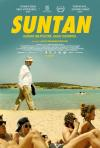

[四十度晒](https://pewae.com/gaan/aHR0cHM6Ly9tb3ZpZS5kb3ViYW4uY29tL3N1YmplY3QvMjY3MjA5Mzcv)

原名：Suntan导演：阿吉里斯·帕帕迪米特洛珀罗斯主演：亚尼斯·伊科诺米季斯 / 亚尼斯·索特基斯 / 哈拉·寇萨利 / 埃莉·特琳古 / 帕夫洛斯·欧克普罗斯 / 玛丽亚·卡利马尼 / 玛丽萨·特里安德菲里都 / 米露·范·格罗森 / 西拉斯·楚梅尔卡斯 / 迪米·哈特类型：剧情地区：希腊 / 德国首映时间：2016

除了天体海滩，没多少看头儿；天体海滩也没什么看头——女主女配都是平胸啊！
都人到中年了还追求个屁的爱情啊！怪不得希腊这个国家会破产。

[李雷和韩梅梅](https://pewae.com/gaan/aHR0cHM6Ly9tb3ZpZS5kb3ViYW4uY29tL3N1YmplY3QvMjYyODkxMzg=)

导演：杨永春主演：塞拉斯·列维·纽豪斯 / 常铖 / 应亦涵 / 张子枫 / 张诚航 / 张逸杰 / 成梓宁 / 朱子岩 / 李扬 / 李砚类型：剧情 / 喜剧 / 爱情地区：大陆首映时间：2017

整个电影都是拧巴的，人教英语确实是个天然IP，但有效期仅限于80-88年龄段，一多半都是拖家带口的人了，没空看你的小清新电影；而照着90后00后的口味拍，这俩名字又没用了，只能说这片子晚拍了10年。
按说李雷和韩梅梅应该是80年的，93年上初一，放着初中的故事不好好发挥，一杆子撅到高中了，本来的小暧昧的故事，给变成了花痴少女追爱记，就算背景高中了吧，难道现在的高中已经这么开放了？
女主表现不错，看好将来能成大气。

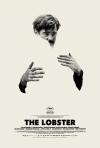

[龙虾](https://pewae.com/gaan/aHR0cHM6Ly9tb3ZpZS5kb3ViYW4uY29tL3N1YmplY3QvMjA1MTQ5NDcv)

原名：The Lobster导演：欧格斯·兰斯莫斯主演：亚里安妮·拉贝德 / 奥利维娅·科尔曼 / 昂格利基·帕普利亚 / 本·卫肖 / 杰西卡·巴登 / 科林·法瑞尔 / 约翰·C·赖利 / 罗杰·阿什顿-格里菲斯 / 蕾切尔·薇兹 / 蕾雅·赛杜类型：剧情 / 喜剧 / 奇幻地区：希腊 / 法国 / 爱尔兰 / 英国 / 荷兰首映时间：2015

一部很安静的反乌托邦电影，一面是主流社会找到伴侣的人必须时刻跟另一半保持一致，不准自慰，另一半是流亡者组织不准发生超友谊行为，必须自慰，二元化的社会，其实两边都一个味儿，不是什么好鸟。
无关单身狗，这是一部关于站队和个性化的电影——打扑克的时候，人们会把一张红桃三跟另一张红桃三叫做一对，可问题是，红桃三自己同意么？
对于最后的开放式结局，我的理解，男猪最终还是没有自戮双目，因为他始终是个自私的人，甚至我觉得片子的主题就是想说，人有自私的权利。

[健忘村](https://pewae.com/gaan/aHR0cHM6Ly9tb3ZpZS5kb3ViYW4uY29tL3N1YmplY3QvMjY3MTc3OTUv)

导演：陈玉勋主演：张孝全 / 张少怀 / 曾志伟 / 杨祐宁 / 林美秀 / 柯宇纶 / 王千源 / 舒淇 / 许杰辉 / 陈竹昇类型：剧情 / 古装 / 喜剧 / 奇幻地区：台湾 / 大陆首映时间：2017

故事非常精彩，王千源和舒淇的发挥很出色。
这根本不是一部喜剧片，最多算黑色幽默吧。
可惜色彩调得过于鲜艳了，不喜欢。

[夜闯寡妇村](https://pewae.com/gaan/aHR0cHM6Ly9tb3ZpZS5kb3ViYW4uY29tL3N1YmplY3QvMjY1OTAwMzA=)

导演：邢博主演：于朦胧 / 倪大红 / 南笙 / 沈昌龙 / 王李丹妮 / 王璐瑶 / 贺淑婧 / 郭艳 / 黄诗佳类型：悬疑 / 惊悚地区：大陆首映时间：2017

被标题坑了，这是一部典型的国产恐怖烂片，剧情辣眼睛：所有的恐怖桥段都来源于找人，主角团队一个个脑子都有坑，就知道分兵找人分兵找人……
倪大红老师为什么要客串这种东西，导演替你挡过原子弹吗？
1分送给1小时10分处李丹妮的乳摇。

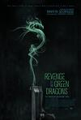

[青龙复仇](https://pewae.com/gaan/aHR0cHM6Ly93d3cuaW1kYi5jb20vdGl0bGUvdHQxMzk2NTIzLw==)

导演：刘伟强 / 卢弘轩主演：全知泰 / 吴凯文 / 岑永康类型：剧情 / 动作 / 犯罪地区：美国 / 香港首映时间：2014

一个纽约华人黑帮版的“投名状”的故事。
片子被刘伟强搞得拖泥带水，难道现在的香港电影连个传统的黑帮题材都拍不好了么，不排除借着无间道（风云）的名头去欺骗美利坚人民的感情的可能性。
感觉刘 sir 是怕被国内观众骂，主动找了个牵强的坦克人镜头自绝于祖国人民了。

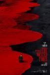

[罗曼蒂克消亡史](https://pewae.com/gaan/aHR0cHM6Ly9tb3ZpZS5kb3ViYW4uY29tL3N1YmplY3QvMjQ3NTE3NjMv)

导演：程耳主演：倪大红 / 吕行 / 杜江 / 杜淳 / 浅野忠信 / 王传君 / 章子怡 / 葛优 / 袁泉 / 赵宝刚 / 钟欣潼 / 钟汉良 / 闫妮 / 霍思燕 / 韩庚 / 马晓伟类型：剧情地区：大陆 / 香港首映时间：2016

片子质量很高，探讨的是战争对人性的破坏，这种沉重的电影不是我的菜，给不到太高的分数。
葛大爷全程无表情演出，感觉被那个日本主演（浅野忠信）盖住了。
片中露屁股的镜头据说是国际章在银幕上奉献出的最大尺度，即使没用替身，这尺度也没有09年那批照片过瘾啊～

[天才枪手](https://pewae.com/gaan/aHR0cHM6Ly9tb3ZpZS5kb3ViYW4uY29tL3N1YmplY3QvMjcwMjQ5MDMv)

原名：ฉลาดเกมส์โกง导演：纳塔吾·彭皮里亚主演：伊戈·米基塔斯 / 依莎亚·贺苏汪 / 坎嘉娜·维耐潘尼 / 塔内·瓦拉库努娄 / 帕辛·宽萨塔彭 / 披纳若·苏潘平佑 / 查侬·散顶腾古 / 育塔彭·瓦拉努科洛楚 / 茱蒂蒙·琼查容苏因 / 莎琳雷特·托马斯类型：剧情 / 悬疑 / 犯罪地区：泰国首映时间：2017

片子节奏很快，快到不像一部泰国电影，但在好莱坞这样的手法就不鲜见了。
文戏部分一点儿也不喜欢，尤其是结局，泰国也有广电总局咩？
女二真乃心机婊也，所谓友情，不过互相利用耳，为这个细节加一分。

[僵尸](https://pewae.com/gaan/aHR0cHM6Ly9tb3ZpZS5kb3ViYW4uY29tL3N1YmplY3QvMjI3MTUwMjEv)

导演：麦浚龙主演：卢海鹏 / 吴耀汉 / 惠英红 / 楼南光 / 钟发 / 钱小豪 / 陈友 / 鲍起静类型：恐怖地区：香港首映时间：2013

比前面那部好了十八层楼不止，片子里充满了哀伤的气氛，尤其是结局——世界上根本没有僵尸也没有道长，钱小豪只是一个没落的类型片电影演员，僵尸片没有了，钱小豪也就没有了。
缺憾就是找了清水崇做监制，把女鬼搞得跟迦椰子似的，扫兴。

[变态假面](https://pewae.com/gaan/aHR0cHM6Ly9tb3ZpZS5kb3ViYW4uY29tL3N1YmplY3QvMjEzNTQwNzYv)

原名：HK 変態仮面导演：福田雄一主演：佐藤二朗 / 冈田义德 / 千眼美子 / 塚本高史 / 大东骏介 / 安田显 / 室毅 / 池田成志 / 片濑那奈 / 铃木亮平类型：喜剧地区：日本首映时间：2013

这个世界上唯有日本人能想到这样的题材，也唯有日本人能把这样的题材一板一眼地拍出来。
而且这玩意儿竟然是有漫画原作的……
本片的男主演和男反派一定有强大的内心，片子里多次出现蛋蛋对撞和亲吻蛋蛋的镜头，耻感满溢，简直比拍200部A片还要丢人，得亏男主角身材那么好，干点儿啥不行。

[上帝之城](https://pewae.com/gaan/aHR0cHM6Ly9tb3ZpZS5kb3ViYW4uY29tL3N1YmplY3QvMTI5MjIwOC8=)

原名：Cidade de Deus导演：卡迪亚·兰德 / 费尔南多·梅里尔斯主演：乔纳森·哈根森 / 亚历桑德雷·罗德里格斯 / 索·豪黑 / 艾莉丝·布拉加 / 莱安德鲁·菲尔米诺 / 菲利佩·哈根森 / 道格拉斯·席尔瓦 / 马修斯·纳克加勒类型：剧情 / 犯罪地区：巴西 / 法国首映时间：2002

纯粹而野蛮的黑社会电影，相比之下香港日本和美国的黑道片都显得太假惺惺了。
巴西有键盘党的话，这个导演一定会被骂成“巴奸”。
看完这片，曾经对于大小罗、罗比尼奥、阿德里亚诺等巴西天才的陨落的难以理解变得非常容易理解。

[没出息的晓丽](https://pewae.com/gaan/aHR0cHM6Ly9tb3ZpZS5kb3ViYW4uY29tL3N1YmplY3QvMjcxMjY5NzI=)

导演：吴星星主演：宋宇 / 牛晓丽类型：剧情 / 爱情地区：大陆首映时间：2017

选择看本片只是因为偶然得知片子是大连理工大学的学生拍的，而且制作拍摄的地点也是在大连。
看了5分钟就觉得不对劲，哪个大连人家里布置得跟日本人似的？而且他爹竟然天天晚上喝清酒！
上网一搜，果然是抄袭，抄袭给0分，没毛病。

[怪物大乱斗](https://pewae.com/gaan/aHR0cHM6Ly9tb3ZpZS5kb3ViYW4uY29tL3N1YmplY3QvMTA0ODI0MjEv)

原名：Freaks of Nature导演：罗比·皮克林主演：丹尼斯·利瑞 / 克里斯·泽尔卡 / 凡妮莎·哈金斯 / 奥罗拉·佩里诺 / 尼可拉斯·博朗 / 帕特·希利 / 帕顿·奥斯瓦尔特 / 席瑞娜·文森 / 爱德·维斯特维克 / 琼·库萨克 / 瑞秋·哈里斯 / 科甘-迈克尔·凯 / 鲍勃·奥登科克 / 麦肯兹·戴维斯类型：喜剧 / 恐怖地区：美国首映时间：2015

就像中国喜欢把各种私活放进抗日神剧里一样，欧美也喜欢往僵尸片里加各种料，本片的料加得我非常满意。
缺点是特效太寒碜了。

[劲道猪头肉](https://pewae.com/gaan/aHR0cHM6Ly9tb3ZpZS5kb3ViYW4uY29tL3N1YmplY3QvMjY4Njg3MzEv)

原名：Schweinskopf al dente导演：Ed Herzog主演：塞巴斯蒂安·贝策尔 / 西蒙·舒瓦茨类型：喜剧 / 犯罪地区：德国首映时间：2016

对于我来说这片太散了，形散而神更散，不知导演到底想说啥。
所谓德式幽默的点也完全 get 不到。

[荒蛮故事](https://pewae.com/gaan/aHR0cHM6Ly9tb3ZpZS5kb3ViYW4uY29tL3N1YmplY3QvMjQ3NTAxMjYv)

原名：Relatos salvajes导演：达米安·斯兹弗隆主演：丽塔·科尔泰塞 / 凯撒·博尔东 / 南希·杜普拉 / 地亚哥·詹蒂莱 / 奥斯卡·马丁内兹 / 奥斯马·努涅斯 / 沃尔特·多纳多 / 玛丽娅·玛努尔 / 玛莉亚·奥内托 / 胡丽叶塔·泽尔贝伯格类型：剧情 / 喜剧 / 犯罪地区：西班牙 / 阿根廷首映时间：2014

非常棒的作品，看着看着就觉得仿佛自己也沉冤得雪了。
片中的配乐无一不是欢快的，冲突感十足。
ICBC强行广告植入，说明祖国真的强大了，不仅能入侵好莱坞，连第三世界国家也沦陷了。

[恶人报喜](https://pewae.com/gaan/aHR0cHM6Ly9tb3ZpZS5kb3ViYW4uY29tL3N1YmplY3QvMjYyMTk2NTEv)

导演：谷德昭主演：何超仪 / 余安安 / 吴镇宇 / 夏春秋 / 官恩娜 / 张达明 / 曾国祥 / 李灿森 / 林子聪 / 江疏影类型：喜剧地区：大陆 / 香港首映时间：2016

这么多年了，郑中基仍旧是还不错的歌手+蹩脚的喜剧演员，只是他好像早就忘了歌手身份了。
摄像大哥是不是跟吴镇宇和郑中基有仇啊，大头照特写给得两位老哥脸上全是褶子摞褶子。
江疏影美则美矣，却很死板，形象太单薄，像个纸片上的人。

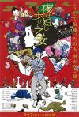

[春宵苦短，少女前进吧！](https://pewae.com/gaan/aHR0cHM6Ly9tb3ZpZS5kb3ViYW4uY29tL3N1YmplY3QvMjY5MzUyNTEv)

原名：夜は短し歩けよ乙女导演：汤浅政明主演：中井和哉 / 中冈创一 / 中博史 / 吉野裕行 / 家中宏 / 小清水亚美 / 悠木碧 / 新妻圣子 / 星野源 / 本多力类型：动画 / 喜剧 / 奇幻 / 爱情地区：日本首映时间：2017

怪诞、精彩、充满想象力。

[凶宅美人头](https://pewae.com/gaan/aHR0cHM6Ly9tb3ZpZS5kb3ViYW4uY29tL3N1YmplY3QvMTMwMDUwOQ==)

导演：刘邑川 / 胡庆士主演：刘晓民 / 吴庄 / 富锦 / 徐萍 / 李小波 / 李越 / 王艳梅 / 胡庆士 / 舒跃宣 / 贺平类型：恐怖地区：大陆首映时间：1989

虽然是翻拍国外名著，但这种题材当年是能过审，足以说明现在环境有多恶劣。
片子倒一点儿也不吓人，倒是有点硬科幻的味道。
年代想象力受限，为表现高科技而做出的呲儿哇儿乱叫的音效现在听起来太刺耳了。

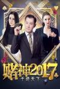

[赌神2017之千绝天下](https://pewae.com/gaan/aHR0cHM6Ly9tb3ZpZS5kb3ViYW4uY29tL3N1YmplY3QvMjcwMTMyNzA=)

导演：何不理 / 熊阿狸主演：宋建新 / 曹国涛 / 杜康 / 熊小梨类型：剧情地区：大陆首映时间：2017

手欠。

[麻辣学院](https://pewae.com/gaan/aHR0cHM6Ly9tb3ZpZS5kb3ViYW4uY29tL3N1YmplY3QvMjcwMzY0Njc=)

导演：李金瀚主演：九孔 / 秦沛 / 董立范 / 蒋欣 / 郝劭文 / 黄品源类型：剧情 / 喜剧地区：大陆首映时间：2017

编剧或剪辑负分。
九孔和董立范都很卖力气，甚至可以说这是我看过九孔先生最好的发挥，蒋欣可圈可点，黄品源中规中矩，秦沛老而弥坚。
可那一帮演学生和老师的30多岁的不红的综艺咖演得都是什么鬼？

[刺客聂隐娘](https://pewae.com/gaan/aHR0cHM6Ly9tb3ZpZS5kb3ViYW4uY29tL3N1YmplY3QvMjMwMzg0NS8=)

导演：侯孝贤主演：倪大红 / 周韵 / 咏梅 / 妻夫木聪 / 张少怀 / 张震 / 忽那汐里 / 戴立忍 / 梅芳 / 毕安生 / 石隽 / 舒淇 / 许芳宜 / 谢欣颖 / 阮经天 / 雷镇语类型：剧情 / 古装 / 武侠地区：台湾 / 大陆 / 香港首映时间：2015

恕我愚钝，除了华丽的服装啥也没看懂。
中间眯了一会儿，所以不敢给太低的分，怕耽误了人家。

[模特魅影](https://pewae.com/gaan/aHR0cHM6Ly9tb3ZpZS5kb3ViYW4uY29tL3N1YmplY3QvMjQzODEwNDYv)

导演：佟秀玄主演：倪慕斯 / 唐宁 / 易薇 / 李星海 / 杨骏 / 梁竟依 / 蒲美辰 / 饶薇类型：剧情 / 悬疑 / 惊悚地区：大陆首映时间：2013

比其他烂片好的一点是这部电影的镜头交待得比较清楚。

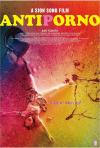

[反情色](https://pewae.com/gaan/aHR0cHM6Ly9tb3ZpZS5kb3ViYW4uY29tL3N1YmplY3QvMjY4NTY5MDcv)

原名：アンチポルノ导演：园子温主演：不二子 / 吉牟田真奈 / 富手麻妙 / 小谷早弥花 / 筒井真理子类型：剧情 / 情色地区：日本首映时间：2016

片子色彩的运用是极好的，女主身材也是极好的，戏中戏反转的手法也是极好的。唯一的问题：没看懂。
仿佛温子园名气大了之后再转回来拍cult片，在把观众当猴耍。

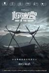

[心迷宫](https://pewae.com/gaan/aHR0cHM6Ly9tb3ZpZS5kb3ViYW4uY29tL3N1YmplY3QvMjU5MTc5NzMv)

导演：忻钰坤主演：孙黎 / 平坦 / 张景素 / 曹西安 / 朱自清 / 杨瑜珍 / 王梓尘 / 王笑天 / 罗芸 / 袁满类型：剧情 / 悬疑 / 犯罪地区：大陆首映时间：2015

忍过去开头10分钟，柳暗花明，粗糙的制作淳朴的演技完全掩盖不住精巧构思和精准剪辑的光芒，全片唯一败笔是应付广电的那几行字幕。
有人说全片下来没好人，我不觉得。大壮和丽琴完全是普通人的做法，换成我几乎会做出跟大壮一样的选择。
倒是那个后期几乎没怎么出场的黄欢，所作所为令人不寒而栗。

[女子学校拷问部](https://pewae.com/gaan/aHR0cHM6Ly93d3cuaW1kYi5jb20vdGl0bGUvdHQzNjE3OTk2)

原名：The Torture Club导演：吉田康太主演：吉住春奈 / 木嶋のりこ / 間宮夕貴类型：剧情 / 喜剧 / 爱情地区：日本首映时间：2014

剧情不知所云。
倒也没谁是冲着剧情去的，几个主演身材尚可。

[黑雪](https://pewae.com/gaan/aHR0cHM6Ly9tb3ZpZS5kb3ViYW4uY29tL3N1YmplY3QvMjY3NzI2MzUv)

原名：Nieve negra导演：马丁·霍达拉主演：伊凡·卢恩戈 / 哈维尔·库斯罗 / 多洛莉丝·房兹 / 安德烈斯·埃雷拉 / 米克尔·伊格莱西亚斯 / 莱娅·奥普莱 / 莱娅·柯丝达 / 莱昂纳多·斯巴拉格利亚 / 贝尔·蒙特罗 / 费德里科·路皮类型：剧情 / 悬疑 / 惊悚 / 犯罪地区：西班牙 / 阿根廷首映时间：2017

最后20分钟的翻转本可以带一波高潮的，可惜前面铺垫得太多太细，已经没效果了。
前3/4非常无聊。
之前只知道阿根廷也有高纬度地区，可没想到会像片子里这样搞得跟大兴安岭一样，长见识了。

[美好的意外](https://pewae.com/gaan/aHR0cHM6Ly9tb3ZpZS5kb3ViYW4uY29tL3N1YmplY3QvMjYzODI5NjIv)

导演：何蔚庭主演：桂纶镁 / 欧阳娜娜 / 王元也 / 王景春 / 谢盈萱 / 郑开元 / 陈坤类型：喜剧 / 奇幻地区：大陆首映时间：2017

最郁闷的烂片类型，是你知道它烂，可是说不好烂在哪里。
本片主咖桂纶镁已经竭尽其所能了，搭戏的人也可以，剧情凑合，导演剪辑也凑合，可它就是，不是个玩意儿。
华谊兄弟这么搞下去，也难怪某点各路娱乐文天天拿它开涮了。

[神探](https://pewae.com/gaan/aHR0cHM6Ly9tb3ZpZS5kb3ViYW4uY29tL3N1YmplY3QvMjAyNzkzOC8=)

导演：杜琪峰 / 韦家辉主演：刘锦玲 / 刘青云 / 安志杰 / 张兆辉 / 李国麟 / 李彩宁 / 林家栋 / 林熙蕾 / 林雪 / 郑保瑞类型：动作 / 悬疑 / 惊悚 / 犯罪地区：香港首映时间：2008

维持了银河映像一贯的水准，却也没什么大惊喜。
林家栋的七个人格没玩好，除了胖子、女人和暴力者，其余四个根本摆设。
这种精神分裂的片子很不好的一点，是强按着你的鼠标逼着你二刷，这种感觉非常不爽。

[冰冷热带鱼](https://pewae.com/gaan/aHR0cHM6Ly9tb3ZpZS5kb3ViYW4uY29tL3N1YmplY3QvNDgzMDIzNi8=)

原名：冷たい熱帯魚导演：园子温主演：三浦诚己 / 吹越满 / 尾原光 / 渡边哲 / 神乐坂惠 / 绪方义博 / 芦川诚 / 黑泽明日香类型：剧情 / 惊悚 / 犯罪地区：日本首映时间：2010

有色情有暴力有血浆有翻转，可以算是小成本cult片的极致了，这就是我想要的电影。
对园子温有种相见恨晚的感觉，相比之下，井口升和西村喜广之流实在是弱爆了，戊戌年计划园子温打通关。
演男主角的老婆的女演员，被反派老头子揉胸，又被反派老头子揉胸，洗澡正面全裸，再被男主角揉胸，牺牲真的很大，于是拍完这片之后，导演园子温就……娶了她！

[Z岛](https://pewae.com/gaan/aHR0cHM6Ly9tb3ZpZS5kb3ViYW4uY29tL3N1YmplY3QvMjU4NzIxOTYv)

原名：Zアイランド导演：品川祐主演：RED RICE / シシド・カフカ / 中野英雄 / 哀川翔 / 山本舞香 / 川島邦裕 / 木村祐一 / 水野絵梨奈 / 窪塚洋介 / 篠原ゆき子类型：动作 / 喜剧 / 恐怖地区：日本首映时间：2015

丧尸片是个烂题材，虽然加入了日式黑道的元素，仍旧没什么新意。
亮点是按照ACG攻略打僵尸的医生和清纯学生妹，以及开始时的大长腿护士。

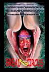

[面包与马戏](https://pewae.com/gaan/aHR0cHM6Ly9tb3ZpZS5kb3ViYW4uY29tL3N1YmplY3QvMzI4NDIzMy8=)

原名：Bread and Circus导演：Martin Loke主演：Benjamin Rørstad / Martin Loke / Miriam Johansson类型：冒险 / 喜剧 / 奇幻 / 恐怖地区：挪威首映时间：2003

挪威语+英文字幕的生肉并不是没看懂的直接原因，这片子本身真的是脑洞大开，莫名其妙。！
从肛门里扣酒瓶子并吞粪自尽的情节荡漾着北欧式的三俗。

[一路向前](https://pewae.com/gaan/aHR0cHM6Ly9tb3ZpZS5kb3ViYW4uY29tL3N1YmplY3QvMjYzODI4ODgv)

导演：侯亮主演：姚星彤 / 常远 / 张佑赫 / 张颂文 / 赵奕欢 / 陆海涛 / 陈赫类型：喜剧地区：大陆首映时间：2015

处处平庸，毫无亮点。
新出炉烂片明灯一名——常远。

[记忆大师](https://pewae.com/gaan/aHR0cHM6Ly9tb3ZpZS5kb3ViYW4uY29tL3N1YmplY3QvMjU4ODQ4MDEv)

导演：陈正道主演：张隽溢 / 徐静蕾 / 曹英睿 / 杜函梦 / 杨子姗 / 栾元晖 / 梁杰理 / 段奕宏 / 焦刚 / 王真儿类型：悬疑 / 惊悚地区：大陆首映时间：2017

国产悬疑片做到这个程度真心不容易，黄渤跟段奕宏飚戏飚得很爽的感觉。
道具的设置很奇怪，可能是为了淡化年代感，为了过审？

[追凶者也](https://pewae.com/gaan/aHR0cHM6Ly9tb3ZpZS5kb3ViYW4uY29tL3N1YmplY3QvMjYyODQ2MjEv)

导演：曹保平主演：刘烨 / 孙磊 / 岱江 / 张岳 / 张译 / 施宁 / 李诗译 / 杨晶 / 段博文 / 王云辉类型：剧情 / 喜剧 / 犯罪地区：大陆首映时间：2016

张译演的东北傻缺黑社会绝对符合我所见过的黑社会的一切特征，太真实了，这家伙是个天才！
一件事套着演三遍，挺喜欢这种调调的，可惜最后的结局跑偏了。
给王子文这要胸没胸要屁股没屁股的小身板安排裸戏，导演到底图个啥？

[恋爱大作战](https://pewae.com/gaan/aHR0cHM6Ly9tb3ZpZS5kb3ViYW4uY29tL3N1YmplY3QvMjcwODYxNjg=)

导演：卫捷主演：李维嘉 / 杜海涛 / 程媛媛地区：大陆首映时间：2017

我不喜欢给人贴标签，尤其“快乐家族”还不是一个人，不过他们离被我集体贴“明灯”标签不远了。
这片子的剪辑实在是辣眼睛。

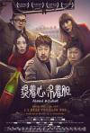

[提着心吊着胆](https://pewae.com/gaan/aHR0cHM6Ly9tb3ZpZS5kb3ViYW4uY29tL3N1YmplY3QvMjY4MDg0NjYv)

导演：李雨禾主演：任素汐 / 徐子力 / 曹瑞 / 楼云飞 / 耿一正 / 董博 / 陈春生 / 陈玺旭 / 高叶类型：剧情 / 喜剧 / 悬疑 / 犯罪地区：大陆首映时间：2017

虽说“无巧不成书”，可有些镜头切得实在太过突兀，有些情节也太扯了。
任素汐的脸好像又没那么长了。

[佩小姐的奇幻城堡](https://pewae.com/gaan/aHR0cHM6Ly9tb3ZpZS5kb3ViYW4uY29tL3N1YmplY3QvNzA1MTgzMC8=)

原名：Miss Peregrine导演：蒂姆·波顿主演：伊娃·格林 / 克里斯·奥多德 / 劳伦·麦克罗斯蒂 / 匹克西·戴夫斯 / 塞缪尔·杰克逊 / 朱迪·丹奇 / 澳澜·琼斯 / 特伦斯·斯坦普 / 米洛·帕克 / 艾拉·珀内尔类型：冒险 / 剧情 / 奇幻地区：美国首映时间：2016

穿衣服的伊娃没有光着的好看，而且伊娃这个妆越看越像姚晨。
后半部分太草率了。
爷爷的钱包里有黄色的毛爷爷。

[盗钥匙的方法](https://pewae.com/gaan/aHR0cHM6Ly9tb3ZpZS5kb3ViYW4uY29tL3N1YmplY3QvNjg4MDQ5Ny8=)

原名：鍵泥棒のメソッド导演：内田贤治主演：堺雅人 / 广末凉子 / 森口瑶子 / 荒川良良 / 香川照之类型：剧情 / 喜剧地区：日本首映时间：2012

香川太君最高！
上世纪末男生宿舍最爱的封面女郎广末凉子的脸上已经看不到胶原蛋白了。
本片完美诠释了“钢铁是怎样没有炼成的”。