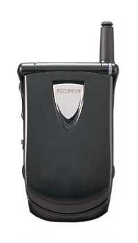
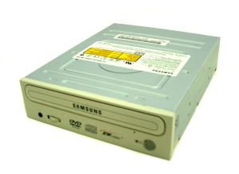

从来不曾像今时今日憎恨三星一般憎恨一个其他品牌。

胖子不是一口气吃出来的。而是三口。

03年大学毕业前，大姑父送了一部他淘汰下来的SGH810找工作用。此手机有三个特点：接电话闪断、信号差、待机短。一个月内耽误了我两个面试。从此将它束之高阁。对三星也产生了警惕。但毕竟是二手货，不好一棒子打死。

转过来到了03年暑假，在Q的鼓动下买了个三星的combo-DVD光驱+CD刻录机。双光头的东西在当时还比较少见——少见就意味着实验性产品，就意味着容易坏。果然，没出两个月，DVD光头就不读盘了。但CD无论读写都还挺方便。就当只买了个CD刻录机呗，反正这玩意儿确实挺便宜，比CD刻录机还要便宜。但烂泥就是扶不上墙，小半年之后，远在德国的宝宝来Q垂询：“上次你给我寄过来的盘，怎么都读不出来啊？！”赶紧打开光盘包。悲催地发现三个月之后CD刻录就变成时灵时不灵的独孤九剑了。损失也可谓惨痛，我生平制作的第一个GIF，江爷爷的ToSimpleToYoung视频，毕设的资料……自此，三星就算上了我的黑名单。惹不起总还躲得起的。

事实证明，躲也是躲不起的。08年年底的时候老婆大人说把蜜月录像整理一下吧。于是我立即顺沟柳屁说硬盘没地方了。于是老婆大人直接把我PASS过去找人买了一块40G的三星移动硬盘。这硬盘从拿回来就挑三拣四，经常供电问题连接不上。为此特意给配了个外部电源。从12年起，想读出来更加需要提前焚香沐浴。终于，昨天晚上，一阵表弦声过后，寿终正寝。这一次的损失也是最巨大的：编辑后的蜜月视频，宝宝的部分视频资料，还有之前汉化梦战4的全部资料。

是的，梦战4永远不会有修正版了。

我痛～