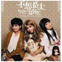
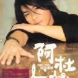
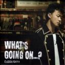
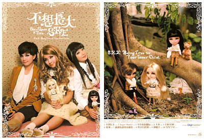

[不想长大](https://pewae.com/gaan/aHR0cHM6Ly9tdXNpYy5kb3ViYW4uY29tL3N1YmplY3QvMzYyMzA2OQ==)

音乐家：S·H·E风格：流行地区：台湾发行年月：2005-01

[I Do](https://pewae.com/gaan/aHR0cHM6Ly9tdXNpYy5kb3ViYW4uY29tL3N1YmplY3QvMTQ5MzQ2Ng==)

音乐家：阿杜风格：流行地区：台湾 / 新加坡发行年月：2005-01

[What's Going On....?](https://pewae.com/gaan/aHR0cHM6Ly9tdXNpYy5kb3ViYW4uY29tL3N1YmplY3QvMTkyMDYyMg==)

音乐家：陈奕迅风格：流行地区：香港发行年月：2006-01

SHE的新片秉承了上一张的幼齿风格,Ella的bass声出现过多导致许多歌曲的效果很不悦耳.这张专辑里的齐唱多而和声少,Hebe几乎没有任何飙高音的表现,有些失望.整张专辑听一遍的感觉是很平.除了某首个配器的旋律极像李心洁的《爱像大海》.不知道为什么现在她们连翻唱都翻不好了.

阿杜两年没发片了,所以专辑的质量就比一年一张的SHE强一点.仅仅一点而已.主打歌里故意把I Do唱得跟阿杜两个字类似,可是感觉拿名字做噱头已经有些过时了.总感觉这两个字唱出来的感觉跟小刚唱出来的 he lo 的感觉十分类似.尽管不喜欢阿杜的声音,但还是不得不承认他这张专辑还不错.专辑质量是一回事,我听不听是另外一回事.

同样是两年一张,陈奕迅的新专辑,感觉国语部分和粤语部分差别很大.国语歌的歌词,大部分都不押韵.曲调也平淡无奇.也许晚上临睡时听会不错,但绝对不适合走路上班的时候听.粤语部分就精彩得很,几个长音拉得也很舒服.陈兄是英皇里唯一还看的顺眼的人,加油!

其实现在我的shuffer里最好听的,是林忆莲的粤语专辑;而最近听的感觉最好的新歌,来自Enya.