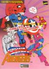

[上尉密令ARC](https://pewae.com/gaan/aHR0cHM6Ly93d3cuZG91YmFuLmNvbS9nYW1lLzI1NzI1NjMzLw==)

原名：Captain America and the Avengers机种：ARC厂商：DATA EAST类别：ACT发行年月：1991-12耗时：5

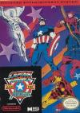

[上尉密令](https://pewae.com/gaan/aHR0cHM6Ly93d3cuZG91YmFuLmNvbS9nYW1lLzI1NzI1NjMzLw==)

原名：Captain America and the Avengers别名：美国队长与复仇者机种：FC厂商：DATA EAST类别：ACT发行年月：1991-12耗时：12

这次来个有趣的双黄蛋。题材是漫威旗下的这几年异常火爆的“复仇者联盟”。
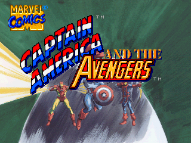
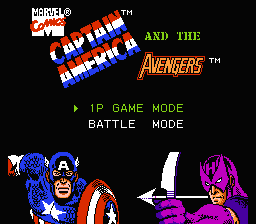
为啥说是双黄蛋呢？因为这次要说的是同名游戏的街机版和家用机版。我实在记不清是先接触的街机还是先玩的红白机了，反正都是在92年的暑假。
这次图也混着贴。总有人说像素游戏像素游戏的，其实像素和像素还不是一回事儿呢，同时代的八位机和街机的图片放一起，还是很容易分辨出来的。分辨不出来的，我也不解释了。
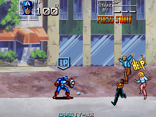
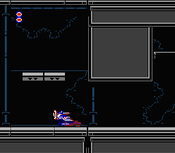

上次老虎说他最早接触的流行文化一般是游戏，其实我也差不多。漫威家的蜘蛛侠、X-MEN和复仇者联盟，时间上脚前脚后，都是大约92-94年在街机和家用机上最先接触到的，倒是隔壁DC的超人和蝙蝠侠先接触的是电影（录像带）。
游戏名直译过来是“美国队长和复仇者联盟”。大约香港人看到Captain就喜欢翻译成上尉，所以美国队长也叫做美国上尉。这本身没什么毛病。可要命的是CAPCOM的另一款名作《名将》的英文名叫“Captain Commando”，所以有另一小撮香港翻译把名将也叫做“上尉密令”，于是造成了“密令”的大混乱，在小孩子之间也难以达成共识。
像我当年就坚持把红白机版认作正宗“上尉密令”，把街机版视为侵权。直到不久前想起这个游戏查资料，才发现二者同根同源，是一个班底做下来的。真尴尬。
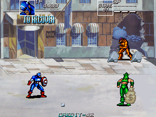
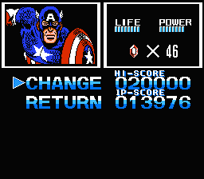

主角当仁不让的是Captain American。街机版和红白机都有的角色是鹰眼。受机能所限，红白机砍掉了钢铁侠和幻视（VISION）。其实小学僧根本不认识谁是谁，只知道拿盾牌的攻击力强，拿弓箭的打得远，红人和白人是废物。这次发现钢铁侠不是废物，但幻视真的是废物。
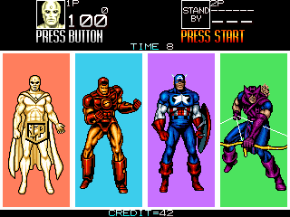
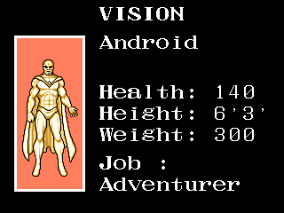

街机版是传统的动作过关为主，穿插飞行射击要素，在陆地上美队和鹰眼比较好用，而到了飞行关卡，则是钢铁侠和幻视看起来比较好用，因为美队和鹰眼要戴头盔，占的地方大，容易被击中。
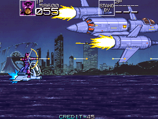

对手则是红骷髅为首的一帮牛鬼蛇神。红白机跟街机的敌人是一样的。
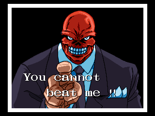
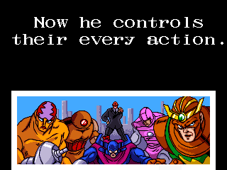

动作过关类的街机游戏的一大特色就是不用动脑子，一路推过去就是了。
BOSS们还真不难，就是有些抗揍而已。最后的红骷髅会变一次身，体型变大很唬人，实力很囊。
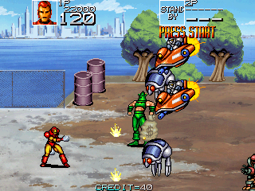
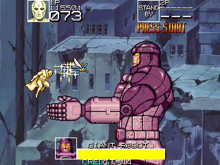
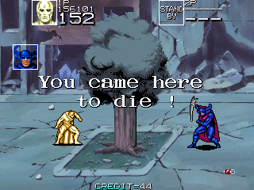
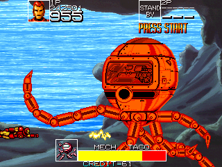
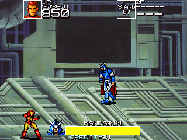
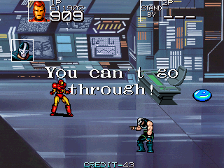
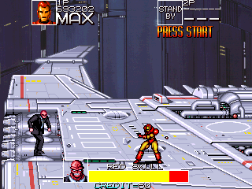
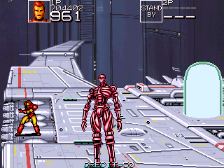

街机版的通关画面，在那个年代来讲算是精致了。而且交待了几个龙套：送批萨的快银，空中无敌的黄蜂女，水底指路的海底人和空中指路的神力人。
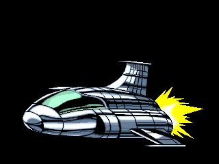
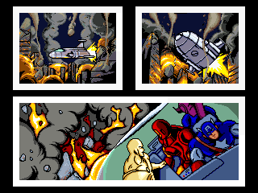
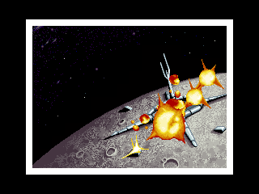
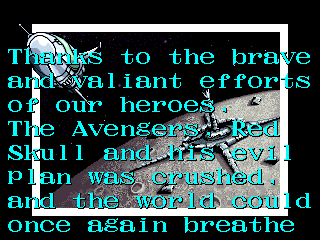
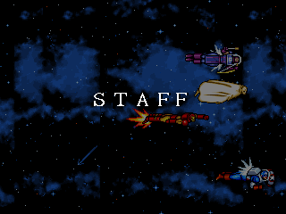
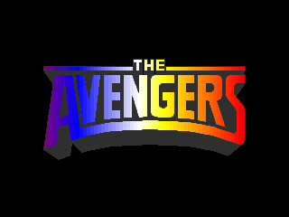
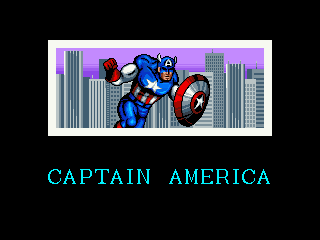
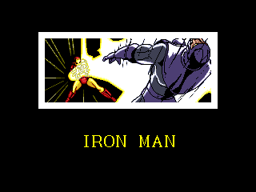
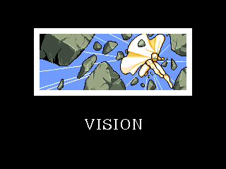
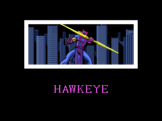
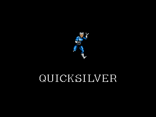
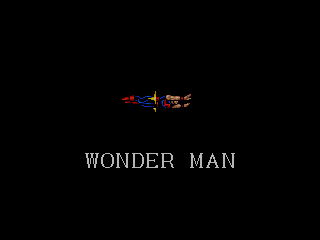
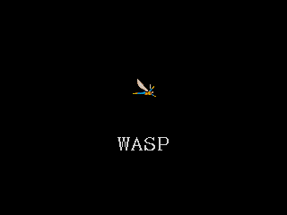
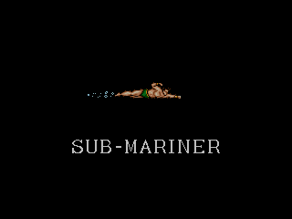
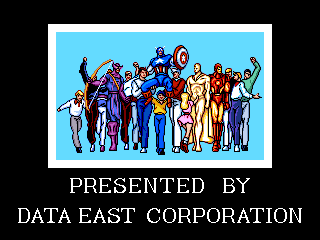

再来看看家用机版。
一开头就有个小剧情，满先生现身，幻视和钢铁侠“立仆”。
小时候还以为这个满先生是斯雷德戴了一手戒指客串的……
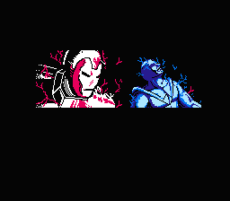
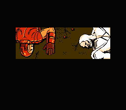
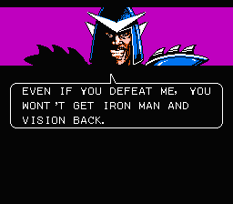

红白机版本，可以选美队或鹰眼交替轮流上场。有一定的升级机制，能量攒到一定程度武器就会升级。由于有中BOSS设定的缘故，所以还蛮难的，往往是美队挂了，换鹰眼去救，救出来之后鹰眼又挂了，再换美队来……无限循环，反正实机上我是没打通关过。因为小兵的力量会随着游戏的进行提升4次，最后的小兵碰一下都很疼的样子。而且家用机版为了增加游戏时间，设计了解谜要素。每小关要找到过关圆球才可以，而最后一关则设计成外太空，需要把地图上所有的城市都踩一遍再去休斯顿才能出现。当年也没个攻略，谁能知道这个啊！我连复仇者飞船都没打出来。
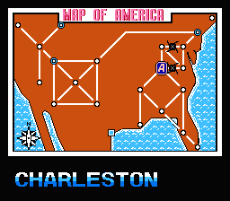
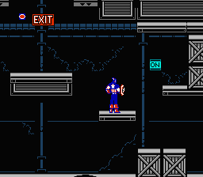

同样为了增加难度，地图上还会出现旋风状的小BOSS。难倒是没多难，就是太晃眼。
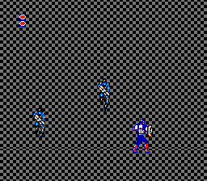

地图上有个虚拟的地方叫复仇者公园，是跟满大人对放的地方，看这背景也挺恶搞的。
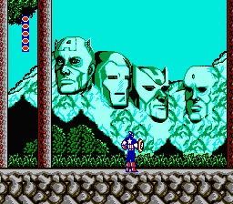

红白机上，鹰眼和美队的区别很大。美队动作更灵活，适合跑地图，鹰眼攻击更好控制，适合打BOSS。很多BOSS都会在天上飞，美队只能干瞪眼。
而且游戏中武器的威力可以提升，鹰眼的弓箭强化后会产生爆炸，射起来很过瘾；而美队的盾牌会多飞行半圈，反而误事。
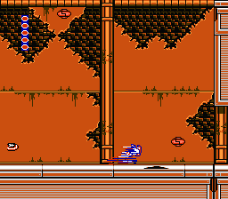
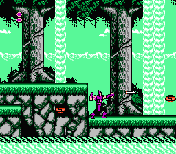
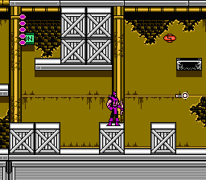

每到一个大城市都会出现一段剧情杀，这种BOSS也叫不上个名字，最后会变成一团火比较难躲。
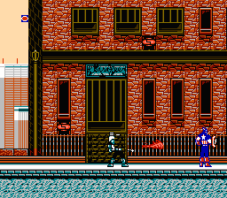
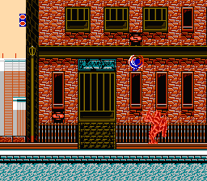

无论街机还是家用机，给美队提供支持的都是黄蜂女（WASP），真不知道电影版里黑寡妇怎么就上位了。
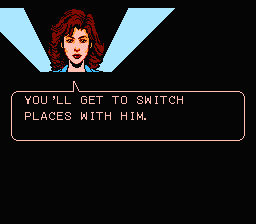

BOSS都不怎么难，只是跟街机版一脉相承的血长。倒数第二的CROSSBONE有点儿意思，一开始藏的位置得引画面上的火焰炸开才能真正开打。
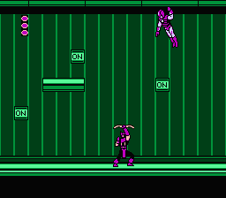

红白机版的通关画面，就要寒酸了许多。

