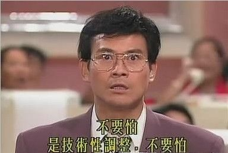

在这个全民皆股的年代,I记这里这么多穿白色晚霞子的,自然也不能免俗.
每个周一,讨论的只有三件事:周末玩得怎么样,周六周日的比赛看了么,这周的大盘如何.
J先生敏锐的嗅觉和黑桃钩一夜回到解放前的故事,已经路人皆知了.

俺是玩基金的,都不好意思跟他们打招呼.
不得不承认,俺对股票有恐惧感.
其一:每次在寝室玩大富翁,股票买的最多的dagang往往被套得最惨.
其二:一看到那红红绿绿的数字,就会想起傻傻的刘青云和咬牙切齿的郑少秋,以及他嘴边的那句”股灾!”

==== Update 14.10.11 ====
Youhun 提交于2007-05-15 9:55 下午

真希望它崩盘啊.
连带着房价也会便宜一点.
今天大跌.连带俺的基金也大跌…

旋律 提交于2007-05-15 9:27 下午

国内股市就是国家开赌场，庄家圈钱。好像前几天涨到4000了吧，
典型的泡沫么。股民们私下说的什么08之前不会崩，看着吧。过
两天有个人跳出来说句什么，就废废了。

幸亏当年9月份开始装修花钱,把基金全赎出来了,否则,哼哼!