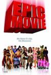

[史诗电影](https://pewae.com/gaan/aHR0cHM6Ly9tb3ZpZS5kb3ViYW4uY29tL3N1YmplY3QvMTkyNjc5NS8=)

原名：Epic Movie导演：亚伦·赛尔策 / 贾森·弗莱德伯格主演：Adam Campbell / Dane Farwell / 佛莱德·威拉特 / 克莉斯塔·弗拉娜甘 / 克里斯平·格洛弗 / 凯文·麦克唐纳德 / 卡尔·潘 / 卡门·伊莱克特拉 / 大卫·卡拉丁 / 托尼·考克斯类型：冒险 / 喜剧地区：美国首映时间：2007

名字从恐怖电影改成了史诗电影,怀疑制作团队是想像打麻将那样调庄换手气.

结果也跟大多麻将牌局一样,技术问题怎么改名也是没有用处的.
反正俺从一开始看就只有一个想头,这回飞出来的车会把谁干倒啊?最后得偿所愿,片子也像之前的一样结束了.唯有跟中国人相关的恶搞成龙和的主题音乐还有点意外.
唉,有这时间干点啥不好.赔了.