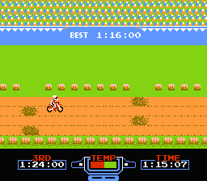
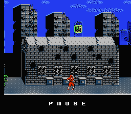
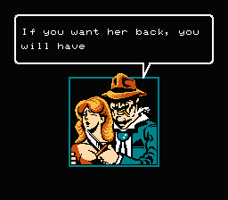
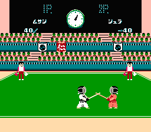
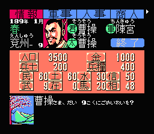

a.第一次接触红白机是在87年的8月初的某个夏夜。大姨家的两个表哥说，大致就要上学了，我们俩去买本书送给他吧。然后就拖着我到了星海公园东门（现圣亚）的那条夜市街上，然后俩人把我扔在一个电游厅里，说：“大致，你在这儿好好等着，这是我同学他姑开的，点蚊香没蚊子，等哥回来领你去买书。”然后俩人屁颠屁颠跑去洗海澡了。一个多小时之后才回来。期间我一直在看俩叼着烟卷儿的社会青年大哥站在电视前面，用手柄操作俩小人，有时往前开枪，有时趴下，有时跳起，有时触电，有时被打中……但就是没打过那关。没错，那俩臭手一个多小时没也打过魂斗罗第四关。

b.那几年电游厅如雨后春笋一般蔓延滋长着，一块钱30分钟的价格维持了好几年。家门口附近就有一个。但是总有坏学生在那里抢钱，也怕被老师抓。所以经常跑到300米外的大化子弟小学附近的电游厅去。开始只是看。后来偶尔才能攒钱爽上半小时。犹记第一次自己花钱玩电游的情形：挑了一盘64IN1的卡，找到一个叫《毛毛虫》的游戏，胡乱摁也过了两关。这时身后走来一位叫林涛的同学，他拍着我的肩膀说：“大致，你玩这个游戏太赔了，我带你玩好玩的。老板，换魂斗罗2！”接下来，我们就双打魂斗罗。30条命第一关就死了个精光。尤其是天上掉炸弹的那个地方，死了10多条命之后林涛帮我跳过去的。嗯，林涛是真名，考虑到几乎每个人都有个叫林涛的同学。

c.89年春节正月初四。老妈先跑出去同学聚会了，老爹带着俺去给家住昆明街的一位李大大拜年。本来是打算串个门就走的，可老爹的那几个工友非要拖着他打麻将。于是李大娘把俺关进另一间屋子，狂玩52IN1，除去中午吃饭，大概玩了7、8个小时吧。水平太臭，最大成就也就是摩托车低级难度全第一。

d.89年春游出发没多久，下雨了。从公园拉回学校之后就解散各回各家了。金子提议去他家玩游戏。于是几个人带着满包的食品去金子家，观赏了一遍金子和小春表演的沙罗曼蛇打通关。自此，凡春游必盼下雨。

e.当时的同学们家里都是苦哈哈，几乎都没有游戏机。只有[沙豆子](https://pewae.com/2010/11/sed-bean.html)家里有一台小天才。老沙是个豪爽的人，每逢周三半天课的时候他都要邀几个要好的同学去他家玩游戏。因为在学校谈论电游是个禁忌话题，所以每次他都问：“放学一起去洗澡？”这放今天就基情无极限了吧。

f.92年转学以后，发现老爹每个月会往家里的一个钱包里装钱，几个月下来发现一直是维持200的样子。某次忽然发现里面是210块钱，欣喜若狂，偷了10块钱出来，去玩了五块钱的《超级玛丽》，剩下的五块钱，请大酒喝豆腐脑了。至今老爹也没发现这件事。

g.[巴塞罗那奥运会](https://pewae.com/2008/09/the-olympics-for-my-13-instant.html)的前夜，在三舅家打一盘蛋疼无比的21IN1。《联合大作战》第四关定版，《龙牙》以我的技术水准死活打不过第二关……在纠结中看完了开幕式。

h.92年，姑父给表妹买了一台红白机。每个周三我放学的时候都不直接回家，而是先跑奶奶家玩一个小时游戏机。某个中午，玩游戏机的时候把姑父那屋新换的电视给玩烧了，嗷嗷直冒烟。吓得俺当时拔腿就跑。后来姑姑和姑父也没怎么责怪我。其实我倒不怕他们责怪，只是害怕把游戏机烧了。好在盗版游戏机比正版星海电视皮实得多。（话说大连本地品牌星海牌电视机，在黑白时代质量是极好的，进入彩色时代就是渣！）

i.马莲花是我的新朋友。他手上有两盘合卡都是极好的。一盘里的沙罗曼蛇保护膜一旦吃上就永远不掉，即使撞死也不掉。另一盘里的所有高K游戏都是30条命，就是仗着这盘卡，我才勉强有了通关鳄鱼先生、双截龙2、忍者龙剑传2的经历。即便是这样，洛克人1也没打通关，曾创下33条命死于会分裂的黄豆怪手下的耻辱记录。

j.92、93年，同学之间换卡玩这事儿很普遍。但如果被标题党骗了就很惨。比如曾经换到过一盘只有敲冰块、大力水手、功夫和超级玛丽的四合一。当时俺就感动得快要哭了……某个暑假召集日，和一个叫李狗狗的小伙伴对骂：理由是我们都认为跟对方换的游戏卡不好玩。当时是四合一换四合一。我手上的是机械战警，终结者，印第安纳琼斯和空中魂斗罗；他手上的是圣斗士黄金传说完结篇，恶魔城2，激龟忍者传和小美人鱼。

k.因为奶奶（姑姑）家有游戏机，所以周日总找理由往那儿跑。一次俺娘答应俺，要俺先配她去姥姥家，然后就放我去奶奶家。你知道的，女人回娘家之后一磨蹭就过点儿，转眼就下午4点了。俺就开始不高兴，反复嘟囔：“说话不算话……”俺娘也恼了，立刻赶俺去了奶奶家，并要求7点以前回家。于是俺小跑着坐公交去奶奶家跟表妹打了几局《六三四的剑》，又小跑着坐公交车回家，然后还被俺娘用笤帚招呼了一顿真实版剑道。

l.大爷再婚后，俺娘跟新大娘就一直不那么对付。新大娘一直想找机会拉近关系。暑假里的一天，便宜堂哥拉我出去，说，今天晚上去我家吧，有《忍者神龟3》可以玩。其实我是知道他目的的，但实在没经起电游的诱惑，就去了。结果，被骗了，根本没有忍者神龟3，只有戏说乾隆。第二天回奶奶家又被老妈臭骂了一顿。从此，再没跟便宜堂哥讲过一句话。其实他也挺冤，他的有忍者神龟3的同学那天碰巧不在家而已。

m.93年上了初中，同桌是宝宝这个臭味相投的家伙。每天中午他都回他奶奶家吃饭，我就去外面书摊逛一圈之后去找他。然后不是一起去上学，而是跑到前楼他自己家玩游戏。动作快的话能玩40分钟，慢的话只能玩20分钟。洛克人2和天使之翼就是这样20分钟20分钟地被打穿的。嗯主要是他动手我动嘴。后来进入文字卡时代之后，这种模式就不太灵光了。逐渐也就不去了。一般是在剩7分钟的时候开始收拾东西往学校疯跑。如果在半路上能碰到rock，就证明没迟到。最惊险的是有一次，变压器一插上电门就鼓了，俩人跑到外面电表那儿研究应该怎么修。因为不会判断究竟是推上去还是拽下来才是切断电源，所以当时俺真是“冒着生命危险”去接的保险丝。但当天玩电游的事儿后来还是被宝宝爹发现了，因为俺没经验，上去就把电表上的铅封拽掉了……这次事件除了宝宝挨了顿打以外也有意外的好处，那就是后来物理考试凡是跟电闸或保险丝有关的问题，我们俩都没错过。

n.受电软蛊惑，逐渐开始迷恋文字卡。每次去新华书店，路过天津街的时候都会在那个电游摊子前徘徊良久。因为那个摊子总喜欢演示《荆轲新传》。若干年后开着模拟器对着攻略地图的我才知道这个游戏是多么的蛋疼。借用A9VG一位同好的话说：“玩穿荆轲新传需要比当年的荆轲更大的勇气。”当时大连卖游戏卡的摊位集中在大同街的旧货市场附近，后来搬到现奥林匹克广场的一个马路市场，再后来搬的胜利轻工市场。胜利轻工市场08年胜利路改造的时候被干掉了，现在也不知搬到了哪里。攒钱买的第一盘文字卡是《赌神》，而后又陆续买了《魔神英雄传》、《太空战士2》、《霸王的大陆》等。

o.94年表姐去广州出差，回来的时候给捎了台学习机。老妈无奈之下收下了。这时我才算有了第一台游戏机。然后就盼着家里来人，那样就可以肆无忌惮地玩游戏了。某次老妈的客户来访，老爹老妈在外招呼客人，我独自在屋里玩《三国志2》，老爹偶尔进来，发现我面对的界面都不动的。问：“你这玩什么呢？”答：“想办法抓吕布呢”

p.转学之后经常回去找3P玩。这时候他家也有了游戏机。一般他会弄个《翼人》我们双打。这个游戏的好处是无限命，只要有时间就可以干穿。比较头疼的是一起双打俄罗斯方块，他家的机器是老式的，副把没有暂停键，所以副把永远用不了秘技。而他从来没有把主把放我手里的时候。

q.珍爱的《霸王大陆》卡被某人弄丢了，隔一个暑假狠心又去买了一盘。买回的这盘经常掉记录，换了几块电池之后，一狠心焊了个电容上去。

r.生病，带状疱疹。一边烤着电，一边玩《封神榜》。老娘在屋外声声催促我要去姥姥家。手忙脚乱间将所有按键一起按下，无意中发现了该游戏的无耻秘技，可以打一仗就升级，穿墙，直接把敌人弄死等。后来接盘再打，发现不能直接冲过去直接干掉总boss，否则会有永远无法触发的剧情，只能推倒重玩。所谓福祸相倚，不过如此。

s.仍旧是生病。高三毕业的那个暑假，生平第一次感冒去挂水。回到家后精神大振，觉得身体全无问题，继续玩《龙珠Z3》。因为家里太热而再次倒下。

t.直到大二配电脑以前，还偶尔把FC拿出来玩一下。这时陪伴我最多的是热血六合一。昨晚本来就在边写这篇怀旧文边玩来着，后来太兴奋随手把浏览器关掉了= =

红白机，30岁生日快乐。