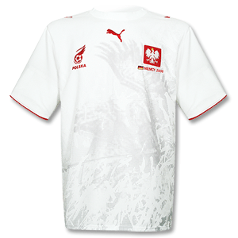
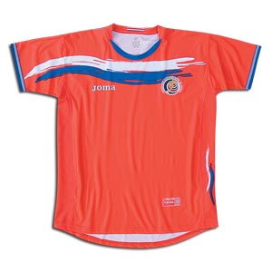
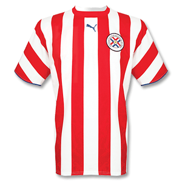
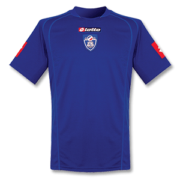
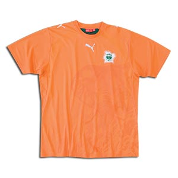
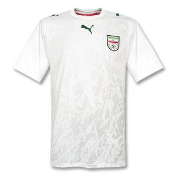
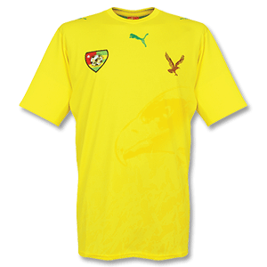

截至17日,已经有6支球队被淘汰了.
我们来看一下他们是谁:

波兰:

哥斯达黎加:

巴拉圭:

塞黑:

科特迪瓦:

伊朗:

某品牌占了2/3.
而已经确认出线的队伍,没有一个是穿puma（http://www.puma.com/pindex.jsp）的.
所以,谁是本届杯赛最大的倒霉鬼,一目了然了吧?
当然,puma是不可能一支队伍都出线不了的.因为意大利这组,有3支puma窝里斗.

==== Update 14.10.1 ====
评论里,紧接着被淘汰的多哥也是
