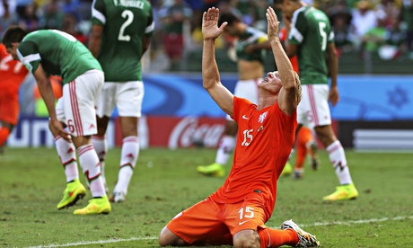

这东西夏天的时候就每天都想写，但是吧，又没激情；博客改版之后又想动手，但是吧，又有太多话题。眼瞅着要立春了，本地有个打春即是过年的说法，这篇要是再不写，2015年就没法写了。

既然晚了这么久才写，不如干脆写成篇总结吧。在这个时节想起总结世界杯，我也够奇葩了。

**总体印象：失望**
巴西世界杯，着实看了不少比赛。观看场次的数量应该仅次于不受时差影响的02和光棍独居的06两届大赛。加之夏天的时候，光腚总急还没下那一纸禁止盒子回看功能的政令，所以但凡想看的比赛，都看了全场。但是吧，激动人心的场面，不多。
一届保守的比赛，出彩的是各队门神。除了德国队以外，各队都在比着摆大巴——跟我看的第一次世界杯（90’意大利），好像！
足球的黄金年代似乎随着我的老去而一起消散在了记忆中。如雷贯耳的只有煤球王和字母罗两大寡头，90年代至00年代初那种群星璀璨的盛景再也见不到了。

**最惊喜球队：阿尔及利亚**
除了我蝠费古利再无知名球员。但组织严密进退有度。反击非常犀利，场面也好看。可惜北非球队身体天赋还是不如西非，而且过早遇到德国，不然弄个四强玩玩亦未可知。

**最失望球队：比利时**
去买足彩的时候，冠亚军玩法想买德国比利时来着，彩票站老板说这种玩法里没有比利时才作罢。实际比赛一开打，这英超联还真就是个联队水平啊，一盘散沙毫无斗志。威尔莫茨当球员的时候就是个二流，当教练还是二流。

**最佳球员：诺伊尔**
最好的球队里最好的球员。没啥好说的。

**最惊喜球员：马图伊迪**
法甲对我来说有点冷门。所以看到一个如此覆盖面的后腰的时候，属实意外。虽然还有些毛躁，但我喜欢的后腰就是这个味儿。都27了，只能说这两年球看得少。

**最意外球员：库伊特**
要不是库伊特，我大河南打墨西哥就跪了。本以为带上他就是个更衣室大哥当吉祥物来的，没想到还能拼全场！

**最失望球员：阿金费耶夫**
一次黄油手，一次出击失误，白白丢了4分。卡佩罗自带坑守门员光环？

**最佳阵容：**
诺伊尔
拉姆 胡梅尔斯 席尔瓦 R罗德里格斯
罗本 马斯切拉诺 德容 J罗纳尔多
梅西
穆勒

**荷兰队点评：**
完全没想到能打满7场。从上届开始，总闹内讧的荷兰竟然成了最团结的队伍之一。坚持下去，大业可成。
赛前一直被诟病的渣后防竟然空前团结。事实证明，防守还真就是个精神大于身体的事情。德弗里超常稳定、因迪死亡之瞪、布林德哪儿要哪儿搬、库伊特老当益壮、德容大将风度、扬马特名不副实。
进攻简直啥都没有。斯内德状态烂得一B型，进攻完全靠罗老汉突突突突突突。范佩西状态只是有一场没一场，至于那根叫伦斯的搅屎棍——他也就是搅屎棍的实力。
新人也就德佩有点意思，但身高太矮。上届的小黑埃利亚和范德维尔本来还有点眼前一亮的意思，这届竟然完全指望不上，85-89年龄段乏人，维纳尔杜姆完全长歪了，费尔也不见得如何。下届只有寄望更年轻的一代了。
最近这两届世界杯，感觉大河南真的是人品用尽了。打墨西哥占了裁判的光；打板鸭对面莫名崩溃；打巴西对方无心恋战（还刷了个全队出场的成就）……

下届三棍客退役,只求斯特罗曼不受伤，进一球平一场赢一场。

最后吐槽一下夏姐。连着三届世界杯唱主题歌（其实06不是），娱乐圈真的无人了？主题歌只能用拉丁风了？过30年，孩子们会不会认为夏奇拉是这个时代最伟大的歌手，而皮克是这个时代最牛叉的男人？

P.S：四年一次的周期有点长，没看过我之前世界杯系列的朋友可能会问为啥不说XX队。是这样，我对英法意巴两牙都无感，无所谓什么希望和失望。我的主队是荷兰，其次是北欧的瑞典丹麦以及爱尔兰，稍微关注一下捷克阿根廷哥伦比亚日本，其余的时候是完全没有态度的。