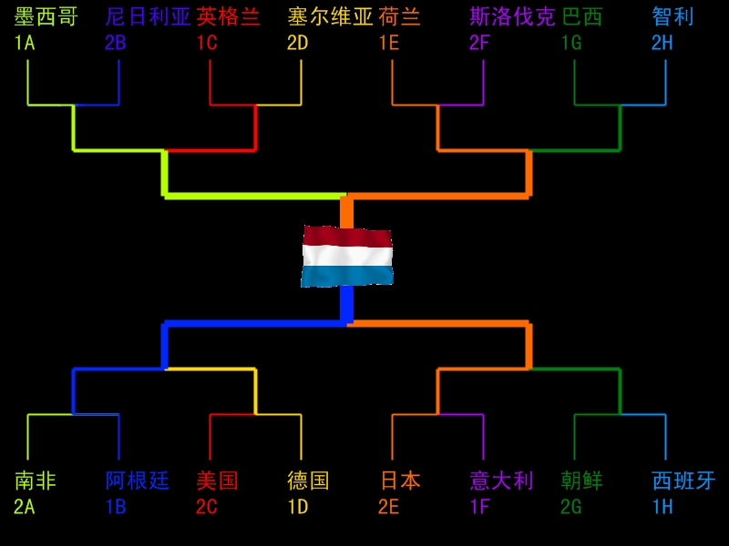

这届要真能打成这样就好了。
我渴望一场进攻无比华丽防守无比操蛋的世界杯决赛。
简单解释一下总体瞎猜：
A组法国一胜一平一负因为最后一场平东道主南非因为净胜球劣势未出线。
D组加纳最后时刻被德国扳平，三连平惨遭淘汰。
E组淘汰谁我都觉得可惜，但还是希望日本出线搅局。他们有田中斗笠王这个大杀器。
F组除了意大利简直一点看头都没有。不论谁出线都是被我荷兰灭门的份儿
G组继续看低葡萄牙，他们会在一场红牌大战中输给朝鲜。
H2觉得智利有希望，毕竟他们挤掉了我钟爱的厄瓜多尔。

淘汰赛第一轮日本点球淘汰意大利
朝鲜在又一场红牌大战里干掉西班牙

淘汰赛第二轮贝拉挑衅杰拉德双双被罚下，利物浦队友反目成仇，英格兰再一次点球饮恨。
荷兰巴西再次上演经典对决，罗本复出戏耍阿尔维斯，范德法特回赠巴西摇篮曲。
阿根廷德国踢出一场4：3的无聊比赛
朝鲜主力都被罚光了，轻松输给日本。

半决赛荷兰血洗墨西哥；阿根廷小胜日本。

决赛两个队各上五名前锋……

这张图是俺渴望的最热闹的预测。按照习惯看低两牙看高墨西哥日本。
当然不靠谱。

靠谱点分析：
西班牙大热必死，像极了参加1990年世界杯的欧洲冠军荷兰。主要担心他们的体力问题。还有普约尔，其实没觉得他是个稳定的后卫。
葡萄牙踢法太脏，一向不喜欢，祝愿他们出线后被意大利磨死。
意大利接着磨死西班牙。
巴西确实很强大，但是遭遇荷兰的时候未必敢投入兵力进攻。邓加更是没带几个进攻型中场，打阵地进攻连瑞士都未必能顺利拿下。而他们的防线其实又没有理论上那样健壮，而荷兰有好的传球手和反击手。只要放下面子打反击，未必不能过关。从人品上讲，也该荷兰赢一次了。
阿根廷虽然教练是个傻子，而且后防都是瘸子，但是战胜现阶段的德国还是很轻松的。从欧冠决赛就可以看出来，德国现在没有好的边路突破和传中手，所以想采用传统的轰炸打法有些吃力，而中路进攻又缺了巴拉克……所以八强就算到头了。
英格兰，分组实在是太tm有利了！费迪南德废了反而是好事，这厮太爱乱跑容易坏事。只要能坚持用赫斯基……
所以实际上这次是谨慎看好英格兰。虽然他们没有好中锋……