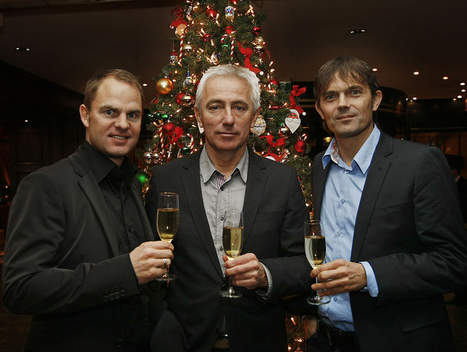

尼日利亚基本被淘汰了。发现他们队里有个人命中带屎（台湾发音sai）。
我说的可不是6号希图（Shittu）。

02年世界杯，04年欧洲杯，06年世界杯。那是瑞典队最好的时候——伊布风光无限、拉尔森老奸巨猾、永贝里左右逢源、梅尔贝里膘肥体壮。可却偏偏打不出好成绩，连个四强都没进去。
当时就觉得伊布这个后起之秀是个丧门星，把整个瑞典的调子带坏了。可后来发现人家伊布在意甲风生水起，尤文啊国米啊身价就像绿豆炒大蒜一样，看着不咋地，可卖得那叫一离谱啊！尤其在尤文和国米人也拿冠军了，所以衰人不是他。

可剩下的人里，永贝里成绩好，还曾经在阿森纳无损夺冠过；拉尔森荣耀无数；梅尔贝里卡尔斯特伦之流完全没有气场……

直到昨天比赛结束，可以确定了，这衰神就是主教练拉德贝克。丧门星之所以被叫做丧门星而不是朴智星，就是因为你除了把事情归咎于不可琢磨的霉运，找不到别的解释：一张冲动的红牌；一个诡异的折射；同一位置上两次无奈的换人。除了运气，你找不到别的解释。

曾经的记忆中，这个称号是属于巴拉克的。勒沃库森三连二，德国两次亚军，到拜仁第一年也是第二。可人家好歹在拜仁的后期以及后来的切尔西证明了自己。所以巴拉克属于先扬后抑后继乏力型的丧门星。这次巴拉克没来，对德国来说未必是坏事。

持久性的丧门星，我认为应该是胡安.塞巴斯蒂安.贝隆。96年开始打意甲，00年混了个冠军，结果第二年拉齐奥就分崩离析了；接着去曼联，曼联当年就衰了，把冠军给丢了；又去国米，还是没在当年混到冠军。不过好歹他在俱乐部还算混到了几个冠军，表现也还可以。更丧的是阿根廷国家队，自从阿根廷有了贝隆，不仅世界杯举步维艰，就连美洲杯也是连续5次无缘……所以我只能归结到贝隆的光头不符合阿根廷长发飘飘的传统。所以既然老马昨天弃用贝隆找到了前场的化学反应，就继续把他弃用下去吧！

还有更悲情的丧门星。[欧洲杯结束的时候](https://pewae.com/2008/06/all-end.html)就说过，是我兰的范德萨同学。历史上最强大的荷兰（1997-2007）都一直没能打出成绩，只能归咎于他那啸天犬排泄物一般的运气。之所以本届无比看好荷兰，也跟老范退休有直接关系。衰人离开了，也该时来运转了吧？
不过看看教练席上正襟危坐的比主教练还像主教练的荷兰二号衰人科库，又有些忐忑了……
